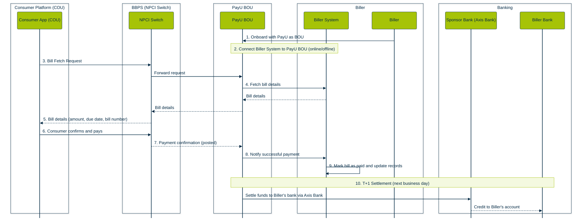

<Cards columns={3}>
  <Card title="1. Register as a Biller with PayU" href="https://docs.payu.in/docs/bbps-biller-integration#register-as06-a-biller-with-payu">
    Submit your **Biller Consent Form** to get onboarded by PayU as the Biller Operating Unit (BOU) and receive your biller credentials.

     
  </Card>

  <Card title="2. Choose Your Connectivity Mode" href="https://docs.payu.in/docs/bbps-biller-integration#choose-your-connectivity-mode">
    Select from **Online** (real-time API), **Offline-A** (file-based bill list), or **Offline-B** (payment-only, no fetch) based on your infrastructure.

     
  </Card>

  <Card title="3. Integrate Biller APIs" href="https://docs.payu.in/docs/bbps-biller-integration#integrate-biller-apis">
    Implement the **Bill Fetch API** (Online mode), **Payment Confirmation webhook**, and **Status Check APIs** to enable end-to-end bill processing.

     
  </Card>

  <Card title="4. Configure Bill Parameters" href="https://docs.payu.in/docs/bbps-biller-integration#configure-bill-parameters">
    Set up **customer identifier fields** (account number, mobile, consumer ID), bill amount, due dates, and convenience fee rules for accurate bill presentation.

     
  </Card>

  <Card title="5. NPCI Certification and Testing" href="https://docs.payu.in/docs/bbps-biller-integration#npci-certification-and-testing">
    Complete **BBPS Sandbox testing**, Comfort round, and final **Certification/UAT** with NPCI to obtain go-live sign-off.

     
  </Card>

  <Card title="6. Go Live on BBPS Network" href="https://docs.payu.in/docs/bbps-biller-integration#go-live-on-bbps-network">
    Your bills become instantly available across **1,200+ consumer platforms** including Google Pay, PhonePe, Amazon Pay, and more.
  </Card>

   
</Cards>

---

## What is PayU BBPS for Billers?

**BBPS (Bharat Bill Payment System)** — now branded as **Bharat Connect** — is India's official, RBI-regulated, NPCI-governed interoperable bill payment network. It is the national infrastructure that connects your bills to millions of consumers across every major consumer platform in India.

As a **Biller on BBPS**, your bills become instantly discoverable and payable on **1,200+ consumer platforms** — including Google Pay, PhonePe, Amazon Pay, Tata Neu, CRED, Bajaj Finserv, UMANG, and thousands of bank portals and fintech apps — without building separate integrations with each one.

PayU acts as your **Biller Operating Unit (BOU)** — the authorised NPCI entity that onboards you onto the BBPS network, connects your billing system, and handles clearing, settlement, and dispute management on your behalf.

---

## Is This Right for You?

PayU BBPS Biller integration is ideal if you are:

- ✅ A **utility provider** (electricity, gas, water, municipal services) wanting to reach millions of bill-payers digitally
- ✅ A **telecom operator, DTH, or broadband provider** looking to accept bill payments and recharges across all platforms
- ✅ A **financial institution** (bank, NBFC, insurer) wanting loan repayments, insurance premiums, or credit card bill payments via BBPS
- ✅ An **educational institution** wanting fee collection via a trusted national network
- ✅ Any **business that issues bills** and wants to reduce collection friction, improve recovery rates, and eliminate manual reconciliation

**This may not be for you if:**
- ❌ You are a consumer-facing app that wants to let users pay bills — see the [Consumer Platform (COU) Overview](#) instead
- ❌ You do not issue recurring or structured bills — consider [PayU Payment Links](#) or [PayU Payment Gateway](#)

---

## What You Get

| Feature | What It Means for You |
|---|---|
| 🌐 **Reach 1,200+ Consumer Platforms** | One integration with PayU BOU puts your bills on Google Pay, PhonePe, Amazon Pay, CRED, and 1,200+ more apps |
| 💰 **Faster Collections** | Consumers pay instantly via their preferred app — fewer missed due dates, reduced defaults |
| 🔔 **Click Pay** | Send pre-filled payment links via WhatsApp / SMS / email — consumer taps once to pay |
| 🔁 **AutoPay / UPMS** | Consumers register for auto-debit — guaranteed on-time payments every billing cycle |
| 📊 **Unified Reconciliation** | Single settlement report covering all consumer platforms — no per-platform reconciliation |
| ⚡ **T+1 Settlement** | Funds settled to your bank account next business day via PayU's sponsor bank (Axis Bank) |
| 🛡️ **RBI / NPCI Trust** | Payments made on regulated national rails — consumers trust the BBPS logo |
| 🗣️ **Managed Disputes** | BBPS standardised complaint handling — PayU BOU manages dispute resolution on your behalf |
| 📡 **Multiple Connectivity Modes** | Connect in real-time (Online), file-based (Offline-A), or payment-only (Offline-B) mode |

---

## How It Works

> **Click Pay Flow:** You generate a BBPS payment link → send via WhatsApp / SMS / email → consumer taps link → opens eligible app with bill pre-filled → one-tap payment → confirmation sent to your system.

> **AutoPay (UPMS) Flow:** Consumer registers once → your bill is pushed to their app on generation → auto-paid on due date → you receive payment confirmation and settlement without any manual follow-up.

---

## What You Will Need (Prerequisites)

Before onboarding as a BBPS Biller with PayU, ensure you have:

- ☑️ **Biller Consent Form** — Signed and stamped, submitted to NPCI designating PayU as your default BOU
- ☑️ **An Active Billing System** — Capable of responding to fetch requests (Online billers) or providing bill files (Offline-A billers)
- ☑️ **Customer Identifier Definition** — Define the parameters consumers use to find their bill (account number, mobile number, consumer ID, etc.)
- ☑️ **Biller Category Registration** — NPCI assigns your biller to the correct category (electricity, gas, telecom, etc.)
- ☑️ **API Integration Readiness** (Online Billers) — Engineering team to expose Bill Fetch and Payment Confirmation APIs
- ☑️ **File Generation Capability** (Offline-A Billers) — Ability to generate and share bill files at agreed frequency
- ☑️ **NPCI Certification** — Mandatory Sandbox testing, Comfort round, and Certification/UAT sign-off before going live
- ☑️ **Bank Account for Settlement** — Designated account for T+1 fund settlement via PayU's sponsor bank (Axis Bank)

---

## Supported Connectivity Modes

Choose the mode that matches your billing system's technical capability:

| Mode | How It Works | Best For |
|---|---|---|
| **Online (Real-Time)** | Your system responds to live bill fetch API calls in real time | Utilities, telecom, financial institutions with live billing systems |
| **Offline-A (File-Based)** | You provide a periodic file of expected bills; PayU serves fetch from this file | Billers without real-time API capability but with predictable billing cycles |
| **Offline-B (Payment Only)** | No bill fetch; consumers enter amount manually and pay; PayU receives and settles | Billers who want payment acceptance only, without bill presentment |

---

## What Happens After a Payment

1. **Real-Time Notification** — PayU BOU sends a payment confirmation to your billing system with transaction reference, amount, and timestamp
2. **Bill Marked Paid** — Your system updates the bill status; consumers see confirmation in their app immediately
3. **Settlement (T+1)** — PayU settles the collected funds to your designated bank account via sponsor bank (Axis Bank) on the next business day
4. **MIS & Reconciliation Reports** — Consolidated settlement reports covering all consumer platforms in one place — no per-platform reconciliation needed
5. **AutoPay Payments** — For UPMS-registered consumers, you receive confirmed payments automatically on each billing cycle without any consumer action required
6. **Dispute Management** — If a consumer raises a complaint, PayU BOU handles it via the standardised BBPS grievance process; you are notified with resolution timelines

> ⚠️ **Important:** Always reconcile your billing system against PayU's settlement MIS report. Do not update bill status based solely on consumer-side confirmation — always wait for PayU BOU's payment notification to your system.

0