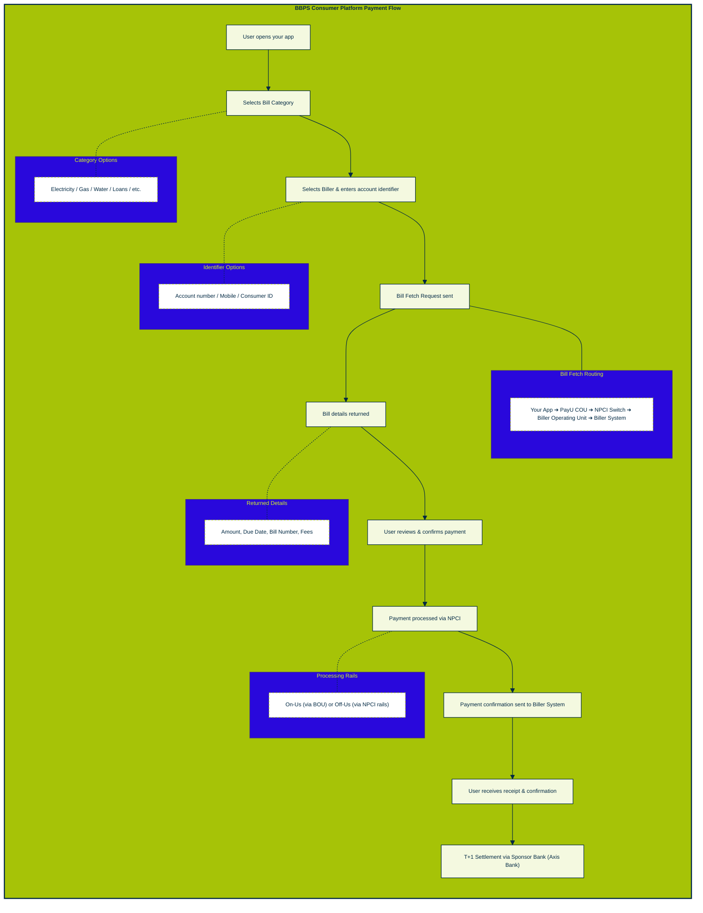

<Cards columns={3}>
  <Card title="1. Create Your PayU Account" href="https://docs.payu.in/docs/bbps-cou-integration#1-create-your-payu-account">
    Sign up for a PayU account, obtain your API credentials, and get your COU access approved by NPCI to begin bill payment integration.

     
  </Card>

  <Card title="2. Choose Your Integration Type" href="https://docs.payu.in/docs/bbps-cou-integration#2-choose-your-integration-type">
    Select the right path for your platform — opt for API-based integration for full control, or the White-label TSP solution for ready-made UI screens.

     
  </Card>
0
  <Card title="3. Build Your Bill Payment UI" href="https://docs.payu.in/docs/bbps-cou-integration#3-build-your-bill-payment-ui">
    Implement category selection, biller search, identifier entry, and bill fetch screens in compliance with NPCI UI guidelines.

     
  </Card>

  <Card title="4. Integrate BBPS APIs" href="https://docs.payu.in/docs/bbps-cou-integration#4-integrate-bbps-apis">
    Connect key APIs — Get Categories, Get Billers, Fetch Bill, Validate, Payment Posting, and Status Check — to enable end-to-end bill payments.

     
  </Card>

  <Card title="5. Get NPCI Approval and Test" href="https://docs.payu.in/docs/bbps-cou-integration#5-get-npci-approval-and-test">
    Submit your UI screens for NPCI approval, complete thorough testing in the NPCI Sandbox environment, and obtain final sign-off before going live.

     
  </Card>

  <Card title="6. Go Live" href="https://docs.payu.in/docs/bbps-cou-integration#6-go-live">
    Launch your BBPS-enabled bill payment experience and start processing live payments for your customers.
  </Card>

   
</Cards>

---

## What is PayU BBPS for Consumer Platforms?

**BBPS (Bharat Bill Payment System)** — now branded as **Bharat Connect** — is India's official, RBI-regulated interoperable bill payment network, governed by NPCI. It connects consumers with thousands of billers across every major category through a single, standardised fetch-and-pay experience.

As a **Consumer Platform (COU — Customer Operating Unit)**, you integrate once with PayU's BBPS rails and instantly offer your users the ability to pay bills across 20+ categories and 22,000+ live billers — without building individual biller integrations.

Whether you are a fintech app, a bank portal, a super-app, or a wallet — PayU's BBPS consumer platform integration puts a complete, trusted bill payment experience in your hands.

---

## Is This Right for You?

PayU BBPS Consumer Platform integration is ideal if you:

- ✅ Run a **consumer-facing app or platform** (fintech, bank, wallet, super-app) and want to offer bill payments to your users
- ✅ Want **one integration** that unlocks access to 22,000+ billers across electricity, gas, water, telecom, loans, and more
- ✅ Want to offer **AutoPay / recurring bill payments** for your users via UPMS
- ✅ Need a **white-labelled experience** that looks and feels like your brand
- ✅ Want to benefit from **RBI/NPCI-backed trust** and standardised dispute resolution

**This may not be for you if:**
- ❌ You are a biller who wants to receive payments — see the [Biller (BOU) Overview](#) instead
- ❌ You only want to collect one-time payments — consider [PayU Payment Gateway](#)

---

## What You Get

| Feature | What It Means for You |
|---|---|
| 🔗 **One Integration, 22,000+ Billers** | Connect once to PayU and reach the entire BBPS biller network — no per-biller deals |
| 🔄 **Standardised Fetch & Pay** | Consistent bill fetch → view → pay flow across all categories and billers |
| 🔁 **AutoPay / UPMS** | Let users register recurring bills, receive bill push notifications, and auto-pay on due dates |
| 🔔 **Click Pay Support** | Handle deep-link payment URLs sent by billers via WhatsApp/SMS — bill pre-filled, one tap to pay |
| 🎨 **White-Label UI** | Fully customisable screens via TSP white-label or your own UI built on BBPS APIs |
| 🛡️ **RBI / NPCI Backed** | Operate on regulated, trusted national rails with standardised grievance handling |
| 📊 **MIS & Reporting** | Access transaction reports, settlement data, and reconciliation dashboards |
| ⚡ **T+1 Settlement** | Predictable next-day settlement cycles via PayU's sponsor bank (Axis Bank) |
| 🗣️ **Complaint Management** | Built-in standardised complaint registration, inquiry, and status tracking |

---

## How It Works

> **Developer Note:** The fetch-and-pay cycle involves a 10-step round trip (5 hops request + 5 hops response) between your app, PayU COU, NPCI switch, and the biller's BOU. PayU handles all routing and switch communication on your behalf.

---

## What You Will Need (Prerequisites)

Before you start integrating, make sure you have the following in place:

- ☑️ **A PayU Account** — [Sign up here](#) and get your COU API credentials
- ☑️ **A Consumer-Facing App or Platform** — Web, mobile (Android/iOS), or both
- ☑️ **Developer Resources** — Engineering team to build and maintain the BBPS flow and UI screens
- ☑️ **NPCI-Compliant UI Screens** — Your bill payment screens must follow NPCI UI guidelines and receive NPCI approval before going live
- ☑️ **App Registration with NPCI** — Required if you want to support Click Pay deep links (Android / iOS)
- ☑️ **Callback Handling Infrastructure** — For UPMS bill push notifications and AutoPay flows
- ☑️ **NPCI Sandbox Access** — For testing and certification before production launch
- ☑️ **Compliance Sign-Off** — NPCI testing and sign-off required for all BBPS functionality before go-live

---

## Supported Bill Categories & Payment Modes

### Bill Categories (20+)

| Category | Examples |
|---|---|
| ⚡ Electricity | BESCOM, Tata Power, Mahavitaran |
| 📱 Mobile Postpaid | Jio, Vi, Airtel, BSNL |
| 📱 Mobile Prepaid (Recharge) | All major operators |
| 📺 DTH | Tata Sky, Airtel DTH, Dish TV |
| 🌐 Broadband / Landline | BSNL, ACT Fibernet, Airtel |
| 🔥 Gas / LPG | Bharat Gas, Indane, HP Gas |
| 💧 Water | Municipal water boards |
| 🏙️ Municipal Taxes | Local civic bodies |
| 🏦 Loan Repayment | Home, personal, vehicle loans |
| 🎓 Education Fees | Schools, colleges, universities |
| 🚗 FASTag Recharge | All major tag issuers |
| 🛡️ Insurance Premium | LIC, general insurance |
| 📈 Mutual Funds | SIP payments |
| 📡 Cable TV | Local cable operators |
| 💳 Credit Card Bills | Major banks |
| 🏛️ Government / E-Challan | Tax and penalty payments |
| And more... | 22,000+ billers across all categories |

### Payment Channels Supported
- In-app digital payments (UPI, Cards, Netbanking, Wallets)
- Physical cash via supported agent outlets
- AutoPay via UPMS recurring mandates
- Click Pay (deep-link initiated payments from WhatsApp / SMS)

---

## What Happens After a Payment

1. **Instant Confirmation** — The user receives a payment receipt and confirmation within the app
2. **Biller Notification** — PayU BBPS rails notify the biller system of the successful payment in real time
3. **Settlement (T+1)** — Funds settle to the biller via PayU's sponsor bank (Axis Bank) on the next business day
4. **Reconciliation** — MIS reports and dashboards are available for transaction-level reconciliation
5. **Complaints** — If a transaction fails or a dispute arises, standardised BBPS complaint registration and status tracking are available to users directly within your app
6. **AutoPay (UPMS)** — If the user has registered for AutoPay, future bills are automatically fetched and paid on due dates; duplicate payment prevention is built in

> ⚠️ **Important:** Always verify payment status server-side using the Status Check API. Do not rely solely on client-side redirects or callbacks for payment confirmation.