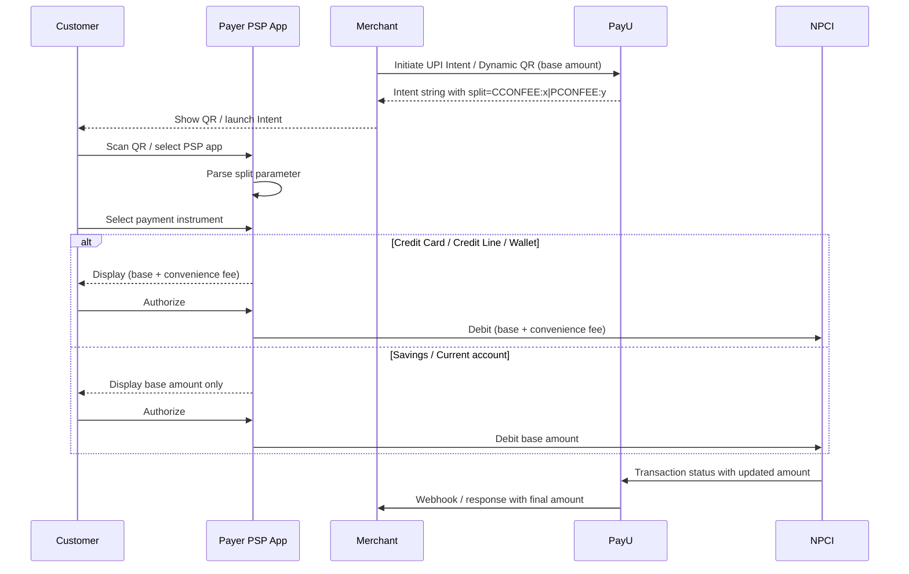

---
title: UPI CC, CL, and PPI Convenience Fee
excerpt: 'Apply and collect convenience fees on credit-based UPI instruments — UPI Credit Card (UPI CC), UPI Credit Line (UPI CL), and UPI PPI — using the NPCI split-parameter framework over Intent and Dynamic QR flows.'
deprecated: false
hidden: false
metadata:
  title: UPI CC, CL, and PPI Convenience Fee | PayU Offerings
  description: >-
    Learn how PayU enables convenience-fee-enabled merchants to apply and
    collect convenience fees on UPI Credit Card (UPI CC), UPI Credit Line
    (UPI CL), and UPI PPI instruments via the NPCI split parameter in UPI
    Intent and Dynamic QR flows.
  keywords:
    - UPI Convenience Fee
    - UPI CC Convenience Fee
    - UPI CL Convenience Fee
    - UPI PPI Convenience Fee
    - CCONFEE
    - PCONFEE
    - NPCI Split Parameter
    - UPI Intent
    - Dynamic QR
  robots: index
next:
  description: ''
---

Unified Payments Interface (UPI) has evolved to allow customers to authorize payments using a variety of instruments — such as **Credit Cards (UPI CC)**, **Prepaid Instruments / wallets (UPI PPI)**, and **Credit Lines (UPI CL)** — directly through TPAP apps, while merchants continue to initiate these transactions as standard UPI requests with a fixed amount.

Until recently, this model did **not** support convenience fees for these credit-based instruments because the transaction amount could not be updated at the time of authorization.

NPCI has now introduced a solution that enables convenience-fee-enabled merchants to **apply and collect convenience fees on eligible UPI instruments (UPI CC, UPI CL, and UPI PPI)** by allowing the customer's payable amount to be updated during authorization. As a result, the merchant receives the transaction with the updated amount — ensuring correct fee recovery while maintaining a seamless UPI payment experience for customers.

This guide describes the flow, specifications, and merchant configurations required to support the convenience fee for UPI CC, UPI CL, and UPI PPI.

<Callout icon="📘" theme="info">
  **Regulatory Note**: Convenience fee on **UPI PPI (wallet)** is **not allowed** as of today per the regulator. However, the technical provision is available and will be enabled as and when the commercials on UPI PPI are introduced.
</Callout>

## Key Highlights

* Convenience fee is supported only via **UPI Intent** and **Dynamic QR** flows (it can only be embedded in an intent string).
* The fee is conveyed using the NPCI **`split`** parameter on the intent URI.
* The convenience fee applies **only when the customer pays using a credit-based instrument** (UPI CC, UPI CL, or UPI PPI). When the customer chooses a Savings/Current bank account, **no convenience fee is added** to the transaction amount.
* The merchant initiates the transaction with the **base amount only**. PayU automatically appends the convenience fee in the intent string based on the merchant's configuration.

## Supported Instruments

| Instrument  | Description                             | Split Tag Used |
| ----------- | --------------------------------------- | -------------- |
| **UPI CC**  | UPI Credit Card                         | `CCONFEE`      |
| **UPI CL**  | UPI Credit Line                         | `CCONFEE`      |
| **UPI PPI** | UPI Prepaid Payment Instrument (wallet) | `PCONFEE`      |

<Callout icon="📘" theme="info">
  **Note**: NPCI does not currently support separate split tags for UPI CC and UPI CL — both share the **`CCONFEE`** tag. If different fees are configured at PayU for UPI CC and UPI CL, the **maximum** of the two is passed in the intent string.
</Callout>

## Transaction Flow

1. The merchant initiates a UPI **Intent** or **Dynamic QR** transaction at PayU with a fixed (base) amount.
2. PayU evaluates the merchant's convenience-fee configuration and appends the `split` parameter to the intent string with the applicable fee tags (`CCONFEE` and/or `PCONFEE`).
3. The customer scans the dynamic QR or selects the Payer PSP app for the intent flow.
4. The Payer PSP app reads the `split` parameter from the QR / intent string.
5. When the customer selects:
   * **Credit Card / Credit Line / Wallet** → the PSP app displays `base amount + applicable convenience fee` and debits this total from the chosen instrument.
   * **Savings / Current account** → the PSP app displays only the `base amount`; the convenience fee is **not added**.
6. PayU receives the authorization with the **updated amount**, validates it against the configured fee, and forwards the result to the merchant via the standard payment response and webhook.

<Image align="center" src="https://files.readme.io/91a7702600d944d779f6555aaf221f5084e63365d525c3d72b2bf5481d7e16e0-upi-cc-flow.png" />

## Technical Flow



## The split Parameter

The convenience fee is passed in the intent URI through the NPCI `split` parameter. The parameter has two sub-keys:

| Sub-key       | Description                                                                                                                                            | Applicable Instruments |
| ------------- | ------------------------------------------------------------------------------------------------------------------------------------------------------ | ---------------------- |
| **`CCONFEE`** | Convenience fee for UPI CC and UPI CL. As NPCI does not yet support separate tags for CC and CL, the **maximum** of the two configured fees is passed. | UPI CC, UPI CL         |
| **`PCONFEE`** | Convenience fee for UPI PPI (wallet).                                                                                                                  | UPI PPI                |

### Sample Intent String

A sample UPI intent URI carrying both UPI CC/CL and UPI PPI convenience fees:

```text
upi://pay?pa=testmerchant@acquiringbank&pn=merchant&tr=29999999999&tid=PPPXXXXXXXXX&am=100.00&cu=INR&tn=UPIIntent&split=CCONFEE:2.36|PCONFEE:1
```

Breakdown of the relevant parameters:

| Parameter | Description                                                                                |
| --------- | ------------------------------------------------------------------------------------------ |
| `pa`      | Payee VPA (acquiring merchant VPA)                                                         |
| `pn`      | Payee name                                                                                 |
| `tr`      | Transaction reference                                                                      |
| `tid`     | Transaction ID                                                                             |
| `am`      | **Base** transaction amount                                                                |
| `cu`      | Currency (INR)                                                                             |
| `tn`      | Transaction note                                                                           |
| `split`   | Convenience fee container — pipe (`\|`) separated `KEY:VALUE` pairs (`CCONFEE`, `PCONFEE`) |

## Merchant Configuration

1. Configure the convenience fee at PayU as either a **percentage** or a **flat amount** for each applicable instrument:
   * UPI CC
   * UPI CL
   * UPI PPI
2. Separate convenience fees can be configured for UPI CC and UPI CL. During the transaction, **whichever value is greater is passed** in the intent's `CCONFEE` tag (NPCI does not currently allow distinct tags for CC and CL).
3. **No additional handling is required from the merchant during the payment process.** PayU automatically:
   * Computes the convenience fee from your configuration.
   * Appends the `split` parameter to the intent string.
   * Validates the authorized amount against the configured fee.
   * Returns the final amount along with the convenience fee breakup in the response and webhook.

<Callout icon="📘" theme="info">
  **Setting up convenience fee**: Contact your PayU **Key Account Manager (KAM)** or PayU Support to enable and configure UPI CC, UPI CL, and UPI PPI convenience fees on your merchant account.
</Callout>

## Behaviour by Selected Instrument

Assuming a base amount of ₹100, with `CCONFEE = 2.36` and `PCONFEE = 1.00`:

| Customer Selects          | Amount Displayed in PSP App            | Amount Debited |
| ------------------------- | -------------------------------------- | -------------- |
| UPI Credit Card           | ₹102.36                                | ₹102.36        |
| UPI Credit Line           | ₹102.36                                | ₹102.36        |
| UPI Wallet (PPI)          | ₹101.00 (when commercials are enabled) | ₹101.00        |
| Savings / Current Account | ₹100.00                                | ₹100.00        |

## Important Considerations

* Convenience fee on credit-based UPI instruments works **only with the Intent and Dynamic QR flows** — it cannot be applied to Collect (VPA) flows.
* The fee is enforced at the PSP app level using the `split` parameter; merchants must not attempt to compute or add the fee to the `am` (amount) field directly.
* Refund handling for the convenience fee may differ across PayU configurations. Confirm refund policy for convenience fee with your PayU KAM.
* Validation at PayU rejects authorizations where the received amount does not match `base amount + applicable convenience fee` for the selected instrument category.

## Related Documentation

* [UPI Convenience Fee Integration (Web)](doc:upi-convenience-fee-integration)
* [UPI Intent Server-to-Server Integration](doc:upi-intent-server-to-server)
* [Collect Additional Charges](doc:collect-additional-charges)
* [Webhooks](doc:webhooks)
* [Verify Payment API](ref:verify_payment_api)
