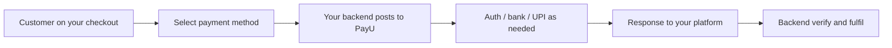

---
title: Seamless Integration
excerpt: >-
  Choose between Merchant Hosted Checkout and Server-to-Server (S2S) for
  Seamless payment integration with PayU.
deprecated: false
hidden: true
metadata:
  robots: index
---
This page helps you understand **Seamless Integration** before you begin. Seamless covers two paths: **Merchant Hosted Checkout** (you build the checkout UI) and **Server-to-Server** (backend-orchestrated payment flows).

## What is Seamless Integration?

Seamless Integration is a payment integration approach where:

- You control the checkout experience on your website or app
- You collect payment method details (or orchestration inputs) and post them to PayU
- PayU processes the payment, authentication, and bank flows
- You verify the final status on your backend before fulfilling the order

Unlike PayU Hosted Checkout, customers are not sent to a PayU-hosted payment page for the full checkout UI (except where a bank/UPI app redirect or OTP step is required).

***

## Merchant Hosted Checkout vs Server-to-Server

|                                     | Merchant Hosted Checkout                         | Server-to-Server (S2S)                                      |
| ----------------------------------- | ------------------------------------------------ | ----------------------------------------------------------- |
| **You build UI**                    | Yes                                              | Yes (or app UI)                                             |
| **Where payment is initiated**      | Browser form / your backend to `/_payment`       | Primarily your backend APIs                                 |
| **Typical use**                     | Custom branded checkout on web                   | Cards/UPI with advanced auth, native OTP, intent orchestration |
| **PCI considerations**              | Higher if you collect card data on your page     | Keep card/auth handling server-side where required          |
| **Best for**                        | Mid-to-large platforms needing UX control        | Apps and platforms needing backend-only payment orchestration |

***

## How Merchant Hosted Checkout Works

1. Customer selects a payment method on your checkout.
2. Your server generates a SHA-512 hash and prepares request parameters (`pg`, `bankcode`, and mode-specific fields).
3. You post the payment request to PayU (`/_payment`).
4. PayU completes authentication (bank page, UPI app, OTP, and so on as applicable).
5. PayU returns the customer/response to your `surl` / `furl`.
6. You validate the reverse hash and verify payment status on the backend.

***

## How Server-to-Server Works

1. Customer initiates payment in your app or website.
2. Your backend posts payment parameters to PayU S2S APIs.
3. Depending on the flow (Classic, Decoupled, Direct Auth, UPI Intent), you handle authentication, redirect, native OTP, or intent invocation.
4. You receive the payment response and/or S2S callback.
5. You verify payment status with Verify Payment API and/or webhooks before fulfilling the order.

***

## Customer journey

***

## Key Concepts

- **Transaction (`txnid`)**: Unique ID for each payment attempt generated by you.
- **Payment request**: Parameters posted to PayU including amount, customer details, `pg` / `bankcode`, and hash.
- **Forward hash**: SHA-512 hash generated on your server using Key and Salt.
- **Reverse hash**: Hash validation on the response/callback to detect tampering.
- **Verify Payment / Webhooks**: Backend confirmation of final status (do not rely on redirect alone).

***

## Why Use Seamless Integration

<Accordion title="Benefits" icon="fa-rocket">
  - **Full UX control**: Keep customers in your branded checkout experience.
  - **Mode-level flexibility**: Integrate Net Banking, Cards, UPI, Wallets, EMI, BNPL, and more as separate flows.
  - **Advanced S2S options**: Use Decoupled, Direct Authorization, UPI Intent, and Omnichannel where required.
  - **Consistent verification model**: Reverse hash + Verify Payment / webhooks across modes.
</Accordion>

***

## Capabilities

<Accordion title="Features" icon="fa-cogs">
  - Merchant-hosted collection for major Indian payment methods
  - S2S card flows (General, Classic, Classic OTP, Decoupled, Direct Authorization)
  - S2S UPI flows (Intent, Omnichannel, PhonePe Deep Offers)
  - Test credentials and production checklists for go-live
</Accordion>

***

## Supported Payment Methods

Merchant Hosted Checkout commonly supports:

- Credit and Debit Cards
- UPI (Collect and Intent)
- Net Banking
- Wallets
- EMI and BNPL
- EFTNET, Pluxee, PayPal, Net Banking TPV (as enabled)

S2S focuses on Cards and UPI orchestration flows listed under Server-to-Server.

***

## What Happens After Payment

- PayU returns success or failure outcome
- Customer may return to your success/failure URL
- Your backend must validate reverse hash and confirm status

<Callout icon="⚠️" theme="warn">
  **Important: Backend Verification**

  Never mark an order as paid from browser redirect alone. Always verify on your server.
</Callout>

***

## Next Steps

- [Merchant Hosted Checkout](doc:merchant-hosted-checkout) — overview and payment modes
- [Merchant Hosted Checkout Quick Start](doc:merchant-hosted-checkout-quick-start)
- [Server-to-Server Integration](doc:server-to-server-integration)
- [Best Practices](doc:best-practices)
