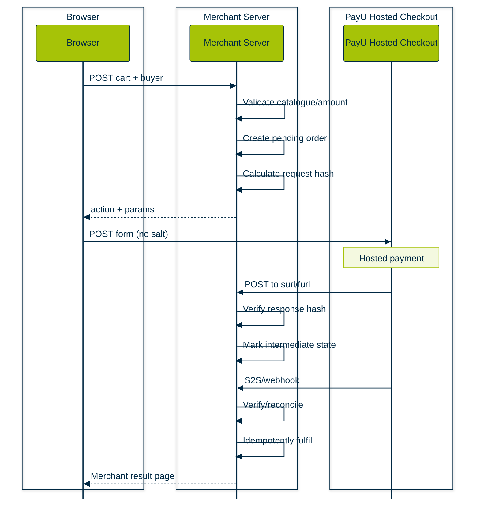

This tutorial shows how to turn a sample eCommerce page (Nøva Apparel sample storefront) into a PayU Hosted Checkout integration. It is written for developers who own both a web storefront and its server. The sample is a useful front-end starting point, but it is **not** a complete payment integration: the supplied files do not contain the `store-checkout` implementation, a callback route, or an S2S/webhook flow.

> **Outcome:** by the end, you should have a server-created order whose amount is authoritative, a server-generated SHA-512 request hash, an auto-submitted POST form to PayU Hosted Checkout, verified form callbacks, and an S2S/reconciliation path that can safely move the order to a final state.

## Prerequisites

Before changing the sample, have:

- A PayU merchant account and separate test and production credentials. Keep the key and salt in server-side secret storage.
- A public HTTPS web origin for `surl` and `furl`. PayU must be able to reach these URLs, and they must accept the documented callback POST.
- A server endpoint that can create an order and calculate its amount from a trusted catalogue or database.
- A server-side SHA-512 implementation.
- A persistent order store with unique transaction IDs and an idempotent update operation.
- A plan for server-to-server (S2S) status notifications and/or reconciliation through the PayU-supported verification mechanism.
- For mobile apps, an Android `WebView` or iOS `WKWebView` owner who can implement deep-link and callback handling.

This page uses the following PayU Hosted Checkout endpoints, as documented by PayU:

| Environment | Payment endpoint                  |
| ----------- | --------------------------------- |
| Test        | `https://test.payu.in/_payment`   |
| Production  | `https://secure.payu.in/_payment` |

Do not send a browser request directly to either endpoint with a salt. The browser may submit a form to PayU, but the server must prepare the values and calculate the hash first.

## Understand the sample

### What Nøva Apparel does

The supplied `nova_apparel_payu_website.zip` is a static storefront with:

- A product catalogue containing **Wool Tote**, **Linen Shirt**, and **Coat 01**.
- A local cart held in browser memory and persisted in `localStorage` under `cart`.
- A cart drawer showing line items and a client-calculated total.
- A buyer form for `firstname`, `email`, and `phone`.
- A browser `fetch()` POST to the separately hosted `window.STORE_CONFIG.paymentEndpoint`, which is set to `/api/public/payu/store-checkout` on the sample deployment origin.
- A response handler that expects an object containing `action` and `params`, creates a hidden HTML form, copies `params` into hidden inputs, and submits that form to `action`.
- A return banner that reads `payment`, `order`, `amount`, and `reason` from the browser query string, then clears those query parameters with `history.replaceState()`.

The source-library files explain the intended PayU helper as well. `src/lib/payu.functions.ts` creates a server function, generates a transaction ID, uses `EXPORT_PRODUCT`, calculates an amount from `EXPORT_PRICE_INR`, sets success and failure URLs, and returns `{ action, params }`. `src/lib/payu.server.ts` contains server-only SHA-512 and request/response hash helpers.

### What the supplied files do not prove

The following are observations about the supplied files, not claims about a deployed payment system:

- The static storefront calls `https://shop-kit-craft.lovable.app/api/public/payu/store-checkout`, but no implementation of that HTTP endpoint is present in the supplied website archive.
- The source library contains a `createPayuPayment` server function, but that is not the same as a supplied `store-checkout` route. It does not consume the storefront cart total; it uses the fixed `EXPORT_PRICE_INR` value of `499` and a fixed product description.
- No callback route implementation is present. The source helper points `surl` and `furl` to `/api/public/payu/callback`, but that route is not supplied.
- No PayU webhook registration, webhook receiver, Verify Payment API call, retry worker, or reconciliation job is present.
- The browser sends item names and prices in its JSON body. The server must not trust those prices in a real store.
- The sample's return banner trusts a browser query string such as `?payment=success`. That is presentation logic, not payment verification. A user can construct such a URL, so it must never fulfil an order.
- The storefront sends a `returnUrl` value, while the supplied server helper does not use it. PayU's documented Hosted Checkout flow uses server-reachable `surl` and `furl` callback URLs and POSTs the result to them; the sample query-parameter convention is custom application behavior.

Treat the files as a front-end demonstration and a set of helper observations. Do not claim that a payment endpoint, callback, or webhook has been implemented or tested until you add and exercise it in your own application.

## Build the flow

### End-to-end architecture

A production integration has these actors:

1. **Browser and storefront:** displays products, keeps a temporary cart, collects buyer details, and starts checkout. It does not decide the payable amount and never sees the salt.
2. **Merchant server:** authenticates the checkout request, validates the cart against the catalogue, creates the order and unique `txnid`, calculates the authoritative amount, generates the request hash, and returns only the PayU form action and form parameters needed by the browser.
3. **PayU Hosted Checkout:** receives the form POST at the test or production endpoint, displays the hosted payment page, collects payment details, and processes the payment.
4. **Callback URLs:** `surl` and `furl` are merchant HTTPS endpoints. PayU POSTs the URL-encoded transaction result to the appropriate URL after the payment attempt. These URLs should verify the response hash before changing order state.
5. **S2S/webhook channel:** a server-to-server status notification or merchant-configured webhook provides an independent status signal. It should be processed idempotently and treated as the final operational authority according to the merchant's PayU verification design.
6. **Reconciliation:** a scheduled or operator-triggered process compares pending orders with PayU's supported status-verification mechanism and dashboard records. It resolves missing, delayed, or contradictory callbacks without relying on the customer's browser.

A typical lifecycle is:



The browser return is useful for user experience. It is not sufficient evidence for fulfilment. If the callback is delayed or the browser closes, the S2S/reconciliation path must still converge the order to the correct state.

### 1. Create an order and calculate the amount on the server

The storefront may send line-item IDs, names, quantities, and prices for convenience. Accept only stable product IDs and quantities as authoritative input. Load names and prices from the server-side catalogue, reject unknown or unavailable items, calculate tax/shipping according to your own rules, and persist a pending order before generating a payment form.

The following is **framework-neutral illustrative pseudocode**, not a PayU API response schema and not a drop-in route:

```text
POST /store-checkout

input = parse_json(request.body)
customer = validate_buyer(input.firstname, input.email, input.phone)
items = validate_quantities(input.items)       // IDs and positive integer quantities only
catalogueItems = catalogue.lookup(items.ids)
assert every requested ID is present and sellable

lines = []
for requested in items:
    product = catalogueItems[requested.id]
    lines.append({
        id: product.id,
        name: product.name,
        unit_price: product.price,              // server value, not browser price
        quantity: requested.quantity,
        line_total: product.price * requested.quantity
    })

amount = calculate_order_total(lines)           // format later as "0.00"
txnid = create_unique_merchant_transaction_id()
order = orders.insert({
    txnid: txnid,
    customer: customer,
    lines: lines,
    amount: amount,
    status: "pending"
})

params = build_payu_params(order, customer)
params.hash = sha512(build_request_hash_string(params, server_secret.salt))
return { action: payment_endpoint_for_environment(), params: params }
```

For Nøva Apparel, this means replacing the browser-controlled `price` values and the fixed helper amount of `₹499` with a server lookup. If the intended cart contains a Wool Tote and a Linen Shirt, the server should derive the total from its own catalogue. The fact that the sample displays a total in the browser does not make that total trustworthy.

### 2. Prepare the PayU POST fields

PayU's documented mandatory fields include:

| Field         | Use                                                                                        |
| ------------- | ------------------------------------------------------------------------------------------ |
| `key`         | Merchant key. This is not the salt. Send it as a payment field, but keep the salt private. |
| `txnid`       | Your unique reference for this order.                                                      |
| `amount`      | The server-calculated amount, represented with two decimal places and no commas.           |
| `productinfo` | A brief product or order description.                                                      |
| `firstname`   | Buyer's first name.                                                                        |
| `email`       | Buyer's email address.                                                                     |
| `phone`       | Buyer's phone number.                                                                      |
| `surl`        | HTTPS success callback URL reachable by PayU.                                              |
| `furl`        | HTTPS failure callback URL reachable by PayU.                                              |
| `hash`        | Server-generated SHA-512 request hash.                                                     |

Optional values used by this tutorial include `udf1` through `udf5`, where `udf1` can hold a merchant order reference. Add any other optional fields only when your PayU integration requires them. If an optional field participates in a hash sequence, preserve its position even when it is empty.

Both `surl` and `furl` should be stable, public HTTPS endpoints that accept a form POST. Do not use a browser-only route, a local development URL, or a query-string-only success convention as a substitute for the documented callback POST.

### 3. Generate the request hash on the server

The documented request sequence is:

```text
key|txnid|amount|productinfo|firstname|email|udf1|udf2|udf3|udf4|udf5||||||salt
```

The five UDF positions and the following empty positions must remain in the sequence. Hash the exact UTF-8 string with SHA-512 and send the lowercase hexadecimal digest as `hash`.

**Illustrative server-side pseudocode:**

```text
function request_hash_string(p, salt):
    udf1 = p.udf1 or ""
    udf2 = p.udf2 or ""
    udf3 = p.udf3 or ""
    udf4 = p.udf4 or ""
    udf5 = p.udf5 or ""

    return join_with_pipe([
        p.key, p.txnid, p.amount, p.productinfo,
        p.firstname, p.email,
        udf1, udf2, udf3, udf4, udf5,
        "", "", "", "", "", salt
    ])

function generate_request_hash(p, salt):
    return lowercase_hex(sha512(utf8(request_hash_string(p, salt))))
```

> **Security warning:** never expose the salt, request-hash source string, or a browser-side hash generator. Do not move SHA-512 request generation into `script.js`, a React component, or any other browser code. The browser is controlled by the customer and must not be able to forge a payable amount or a valid request hash.

### 4. Submit an HTML form to PayU

The merchant server can return the `action` and a map of form parameters to the browser. The browser can then construct and submit a form. This is the same general pattern used by the Nøva Apparel sample, but the response must come from a real merchant server route.

```html
<!-- Illustrative browser code. The values must come from your merchant server. -->
<form id="payu-form" method="post" action="https://test.payu.in/_payment">
  <input type="hidden" name="key" value="SERVER_KEY">
  <input type="hidden" name="txnid" value="MERCHANT_TXN_ID_FROM_SERVER">
  <input type="hidden" name="amount" value="SERVER_AMOUNT_WITH_TWO_DECIMALS">
  <input type="hidden" name="productinfo" value="SERVER_PRODUCT_INFO">
  <input type="hidden" name="firstname" value="BUYER_FIRST_NAME">
  <input type="hidden" name="email" value="BUYER_EMAIL">
  <input type="hidden" name="phone" value="BUYER_PHONE">
  <input type="hidden" name="udf1" value="MERCHANT_ORDER_REFERENCE">
  <input type="hidden" name="surl" value="https://merchant.example/payu/callback/success">
  <input type="hidden" name="furl" value="https://merchant.example/payu/callback/failure">
  <input type="hidden" name="hash" value="SERVER_GENERATED_SHA512_HASH">
  <button type="submit">Pay securely with PayU</button>
</form>
<script>
  // Optional: submit after rendering the server-provided fields.
  // document.getElementById("payu-form").submit();
</script>
```

The values in the snippet are labels, not credentials or test results. In a real implementation, populate them from the validated server response and escape them when rendering. Switch only the `action` between the documented test and production endpoints, together with the corresponding environment credentials.

## Verify callbacks

### 5. Handle the callback as a form POST

PayU's documented flow POSTs URL-encoded result fields to `surl` or `furl`. The callback handler should:

1. Accept the form POST and parse the fields.
2. Require the transaction ID, returned hash, status, amount, and the fields required by the reverse-hash sequence.
3. Load the pending order by the merchant transaction ID from the server-side order store.
4. Compare the returned amount with the original order amount using a canonical representation.
5. Recalculate and constant-time compare the response hash.
6. Record the callback safely, including whether it was received at the success or failure route.
7. Update the order idempotently. Never move an order to paid solely because the request arrived at `surl`, because a field says `success`, or because the browser displays a success banner.
8. Return a simple merchant result page or redirect to a page that fetches order status from the server.

The callback is not necessarily the final answer when the payment is pending, delayed, or a user closes a WebView. Keep the order pending until the S2S/webhook or supported verification/reconciliation path establishes the final state.

**Illustrative framework-neutral callback handler:**

```text
POST /payu/callback/success or /payu/callback/failure

response = parse_form_body(request)
order = orders.find_by_txnid(response.txnid)
if order is missing:
    record_unmatched_callback(redact(response))
    return merchant_result_page("We are checking this payment")

verified = verify_payu_response(response, order, server_secret.salt)
if not verified:
    record_security_event("response hash mismatch", response.txnid)
    return merchant_result_page("We could not verify this payment")

result = apply_verified_result(order, map_documented_status(response))
return merchant_result_page_for_server_status(result)
```

The function names in this example are application pseudocode. `response` is deliberately not given an invented schema: bind it to the fields and response variants documented for the PayU Hosted Checkout flow you use. The result page should read the order state from your server, not echo a success value supplied by the browser.

### Response-hash verification sequence

For a normal response, the reverse-hash sequence documented for Hosted Checkout is:

```text
SALT|status||||||udf5|udf4|udf3|udf2|udf1|email|firstname|productinfo|amount|txnid|key
```

When PayU supplies `additionalCharges`, the supplied source helper prepends that value to the sequence before hashing. Confirm the current PayU response variant used by your account and apply the documented variant exactly:

```text
additionalCharges|SALT|status||||||udf5|udf4|udf3|udf2|udf1|email|firstname|productinfo|amount|txnid|key
```

**Illustrative server-side pseudocode:**

```text
function verify_payu_response(response, order, salt):
    require response.txnid == order.txnid
    require canonical_money(response.amount) == canonical_money(order.amount)
    require response.hash is present

    base = join_with_pipe([
        salt,
        response.status,
        "", "", "", "", "",
        response.udf5 or "",
        response.udf4 or "",
        response.udf3 or "",
        response.udf2 or "",
        response.udf1 or "",
        response.email or "",
        response.firstname or "",
        response.productinfo or "",
        response.amount,
        response.txnid,
        response.key
    ])

    if response.additionalCharges is present:
        base = response.additionalCharges + "|" + base

    expected = lowercase_hex(sha512(utf8(base)))
    return constant_time_equal(expected, lowercase(response.hash))
```

If verification fails, do not mark the order successful. Log a security event with the merchant transaction ID and a redacted reason, alert where appropriate, and send the order through reconciliation. Do not log the salt, request hash string, full response hash, card data, UPI credentials, or other sensitive payment values.

### Idempotent order updates

Callbacks and S2S notifications can be retried or can arrive out of order. Use a transaction or compare-and-set update keyed by the merchant transaction ID. The exact status names are application choices; the following is **illustrative pseudocode**, not a PayU response schema:

```text
function apply_verified_result(order, verified_result):
    begin_transaction()
    current = orders.lock_by_txnid(order.txnid)

    if current is missing:
        record_unmatched_payment(verified_result)
        commit()
        return "unmatched"

    if current.amount != verified_result.amount:
        record_security_event("amount mismatch", current.txnid)
        commit()
        return "rejected"

    if current.fulfilled_at is not null:
        record_duplicate_event(current.txnid)
        commit()
        return "already_fulfilled"

    if verified_result.is_final_success:
        orders.update_if_status_in(current.txnid, ["pending", "processing"], {
            status: "paid",
            provider_reference: verified_result.provider_reference,
            paid_at: now()
        })
    else if verified_result.is_final_failure:
        orders.update_if_status_in(current.txnid, ["pending", "processing"], {
            status: "failed"
        })
    else:
        orders.update_if_status_in(current.txnid, ["pending"], {
            status: "processing"
        })

    commit()
    return "applied"
```

Fulfilment should be a separate idempotent action triggered only after the order is in your verified final-paid state. A browser redirect can display the server's current order status, but it cannot authorize fulfilment.

### S2S/webhook and reconciliation outline

Configure the PayU-supported webhook or S2S status mechanism for the merchant account and expose a protected HTTPS receiver. Do not invent or assume an event payload: use the fields and signature/verification rules in the PayU webhook documentation for the event you configure.

```text
POST /payu/webhook

payload = parse_documented_webhook_payload(request)
verify_webhook_authentication_or_signature(payload, request.headers)
txnid = extract_documented_transaction_reference(payload)

order = orders.find_by_txnid(txnid)
if order is missing:
    store_redacted_unmatched_event(payload)
    return accepted_for_retry_or_operator_review()

apply_documented_status_to_order_idempotently(order, payload)
queue_fulfilment_only_if_order_is_verified_final_paid(order)
return success_without_sensitive_body()
```

A reconciliation worker should periodically find orders that remain pending beyond your business timeout, query PayU using the supported verification mechanism, compare the result with the stored order amount and transaction ID, and apply the same idempotent state transition. Retain a redacted audit trail for callback, webhook, verification, retry, and fulfilment decisions.

## Customize checkout

### Dashboard controls

PayU documentation describes dashboard controls for enabling or activating payment modes. Availability can depend on merchant eligibility or an agreement with PayU. Review **Manage Checkout > Payment Modes** in the dashboard and request activation where required. The documented default categories include NetBanking, debit cards, credit cards, UPI, and wallets; BNPL, EMI, and international payments may require eligibility or activation.

Dashboard configuration is separate from transaction-level parameters. A method that is not enabled or eligible may not appear even when requested by a transaction parameter.

### Restrict with `enforce_paymethod`

`enforce_paymethod` shows only the payment method categories passed in the request. Examples documented by PayU include:

- `creditcard`
- `debitcard`
- `netbanking`
- `emi`
- `cashcard`
- `upi`
- `bnpl`
- `qr`
- `SODEXO`

For example, a request may include:

```text
enforce_paymethod=creditcard|debitcard
```

The vertical bar (`|`) is the documented delimiter for multiple categories. Because this parameter changes the request, include the same transaction fields in the server-generated hash as required by PayU's current hash rules and regenerate the hash whenever the request values change. The PayU page's sample uses `creditcard` for a single category and `creditcard|debitcard` for multiple categories.

### Hide with `drop_category`

`drop_category` hides one or more payment categories. The PayU customization page shows examples such as:

```text
drop_category=CC
drop_category=CC|NB
```

Here too, `|` is the delimiter for multiple values. Use the category/value conventions from the current PayU page, not a locally invented spelling. Test the rendered checkout because category support, merchant eligibility, and dashboard overrides can affect what is actually displayed.

Do not use `enforce_paymethod` and `drop_category` in conflicting ways without a clear reason. A method can be absent because it was deliberately dropped, not enabled for the merchant, ineligible for the transaction, or excluded by another checkout rule.

### Language and display parameters

The customization page documents `display_lang` and lists language values including `English`, `Hindi`, `Kannada`, `Telugu`, `Tamil`, `Gujarati`, and `Marathi`. For example:

```text
display_lang=Hindi
```

The supplied task materials also refer to `language`/`display_lang` naming in the customization context. Use the exact parameter name and supported value documented for the version of Hosted Checkout you integrate, then test the complete request and hash together. Do not assume that changing display text in the storefront changes the PayU-hosted page.

## Mobile WebView

A WebView reuses the Hosted Checkout POST flow inside an Android or iOS app. It does not change the requirement that the merchant server creates the order, calculates the amount, and generates the hash.

### Common mobile sequence

1. The app asks the merchant server for a prepared PayU POST payload.
2. The server returns the PayU action, payment fields, and server-generated hash. It never returns the salt.
3. The app URL-encodes the fields as `postData` and POSTs them to the test or production endpoint.
4. The WebView loads PayU's hosted checkout.
5. The client handles ordinary HTTPS navigation, payment callbacks, UPI/intent deep links, and possible new windows.
6. The merchant callback endpoint verifies the form POST on the server. The app can display the server's resulting order status.
7. If the app loses focus or a callback is missed, the server-side webhook/reconciliation path remains authoritative.

### Android considerations

The PayU WebView material documents enabling JavaScript and DOM storage, using a wide viewport/overview mode, and supporting multiple windows. A minimal Kotlin-style configuration is:

```kotlin
// Illustrative Android configuration based on the PayU WebView guidance.
val settings = webView.settings
settings.javaScriptEnabled = true
settings.domStorageEnabled = true
settings.useWideViewPort = true
settings.loadWithOverviewMode = true
settings.setSupportMultipleWindows(true)

val postData = formUrlEncode(serverProvidedParams).toByteArray(Charsets.UTF_8)
webView.postUrl("https://test.payu.in/_payment", postData)
```

Implement a `WebViewClient`/`WebChromeClient` appropriate to your app. In navigation handling:

- Detect `upi://` and `intent://` only when your app can safely handle them.
- Resolve an available PSP activity before launching an intent.
- Use the documented `browser_fallback_url` when an intent cannot be resolved.
- Add the Android package-query configuration needed to discover UPI handlers.
- Support `window.open` with `setSupportMultipleWindows(true)` and `onCreateWindow` when the checkout flow requires it.
- Do not call `loadUrl()` repeatedly on every `onResume`; load the payment request once per payment session.
- Set a correct user agent if your app changes it, because an incorrect user agent can cause layout or checkout issues.

The supplied PayU page shows a `payuHandleIntent` session flag in its fallback guidance. If your chosen flow requires it, set it as described by that current documentation and test the callback path on real devices.

### iOS considerations

For `WKWebView`:

- Create a `URLRequest` with `httpMethod = "POST"` and a URL-encoded `httpBody`.
- Set `javaScriptCanOpenWindowsAutomatically` when your flow needs window creation.
- Configure the default `WKWebsiteDataStore` when local storage is required.
- Implement `WKNavigationDelegate` handling for HTTPS callbacks and non-HTTP(S) deep links.
- Add the required UPI schemes to `LSApplicationQueriesSchemes` and use `UIApplication` only after checking whether a URL can be opened.
- Implement `createWebViewWith` if the flow uses `window.open`.
- Use universal links or another app-supported callback design so that the app can receive the return navigation reliably.
- Set a correct custom user agent only when needed; an incorrect one can alter the checkout layout or behaviour.

The PayU material also describes setting the `payuHandleIntent` value in session storage for fallback handling. Treat this as a platform-flow requirement to verify during device testing, not as proof that a payment succeeded.

### SSL and mobile security cautions

Never “fix” a certificate problem by proceeding through an SSL warning. The supplied PayU WebView material contains example callbacks that call `handler.proceed()` in an SSL-error method; do not copy that unsafe behaviour into a production app. Reject certificate errors, investigate the trust-chain or network problem, and use valid HTTPS URLs.

Do not put the merchant salt, raw card data, or a secret hash generator in the app bundle. A WebView is a client, even when it is inside a native app. Do not treat a successful navigation, deep-link return, or app callback as final payment authority without server-side verification.

## Test

Use the test endpoint and test credentials only. The following values are reproduced from the retrieved PayU documentation pages and are **PayU documentation examples**, not credentials for this tutorial:

| Field or flow                         | Documentation example                   |
| ------------------------------------- | --------------------------------------- |
| `txnid`                               | `txn_123456`                            |
| `amount`                              | `10.00`                                 |
| `productinfo`                         | `TestProduct` or `iPhone`               |
| `firstname`                           | `Test` or `Aarav`                       |
| `email`                               | `test@example.com` or `test@gmail.com`  |
| `phone`                               | `9999999999` or `9876543210`            |
| Test UPI VPA                          | `anything@payu` or `999999999@payu`     |
| NetBanking test username/password/OTP | `payu` / `payu` / `123456`              |
| Test wallet example                   | PayTM number `7777777777`, OTP `888888` |

PayU's retrieved Hosted Checkout page also lists test card examples, including:

- Debit card `5118-7000-0000-0003`, expiry `05/30`, CVV `123`, OTP `123456`.
- Debit card `4594-5380-5063-9999`, expiry `05/30`, CVV `123`, OTP `123456`.
- Credit card `5123456789012346`, expiry `05/30`, CVV `123`, OTP `123456`.
- Credit card `4012001037141112`, expiry `05/30`, CVV `123`, OTP `123456`.

These values are included only because they appear in the retrieved PayU documentation. They are not real customer credentials and are not evidence that this tutorial or an endpoint was tested.

### Test checklist

- Use `https://test.payu.in/_payment` and test credentials.
- Create a unique merchant transaction ID for each attempt.
- Confirm that the server amount matches the order amount, not the browser's displayed total.
- Inspect the exact server hash input during local debugging only; remove or redact it before production logging.
- Confirm the form method is POST and that the generated form includes all required fields.
- Confirm both HTTPS callback URLs are publicly reachable and accept URL-encoded POST data.
- Simulate a successful payment with a documented PayU test value and verify the response hash.
- Simulate a failure or cancellation and verify that the order remains unpaid.
- Send the same callback twice and confirm the order is not fulfilled twice.
- Test a missing callback and confirm reconciliation can find the pending order.
- Test an amount mismatch and a response-hash mismatch; both must be rejected.
- Test the browser URL `?payment=success` without a verified server order. It must not fulfil anything.
- On Android and iOS, test UPI app launch, no-installed-app fallback, back navigation, multiple windows, keyboard behaviour, and return to the app.

## Go live

Before switching to production:

- Replace test credentials with production credentials in secret storage. Do not commit them or put them in front-end assets.
- Change the form action to `https://secure.payu.in/_payment`.
- Verify that production `surl` and `furl` are HTTPS, public, stable, and routed to the callback handler that performs reverse hashing.
- Confirm the production merchant key, salt, and endpoint are selected by server configuration, not by a browser-provided mode.
- Confirm request-hash and response-hash verification is covered by automated tests.
- Confirm amount, transaction ID, and order ownership are checked before any state transition.
- Configure and exercise the S2S/webhook path and the supported verification/reconciliation mechanism.
- Make callbacks and webhook processing idempotent, with retries and dead-letter/operator review for unmatched transactions.
- Log transaction IDs and safe status metadata, not salts, card details, raw secrets, or unnecessary personal data.
- Monitor callback failures, hash mismatches, amount mismatches, pending-order age, reconciliation drift, duplicate notifications, and fulfilment failures.
- Keep the customer-facing result page separate from the payment authority. It should query your server's order status rather than trusting a query string.
- Run a controlled production smoke test using the merchant's approved procedure, and record evidence from your server and PayU dashboard. This tutorial does not claim that such a test has been run.

## Troubleshooting

### Invalid hash

Check the exact field order, pipe count, UTF-8 encoding, empty UDF positions, whitespace, amount formatting, and environment salt. Regenerate the hash whenever any hashed request value changes. Never paste a production salt into browser debugging tools.

### Payment page does not load

Check that the method is POST, the action is the correct environment endpoint, the merchant key belongs to that environment, required fields are present, and the request is not being sent as JSON to `/_payment`. Check that the callback URLs are valid HTTPS URLs. Do not claim an endpoint works based only on a generated HTML file; exercise the complete request in the intended test environment.

### Callback is missing

Check public routing, TLS, firewall/WAF rules, form-body parsing, and callback logs. Then use the S2S/webhook or supported verification mechanism to reconcile the order. Do not mark an order paid because the browser returned to the storefront.

### Callback arrives but order is not updated

Check that the callback `txnid` maps to a pending order, the amount is equal after canonical formatting, the reverse hash matches, and the idempotency rule permits the transition. Record an unmatched or rejected callback for operator review rather than silently discarding it.

### Mobile UPI does not open

Check Android intent resolution and package queries, iOS `LSApplicationQueriesSchemes`, URL-scheme handling, correct user agent, WebView JavaScript/DOM storage settings, and the fallback URL. Test on a device with and without the relevant UPI app. A deep link opening is not a payment success signal.

### Nøva Apparel shows the wrong total

The sample's total is browser-controlled, while the supplied helper uses a fixed `₹499`. Implement server-side catalogue lookup and order creation, then return the authoritative amount in the PayU form parameters. Do not attempt to repair this by merely trusting the cart's posted prices.

## Sources

The tutorial is based on the supplied sample archives and retrieved PayU documentation pages. The four primary PayU pages are:

1. [PayU Hosted Checkout](https://docs.payu.in/docs/prebuilt-checkout-payu-hosted)
2. [Web Integration - PayU Hosted](https://docs.payu.in/docs/prebuilt-checkout-page-integration)
3. [PayU Payment Page Customization](https://docs.payu.in/docs/payu-payment-page-customization)
4. [WebView for Mobile Apps](https://docs.payu.in/docs/webview-for-mobile-apps)

The sample-specific observations come from `tmp/src_lib.zip` and `tmp/nova_apparel_payu_website.zip` supplied with this task. PayU endpoint behaviour, field sequences, callback expectations, customization values, test examples, and mobile guidance should be rechecked against the linked documentation version before production use.
