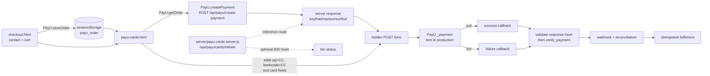

## Outcome and scope

This tutorial explains how the Kettle & Co. sample is shaped around PayU Cards **merchant-hosted/seamless checkout**, and how to turn that reference into a safer integration. It is intended for developers who need to understand the existing browser flow, the fields PayU expects, and the server-side controls required before production use.

By the end, you should be able to:

- trace the sample from checkout through the card page, PayU request, callbacks, and reconciliation;
- map the sample's card fields and routes to the PayU Cards documentation;
- separate code facts from documented PayU requirements and from recommended production design; and
- identify the security, integrity, callback, and fulfilment work still required.

**Important:** this page is based on static inspection of the archive and the retrieved PayU Cards page. The sample was **not run**, and no payment flow was tested. Values that appear in the archive or in PayU's examples are intentionally not reproduced here.

### Evidence labels used in this tutorial

**Recommendations** in this tutorial are explicitly marked as recommendations and are not claims about the current archive.

- **Observed source fact** means the statement is visible in the Kettle archive files.
- **PayU documentation fact** means the statement comes from the retrieved [Cards Integration documentation](https://docs.payu.in/docs/collect-payments-with-cards-seamless).
- **Recommendation** means a design or control to add; it is not a claim about what the archive currently does or what the cited page alone mandates.

## Prerequisites

- A server application that can keep the PayU key and salt out of browser code. The source is a Node/Express reference server, but the same boundaries apply to another backend.
- A PayU test merchant account and test key/salt obtained through the PayU dashboard. Do not copy credentials from the archive into a new deployment.
- HTTPS for every deployed page and callback endpoint.
- An order store with server-owned prices, inventory/SKU data, transaction state, and an idempotency key.
- A decision from your security/compliance team about whether you will handle raw cardholder data, use a PayU-supported tokenisation route, or use another hosted/payment-component approach. Do not assume that a browser form is automatically PCI-safe.
- A public, authenticated-by-integrity callback design for both success and failure, plus a reconciliation job or operator process.

## Architecture and exact sample flow

The following describes the flow represented by the source, not a statement that it has been executed.



Plain-text view:

```text
checkout.html
  └─ PayU.saveOrder()
       └─ sessionStorage key: payu_order
            └─ payu-cards.html
                 ├─ PayU.getOrder()
                 ├─ PayU.createPayment()
                 │    └─ POST /api/payu/create-payment
                 ├─ receive server-signed fields
                 ├─ add pg=CC, bankcode=CC, and card fields
                 └─ PayU.postToPayU() -> hidden POST -> PayU _payment
                                      ├─ surl -> success callback
                                      └─ furl -> failure callback
                                           └─ response validation
                                                └─ verify_payment/webhook
                                                     └─ reconciliation + fulfilment
```

### What the sample does, step by step

1. **Checkout.** `checkout.html` displays contact/delivery fields and the cart total. Its button calls `PayU.saveOrder()` and then navigates to `payu-cards.html`.
2. **Temporary order hand-off.** `saveOrder()` puts `amount`, a product description, `firstname`, `email`, and `phone` in browser `sessionStorage` under `payu_order`. `app.js` calculates the displayed total from the browser cart and its embedded catalogue.
3. **Card form.** `payu-cards.html` presents the cardholder name, card number, expiry month, expiry year, and CVV. It calls `PayU.getOrder()`, which reads `payu_order` and can fall back to values in the DOM or defaults.
4. **Server response.** `PayU.createPayment(order)` posts JSON to `/api/payu/create-payment`. The shared helper expects JSON back and does not itself add card fields.
5. **Hidden PayU POST.** The card-page handler passes the response to `PayU.postToPayU()`, adding `pg: "CC"`, `bankcode: "CC"`, and the five card fields. `postToPayU()` creates a hidden form, sets its action to the returned `action` or the hard-coded `PayU.ACTION`, appends every supplied property as a hidden input, and submits it.
6. **PayU processing and callbacks.** The server reference route returns an action and callback URLs, and the page posts to PayU's `_payment` endpoint. PayU then redirects to `surl` or `furl` as appropriate. A landing page is not, by itself, proof of payment.
7. **Verification and reconciliation.** A production callback handler must validate the PayU response, compare it with the server order, call `verify_payment`, consume webhooks, and reconcile the resulting state before fulfilment. The archive's `success.html` itself only displays a success message and a note to re-verify.

### Important route mismatch in the reference

**Observed source fact:** `server/payu-cards-server.js` defines `POST /api/payu/cards/initiate`. **Observed source fact:** `PayU.createPayment()` in `payu-common.js` calls `POST /api/payu/create-payment`. The inspected files do not show these routes being joined. Treat `cards/initiate` as the card-server reference route and either change the client to call it or provide a deliberate `/api/payu/create-payment` implementation. Do not assume that the current sample is wired end to end.

## The card implementation in detail

### Fields and gateway values

**Observed source fact:** the card page uses these element IDs and posts these names:

| Field      | Source element | Role          |
| ---------- | -------------- | ------------- |
| `ccname`   | `#ccname`      | Name on card  |
| `ccnum`    | `#ccnum`       | Card number   |
| `ccexpmon` | `#ccexpmon`    | Expiry month  |
| `ccexpyr`  | `#ccexpyr`     | Expiry year   |
| `ccvv`     | `#ccvv`        | Security code |

The handler sets `pg=CC` and `bankcode=CC`. It removes whitespace from the `ccnum` value with `.replace(/\s/g, "")`, but does not visibly apply Luhn validation, BIN-derived network selection, or length/format validation before building the form.

**PayU documentation fact:** Cards are initiated at the test `_payment` endpoint `https://test.payu.in/_payment` or the production endpoint `https://secure.payu.in/_payment`. The documented card request marks the key, transaction ID, amount, product information, customer identity/contact, `pg`, `bankcode`, card fields, `surl`, `furl`, and hash as mandatory for the plain card flow. The documentation says `pg` must be `CC`; `bankcode` identifies the card option and may be a network/card code rather than always `CC`.

**PayU documentation fact:** `ccnum` is 13–19 digits for general credit/debit cards, with documented special constraints for AMEX and Maestro, and should be checked with the Luhn algorithm. `ccvv` is three digits for ordinary credit/debit cards and four digits for AMEX security codes. `ccexpmon` is two-digit `MM` format, including a leading zero for months 1–9; `ccexpyr` is four digits. The page identifies Visa, Mastercard, AMEX, Diners, and RuPay as supported card types.

### BIN status route

**Observed source fact:** the reference server also exposes `GET /api/payu/cards/bin-status`. It takes `req.query.bin`, places it in `var1`, hashes `key|command|var1|salt` using the `getIssuingBankStatus` command, and posts to `https://info.payu.in/merchant/postservice.php?form=2`. The source comment calls this a check of issuing-bank/BIN health.

**PayU documentation fact:** the Cards page describes `getBinInfo` as the BIN API for validating card type from the first six digits. It documents `https://test.payu.in/merchant/postservice?form=2` for test and `https://info.payu.in/merchant/postservice?form=2` for production, with a form-encoded command request. The retrieved page's main integration steps say to validate card type with BIN API before initiating payment.

**Recommendation:** do not expose an unvalidated proxy. Accept only the expected numeric BIN length, reject other input, rate-limit the route, keep PayU credentials server-side, and return only the minimum UI-safe result. Confirm the currently supported command and parameter mapping with PayU before replacing `getBinInfo` with `getIssuingBankStatus`; they are not interchangeable merely because both are associated with card/BIN checks.

### What the source comments do and do not establish

The comments in `payu-common.js` and `server/payu-cards-server.js` correctly place salt and hash generation on the server and name the request and command hash shapes. The cards server comment also says not to log or persist raw card data. However, the inspected code does not demonstrate:

- a server-side order lookup or SKU/price calculation;
- a unique, durable transaction ID strategy;
- authentication, authorisation, rate limiting, CSRF protection, or input validation;
- response/reverse-hash verification;
- a `verify_payment` call, webhook handler, retry policy, or idempotent fulfilment;
- PCI scope controls, a tokenisation boundary, or 3DS implementation; or
- a network-specific `bankcode` selected from a validated BIN result.

## PayU request, hashing, and response facts

### BIN and Verify Payments APIs

**PayU documentation fact:** the Cards page names the BIN API for card-type validation and `verify_payment` for payment verification. Treat both as server-side integration points: BIN helps select/validate the card option before payment, while Verify Payments confirms the transaction after the callback. The retrieved page does not provide a new response schema in this tutorial, so consume only fields documented for your account and approved API version.

### Mandatory request and hash

**PayU documentation fact:** the request hash is:

```text
sha512(key|txnid|amount|productinfo|firstname|email|udf1|udf2|udf3|udf4|udf5||||||SALT)
```

Empty `udf1` through `udf5` positions must remain represented in the sequence. Hash on the server using the exact values that will be posted, including the server-owned amount and transaction ID.

**PayU documentation fact:** for command-style APIs such as the BIN call, the documented command hash shape is:

```text
sha512(key|command|var1|salt)
```

The archive implements this shape in `commandHash(command, var1)`.

**Recommendation:** use a vetted SHA-512 implementation, constant-time comparison where appropriate, and a canonical request builder so the signed values and posted values cannot diverge. Never place the salt or a hash-generation secret in browser JavaScript.

### Reverse response hash

**Observed source fact:** `README.md` explicitly tells implementers to recompute the reverse hash and compare it before marking an order paid. **PayU documentation fact:** the retrieved Cards page includes a response `hash` and instructs the integrator to check PayU's response, then verify the payment. The page also says the hash prevents transaction tampering.

**Recommendation:** implement the current PayU reverse-response hash procedure from your approved PayU integration guidance, compare the returned hash before using any success status, and reject a missing or mismatched hash. This tutorial does not invent a response formula because the retrieved Cards page exposes the request formula but does not state the complete reverse-hash sequence in the text inspected here.

### 3DS and tokenisation are optional flows, not automatic properties

**PayU documentation fact:** the retrieved page documents 3DS Secure 2.0 as an additional flow using `threeDS2RequestData`, including browser information, and describes guest-checkout/Alt ID and saved/network-token scenarios elsewhere on the same page. It also says that merchants storing or transmitting cardholder data must complete the referenced Self-Assessment Questionnaire A-EP and Attestation of Compliance process. These are documented alternatives or additional requirements, not evidence that the Kettle sample implements them.

**Recommendation:** choose one approved payment architecture with your security and PayU teams. Do not describe the Kettle browser form as tokenised, 3DS-enabled, or PCI-reduced merely because its checkout is called “seamless.” The source page's UI copy mentions tokenisation and 3-D Secure, but the inspected JavaScript contains no tokenisation call and no `threeDS2RequestData`.

## Build the integration

### 1. Create the order on the server from SKU IDs

The browser may submit SKU IDs and quantities, but it must not define the payable amount. Look up catalogue prices and availability on the server, calculate the total using integer minor units/decimal-safe arithmetic, create a pending order, and return a transaction ID plus only the signed payment fields needed by the selected flow.

```text
POST /api/orders
input: [{sku_id, quantity}], customer contact, shipping data

for each line:
    product = catalogue.find(sku_id)
    require product exists and is purchasable
    require quantity is within policy
    total += server_price(product) * quantity

order = create_pending_order(
    immutable_lines, total, customer, random_unique_txnid(), idempotency_key
)
return { order_id, txnid, amount: total, productinfo, firstname, email, phone }
```

**Recommendation:** bind the PayU `txnid` to the pending order and reject any later callback whose transaction ID, amount, currency assumptions, or order identity does not match.

### 2. Validate a BIN without leaking card data

```text
bin = first six digits after removing display spaces
require bin matches the documented numeric BIN format
require caller is allowed and route is rate-limited

result = PayU BIN API using server key + command hash
return only { network, category, domestic_or_international, allowed }
```

Do not store the full PAN for BIN lookup. Do not log the query string, full request, or raw PayU response if it contains more information than the UI needs.

### 3. Make an explicit card-data handling decision

```text
if approved tokenised/hosted component is available:
    collect card data only inside that approved boundary
    receive a token or payment result, not PAN/CVV
else if merchant-hosted plain card flow is approved:
    document PCI DSS scope and controls before implementation
    use TLS, strict CSP, trusted scripts, redaction, access controls,
    no logs/persistence/analytics capture, and controlled memory lifetime
    send fields only to the approved PayU destination
else:
    stop and obtain security/compliance approval
```

**Warning:** collecting PAN and CVV in a browser and then putting them into hidden inputs is not automatically PCI-safe. The archive does exactly that; it does not prove the required PCI controls.

### 4. Generate the hash and submit the form

```text
server:
    p = server-owned order and customer fields
    p.hash = sha512(join_with_pipes(
        key, p.txnid, p.amount, p.productinfo, p.firstname, p.email,
        p.udf1, p.udf2, p.udf3, p.udf4, p.udf5,
        "", "", "", "", "", salt
    ))
    return { key, p.*, hash, action, surl, furl }

browser, only after approved card-data design:
    form = hidden form(method=POST, action=action)
    add server fields
    add pg=CC
    add approved bankcode/network
    add ccname, normalized ccnum, ccexpmon, ccexpyr, ccvv
    submit once; prevent duplicate clicks
```

The PayU documentation says request data is form encoded for `_payment`. The archive's `postToPayU()` uses a browser form rather than a server-to-server POST; preserve the exact encoding and signed values required by your selected PayU flow.

### 5. Validate the callback response

```text
receive POST at surl or furl
parse only the documented response fields you need
locate pending order by txnid
reject unknown txnid, amount mismatch, or duplicate state transition
verify PayU response hash using the approved reverse-hash procedure
record raw response only under an approved redaction/retention policy
set payment state to observed_success or observed_failure
```

Do not invent success from the URL, page title, browser navigation, or a client-supplied status. Do not treat an undocumented field as authoritative without confirming it with PayU.

### 6. Verify, reconcile, and fulfil idempotently

```text
on callback or scheduled retry:
    verify response hash
    call PayU verify_payment for txnid using command hash
    accept only a verified result consistent with order amount and txnid
    ingest configured PayU webhook events and record delivery/event identity
    reconcile callback, verify_payment, webhook, and settlement records

if verified payment state is captured and order not fulfilled:
    transactionally mark order fulfilled
    reserve/decrement inventory once
    enqueue shipment/receipt once
else if already fulfilled:
    return success without repeating side effects
else:
    keep pending or route to manual review; do not ship
```

**PayU documentation fact:** the Cards page's four-step flow is BIN validation, payment initiation, response checking, and payment verification; it specifically names `verify_payment` and monitoring with webhooks. **Recommendation:** treat webhooks and verification as complementary signals, use retries with backoff, and make the fulfilment transition idempotent.

## Verify callbacks and reconcile

Configure `surl` and `furl` as server-handled HTTPS endpoints, even if they ultimately redirect the shopper to `success.html` or `failure.html`. The callback service should:

1. accept the PayU response without trusting its browser origin;
2. validate the response hash using the approved reverse-hash sequence;
3. find the server order by `txnid` and compare amount and merchant context;
4. call `verify_payment` and persist a normalized payment state;
5. process configured webhook notifications and deduplicate deliveries;
6. reconcile callback, verification, webhook, and later settlement status; and
7. make fulfilment a single, transactional, idempotent operation.

The sample's `success.html` says payment went through and an order is confirmed, but it does not perform any of these checks. Keep customer-facing pages informational until the server has verified the payment.

## Security

The controls below are part of the production security baseline for this integration.

## PCI and security considerations

The archive has a high-risk design boundary: `payu-cards.html` reads PAN and CVV in JavaScript, then `postToPayU()` creates hidden inputs containing those values. The browser, its extensions, page history, client-side error tooling, access logs, reverse proxies, and third-party scripts can all affect exposure. Hidden does not mean encrypted, isolated, or absent from memory.

At minimum, remediate these issues before production:

| Severity | Gap in the inspected sample                                                                                                          | Remediation direction                                                                                                                              |
| -------- | ------------------------------------------------------------------------------------------------------------------------------------ | -------------------------------------------------------------------------------------------------------------------------------------------------- |
| Critical | Raw PAN/CVV are collected in the browser and placed in a hidden form; no demonstrated PCI controls or tokenisation.                  | Obtain security/compliance approval, minimize scope with an approved PayU/tokenised/hosted design, and prohibit logging or persistence of PAN/CVV. |
| Critical | The archive contains sandbox values and card test material.                                                                          | Keep those values out of deployments and documentation; rotate or invalidate any value that may have been exposed.                                 |
| High     | Amount, product description, and customer values can originate from `sessionStorage`/browser defaults; cart prices live in `app.js`. | Create the order from SKU IDs server-side and sign only server-owned values.                                                                       |
| High     | Server fallback credentials and a test-mode/hard-coded action are present in the reference.                                          | Use secret management, fail closed when configuration is absent, and select environment configuration server-side.                                 |
| High     | `txnid` is generated as `"TXN" + Date.now()`.                                                                                        | Use a collision-resistant, durable, unique transaction ID bound to an order and idempotency key.                                                   |
| High     | No demonstrated authentication, authorisation, CSRF protection, rate limiting, or general validation.                                | Add controls appropriate to the storefront and callback model; validate every field and cap retries.                                               |
| High     | No demonstrated callback hash verification, webhook handler, or idempotent fulfilment.                                               | Implement response validation, `verify_payment`, webhook deduplication, reconciliation, and transactional fulfilment.                              |
| Medium   | BIN route accepts an unchecked query parameter and proxies a broad response.                                                         | Validate BIN format, rate-limit, authorize as appropriate, and minimize/redact output.                                                             |
| Medium   | Optional network/card-code selection and 3DS fields are not implemented.                                                             | Use BIN results to select a supported code and add `threeDS2RequestData` only when the approved flow requires it.                                  |
| Medium   | Sensitive values may be exposed through browser history, page state, diagnostics, or logs.                                           | Use approved capture controls, restrictive CSP, no third-party scripts on card entry, redacted telemetry, and explicit retention rules.            |
| Medium   | The source UI and README say “tokenise”/“3-D Secure,” but code does not demonstrate either.                                          | Label these as future or optional capabilities until the actual integration is present and tested.                                                 |

Never log the PAN, CVV, full form body, or full PayU request/response. Redact PAN to the minimum approved representation if operational debugging requires it, and never retain CVV after authorization. Follow your PCI assessor, PayU agreement, and applicable regulatory requirements for exact retention and control decisions.

## Test

These are test facts retrieved from the PayU Cards documentation, not claims that this archive was tested:

- Use `https://test.payu.in/_payment` for the test payment endpoint and the documented test merchant/postservice endpoint for BIN operations.
- The documentation provides test-environment request examples and identifies the required card field formats, `pg=CC`, callback URLs, and server-side hashing.
- The documentation's integration sequence is BIN validation, payment initiation, response checking, and `verify_payment`; configure webhook monitoring as documented for the account.
- Exercise success, failure, timeout, duplicate callback, missing callback, mismatched amount, invalid hash, and webhook-retry cases with non-production data.

Do not paste archive credentials, card numbers, customer contact values, or OTP values into a test plan. Use the current test credentials and test instruments supplied through the PayU documentation/dashboard, and keep them in the test environment only. This tutorial makes no claim that any of those cases passed in Kettle.

## Go live

Before switching to production:

- replace the test action with server-selected `https://secure.payu.in/_payment` and use production configuration only;
- verify that the production merchant account is enabled for the card networks and, where applicable, international transactions;
- complete the agreed PCI/security assessment for the chosen card-data architecture;
- verify server-owned pricing, durable unique transaction IDs, replay/duplicate handling, and fulfilment idempotency;
- deploy HTTPS callback endpoints and confirm response hash, `verify_payment`, webhook, and reconciliation monitoring;
- remove debug output, sample values, test notes, and fallback credentials;
- test rollback and manual-review paths; and
- obtain a controlled production approval from the payment, security, and operations owners.

**PayU documentation fact:** the page states that international transactions need to be enabled by contacting PayU's Integration Team. Confirm account eligibility and current onboarding instructions before enabling them.

## Troubleshooting

### The page submits to the wrong backend route

Compare the client URL in `payu-common.js` (`/api/payu/create-payment`) with the cards server route (`/api/payu/cards/initiate`). Make the route contract explicit; do not silently add a permissive alias.

### PayU rejects the request hash

Rebuild the exact pipe-delimited sequence, preserve all five UDF positions and empty placeholders, use the exact server-owned amount and transaction ID, and ensure the submitted form values are the values hashed. Never debug by printing the salt or full request.

### PayU rejects the card fields

Check the documented card-number length/Luhn rules, network-specific `bankcode`, three- versus four-digit security code, two-digit month, and four-digit year. Use the BIN API to validate/identify the card type and return a safe field error.

### The shopper sees success but the order is not fulfilled

Check the callback record, response hash result, `verify_payment` result, webhook delivery, transaction ID/amount match, and reconciliation state. A browser redirect or `success.html` is not proof of capture.

### A callback is received twice or arrives after a timeout

Use the `txnid` and webhook/event identity as deduplication keys. Keep state transitions monotonic and make fulfilment safe to repeat. Do not create a second shipment because a callback was retried.

## Sources

### Retrieved authority

- PayU, **Cards Integration**: [https://docs.payu.in/docs/collect-payments-with-cards-seamless](https://docs.payu.in/docs/collect-payments-with-cards-seamless)

Only the URL above was retrieved for PayU documentation in preparing this tutorial. References to BIN, `_payment`, request parameters, hash shapes, 3DS Secure 2.0, tokenisation/Alt ID, `verify_payment`, and webhook monitoring are limited to the content visible on that page. The current reverse-response hash sequence should be confirmed in PayU's approved, current integration guidance before implementation.

### Kettle archive paths analysed

- `tmp/kettle_inspect/README.md`
- `tmp/kettle_inspect/checkout.html`
- `tmp/kettle_inspect/payu-common.js`
- `tmp/kettle_inspect/payu-cards.html`
- `tmp/kettle_inspect/server/payu-cards-server.js`
- `tmp/kettle_inspect/success.html`
- `tmp/kettle_inspect/failure.html`
- `tmp/kettle_inspect/app.js`

The archive was inspected statically. This page does not claim that the sample started, that an endpoint responded, that a card was authorized, or that any payment flow was tested.
