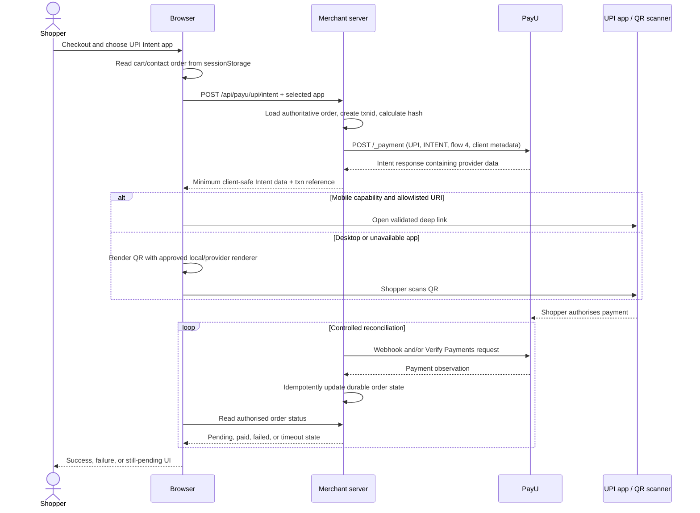

#

This tutorial explains how the Kettle & Co. sample is structured for a PayU UPI Intent server-to-server integration, and how to turn that reference flow into a production-ready implementation.

> **Integrity note:** This page is based on static inspection of the Kettle & Co. archive and the retrieved PayU UPI Intent documentation page. The sample was not run, no payment was initiated, and the UPI flow was not tested.

## Outcome and scope

By the end, you should understand how to:

- carry an order from the Kettle & Co. checkout into the UPI Intent page;
- initiate an Intent payment from a trusted merchant server;
- handle the returned `intentURIData` on a mobile device or present a desktop QR fallback;
- reconcile the payment with a server-side Verify Payments request and/or a PayU webhook; and
- identify the changes required before using this reference sample beyond a sandbox or code-review exercise.

This page covers the UPI Intent path only. It does not document the Cards, Net Banking, or Wallets sample paths, and it does not claim that any endpoint or payment has been exercised.

### How to read the evidence

- **Observed source fact** means behaviour or a value directly visible in an analysed archive file. It is not a recommendation for production.
- **PayU documentation fact** means information visible on the retrieved page [UPI Intent Integration](https://docs.payu.in/docs/upi-intent-server-to-server).
- **Recommendation** means a hardening or implementation choice proposed in this tutorial. Confirm account-specific requirements with PayU before go-live.

## Prerequisites

- A merchant account and PayU credentials obtained through the appropriate PayU onboarding process. Keep the salt and other secrets on the server only.
- A server application that can receive JSON from the browser and make form-encoded HTTPS requests to PayU.
- A durable order store, or an equivalent server-side order service. The archive does not provide one.
- HTTPS for browser-to-server and server-to-server traffic in a deployed environment.
- For an app-based implementation, the platform configuration and package identifiers needed to invoke the UPI apps supported for your integration. PayU’s retrieved page says to add package IDs to the app manifest; it does not provide a complete package list on that page.
- A controlled way to generate and validate SHA-512 hashes on the server.

## Exact sample flow

The sample’s intended path is:

1. On `checkout.html`, `PayU.saveOrder()` writes the cart total and contact fields to `sessionStorage` under `payu_order`.
2. The shopper opens `payu-upi-intent.html` and chooses one of four buttons: Google Pay (`gpay`), PhonePe (`phonepe`), Paytm (`paytm`), or Any UPI app (`any`).
3. The page calls `POST /api/payu/upi/intent` with the order returned by `PayU.getOrder()` and the selected button’s `app` value.
4. The reference server creates a transaction ID, builds the payment request, computes a payment hash, and POSTs form data to PayU’s test `_payment` endpoint with `pg=UPI`, `bankcode=INTENT`, and `txn_s2s_flow=4`. It also passes client IP and user-agent metadata as `s2s_client_ip` and `s2s_device_info`.
5. The server returns PayU’s response fields together with the locally generated `txnid`. The browser reads `res.intentURIData`.
6. On a user agent matching `Android` or `iPhone`, the sample assigns `window.location.href = res.intentURIData` to attempt to open a UPI app. Otherwise, it calls `PayU.renderQR(res.intentURIData)`.
7. `renderQR` points an external QR service at the URL-encoded Intent URI. In parallel, `PayU.pollStatus(res.txnid)` starts browser polling.
8. `GET /api/payu/upi/status/:txnid` calls PayU’s `verify_payment` service-to-server API. The browser looks for `transaction_details[txnid].status`.
9. The sample redirects to `success.html` only when the extracted status is `success`; every other terminal result, including the polling limit, is sent to `failure.html`.

The sample’s success and failure pages are presentation pages. A page display is not proof that an order was paid.

## Sequence diagram

The following diagram combines the browser/mobile path with the server-to-server calls. It represents the inspected sample plus the recommended reconciliation boundary; it is not evidence that the flow was executed.



## Build the integration

### 1. Create the order on the server, not from browser totals

#### Observed source fact

`app.js` calculates the cart total from the browser’s `localStorage` cart and a client-side catalogue. On checkout, `PayU.saveOrder()` stores that total, a fixed product description, and the form’s name, email, and phone in `sessionStorage`. `PayU.getOrder()` reads those values and falls back to form fields or default values when they are absent.

#### Recommendation

Use the browser data only as a request to create or identify an order. On the server:

- resolve product IDs and quantities against your catalogue;
- calculate the amount from authoritative prices;
- validate customer fields and currency/decimal formatting;
- create one server-side order in an `awaiting_payment` state; and
- issue a unique, non-predictable merchant transaction ID associated with that order.

Do not accept a browser-supplied amount or product description as the amount to charge. Do not use `Date.now()` alone as a transaction ID.

Illustrative trusted order-creation pseudocode:

````text
POST /api/orders
  require an authenticated customer or checkout session
  validate product IDs, quantities, address, and customer contact data
  catalogue_rows = catalogue.lookup(request.items)
  amount = calculate_total_from_catalogue(catalogue_rows, request.quantities, server_pricing_rules)
  order_id = create_non_guessable_order_id()
  insert order(order_id, amount, currency, state="awaiting_payment", customer_id)
  return order_id and a server-signed checkout reference

# The later payment request carries the order reference, not an authority to set amount.
``

### 2. Initiate the Intent payment

#### Observed source fact

`server/payu-upi-intent-server.js` exposes `POST /api/payu/upi/intent`. It constructs `p` from a new transaction ID, a number formatted to two decimal places from `req.body.amount`, and `productinfo`, `firstname`, and `email` from the request. It separately passes `phone`, `surl`, and `furl`. The payment request includes:

- `pg: "UPI"`;
- `bankcode: "INTENT"`;
- `txn_s2s_flow: "4"`;
- `s2s_client_ip`, using `x-forwarded-for` if present, otherwise the socket address; and
- `s2s_device_info`, using the request’s user-agent.

It sends `application/x-www-form-urlencoded` data to the test `_payment` URL and calls `r.json()`. The source comment illustrates fields such as `intentURIData` and `merchantTxnId`, but the code does not validate a complete response schema before forwarding it.

The request hash is built from the key, transaction fields, five empty-or-provided UDF positions, six empty positions, and the salt. The source’s hash function is equivalent to the documentation formula below. The source’s command hash is built for `verify_payment`.

#### PayU documentation fact

The retrieved PayU page lists these mandatory payment fields: `key`, `txnid`, `amount`, `productinfo`, `firstname`, `email`, `phone`, `surl`, `furl`, `hash`, `pg`, `bankcode`, `txn_s2s_flow`, `s2s_client_ip`, and `s2s_device_info`. It describes `pg=UPI`, `bankcode=INTENT`, and `txn_s2s_flow=4` for UPI Intent. It describes `s2s_client_ip` as the client device IP and `s2s_device_info` as device information/user-agent data.

The payment hash formula on that page is:

```text
sha512(key|txnid|amount|productinfo|firstname|email|udf1|udf2|udf3|udf4|udf5||||||Salt)
````

The retrieved page shows the test payment endpoint as:

```text
https://test.payu.in/_payment
```

Its examples use placeholders and documentation-example values. Do not copy archive credentials or documentation-example credentials into an application.

#### Recommendation

The server should load the order by an authenticated or otherwise bound order reference, derive every chargeable field from that order, and generate the hash with the exact field order required by PayU. Configure return URLs and the optional `notifyurl` deliberately. Treat PayU’s response as untrusted input until it has passed basic parsing, transaction correlation, and reconciliation checks.

Illustrative server-side pseudocode:

```text
POST /api/payu/upi/intent
  require an authenticated checkout session or signed order reference
  order = orders.get(orderReference)
  require order exists and order.state == "awaiting_payment"
  require order has not already received a terminal payment result

  txnid = create_unique_server_transaction_id(order.id)
  payment = {
    key: server_config.payu_key,
    txnid: txnid,
    amount: format_authoritative_amount(order.total),
    productinfo: order.description,
    firstname: order.customer.first_name,
    email: order.customer.email,
    phone: order.customer.phone,
    surl: server_config.success_return_url,
    furl: server_config.failure_return_url,
    pg: "UPI",
    bankcode: "INTENT",
    txn_s2s_flow: "4",
    s2s_client_ip: derive_client_ip_from_trusted_proxy_chain(request),
    s2s_device_info: request.user_agent,
    hash: sha512_in_the_documented_field_order(payment, server_config.payu_salt)
  }
  response = POST_FORM(server_config.payu_payment_endpoint, payment)
  require response is parseable and contains the fields needed by this client path
  persist(order.id, txnid, response_reference, state="intent_created")
  return only the minimum client-safe Intent data and a server transaction reference
```

This pseudocode intentionally does not define an undocumented PayU response schema.

## Intent and deep-link handling

### App buttons and selected values

#### Observed source fact

`payu-upi-intent.html` renders four buttons with these exact `data-app` values:

| Visible button | `data-app` value |
| -------------- | ---------------- |
| Google Pay     | `gpay`           |
| PhonePe        | `phonepe`        |
| Paytm          | `paytm`          |
| Any UPI app    | `any`            |

The browser includes `app: btn.dataset.app` in the request. The observed Node route does not use `req.body.app` when it builds the PayU request. In other words, the button choice is sent to the server but is not visibly used to select a PayU field or construct a package-specific URI in this archive.

### Mobile branch and desktop fallback

#### Observed source fact

The mobile branch is `/Android|iPhone/i.test(navigator.userAgent)`. When true, the page sets `window.location.href` to the returned `res.intentURIData`. When false, it calls `PayU.renderQR`.

`payu-common.js` creates the QR image by putting the URL-encoded Intent URI into a request to:

```text
https://api.qrserver.com/v1/create-qr-code/?size=220x220&data=...
```

That means the Intent URI is sent to an external QR service. The source does not ask for approval, provide a local QR renderer, or apply a data-sharing policy.

#### PayU documentation fact

The retrieved PayU page describes a Smart Intent workflow: update the manifest with package IDs, fetch the supported UPI/Smart Intent app list, obtain the Intent URI from `_payment`, extract `intentURIData`, and construct a platform-specific URI. It shows these construction concepts:

- Android prefix: `intent://pay?`, with a suffix concept containing `#Intent;scheme=upi;package=<package name>;`.
- iOS examples: `phonepe://upi/pay?`, `paytm://upi/pay?`, and `gpay://upi/pay?`.

The page says to add the appropriate prefix to create a fully qualified deep link. It does not, in the retrieved content, specify a complete `intentURIData` schema, a complete package list, or production-specific deep-link details.

#### Recommendation: allowlist and construct safely

Do not treat an arbitrary returned string as a safe navigation target. Validate the response type, correlate the transaction, and allow only schemes and package combinations that your integration explicitly supports. Also define what happens when an app is not installed, when the user returns from the app, and when a browser blocks the navigation.

Illustrative pseudocode:

```text
intent = response.intentURIData
require intent is a string and is below the configured length limit
parsed = parse_as_uri_or_documented_intent_data(intent)
require parsed is valid for the selected platform
require parsed.scheme in {"gpay", "phonepe", "paytm", "intent"}
if parsed contains a package:
  require parsed.package in server_config.allowed_upi_packages
require transaction_reference matches the server-created transaction

show an explicit "Open UPI app" action rather than navigating automatically where platform UX requires it
navigate only to the validated, allowlisted URI
on return, show "Checking payment" and reconcile on the server
```

The parser and package values in this pseudocode are integration policy, not claims about an undocumented PayU response shape.

### QR fallback without leaking data to an unapproved third party

#### Recommendation

Prefer generating the QR image locally or through an approved first-party/contracted service. The QR payload can contain payment data, so do not put it in an unapproved third-party URL. A safe server-side pattern is:

```text
POST /api/payu/upi/qr
  require the caller is authorised for the order
  require the transaction is in an intent-created state
  create the QR image locally from the validated, server-held payment URI
  return an image response or a short-lived same-origin object URL
  never log the URI, full QR URL, salt, or credentials
```

If a third-party QR service is approved, document the data-sharing decision, use the service’s supported privacy controls, and send only the minimum data required. The archive’s `api.qrserver.com` call is an observed implementation detail, not a security recommendation.

## Verify status and reconcile

### What the sample does

#### Observed source fact

`PayU.pollStatus(txnid)` starts a `setInterval` every 3,000 milliseconds. On each tick it increments `tries` and requests:

```text
GET /api/payu/upi/status/:txnid
```

It extracts the status from:

```text
res.transaction_details[txnid].status
```

when that object exists; otherwise it uses `pending`. It stops when the status is anything other than `pending` or when `tries > 40`. It then navigates to `success.html` only for the literal status `success`; all other outcomes navigate to `failure.html`. Fetch errors are not handled in this function, so a failed request does not visibly clear the interval or produce a controlled timeout state.

The server route uses the path parameter as `var1`, posts `key`, `command=verify_payment`, `var1`, and a command hash to PayU’s Verify Payments service, and returns the upstream JSON directly. The browser therefore has access to a status-polling route that performs a credentialed PayU operation on its behalf.

### PayU reconciliation facts

The retrieved documentation says to reconcile the transaction and provides two options: PayU webhooks or the Verify Payments API. It documents these Verify Payments environments and endpoints:

| Environment            | Verify Payments endpoint                               |
| ---------------------- | ------------------------------------------------------ |
| Test Environment       | `https://test.payu.in/merchant/postservice.php?form=2` |
| Production Environment | `https://info.payu.in/merchant/postservice.php?form=2` |

It gives the Verify Payments hash formula:

```text
sha512(key|command|var1|salt)
```

The page’s response examples show a top-level `status`, `msg`, and `transaction_details` object keyed by transaction ID. Those examples are documentation examples, not evidence of a response from this archive or a live call. Do not infer additional response fields from them.

### Webhook and Verify Payments design

#### Recommendation

Implement a server-owned reconciliation pipeline. Webhooks should be accepted at a protected endpoint, authenticated according to PayU’s current webhook guidance, schema-checked, correlated to an existing order, and treated as at-least-once delivery. Verify Payments should be the fallback and a reconciliation tool, not a browser trust signal.

Illustrative pseudocode:

```text
POST /webhooks/payu/payment
  verify webhook authenticity using the current PayU configuration
  parse only the documented fields needed to correlate the transaction
  order = find_order_by_server_transaction_id(event.transaction_id)
  if order is unknown: store for investigation and return the documented safe acknowledgement
  reconcile_payment(order, event)

reconcile_payment(order, payment_observation)
  verify transaction ID, amount, currency, merchant identity, and terminal status
  if the observation is successful:
    atomically update the order from awaiting_payment/intent_created to paid
  if the observation is failed or cancelled:
    atomically update it to the corresponding internal terminal state
  if it is pending or incomplete:
    leave it pending and schedule a controlled reconciliation attempt
  record the source, received time, raw response reference, and decision without secrets

fallback_verify(order)
  var1 = order.payu_transaction_id
  hash = sha512(key|verify_payment|var1|salt)
  response = POST_FORM(configured_verify_endpoint, {
    key, command: "verify_payment", var1, hash
  })
  reconcile_payment(order, response)
```

### Idempotent order updates

The same payment may be observed from a webhook, a return URL, and a Verify Payments request. Use a database transaction or equivalent compare-and-set operation:

```text
update order
set state = "paid", paid_at = now(), payment_reference = verified_reference
where id = order_id
  and state not in {"paid", "fulfilled", "refunded"}

if no row changed:
  treat the observation as a duplicate or already-terminal update
```

Do not fulfil an order merely because `success.html` rendered. The archive’s own `success.html` says to re-verify with `verify_payment` and the reverse hash before fulfilling, but the sample page itself does not perform that check.

### Retry and timeout handling

#### Recommendation

Provider calls and webhooks can be delayed or repeated. Make retries safe and bounded. Never create a second payment attempt merely because a browser request timed out unless the existing attempt has been checked and the business policy permits a new attempt. Use a retry key tied to the order and payment attempt.

Illustrative pseudocode:

```text
reconcile_with_retry(order_id, attempt_id)
  for delay in [short_backoff, medium_backoff, long_backoff]:
    response = verify_payment_from_server(attempt_id)
    if response is a verified terminal success or failure:
      return idempotently_update_order(order_id, response)
    if response is a known pending state:
      sleep(delay)
      continue
    if response is a timeout or transient provider/network error:
      sleep(delay)
      continue
    record_unknown_result_for_review()
    return pending_or_manual_review
  mark_attempt_as_reconciliation_pending()
  notify_operations_if_sla_requires_it()
  return pending

# The browser may stop polling; server reconciliation must continue independently.
``

The specific backoff values, retry count, and pending duration are merchant operational policy. They are not specified by the retrieved PayU page.

## Test

This section records what the retrieved PayU documentation says, not a test performed by this tutorial.

1. Configure a PayU test merchant using credentials obtained through PayU’s supported process. Do not use credentials copied from the archive or from a documentation snippet.
2. Generate a server-side payment hash using the exact formula and send a form-encoded request to the documented test payment endpoint, `https://test.payu.in/_payment`.
3. Include the documented UPI Intent values `pg=UPI`, `bankcode=INTENT`, and `txn_s2s_flow=4`, plus `s2s_client_ip` and `s2s_device_info`.
4. Confirm that the server handles the returned Intent data without logging secrets or sending it to an unapproved QR provider.
5. Verify the transaction from the server using `verify_payment` and the documented test Verify Payments endpoint, `https://test.payu.in/merchant/postservice.php?form=2`, with `sha512(key|command|var1|salt)`.
6. Exercise pending, successful, failed, timeout, duplicate webhook, browser refresh, app-not-installed, and desktop QR scenarios in the merchant’s controlled test environment.
7. Confirm that fulfilment occurs only after the server-side reconciliation state changes atomically.

No step above was executed during the static inspection for this page. PayU’s retrieved page does not specify the sample’s exact `intentURIData` schema, a complete package list, or a prescribed polling interval. Do not treat the sample’s 3-second interval or 40-count limit as PayU requirements.

## Go live

- Obtain and store live credentials through PayU’s merchant process. Keep the salt in secret-managed server configuration only.
- Confirm the production payment endpoint, request parameters, supported apps/package IDs, return handling, webhook configuration, and operational limits with PayU. The retrieved page provides production information for Verify Payments, but does not provide complete production payment/deep-link details for this tutorial.
- Replace the archive’s test-only endpoint configuration. Never infer that changing one URL is sufficient for production readiness.
- Deploy the payment-initiation and reconciliation routes behind authentication, request validation, rate limits, abuse monitoring, and network controls.
- Use a durable order state machine and idempotent fulfilment.
- Configure and verify webhooks before depending on them. Retain Verify Payments as a reconciliation path.
- Use a local or approved QR mechanism, and review the data sent to any external service.
- Run PayU’s current certification or merchant go-live checks, if applicable, and confirm settlement, refund, dispute, and observability procedures.
- Keep a runbook for pending transactions, duplicate callbacks, provider outages, and customer return-from-app behaviour.

## Troubleshooting

| Symptom | What the archive shows | Safer investigation |
| --- | --- | --- |
| The UPI app does not open | The page detects only `Android` or `iPhone` in the user-agent and assigns `window.location.href` directly. | Check platform/browser restrictions, app installation, the validated URI scheme, package configuration, and return handling. Do not assume a mobile user agent means a compatible app is installed. |
| Desktop shopper sees a QR | The non-mobile branch calls `renderQR`, which uses `api.qrserver.com` and sends it the encoded URI. | Use an approved local or contracted QR renderer and verify that the QR payload is not exposed through logs, referrers, or an unapproved service. |
| Status remains pending | Polling calls the browser route every 3 seconds, but fetch errors are not handled. | Inspect server and provider responses by transaction ID, apply bounded server-side reconciliation, and show a controlled pending/timeout state. |
| The page shows failure after waiting | The sample stops after `tries > 40` and treats every non-`success` status as failure. | Distinguish pending, failed, cancelled, unknown, and timeout internally. Query Verify Payments from the server before customer-facing finality. |
| PayU rejects the request | The route sends a fixed UPI mode and a payment hash, but takes important order fields from the request. | Compare the server-generated fields, exact hash order, mandatory client IP/device metadata, return URLs, endpoint environment, and merchant configuration. Redact secrets while logging. |
| An order is marked paid unexpectedly | `success.html` is only a static UI and browser routing is not authoritative. | Require server-side verification, amount/transaction correlation, reverse-hash or callback validation as applicable, and an idempotent state transition. |

## Security

The following gaps are visible from static inspection. Severity is an engineering triage estimate for a production integration; confirm impact in your threat model.

| Severity | Observed gap | Remediation |
| --- | --- | --- |
| Critical | The archive contains sandbox credentials and the Node sample has fallback credential values when environment variables are absent. | Archive sandbox values, but omit them from this tutorial and never reuse them. Remove code fallbacks; require secret-managed configuration and fail closed. Rotate any value that may have been exposed. |
| Critical | Amount, description, name, email, and phone reach the server from browser-controlled storage/form data. | Create and price orders server-side; bind payment attempts to an authenticated order and validate all fields. |
| High | The status route is exposed to the browser and performs a credentialed Verify Payments request. | Keep provider credentials and reconciliation server-side. Return only a minimal, authorisation-checked order state to the browser. Rate-limit and bind the route to the caller/order. |
| High | There is no visible authentication, authorisation, rate limit, or robust input validation on the two API routes. | Add session/order binding, CSRF protection where applicable, schema and size validation, authentication, authorisation, rate limits, abuse monitoring, and safe error handling. |
| High | `x-forwarded-for` is trusted without an explicit trusted-proxy policy. | Derive client IP from a configured proxy chain, validate it, and never let an arbitrary caller choose the value sent as payment metadata. |
| High | No webhook implementation is present, and the sample relies on browser polling. | Implement authenticated webhook handling and server reconciliation, with Verify Payments as fallback. |
| High | Polling is exposed to the browser, uses a fixed interval/limit, and leaves fetch failures unhandled. | Make polling/reconciliation server-controlled, bounded, observable, and retryable with backoff; return a clear pending state to the UI. |
| High | The client trusts `res.intentURIData` and navigates to it directly. | Validate type, scheme, package, transaction correlation, and allowed app before navigation. Define cancellation and return handling. |
| Medium | QR generation sends the encoded payment URI to an external QR service. | Generate locally or use an approved provider with an explicit privacy review. Avoid query-string leakage and sensitive logs. |
| Medium | User-agent mobile detection is brittle and covers only Android/iPhone string matches. | Use a deliberate platform capability strategy and explicit user action/fallbacks; do not use detection as a security control. |
| Medium | There is no app package allowlist or documented return/deep-link handling in the sample. | Maintain an allowlist based on the supported app configuration, configure platform manifests where applicable, and handle app absence, cancellation, and return. |
| Medium | The success page can be reached as a static UI and is not proof of payment. | Make fulfilment depend only on a durable, server-verified terminal state. |
| High | No durable order state or idempotency mechanism is shown; the transaction ID is `"TXN" + Date.now()`. | Persist an order/payment-attempt record, use a collision-resistant ID, enforce one-time transitions, and deduplicate webhooks/retries. |
| High | The archive points at a test-only payment endpoint and describes a sandbox configuration. | Treat it as reference code only, keep test and production configuration separate, and complete PayU’s current go-live checks. |

## Sources

### Retrieved documentation

- [PayU: UPI Intent Integration](https://docs.payu.in/docs/upi-intent-server-to-server) — retrieved for the UPI Intent workflow, mandatory payment fields, hash formulas, test payment endpoint, deep-link construction concepts, webhook/Verify Payments reconciliation, and documented Verify Payments endpoints. The retrieved page did not specify a complete `intentURIData` schema, complete package list, production payment/deep-link details, or a polling interval.

### Analysed archive paths

Static inspection was performed against the extracted archive under `tmp/kettle_inspect/`:

- `tmp/kettle_inspect/README.md`
- `tmp/kettle_inspect/checkout.html`
- `tmp/kettle_inspect/payu-common.js`
- `tmp/kettle_inspect/payu-upi-intent.html`
- `tmp/kettle_inspect/server/payu-upi-intent-server.js`
- `tmp/kettle_inspect/success.html`
- `tmp/kettle_inspect/failure.html`
- `tmp/kettle_inspect/app.js`

No other documentation page is cited here.
```
