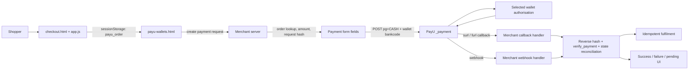

This tutorial explains how the Kettle & Co. sample is intended to collect a wallet payment through PayU Merchant Hosted Checkout, and how to turn the reference code into a production-ready integration. It is based on static inspection of the archive and the retrieved PayU Wallets documentation page. **The sample was not run and the payment flow was not tested.**

## Outcome and scope

By the end, you should understand how to:

- carry an order from the Kettle & Co. checkout page to the wallet selection page;
- select a wallet and post a server-signed payment request to PayU with `pg=CASH` and a wallet-specific `bankcode`;
- handle PayU success and failure redirects without treating a browser redirect as proof of payment;
- verify the transaction server-to-server and reconcile it before idempotent fulfilment; and
- identify the changes needed before using this archive as more than a learning reference.

The scope is web-based, seamless or merchant-hosted wallet checkout. It covers the source files listed in [Sources](#sources), the retrieved Wallets Integration documentation, the request and response hash concepts shown there, and implementation pseudocode. It does not document an SDK wallet flow, reproduce archive credentials, or claim that any code or payment was executed.

> **Important reading rule**
>
> - **Observed source facts** describe what the inspected Kettle & Co. files contain.
> - **PayU documentation facts** describe what the retrieved PayU page states.
> - **Recommendations** describe changes an implementation should make. They are not claims about what the archive already does.

## Prerequisites

Before implementing this flow:

1. Have a PayU merchant account and obtain the appropriate test credentials from PayU for sandbox work. Keep the salt only in server-side secret storage. The archive contains sandbox-looking values, but this tutorial intentionally does not reproduce them.
2. Have an HTTPS application origin for callbacks. The `surl` and `furl` values must be reachable by PayU and must route to server-controlled callback handling, even if the user-facing result page is separate.
3. Maintain a server-side order store. An order should contain the authoritative SKU IDs, quantities, prices, currency, customer details, total, transaction ID, selected wallet, and payment state.
4. Decide how you will receive and reconcile PayU updates: callback handling plus `verify_payment`, webhooks, or both. The retrieved PayU page recommends verifying with webhooks and/or the Verify Payments API.
5. Confirm current wallet availability and bank codes for the merchant account. The archive's hardcoded list is a UI example, not an authority for current availability.

## What the archive shows

### Observed source facts

The sample is a static storefront with a Node/Express reference server. `README.md` describes `checkout.html` as an address form plus a Seamless PayU Checkout button, and identifies the Wallets page and server as separate files.

`checkout.html` contains customer fields for full name, email, phone, and address. It renders the cart summary and provides links for several payment-mode pages, including `payu-wallets.html`. Its general PayU button calls `PayU.saveOrder()` and then navigates to the cards page; the Wallets link is the path to use for this tutorial. The page also displays a test-mode note. Do not copy credentials from the archive into a real application.

`app.js` defines the catalogue and cart. Catalogue items have IDs such as `p1` through `p6`; the cart stores item IDs and quantities in `localStorage`; and `Cart.total()` calculates a total from the client-side catalogue. This is useful for a demo but is not an authoritative pricing or order system.

`payu-common.js` exposes a shared `PayU` object:

- `getOrder()` reads `sessionStorage.payu_order`, parses it, and otherwise uses values from elements with IDs such as `firstname` and `email`. It supplies fallback values when fields are absent. The amount can come from the saved order, from `Cart.total()`, or from a numeric fallback. It returns `amount`, `productinfo`, `firstname`, `email`, and `phone`.
- `saveOrder()` writes the client-side cart total, a fixed product description, and the checkout field values to `sessionStorage` under `payu_order`.
- `createPayment(order)` sends JSON to `/api/payu/create-payment` and returns the parsed JSON response.
- `postToPayU(fields)` creates a hidden HTML form, uses `fields.action` or the shared test action as the form target, adds every non-null field except `action` as a hidden input, appends the form to the document, and calls `form.submit()`.
- `renderQR()` and `pollStatus()` are shared helpers for the UPI sample. They are not used by the Wallets page.

`payu-wallets.html` displays these six wallet buttons and data attributes:

| Label displayed | `data-code` sent as `bankcode` |
| --------------- | ------------------------------ |
| Paytm           | `PAYTM`                        |
| PhonePe         | `PHONEPE`                      |
| Amazon Pay      | `AMAZONPAY`                    |
| Mobikwik        | `MOBIKWIK`                     |
| Freecharge      | `FREECHARGE`                   |
| Ola Money       | `OLAMONEY`                     |

The page states `pg=CASH` with a wallet bank code. On a button click, it calls `PayU.createPayment(PayU.getOrder())`, then calls `PayU.postToPayU()` with the returned object plus `pg: "CASH"` and `bankcode: btn.dataset.code`.

`server/payu-wallets-server.js` contains a reference Express route, `POST /api/payu/wallets/initiate`. It builds a payment object with a generated transaction ID, a two-decimal numeric amount, and `productinfo`, `firstname`, and `email` copied from the request body. It returns an object containing the payment data, the server-side `key`, a request `hash`, the test `_payment` action, and `surl` and `furl` read from server environment configuration. It also contains a `GET /api/payu/wallets/options` route.

The archive has an important wiring mismatch: the browser helper calls `/api/payu/create-payment`, while the inspected Wallets server exposes `/api/payu/wallets/initiate`. Static inspection cannot establish that another server file supplies `/api/payu/create-payment`. Treat this as a gap to fix, not as a working connection between the page and the route.

The options route creates a form with `key`, `command=getPaymentOptions`, `var1=default`, and a command hash. It posts to `https://info.payu.in/merchant/postservice.php?form=2` and directly returns the parsed JSON. The Wallets page does not call this options route, so the six buttons are not dynamically filtered by the merchant's enabled wallets.

The success page says the payment went through, that the order is confirmed, and that a receipt is on its way. It also includes a note telling the implementer to re-verify with `verify_payment` and the reverse hash. The failure page says the payment was not completed, says no money was taken, and links back to checkout. These are presentation pages; neither page is shown implementing callback validation, webhook processing, verification, or fulfilment.

### Exact sample flow, including the mismatch

The intended user journey is:

1. **Checkout:** the shopper fills in the checkout fields and has a cart rendered by `app.js`.
2. **Order snapshot:** `PayU.saveOrder()` stores the client-side amount, product description, and customer fields as `sessionStorage.payu_order`.
3. **Wallet selection:** the shopper opens `payu-wallets.html` and chooses one of the six hardcoded buttons.
4. **Create payment:** the page calls `PayU.getOrder()` and then `PayU.createPayment(order)`.
5. **Server response:** the server should create or load the authoritative order, assign a unique transaction ID, calculate the request hash, and return payment fields including the action, key, hash, transaction ID, amount, product description, customer fields, and callback URLs. In the inspected reference route, those returned fields are `txnid`, `amount`, `productinfo`, `firstname`, `email`, `key`, `hash`, `action`, `surl`, and `furl`.
6. **Hidden POST:** the client builds a hidden form from the response and adds `pg=CASH` and the chosen wallet code as `bankcode`, then posts to the returned PayU action.
7. **Wallet authorisation:** PayU and the selected wallet handle the shopper's login and authorisation.
8. **Callback:** PayU redirects or posts to `surl` on success or `furl` on failure. The sample pages are the visible landing pages, but production code must validate the callback first.
9. **Verification and reconciliation:** the server validates the response hash, calls `verify_payment` and/or processes a webhook, compares the returned transaction and amount to its order, and only then marks the order paid.
10. **Fulfilment:** a transactional, idempotent fulfilment operation creates the shipment or entitlement once. Repeated callbacks, webhook retries, and shopper refreshes must not fulfil twice.

**As written, step 4 requests&#x20;**`/api/payu/create-payment`**, while the inspected Wallets reference server provides&#x20;**`/api/payu/wallets/initiate`**.** Choose one canonical route and update both sides. Do not assume the sample flow is runnable merely because the functions have compatible names.

### Architecture

The following diagram separates the observed browser/server pieces from the PayU and wallet-provider steps, and shows where verification and fulfilment belong in a production design.



The archive visibly implements the checkout page, wallet page, shared form helper, reference initiation/options routes, and success/failure pages. The callback, webhook, verification, and fulfilment nodes are the required production additions; they are not claimed to exist in the inspected files.

## PayU documentation facts

The retrieved page, [Collect Payments with Wallets - Merchant Hosted Checkout](https://docs.payu.in/docs/collect-payments-with-wallets-seamless), states that wallet payments use Merchant Hosted Checkout and that the merchant posts `CASH` for `pg` and the code for the desired wallet for `bankcode`.

### Payment action and required fields

The page lists these payment endpoints:

| Environment | `_payment` endpoint               |
| ----------- | --------------------------------- |
| Test        | `https://test.payu.in/_payment`   |
| Production  | `https://secure.payu.in/_payment` |

The request is a form-encoded POST. The documentation's wallet parameter material identifies these as mandatory or relevant fields: merchant `key`, merchant-generated `txnid`, `amount`, `productinfo`, customer `firstname`, customer `email`, `phone`, `pg`, `bankcode`, `surl`, `furl`, and the merchant-calculated `hash`. The exact field contract and any account-specific requirements should be checked against the current PayU API reference before release.

For ordinary wallets, the page documents `pg=CASH`. It documents an exception for Advantage Club: use `pg=RD` with its wallet-specific bank code. The page also states that there is no test environment for Advantage Club and that it must be tested directly in production. Do not apply that exception to ordinary wallets.

`bankcode` is provider-specific. The page directs merchants to the Wallet Codes reference for the exact value. Therefore the UI's `PAYTM`, `PHONEPE`, `AMAZONPAY`, `MOBIKWIK`, `FREECHARGE`, and `OLAMONEY` values are observed archive choices, not a guarantee that every code is currently enabled or spelled identically for every merchant account.

### Request hash

The page specifies this request hash sequence:

```text
sha512(key|txnid|amount|productinfo|firstname|email|udf1|udf2|udf3|udf4|udf5||||||SALT)
```

The separators are part of the input. Empty `udf1` through `udf5` values still occupy their positions, as do the empty positions between `udf5` and `SALT`. Use the exact field values and formatting that will be posted, especially the amount representation. Generate this hash only on the server. The `key` may be posted as part of the payment form, but the salt must never be sent to the browser.

### `surl`, `furl`, and reverse response hash

The page describes `surl` as the success URL and `furl` as the failure URL. They are return endpoints, not a substitute for server-side payment confirmation.

For the response, the page documents reverse hashing with this sequence:

```text
sha512(SALT|status||||||udf5|udf4|udf3|udf2|udf1|email|firstname|productinfo|amount|txnid|key)
```

A callback handler should reconstruct the documented sequence from the received response, compare the result using a constant-time comparison, and reject or quarantine mismatches. It should also compare the callback's transaction ID, amount, merchant key, payment mode, and relevant order metadata with the server's stored order. The status must be interpreted according to PayU's documented payment states, not only by the presence of a `surl` request.

### Verify Payments API and webhooks

The page says PayU recommends reconciliation after receiving the response and offers two methods: webhooks and the Verify Payments API. It lists these verification service endpoints:

| Environment | Verify service endpoint                                |
| ----------- | ------------------------------------------------------ |
| Test        | `https://test.payu.in/merchant/postservice.php?form=2` |
| Production  | `https://info.payu.in/merchant/postservice.php?form=2` |

The Verify Payments API request uses `command=verify_payment`, with `var1` set to the transaction ID. The page specifies the command hash formula:

```text
sha512(key|command|var1|salt)
```

The page shows a response containing a top-level web-service status, a message, and `transaction_details` keyed by the requested transaction ID. Do not hardcode a success decision from only the web-service status: inspect the transaction record and compare its payment status and amount with the stored order. The page also notes that webhooks are server-to-server callbacks triggered by payment events and points merchants to PayU's payment-webhook management guidance.

## Build the integration

The following sequence keeps the browser responsible for presentation and the server responsible for money, identity, hashes, and state.

### 1. Create the order on the server from SKU IDs

The browser may send SKU IDs and quantities, but it must not define the payable amount. Load each SKU from the server catalogue, apply server-side pricing and promotions, calculate the total, and store an order before initiating payment.

```text
# Illustrative pseudocode. The order schema and response shape are application-defined.
POST /api/orders
  input: { items: [{ sku_id, quantity }], customer: { name, email, phone } }

  validate request shape and quantity limits
  for each item:
    product = catalogue.lookup(item.sku_id)
    if product is missing or not sellable: reject
    line_total = product.current_price * item.quantity

  total = sum(line_total)
  order_id = database.insert_order(
    items, customer, total, currency, state="payment_pending"
  )
  return { order_id, total, customer_summary }
```

Use a server-generated transaction ID associated with `order_id`. It should be unique, unpredictable enough for its role, and stable for retries of the same payment attempt. Avoid using a timestamp alone, as the archive does in `payu-wallets-server.js` with a `Date.now()`-based ID.

### 2. Retrieve wallet options

Use the merchant-enabled options response as a discovery or availability signal. Keep the call server-side because it requires the merchant key and command hash. Cache it for a short, controlled period and refresh on errors or an operator request. Do not present a wallet as available solely because it appears in a static HTML file.

```text
GET /api/payu/wallets/options
  if a fresh cached options result exists:
    return a normalized, allowlisted subset to the browser

  var1 = the value required by the current PayU options contract
  hash = sha512(key|"getPaymentOptions"|var1|salt)
  response = POST form-encoded to the PayU options service
    { key, command: "getPaymentOptions", var1, hash }

  if transport or provider response is not successful:
    log a redacted correlation ID and return a safe availability response
  cache only validated provider data
  return { available_wallets: normalized_codes }
```

The archive's route uses `var1=default`, posts to `https://info.payu.in/merchant/postservice.php?form=2`, and returns the raw JSON without status checking, timeout handling, normalization, caching, or an error branch. The exact options response schema is not asserted here because it was not part of the retrieved Wallets page's documented payment flow.

### 3. Create and hash the payment request

The payment-initiation route should accept an internal `order_id` and a selected, allowlisted wallet code. It should load the order from storage, not trust `amount`, `productinfo`, or customer fields from the browser. It should choose `pg=CASH` for ordinary wallets, or the documented `RD` exception only when the merchant is specifically integrating Advantage Club.

```text
POST /api/payu/wallets/initiate
  input: { order_id, wallet_code }

  order = database.get(order_id)
  require order.state == "payment_pending"
  require wallet_code is in current merchant allowlist
  require order.amount is server-calculated

  txnid = create_unique_transaction_id(order_id)
  payment = {
    key: merchant_key,
    txnid,
    amount: format_amount(order.total),
    productinfo: order.description,
    firstname: order.customer.first_name,
    email: order.customer.email,
    phone: order.customer.phone,
    pg: "CASH",
    bankcode: wallet_code,
    surl: HTTPS_CALLBACK_SUCCESS,
    furl: HTTPS_CALLBACK_FAILURE
  }
  payment.hash = sha512(
    key|txnid|amount|productinfo|firstname|email|
    udf1|udf2|udf3|udf4|udf5||||||SALT
  )
  database.record_payment_attempt(order_id, txnid, wallet_code)
  return payment fields needed by the browser
```

The returned object should contain only fields intended for the payment form. Never return `SALT`. If the endpoint returns an `action`, the browser may use it; otherwise select the environment from trusted server configuration rather than a client-supplied URL.

### 4. Post the form to PayU

The archive's `PayU.postToPayU()` behavior is a useful illustrative pattern: create a form, set `method=POST`, add hidden inputs, append it, and submit it. A production implementation should add a visible loading state, disable repeat clicks, handle a missing or malformed server response, and ensure that only expected field names are copied into the form.

```text
# Browser-side illustrative pseudocode
order = await POST /api/orders with SKU IDs and quantities
options = await GET /api/payu/wallets/options
render only options.available_wallets

on wallet click(wallet_code):
  disable wallet buttons
  payment = await POST /api/payu/wallets/initiate {
    order_id: order.order_id,
    wallet_code
  }
  require payment.action, payment.key, payment.txnid, payment.amount,
          payment.hash, payment.surl, payment.furl
  form = hidden POST form to payment.action
  add only the server-returned payment fields
  add pg="CASH" and bankcode=wallet_code only if the server did not already bind them
  submit form
```

In the archive, `bankcode` is added by the client after the server response. That makes the server's hash and the posted payment fields potentially disagree: the reference server hashes a base object before the browser adds `pg` and `bankcode`, while the documented request hash formula does not include either field. Even though those fields are not in the displayed formula, the server should still validate and bind the selected wallet to the order and payment attempt. Do not allow the browser to switch the wallet for an already signed or recorded attempt without server validation.

## Verify callbacks and reconcile

### Callback validation

Configure the PayU success and failure URLs to reach server endpoints. The server should parse the form POST as well as any supported callback transport, preserve the raw values needed for hashing, and handle duplicate delivery.

```text
POST /payments/payu/callback
  response = parse_provider_callback()
  attempt = database.find_payment_by_txnid(response.txnid)

  if attempt is missing: quarantine and return a non-success acknowledgement
  if response.key != merchant_key: reject
  if response.amount != attempt.amount: reject and alert
  if response.bankcode or response.mode conflicts with attempt: reject or review

  expected = sha512(
    SALT|response.status||||||response.udf5|response.udf4|
    response.udf3|response.udf2|response.udf1|response.email|
    response.firstname|response.productinfo|response.amount|
    response.txnid|response.key
  )
  if not constant_time_equal(expected, response.hash):
    record "invalid_response_hash"
    do not mark paid
    return

  record the callback idempotently
  enqueue verification/reconciliation
  return an acknowledgement suitable for the callback contract
```

The reverse-hash field ordering above follows the retrieved PayU page. Use the current PayU response contract for optional fields and empty positions. Never log the salt, a complete hash input, or unredacted customer data.

### Verify Payments and webhooks

Use `verify_payment` as a server-to-server check and configure webhooks for asynchronous status changes. The Verify Payments API request must be form-encoded and signed with `sha512(key|command|var1|salt)`, where `var1` is the transaction ID.

```text
reconcile(attempt):
  command = "verify_payment"
  var1 = attempt.txnid
  hash = sha512(key|command|var1|salt)
  result = POST verification endpoint with { key, command, var1, hash }

  transaction = locate result.transaction_details[attempt.txnid]
  if provider_call_failed or transaction is missing:
    keep order in "verification_pending" and retry with bounded backoff
  else if transaction indicates success AND
          transaction.txnid == attempt.txnid AND
          transaction.amount == attempt.amount:
    transition order to "paid" using a database compare-and-set
  else if transaction indicates failure:
    transition order to a terminal payment-failed state
  else:
    keep order in review/pending and alert
```

The exact transaction-detail schema beyond what is documented should not be invented. Treat the provider response as untrusted input, validate the fields you use, and retain a redacted audit record.

A webhook handler should apply the same order and amount checks, validate any PayU-specified authenticity mechanism, store the event ID or a deterministic deduplication key, and enqueue the same reconciliation worker. Webhooks and browser callbacks can arrive in either order.

### Idempotent fulfilment

```text
fulfil_if_paid(order_id):
  begin database transaction
  order = lock order row
  if order.state != "paid": return "not_ready"
  if order.fulfilment_state == "complete": return "already_done"

  create fulfilment record with unique order_id constraint
  reserve or release inventory exactly once
  enqueue shipment/entitlement work with a unique fulfilment key
  set fulfilment_state = "complete"
  commit
```

Do not fulfil from `success.html`, from a client-side success flag, or from a redirect alone. The archive's success page itself advises re-verification, which is the correct boundary to preserve in a real integration.

## Wallet availability and errors

Wallet availability is account-, environment-, provider-, and sometimes time-dependent. Use the options endpoint or the current PayU Wallet Codes reference as the source of truth. The static buttons in `payu-wallets.html` should be treated as an example list.

Recommended behavior:

- render only server-approved wallets, or mark an unavailable option as unavailable;
- if the options request fails, show a recoverable message and offer a different payment mode rather than silently posting stale codes;
- disable the clicked button while initiation is pending and use a request idempotency key or stable payment-attempt record to prevent duplicate attempts;
- preserve a pending state when a wallet authorisation is interrupted, and give the shopper a safe retry path;
- keep provider error codes and messages in the server audit trail, redacted and correlated to the order, while presenting a general message to the shopper;
- distinguish a user cancellation, a provider decline, an unavailable wallet, a callback timeout, and an unknown status; and
- never tell a shopper that no money was taken until the provider status has been reconciled. A failure redirect alone is not sufficient evidence for every failure scenario.

The archive's options route has no `try/catch`, timeout, HTTP status check, response-shape check, cache, or fallback. It returns whatever JSON the upstream sends. Add those controls before using it.

## Test

The retrieved PayU Wallets page documents these test facts:

- use the test `_payment` endpoint for the test environment;
- for Paytm, the page provides a documented sandbox mobile and OTP pair;
- for Amazon, the page says to use a real Amazon account in the sandbox; and
- for Airtel, the page says to use the mobile number guidance shown on the page.

The exact sandbox phone number, OTP, and any sample personal data are intentionally not reproduced here. Obtain current values from the PayU page and merchant test account at test time. The archive's credentials and sample values are also intentionally omitted.

Test the implementation in PayU's test environment only with credentials obtained for your merchant account. Test at least:

1. a successful payment for each wallet that PayU enables in the test account;
2. shopper cancellation and wallet/provider decline;
3. a malformed or mismatched callback hash;
4. a callback with an unknown transaction ID or incorrect amount;
5. duplicate success callbacks and duplicate webhooks;
6. a verification timeout, an unknown status, and a later successful reconciliation;
7. an unavailable or stale wallet code; and
8. refreshes or retries from the success and failure pages.

These are test-plan recommendations, not claims that the archive supports or that the payment flow has been exercised. Do not use the production Advantage Club path for ordinary sandbox testing. If Advantage Club is in scope, follow the PayU documentation's specific production-only testing instruction and obtain the required production approval and controls first.

## Go live

Before switching the payment action from test to production:

- replace test configuration with the merchant's production key and server-side salt using a secret manager, not source code or browser JavaScript;
- switch only the server-selected action to `https://secure.payu.in/_payment` and the verification service to `https://info.payu.in/merchant/postservice.php?form=2`;
- configure production HTTPS `surl`, `furl`, and webhook endpoints with monitoring and a replay-safe design;
- verify the production merchant's wallet availability and exact wallet codes rather than carrying over the archive list;
- confirm that request and reverse response hashes use exact field order, separators, and amount formatting;
- enable rate limits, authentication or abuse controls around order and initiation routes, CSRF protection where applicable, schema validation, and alerting;
- perform a controlled production smoke test only after PayU and business approvals; and
- keep fulfilment behind verified, reconciled, idempotent payment state.

The retrieved page documents the test and production endpoint distinction. It does not, by itself, constitute a complete production-readiness checklist for the merchant's business, risk, refund, settlement, or operational requirements.

## Troubleshooting

| Symptom                                                      | Likely cause to check                                                                                               | Safe response                                                                                                 |
| ------------------------------------------------------------ | ------------------------------------------------------------------------------------------------------------------- | ------------------------------------------------------------------------------------------------------------- |
| Wallet button does nothing or returns an API error           | The browser calls `/api/payu/create-payment`, but the inspected Wallets server exposes `/api/payu/wallets/initiate` | Align the route contract and inspect the browser/server correlation log. Do not claim payment was initiated.  |
| PayU rejects the form hash                                   | Amount formatting, empty UDF positions, field order, salt environment, or a value changed after hashing             | Recompute from the exact server-side posted values and compare in a redacted test log. Never expose the salt. |
| A wallet is shown but unavailable                            | Hardcoded archive code is stale or not enabled for the merchant                                                     | Refresh options and the Wallet Codes source; show a retry or alternate mode.                                  |
| The shopper reaches a success page but the order is unpaid   | The UI page was opened directly or the callback was not reconciled                                                  | Keep the order pending and verify by transaction ID before fulfilment.                                        |
| A failure page says no money was taken but status is unknown | Redirect was received before reconciliation or provider status is delayed                                           | Mark verification pending, query `verify_payment`, and communicate uncertainty accurately.                    |
| Options endpoint returns an error or non-JSON                | Upstream error, timeout, invalid command hash, or changed response                                                  | Add timeout/status/schema checks, avoid returning raw upstream data, and use a safe fallback.                 |
| Duplicate shipments or entitlements                          | Callback/webhook retries were not deduplicated                                                                      | Add a unique payment-attempt and fulfilment key and use a transaction/compare-and-set.                        |
| Sensitive details appear in logs                             | Raw request, callback, or hash input was logged                                                                     | Redact customer data, tokens, hashes, and all secret material; rotate anything accidentally exposed.          |

## Security

The inspected archive is a teaching reference, not a secure payment implementation. Address these gaps before adoption:

| Severity | Observed gap                                                                                                                                 | Remediation                                                                                                                                                                                                                                 |
| -------- | -------------------------------------------------------------------------------------------------------------------------------------------- | ------------------------------------------------------------------------------------------------------------------------------------------------------------------------------------------------------------------------------------------- |
| Critical | `README.md`, `checkout.html`, and `payu-common.js` expose archive sandbox configuration, and the server contains fallback credential values. | Archive or remove the sandbox values, rotate any credential that was used outside an isolated demo, and require server-side secret configuration with startup failure when absent. The values are intentionally omitted from this tutorial. |
| Critical | The client can influence the amount through `sessionStorage` and `Cart.total()`, and the initiation route copies request fields.             | Send SKU IDs and quantities only; recalculate prices and totals on the server and bind the payment attempt to a stored order.                                                                                                               |
| High     | The reference transaction ID is based on `Date.now()`.                                                                                       | Use a unique transaction ID generated with a collision-resistant strategy and persist it with the order.                                                                                                                                    |
| High     | The archive does not implement callback reverse-hash validation, webhook processing, or `verify_payment` reconciliation.                     | Add all validation and reconciliation before changing an order to paid.                                                                                                                                                                     |
| High     | There is no visible authentication, rate limiting, strict input validation, or abuse control around the order and initiation endpoints.      | Add session or order authorization, schema validation, amount and quantity bounds, CSRF controls where applicable, rate limits, replay protection, and monitoring.                                                                          |
| High     | Wallet codes are hardcoded in the page and may be stale or unavailable.                                                                      | Retrieve and validate current merchant-enabled options and maintain an allowlist.                                                                                                                                                           |
| High     | The options route has no caching, timeout, error handling, HTTP status check, or response validation.                                        | Add bounded timeouts, retries with backoff, safe fallback behavior, cache expiry, schema validation, and redacted diagnostics.                                                                                                              |
| High     | `surl` and `furl` are returned from environment variables but are not shown as validated HTTPS callback routes.                              | Validate configuration at startup, use HTTPS, separate callback processing from presentation pages, and protect against open redirects.                                                                                                     |
| Medium   | The client copies arbitrary keys from the payment response into hidden inputs.                                                               | Allow only an explicit field list and reject malformed responses before submitting.                                                                                                                                                         |
| Medium   | Success and failure UI text can be reached without proof of payment; provider-specific errors and redirect interruptions are not handled.    | Show a pending state until server confirmation, use provider status and verification, and provide a safe retry/support flow.                                                                                                                |
| Medium   | Logging strategy is not shown; raw payloads could contain personal data or sensitive hashes.                                                 | Define redaction rules, retention, access control, and correlation IDs. Never log salts or full hash input strings.                                                                                                                         |
| Medium   | The sample is test-only by default and includes a production switch in documentation comments.                                               | Make environment selection a controlled server deployment setting with separate credentials, endpoints, monitoring, and release approval.                                                                                                   |

Also remember that a wallet authorisation screen is not the same as card capture. Do not add card or wallet credentials to the sample's own frontend, and do not store wallet passwords, OTPs, or sensitive payment data.

## Sources

### Retrieved PayU documentation

- [Collect Payments with Wallets - Merchant Hosted Checkout](https://docs.payu.in/docs/collect-payments-with-wallets-seamless) - retrieved for the wallet flow, endpoints, request fields, `pg` and `bankcode` guidance, request and reverse hashes, Verify Payments API, webhooks, and documented wallet test guidance.

### Archive paths inspected

The archive was statically inspected under `tmp/kettle_inspect/`:

- `tmp/kettle_inspect/README.md`
- `tmp/kettle_inspect/checkout.html`
- `tmp/kettle_inspect/payu-common.js`
- `tmp/kettle_inspect/payu-wallets.html`
- `tmp/kettle_inspect/server/payu-wallets-server.js`
- `tmp/kettle_inspect/success.html`
- `tmp/kettle_inspect/failure.html`
- `tmp/kettle_inspect/app.js`

No other PayU documentation page is cited here. The archive was not run, and no payment flow, callback, webhook, or API response was tested as part of this tutorial.
