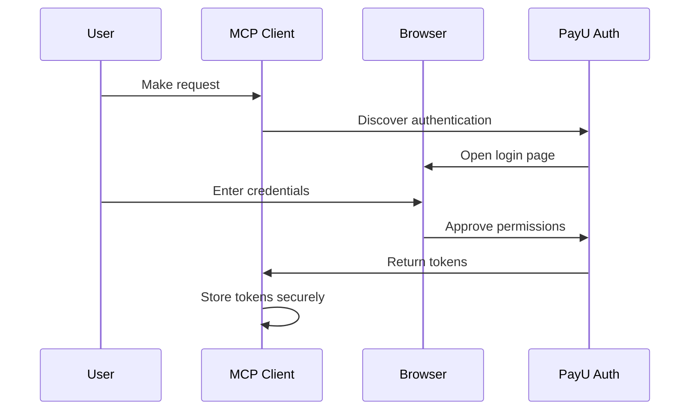

PayU MCP Server is a secure, OAuth-protected remote MCP (Model Context Protocol) gateway that provides AI assistants with access to PayU's merchant services. It acts as a unified endpoint, enabling AI clients like Claude to perform payment operations, generate reports, manage payment links, and handle merchant account management — all through a single authenticated connection at `https://api.payu.in/mcp`.

## Features

- **Merchant Account Management:** List, switch, and manage multiple merchant team accounts. Single-account users are auto-selected; multi-account users can switch seamlessly via tool calls.
- **Transaction Reporting:** Create and retrieve CSV reports for transactions, settlements, refunds, and payouts with configurable date filters and comprehensive field selection.
- **Payment Link Operations:** Create, send, update, and track payment links with support for partial payments, expiry settings, invoice numbers, and multi-channel delivery (SMS/Email).
- **OAuth 2.1 Authentication with PKCE:** Industry-standard authorization code flow with PKCE, token introspection, automatic merchant validation, and per-request merchant isolation.
- **Built-in Security Guardrails:** Automatic PII redaction, secret scanning, and data sanitization on all responses to protect sensitive merchant and customer data.
- **Stateless HTTP with Persistent Connections:** Horizontally scalable architecture using stateless HTTP sessions with global downstream server persistence for fast tool execution.

## Authentication

This server requires OAuth 2.1 authentication. You'll need:

- A valid PayU merchant account
- Access granted to the PayU MCP service
- Your MCP client will handle the OAuth flow automatically:
  1. Discovery via `https://api.payu.in/.well-known/oauth-authorization-server`
  2. Authorization through `https://accounts.payu.in/oauth/authorize`
  3. Token exchange and refresh are managed transparently by the client

Tokens are validated on every request via introspection.

### OAuth 2.1 Flow

The authentication process is handled automatically by your MCP client:



### Flow Steps

1. **Configure Service URL** - Add the PayU MCP URL to your client
2. **Client Discovers Authentication** - Client detects OAuth requirements
3. **Browser Opens** - Login page opens automatically
4. **Enter Credentials** - Sign in with your PayU account
5. **Approve Permissions** - Review and grant access
6. **Tokens Stored Securely** - Client stores encrypted tokens
7. **Automatic Authentication** - All subsequent requests use stored tokens

## Available Tools

### Account Management (4 tools)

| Tool                           | Description                                                     |
| ------------------------------ | --------------------------------------------------------------- |
| `list_available_team_accounts` | Lists all merchant accounts available to the authenticated user |
| `get_current_team_account`     | Shows the currently selected merchant account                   |
| `switch_team_account`          | Switches to a different merchant account by MID                 |
| `clear_team_selection`         | Clears the current merchant account selection                   |

### Reporting (2 tools)

| Tool                     | Description                                                                                   |
| ------------------------ | --------------------------------------------------------------------------------------------- |
| `reporting_createReport` | Creates a CSV report with specified fields and date filters (transactions, settlements, etc.) |
| `reporting_getReport`    | Fetches a previously created report by report ID, returns status and download URL             |

### Payment Links (4 tools)

| Tool                                      | Description                                                                             |
| ----------------------------------------- | --------------------------------------------------------------------------------------- |
| `payLinks_paymentLink_create`             | Creates a new payment link with customer details, amount, expiry, and template settings |
| `payLinks_paymentLink_sendPaymentLink`    | Sends a payment link to a customer via SMS or Email                                     |
| `payLinks_paymentLink_getByInvoiceNumber` | Retrieves payment link status and details by invoice number                             |
| `payLinks_paymentLink_updatePaymentLink`  | Updates an existing payment link's description, status, or expiry                       |

### System (3 tools)

| Tool                   | Description                                                               |
| ---------------------- | ------------------------------------------------------------------------- |
| `list_available_tools` | Lists all available tools from all proxied servers                        |
| `get_metadata`         | Provides metadata about all available proxied MCPs and their capabilities |
| `health_check`         | Verifies the MCP server is running and reachable                          |

## Examples

### Example 1: Generate a Transaction Report

**User prompt:**

> "Create a transactions report for the last 7 days"

**What happens:** The AI calls `reporting_createReport` with the date range and relevant fields, then uses `reporting_getReport` to poll for the completed report and return a download link.

```
User: Create a transactions report from 2026-03-01 to 2026-03-08
Assistant: I'll create a transactions report for that period.
→ Calls: reporting_createReport(service="transactions", filters={"dateFrom": "2026-03-01 00:00:00", "dateTo": "2026-03-08 23:59:59"})
→ Returns: Report ID "RPT-12345" created successfully


User: Is the report ready?
Assistant: Let me check.
→ Calls: reporting_getReport(reportId="RPT-12345")
→ Returns: Report ready, download URL provided
```

### Example 2: Create and Send a Payment Link

**User prompt:**

> "Create a payment link for ₹5,000 and send it to the customer via email"

**What happens:** The AI calls `payLinks_paymentLink_create` with the amount and customer details, then sends it using `payLinks_paymentLink_sendPaymentLink`.

```
User: Create a payment link for ₹5,000 for customer [name] at [email]
Assistan
t: I'll create the payment link and send it.
→ Calls: payLinks_paymentLink_create(customerName="[name]", customerEmail="[email]", amount=5000, ...)
→ Returns: Payment link created with invoice number "INV-67890"

→ Calls: payLinks_paymentLink_sendPaymentLink(invoiceNumber="INV-67890", channels=[{"type": "email", "address": "[email]"}])
→ Returns: Payment link sent successfully via email
```

### Example 3: Manage Merchant Accounts

**User prompt:**

> "Which merchant accounts do I have access to? Switch to MID 180012."

**What happens:** The AI lists available accounts and switches to the requested one.

```
User: What merchant accounts do I have?
Assis
tant: Let me check your available accounts.
→ Calls: list_available_team_accounts()
→ Returns:
  [1] PayU Test Store (MID: 180012)
  [2] PayU Demo Merchant (MID: 180045)

User: Switch to 180012
Assistant: Switching now.
→ Calls: switch_team_account(identifier="180012")
→ Returns: Successfully switched to PayU Test Store (MID: 180012)
```

### Example 4: Check Payment Link Status

**User prompt:**

> "What's the status of payment link INV-67890?"

**What happens:** The AI retrieves the payment link details including payment status.

```
User: Check the status of payment link INV-67890
Assistant: Let me look that up.
→ Calls: payLinks_paymentLink_getByInvoiceNumber(invoiceNumber="INV-67890", paymentDetailsRequired=true)
→ Returns: Payment link is active, amount ₹5,000, 0 payments received, expires in 3 days
```

## Privacy Policy

For PayU Privacy policy, refer to the following page:

[https://www.payu.in/privacy-policy](https://www.payu.in/privacy-policy)]

## Support

Contact PayU Support using the [PayU Support page.](https://help.payu.in).

Email - [ai-solutions@payu.in](mailto:ai-solutions@payu.in)

Issues - [https://github.com/payu-intrepos/payu-mcp-server/issues](https://github.com/payu-intrepos/payu-mcp-server/issues)
