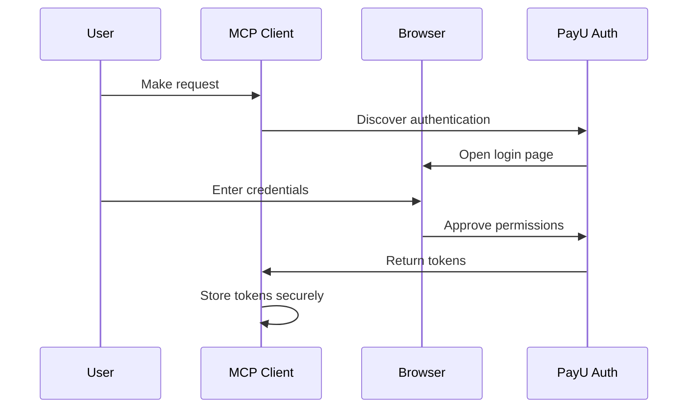

---
title: Authentication
deprecated: false
hidden: false
metadata:
  title: Remote MCP for Merchants - Authentication
  keywords:
    - OAuth 2.1
    - PKCE Authentication
    - MCP Authentication
    - PayU Login
  robots: index
---

PayU Remote MCP uses industry-standard OAuth 2.1 authentication with PKCE (Proof Key for Code Exchange) to ensure secure access to your merchant services.

## OAuth 2.1 Flow

The authentication process is handled automatically by your MCP client:

### Flow Steps

1. **Configure Service URL** - Add the PayU MCP URL to your client
2. **Client Discovers Authentication** - Client detects OAuth requirements
3. **Browser Opens** - Login page opens automatically
4. **Enter Credentials** - Sign in with your PayU account
5. **Approve Permissions** - Review and grant access
6. **Tokens Stored Securely** - Client stores encrypted tokens
7. **Automatic Authentication** - All subsequent requests use stored tokens

## Security Features

| Feature                 | Description                                                                                     |
| ----------------------- | ----------------------------------------------------------------------------------------------- |
| **OAuth 2.1 with PKCE** | Industry-standard authentication protocol that prevents authorization code interception attacks |
| **Encrypted Tokens**    | All tokens are encrypted and securely stored by your MCP client                                 |
| **Request Validation**  | Every request is validated before execution                                                     |
| **PII Protection**      | Personal data automatically filtered from responses                                             |

## Token Management

### Token Lifetime

* Access tokens typically last several hours
* Your client automatically refreshes tokens when needed
* No manual intervention required for token renewal

### Token Storage

Tokens are securely stored by your MCP client:

| Client             | Storage Location        |
| ------------------ | ----------------------- |
| **Cursor IDE**     | Encrypted local storage |
| **Claude Desktop** | System keychain         |

## Permissions

During the authentication flow, you'll see exactly what permissions you're granting. Common permissions include:

* **Transaction Access** - View and manage transactions
* **Refund Operations** - Process refunds
* **Settlement Information** - Access settlement data
* **Report Generation** - Create and download reports

## Revoking Access

You can revoke MCP access anytime through your PayU account:

1. Log in to your PayU dashboard
2. Navigate to Security Settings
3. Find "Connected Applications" or "API Access"
4. Revoke access for the MCP service

> 📘 Note
>
> After revoking access, you'll need to re-authenticate the next time you use the MCP service.

## Re-Authentication

If your token expires or you've revoked access, simply:

1. Make a request through your MCP client
2. The authentication flow will trigger automatically
3. Complete the login process in your browser
4. Continue using the service

 

 
