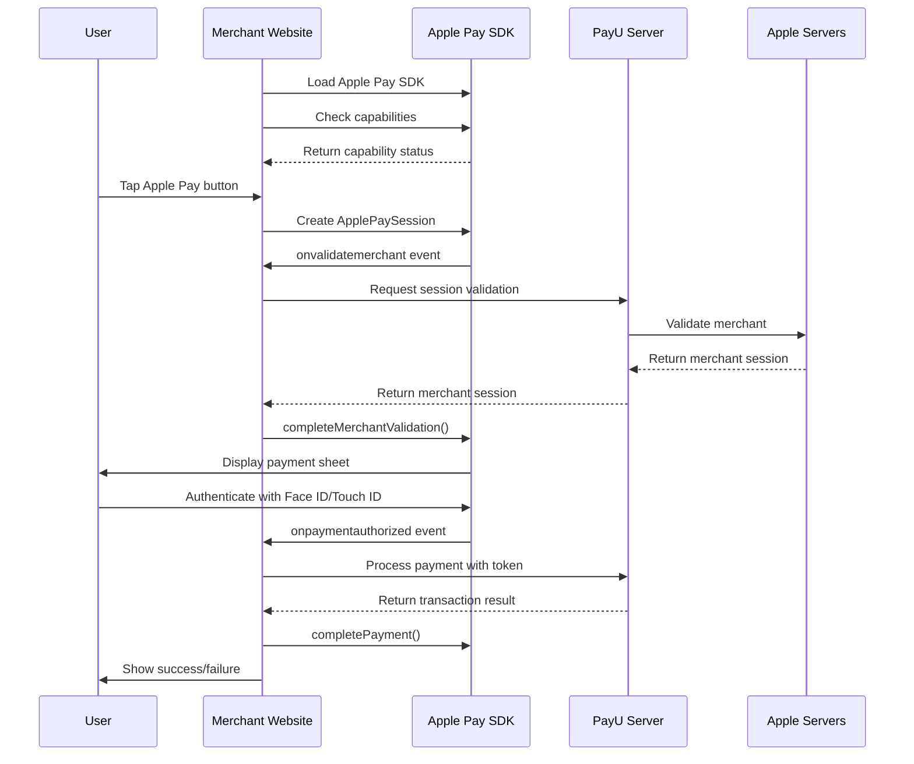

---
title: Apple Pay UI - Seamless Integration
deprecated: false
hidden: false
metadata:
  title: Apple Pay User Interface for Seamless Integration
  description: >-
    Implement Apple Pay's native payment sheet on your merchant-hosted checkout
    using Apple's JavaScript SDK. Learn how to load the SDK, check device
    capabilities, create payment sessions, and handle all payment events.
  keywords:
    - apple pay javascript sdk
    - apple pay ui integration
    - apple pay payment sheet
    - applepaysession
    - merchant hosted apple pay
    - apple pay button
    - apple pay capabilities
    - seamless apple pay checkout
    - apple pay event handlers
    - apple pay session management
  robots: index
---
This section provides a complete walkthrough for implementing Apple Pay's native user interface on your merchant-hosted checkout page. You will learn how to load the Apple Pay JavaScript SDK, check device capabilities, create payment sessions, and handle all payment lifecycle events.

<Callout icon="📘" theme="info">
  **Before you begin**: Ensure that you have completed the prerequisites before you start the integration. For more information, refer to [Prerequisites and Set up for Apple Pay Integration](doc:prerequisites-and-set-up-for-apple-pay-integration).
</Callout>

<Cards columns={3}>
  <Card title="1. Load Apple Pay SDK" href="#step-1-load-the-apple-pay-javascript-sdk">
    Include Apple's JavaScript SDK on your checkout page
  </Card>

  <Card title="2. Check capabilities" href="#step-2-check-apple-pay-capabilities">
    Verify if the user's device supports Apple Pay
  </Card>

  <Card title="3. Create payment request" href="#step-3-create-the-payment-request">
    Configure the payment parameters for the transaction
  </Card>

  <Card title="4. Initialize session" href="#step-4-initialize-the-apple-pay-session">
    Create a new ApplePaySession instance
  </Card>

  <Card title="5. Handle merchant validation" href="#step-5-handle-merchant-validation">
    Validate the merchant with Apple's servers via PayU
  </Card>

  <Card title="6. Handle payment authorization" href="#step-6-handle-payment-authorization">
    Process the payment token after user authentication
  </Card>

  <Card title="7. Handle session cancellation" href="#step-7-handle-session-cancellation">
    Manage user-initiated session cancellations
  </Card>
</Cards>

***

## Integration Flow Overview

The Apple Pay UI integration follows this sequence:



***

## Step 1: Load the Apple Pay JavaScript SDK

Add the Apple Pay JavaScript SDK to your checkout page. This script provides the `ApplePaySession` class and related APIs.

```html
<script src="https://applepay.cdn-apple.com/jsapi/1.latest/apple-pay-sdk.js"></script>
```

<Accordion title="Implementation notes" icon="fa-info-circle">
  | Consideration | Details |
  | :------------ | :------ |
  | Script placement | Load the script in the `<head>` or before your checkout logic runs |
  | HTTPS required | Apple Pay only works on pages served over HTTPS |
  | Safari support | Apple Pay on the web works on Safari browser for macOS and iOS |
  | Version | Using `1.latest` ensures you always have the latest stable version |
</Accordion>

***

## Step 2: Check Apple Pay Capabilities

Before displaying the Apple Pay button, check whether the user's device supports Apple Pay and has payment credentials available.

```javascript
const applePaySession = window.ApplePaySession;

if (applePaySession && applePaySession.canMakePayments()) {
  // Apple Pay is supported on this device
  applePaySession
    .applePayCapabilities(merchantId)
    .then((capabilities) => {
      switch (capabilities.paymentCredentialStatus) {
        case "paymentCredentialsAvailable":
          // User has an active card in Apple Wallet
          // Display Apple Pay as the default/preferred payment option
          showApplePayButton({ isPreferred: true });
          break;

        case "paymentCredentialStatusUnknown":
          // Cannot determine if user has cards (privacy protection)
          // Display Apple Pay button normally
          showApplePayButton({ isPreferred: false });
          break;

        case "paymentCredentialsUnavailable":
          // User does not have cards set up in Apple Wallet
          // Still display Apple Pay button (user can add a card)
          showApplePayButton({ isPreferred: false });
          break;

        case "applePayUnsupported":
          // Apple Pay is not supported on this device/browser
          // Do NOT show Apple Pay button
          hideApplePayButton();
          break;
      }
    })
    .catch((error) => {
      console.error("Failed to check Apple Pay capabilities:", error);
      hideApplePayButton();
    });
} else {
  // Apple Pay is not available
  hideApplePayButton();
}
```

<Accordion title="Capability status reference" icon="fa-table">
  | Status | Description | Recommended Action |
  | :----- | :---------- | :----------------- |
  | `paymentCredentialsAvailable` | User has at least one active payment card provisioned in Apple Wallet | Display Apple Pay button prominently as the preferred payment option |
  | `paymentCredentialStatusUnknown` | Privacy setting prevents determining card status | Display Apple Pay button; the user may have cards available |
  | `paymentCredentialsUnavailable` | User does not have payment cards set up in Apple Wallet | Display Apple Pay button; tapping it prompts the user to add a card |
  | `applePayUnsupported` | Device or browser does not support Apple Pay | Do not display Apple Pay button or offer Apple Pay as an option |
</Accordion>

<Callout icon="⚠️" theme="warning">
  **Important**: Never cache capability results for extended periods. Device capabilities can change when users add or remove cards from Apple Wallet.
</Callout>

***

## Step 3: Create the Payment Request

Define the payment request object with transaction details. This object configures what the user sees on the Apple Pay payment sheet.

```javascript
const paymentRequest = {
  countryCode: "IN",
  currencyCode: "INR",
  supportedNetworks: ["visa", "masterCard", "amex", "discover"],
  merchantCapabilities: ["supports3DS"],
  total: {
    label: "Your Merchant Name",
    amount: "100.00",
  },
};
```

<Accordion title="Payment request parameters" icon="fa-table">
  | Parameter | Type | Required | Description |
  | :-------- | :--- | :------- | :---------- |
  | `countryCode` | String | Yes | Two-letter ISO 3166 country code where the transaction is processed (e.g., `IN` for India, `US` for United States) |
  | `currencyCode` | String | Yes | Three-letter ISO 4217 currency code (e.g., `INR`, `USD`) |
  | `supportedNetworks` | Array | Yes | Card networks you accept. Options: `visa`, `masterCard`, `amex`, `discover`, `jcb`, `chinaUnionPay` |
  | `merchantCapabilities` | Array | Yes | Payment capabilities. Use `supports3DS` for 3D Secure transactions |
  | `total` | Object | Yes | The total amount to charge, with a `label` (merchant name shown to user) and `amount` (string with two decimal places) |
</Accordion>

<Accordion title="Optional payment request parameters" icon="fa-plus">
  ```javascript
  const paymentRequest = {
    countryCode: "IN",
    currencyCode: "INR",
    supportedNetworks: ["visa", "masterCard", "amex"],
    merchantCapabilities: ["supports3DS"],
    total: {
      label: "Your Merchant Name",
      amount: "100.00",
    },
    // Optional: Request billing address
    requiredBillingContactFields: ["postalAddress", "name"],
    // Optional: Request shipping address
    requiredShippingContactFields: ["postalAddress", "name", "phone", "email"],
    // Optional: Line items shown on payment sheet
    lineItems: [
      {
        label: "Subtotal",
        amount: "90.00",
      },
      {
        label: "Tax",
        amount: "10.00",
      },
    ],
  };
  ```

  | Parameter | Description |
  | :-------- | :---------- |
  | `requiredBillingContactFields` | Fields to collect from billing contact: `postalAddress`, `name`, `phone`, `email` |
  | `requiredShippingContactFields` | Fields to collect from shipping contact |
  | `lineItems` | Array of line items displayed on the payment sheet before the total |
</Accordion>

***

## Step 4: Initialize the Apple Pay Session

Create a new `ApplePaySession` instance with the SDK version and payment request.

```javascript
const APPLE_PAY_VERSION = 14; // Use latest supported version

const session = new window.ApplePaySession(APPLE_PAY_VERSION, paymentRequest);

// Begin the session (this must be triggered by a user action)
session.begin();
```

<Accordion title="Version compatibility" icon="fa-info-circle">
  | Version | Minimum Safari | Key Features |
  | :------ | :------------- | :----------- |
  | 14 | Safari 17+ | Latest features including order tracking |
  | 12 | Safari 16+ | Multi-merchant payments |
  | 10 | Safari 14+ | Coupon codes support |
  | 6 | Safari 12+ | Support for multiple shipping methods |
  | 3 | Safari 10+ | Basic Apple Pay support |

  Use `ApplePaySession.supportsVersion(version)` to check if a specific version is supported:

  ```javascript
  const version = ApplePaySession.supportsVersion(14) ? 14 : 
                  ApplePaySession.supportsVersion(12) ? 12 : 
                  ApplePaySession.supportsVersion(10) ? 10 : 3;
  ```
</Accordion>

<Callout icon="⚠️" theme="warning">
  **User gesture required**: The `session.begin()` method must be called in direct response to a user action (such as a button click). Calling it outside a user gesture context will fail.
</Callout>

***

## Step 5: Handle Merchant Validation

When the Apple Pay session starts, Apple sends an `onvalidatemerchant` event. You must validate your merchant identity with Apple's servers through PayU.

```javascript
session.onvalidatemerchant = (event) => {
  const validationURL = event.validationURL;

  // Call PayU's session validation API
  validateApplePaySession(validationURL, merchantKey, txnId)
    .then((merchantSession) => {
      if (merchantSession?.result) {
        // Complete the merchant validation with Apple
        session.completeMerchantValidation(merchantSession.result);
      } else {
        throw new Error("Invalid merchant session response");
      }
    })
    .catch((error) => {
      console.error("Merchant validation failed:", error);
      
      // Complete payment with failure status
      session.completePayment(window.ApplePaySession.STATUS_FAILURE);
      
      // Handle the error in your UI
      handlePaymentError(error);
    });
};
```

<Accordion title="Merchant validation API call" icon="fa-code">
  ```javascript
  async function validateApplePaySession(validationURL, merchantKey, txnId) {
    const response = await fetch("/api/apple-pay/validate-session", {
      method: "POST",
      headers: {
        "Content-Type": "application/json",
      },
      body: JSON.stringify({
        validationURL,
        merchantKey,
        txnId,
      }),
    });

    if (!response.ok) {
      throw new Error(`Validation failed: ${response.status}`);
    }

    return response.json();
  }
  ```

  Your server should call PayU's session validation endpoint:

  ```bash
  curl --location 'https://secure.payu.in/seamless/Session' \
  --header 'Content-Type: application/json' \
  --header 'mid: {{merchant_id}}' \
  --data '{
      "validationUrl": "{{validationURL}}",
      "txnid": "{{txnId}}"
  }'
  ```
</Accordion>

<Callout icon="📘" theme="info">
  **Reference**: For detailed information about the PayU session validation API, refer to [Merchant Hosted with Session Management Integration](doc:apple-pay-session-mgmt-integration).
</Callout>

***

## Step 6: Handle Payment Authorization

After the user authenticates with Face ID, Touch ID, or passcode, Apple returns an encrypted payment token through the `onpaymentauthorized` event.

```javascript
session.onpaymentauthorized = (event) => {
  // Get the encrypted payment token
  const applePaymentToken = event.payment.token;

  // Prepare payment parameters for PayU
  const paymentParams = {
    key: merchantKey,
    authentication_info: JSON.stringify(applePaymentToken),
    txnid: txnId,
  };

  // Process the payment with PayU
  createPayment(paymentParams)
    .then((result) => {
      if (result.status === "success") {
        // Complete payment successfully
        session.completePayment(window.ApplePaySession.STATUS_SUCCESS);
        
        // Redirect to success page
        redirectToSuccessPage(result);
      } else {
        // Complete payment with failure
        session.completePayment(window.ApplePaySession.STATUS_FAILURE);
        
        // Show error to user
        handlePaymentError(result);
      }
    })
    .catch((error) => {
      console.error("Payment processing failed:", error);
      
      session.completePayment(window.ApplePaySession.STATUS_FAILURE);
      handlePaymentError(error);
    });
};
```

<Accordion title="Payment token structure" icon="fa-code">
  The `event.payment.token` object contains:

  ```json
  {
    "paymentData": {
      "data": "<Base64 encrypted payload>",
      "signature": "<Base64 PKCS#7 signature>",
      "header": {
        "publicKeyHash": "<Base64 SHA-256 hash>",
        "ephemeralPublicKey": "<Base64 EC P-256 public key>",
        "transactionId": "<hex string>"
      },
      "version": "EC_v1"
    },
    "paymentMethod": {
      "displayName": "Visa 1234",
      "network": "Visa",
      "type": "debit"
    },
    "transactionIdentifier": "<hex string>"
  }
  ```
</Accordion>

<Accordion title="Complete payment processing implementation" icon="fa-code">
  ```javascript
  async function createPayment(params, session, options = {}) {
    const { onError, returnUrl, setShowLoader, setLoaderState } = options;

    try {
      setShowLoader?.(true);
      setLoaderState?.("processing");

      const response = await fetch("/api/apple-pay/process-payment", {
        method: "POST",
        headers: {
          "Content-Type": "application/json",
        },
        body: JSON.stringify(params),
      });

      const result = await response.json();

      if (result.status === "success") {
        session.completePayment(window.ApplePaySession.STATUS_SUCCESS);
        
        // Redirect to merchant's return URL
        if (returnUrl) {
          window.location.href = `${returnUrl}?txnid=${params.txnid}&status=success`;
        }
      } else {
        throw new Error(result.error_Message || "Payment failed");
      }
    } catch (error) {
      session.completePayment(window.ApplePaySession.STATUS_FAILURE);
      onError?.(error);
      setShowLoader?.(false);
      throw error;
    }
  }
  ```
</Accordion>

<Callout icon="⚠️" theme="warning">
  **Important**: You must call `session.completePayment()` within 30 seconds of receiving the `onpaymentauthorized` event, or the session will time out.
</Callout>

***

## Step 7: Handle Session Cancellation

Handle cases where the user dismisses the Apple Pay payment sheet without completing the payment.

```javascript
session.oncancel = () => {
  // User cancelled the payment
  console.log("Apple Pay session cancelled by user");

  // Clean up your UI state
  handleSessionCancellation();
};

function handleSessionCancellation() {
  // Reset any loading states
  setShowLoader?.(false);

  // Optionally notify the user
  showMessage("Payment cancelled. You can try again or choose another payment method.");

  // Re-enable the Apple Pay button for retry
  enableApplePayButton();
}
```

<Accordion title="Common cancellation scenarios" icon="fa-info-circle">
  | Scenario | User Action | Recommended Handling |
  | :------- | :---------- | :------------------- |
  | Dismissed sheet | User taps outside or swipes down | Allow retry, show alternative payment options |
  | Tapped Cancel | User explicitly cancels | Allow retry, preserve cart state |
  | Authentication failed | Face ID/Touch ID failed multiple times | Show message, suggest device passcode |
  | Session timeout | Payment sheet was open too long | Allow retry with fresh session |
</Accordion>

***

## Complete Integration Example

Here is a complete implementation combining all the steps:

```javascript
class ApplePayIntegration {
  constructor(config) {
    this.merchantId = config.merchantId;
    this.merchantKey = config.merchantKey;
    this.merchantName = config.merchantName;
    this.version = 14;
  }

  async initialize() {
    // Step 1: Check if SDK is loaded
    if (!window.ApplePaySession) {
      console.log("Apple Pay SDK not available");
      return false;
    }

    // Step 2: Check capabilities
    if (!ApplePaySession.canMakePayments()) {
      console.log("Apple Pay not supported on this device");
      return false;
    }

    try {
      const capabilities = await ApplePaySession.applePayCapabilities(this.merchantId);
      return capabilities.paymentCredentialStatus !== "applePayUnsupported";
    } catch (error) {
      console.error("Failed to check capabilities:", error);
      return false;
    }
  }

  startPayment(amount, txnId, options = {}) {
    // Step 3: Create payment request
    const paymentRequest = {
      countryCode: options.countryCode || "IN",
      currencyCode: options.currencyCode || "INR",
      supportedNetworks: ["visa", "masterCard", "amex"],
      merchantCapabilities: ["supports3DS"],
      total: {
        label: this.merchantName,
        amount: amount.toString(),
      },
    };

    // Step 4: Initialize session
    const session = new ApplePaySession(this.version, paymentRequest);

    // Step 5: Handle merchant validation
    session.onvalidatemerchant = async (event) => {
      try {
        const merchantSession = await this.validateMerchant(
          event.validationURL,
          txnId
        );
        session.completeMerchantValidation(merchantSession);
      } catch (error) {
        console.error("Merchant validation failed:", error);
        session.completePayment(ApplePaySession.STATUS_FAILURE);
        options.onError?.(error);
      }
    };

    // Step 6: Handle payment authorization
    session.onpaymentauthorized = async (event) => {
      try {
        const result = await this.processPayment(event.payment.token, txnId);
        
        if (result.status === "success") {
          session.completePayment(ApplePaySession.STATUS_SUCCESS);
          options.onSuccess?.(result);
        } else {
          session.completePayment(ApplePaySession.STATUS_FAILURE);
          options.onError?.(new Error(result.error_Message));
        }
      } catch (error) {
        session.completePayment(ApplePaySession.STATUS_FAILURE);
        options.onError?.(error);
      }
    };

    // Step 7: Handle cancellation
    session.oncancel = () => {
      console.log("Payment cancelled");
      options.onCancel?.();
    };

    // Start the session
    session.begin();
  }

  async validateMerchant(validationURL, txnId) {
    const response = await fetch("/api/apple-pay/validate", {
      method: "POST",
      headers: { "Content-Type": "application/json" },
      body: JSON.stringify({
        validationURL,
        merchantKey: this.merchantKey,
        txnId,
      }),
    });

    const data = await response.json();
    if (!data.result) throw new Error("Invalid merchant session");
    return data.result;
  }

  async processPayment(token, txnId) {
    const response = await fetch("/api/apple-pay/process", {
      method: "POST",
      headers: { "Content-Type": "application/json" },
      body: JSON.stringify({
        key: this.merchantKey,
        authentication_info: JSON.stringify(token),
        txnid: txnId,
      }),
    });

    return response.json();
  }
}

// Usage
const applePay = new ApplePayIntegration({
  merchantId: "merchant.com.example",
  merchantKey: "your_payu_merchant_key",
  merchantName: "Your Store Name",
});

document.getElementById("apple-pay-button").addEventListener("click", async () => {
  const isAvailable = await applePay.initialize();
  
  if (isAvailable) {
    applePay.startPayment("100.00", "txn_" + Date.now(), {
      onSuccess: (result) => {
        window.location.href = "/order-confirmation?id=" + result.txnid;
      },
      onError: (error) => {
        alert("Payment failed: " + error.message);
      },
      onCancel: () => {
        console.log("User cancelled payment");
      },
    });
  } else {
    alert("Apple Pay is not available on this device");
  }
});
```