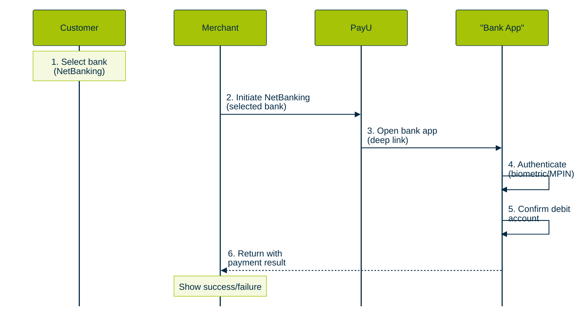
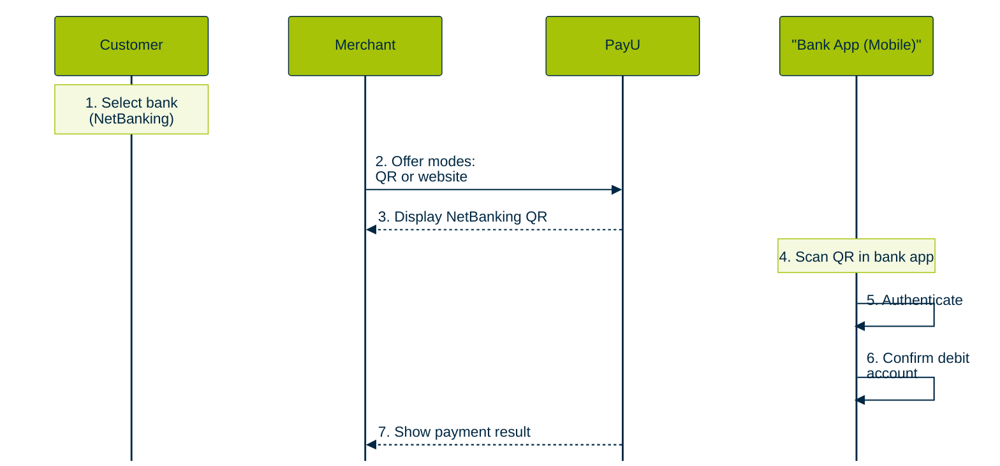
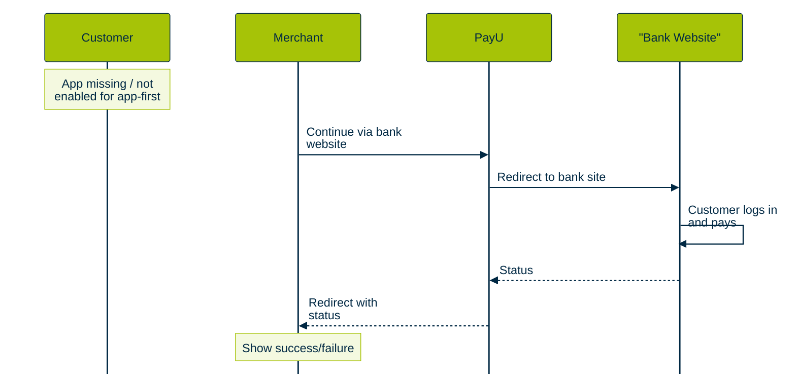
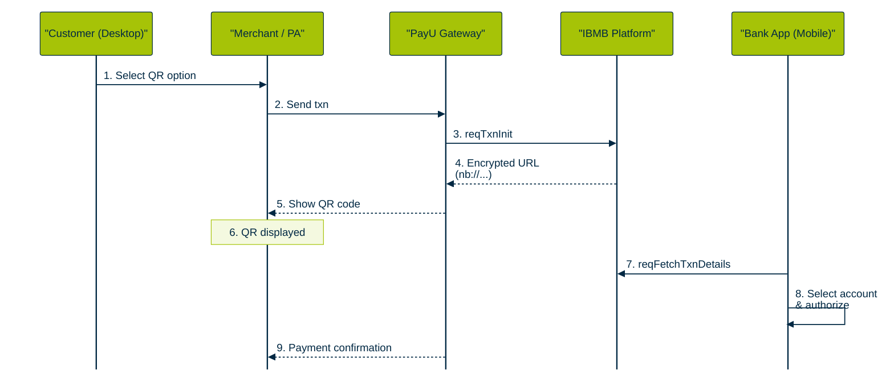

title: NBBL Banking Connect overview
deprecated: false
hidden: false
metadata:
  description: Understand NBBL Banking Connect, its payment journeys, merchant benefits, and bank rollout.
  robots: index
---
# NBBL Banking Connect overview

NBBL Banking Connect is PayU's implementation of NPCI Bharat BillPay Limited's standardized NetBanking framework. It keeps the trust and high-value capability of NetBanking while replacing the checkout experience built around bank-website credentials with a mobile-first, password-free flow.

## What changes for the customer

The customer selects a bank at checkout and authenticates inside that bank's app. Depending on the device and available bank flow, the customer either opens the app through an intent deep link or scans a QR code displayed on the checkout page.

The customer uses the bank app's authentication method, such as biometrics or an app MPIN. The customer does not enter NetBanking credentials on a merchant or PayU page.

If the selected bank app is not installed, or the app-first path is not enabled, the journey can fall back to the bank website NetBanking flow.

## Payment flows

### Mobile app-intent flow



1. The customer selects a bank under NetBanking.
2. PayU offers the option to pay through the selected bank app.
3. PayU opens the installed bank app through a deep link.
4. The customer authenticates in the bank app with biometrics or an app MPIN.
5. The customer confirms the debit account.
6. The customer returns to the merchant with the payment result.

### Desktop QR flow



1. The customer selects a bank under NetBanking.
2. PayU offers the available payment modes, such as QR or the bank website.
3. PayU displays a NetBanking QR code.
4. The customer scans the QR code with the bank's mobile app.
5. The customer authenticates in the bank app.
6. The customer confirms the debit account.
7. PayU displays the payment result to the customer and merchant.

### Website fallback



When the bank app is not installed or the app-first route is unavailable, the customer can continue with the familiar bank-website NetBanking journey.

## Technical flow diagrams

> **Source note:** The following Net Banking 1.0+ and Net Banking 2.0 flow diagrams are retained from the previous Devguide page. Confirm the API names and technical sequence against the current Product and Tech source before publication.

NBBL offers two payment flows to accommodate different use cases:

### Net Banking 1.0+ (Redirect Flow)

Enhanced version of traditional net banking that maintains the familiar bank website experience while adding interoperability:

```mermaid
%%{init: {
  "theme": "base",
  "sequence": {
    "mirrorActors": false,
    "rightAngles": true,
    "messageAlign": "left",
    "fontSize": 10,
    "actorFontSize": 10,
    "noteFontSize": 10,
    "actorMargin": 88,
    "width": 168,
    "boxMargin": 10,
    "messageMargin": 38,
    "diagramMarginX": 60,
    "diagramMarginY": 18
  },
  "themeVariables": {
    "fontFamily": "Arial, Helvetica, sans-serif",
    "fontSize": "10px",
    "background": "#FFFFFF",
    "primaryColor": "#A6C307",
    "primaryTextColor": "#002843",
    "primaryBorderColor": "#002843",
    "secondaryColor": "#F4F9E0",
    "lineColor": "#002843",
    "textColor": "#002843",
    "actorBkg": "#A6C307",
    "actorBorder": "#002843",
    "actorTextColor": "#002843",
    "actorLineColor": "#002843",
    "signalColor": "#002843",
    "signalTextColor": "#002843",
    "labelBoxBkgColor": "#F4F9E0",
    "labelBoxBorderColor": "#A6C307",
    "noteBkgColor": "#F4F9E0",
    "noteTextColor": "#002843",
    "noteBorderColor": "#A6C307",
    "activationBkgColor": "#E8F0C4",
    "activationBorderColor": "#002843"
  }
}}%%
sequenceDiagram
    participant Customer
    participant MerchantPA as "Merchant / PA"
    participant PayU as "PayU Gateway"
    participant IBMB as "IBMB Platform"
    participant Bank as "Bank Website"

    Customer->>MerchantPA: 1. Select bank &<br/>initiate payment
    MerchantPA->>PayU: 2. Send txn<br/>details
    PayU->>IBMB: 3. reqTxnInit
    IBMB-->>PayU: 4. Encrypted URL
    PayU-->>MerchantPA: 5. Redirect URL
    MerchantPA->>Bank: 6. Redirect to<br/>bank site
    Bank->>IBMB: 7. Decrypt URL via API
    Note over Bank,PayU,MerchantPA: 8. Customer completes on<br/>bank site; status flows back
```

**Key Steps:**
1. Customer selects bank and initiates payment
2. Merchant/PA sends transaction details to PayU
3. PayU sends transaction to IBMB platform via `reqTxnInit` API
4. IBMB generates bank-specific encrypted redirection URL
5. Customer is redirected to bank website
6. Bank decrypts URL via API call to IBMB
7. Customer completes transaction on bank website using existing login
8. Transaction status communicated back through the system

### Net Banking 2.0 (QR & Intent Flow)

Modern mobile-first approach using QR codes and app intents:



**Key Steps:**
1. Customer selects QR code payment option
2. Merchant/PA sends transaction to PayU
3. PayU sends transaction to IBMB via `reqTxnInit` API
4. IBMB generates encrypted URL (format: `nb://nbpay?param=value`)
5. PayU converts URL to QR code and displays on merchant page
6. Customer scans QR code using bank mobile app
7. Bank app sends `reqFetchTxnDetails` to IBMB to decrypt URL
8. Customer selects account and authorizes payment in bank app
9. Transaction completes within bank app
10. Merchant page shows payment confirmation

## Merchant impact

- Existing NetBanking integrations do not require changes.
- PayU can roll out the capability bank by bank or through traffic splits.
- Reconciliation and settlement processes remain unchanged according to the product brief.
- A standardized framework is intended to improve transaction visibility and dispute handling.

## Product positioning

NBBL Banking Connect is intended for merchants with high-value NetBanking use cases, including insurance, financial services, government and utilities, education-fee payments, loan and EMI repayments, SIP or investment contributions, B2B invoice settlement, and travel bookings.

## Bank rollout

The attached product brief lists HDFC Bank, ICICI Bank, Axis Bank, YES Bank, Federal Bank, and AU Small Finance Bank as currently live via NBBL. It lists SBI, IDBI Bank, Bank of Baroda, IDFC FIRST Bank, Canara Bank, Kotak Mahindra Bank, and CSB Bank as coming soon.

> **Publication note:** The source brief contains a separate supporting statement that mentions four live banks, while its detailed live-bank list contains six. This page uses the detailed list and the discrepancy is recorded in the delivery notes. Confirm the live-bank list with Product before publication.

## Related documentation

- [PayU Hosted Customer Journey - Banking Connect](./payu-hosted-customer-journey-banking-connect.md)
- [Handle NBBL Deep-Links in WebView](./handle-nbbl-deep-links-in-webview.md)