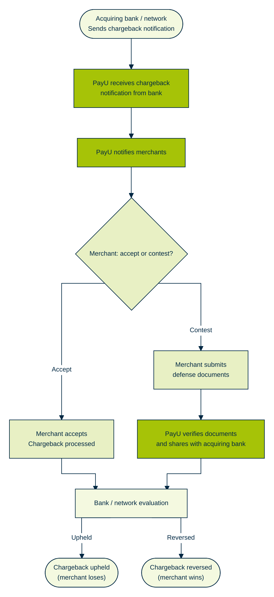

The following flow diagram illustrate the PayU Chargeback flow.

<Image src="https://files.readme.io/41abd752e30c42d3f761fe65da96d0e45ace3b05c6f3241ce87d18dcfc2c6bd0-chargeback_flow_updated.png" align="center" width="500px" />

## Step1 : Chargeback Notification

Merchant receives a chargeback alert from PayU via dashboard and email. The details include:

- Chargeback amount
- Reason code
- "Reply Before" deadline (the date by which you must act)

> 📘
>
> **Reference**: For more information on how to view a case details for the above, refer to [View a Case Details](doc:view-a-case-details-charageback).

> ❗️
>
> **Notifications from child MIDs**: On the basis of configuration, the notifications from child MIDs can also be displayed.

***

## Step 2: Merchant Response Options

You must act before the "Reply Before" date! Choose one of the following actions:

- **Accept the Chargeback**: For more information, refer to any of the following:
  - **Manually**: [Accept Chargeback on Dashboard](doc:accept-chargeback-on-dashboard)
  - **API**:  [Accept Chargeback API](ref:accept-chargeback-api)
- **Contest/Dispute the Chargeback**: For more information, refer to any of the following:
  - **Manually**: [Contest Chargeback on Dashboard](doc:contest-chargeback-on-dashboard)
  - **API**: [Contest Chargeback API](ref:contest-chargeback-api)

> 📘
>
> **Update evidences**: In order to contest the chargeback, evidences should be uploaded based the reason code.

***

## Step 3: PayU Review & Submission

- PayU Reviews the submission with evidences and then builds the case
- PayU can return the submission because of insufficient documentation for re-submission
- PayU forwards your response (acceptance or contest with evidence) to the acquiring bank for final evaluation.

***

## Step 4: Resolution & Status Update

- The bank reviews and makes a decision.
- PayU dashboard reflects the final outcome:
  - **Closed in Customer Favour** (if chargeback accepted, or evidence rejected)
  - Other statuses for dispute win or closure.

***

## Pre-Arbitration and Arbitration

- **Pre-Arbitration**: After the merchant/acquirer has represented the case (submitted evidence) and the issuer still disagrees with the response. This offers a final opportunity to resolve the dispute based on new information or further clarification, potentially avoiding formal arbitration. The following happens with the case:
  - The issuer (customer’s bank) initiates pre-arbitration, usually providing new evidence or arguments as to why the chargeback should stand.
  - The acquirer (merchant’s bank through PayU) receives this and can:

    - Accept (agree with chargeback, absorbing the loss), or
    - Decline (dispute further, escalating to arbitration).

    All additional correspondence, documentation, and clarified arguments are exchanged between issuer and acquirer, often facilitated or relayed by the PayU.

- **Arbitration**: If pre-arbitration does not resolve the dispute—that is, the acquirer declines to accept liability. Issuer now formally intervenes and reviews the complete dispute file. The following happens with the case:
  - Both parties (issuer and acquirer) submit all documentation, correspondence, and a summary of their positions.
  - Issuer dispute resolution team evaluates according to rules and evidence.
  - Issuer issues a ruling: assigns financial liability (who bears the loss) and may impose administrative fees or penalties.
  - The decision at this stage is **final and binding**.

### Workflow

1. **Role of PayU:**
   - Acts as an intermediary, collecting all merchant evidence and forwarding it to the acquirer (merchant’s settling bank, e.g., ICICI, HDFC, etc.).
   - PayU assists in interpreting chargeback codes, compliance criteria, and documentation for the acquiring bank’s submission.

2. **If Pre-Arbitration Is Initiated:**
   - The issuing bank, after reviewing the merchant’s representment (initial defense), may still find the defense unsatisfactory or provide new evidence.
   - The issuer sends a pre-arbitration claim to the acquirer.
   - PayU coordinates with the merchant (if more evidence is required) and the acquiring bank decides whether to accept liability or pursue further.
   - If accepted, the merchant (indirectly, through acquirer/PayU) absorbs the financial loss.
   - If declined, the process moves to arbitration.

3. **During Arbitration:**
   - The dispute case file—including all prior evidence, chargeback codes, written arguments, and any newly exchanged materials—is sent to MasterCard for adjudication.
   - MasterCard sets a deadline for both sides to submit any additional evidence/arguments.
   - MasterCard’s ruling is communicated back to the acquiring and issuing banks.
   - Any imposed fees (arbitration costs, penalties for losing party) are charged to the losing side’s bank, which may then debit/credit the merchant via PayU.

4. **Timeline and Finality:**
   - Timeframes for responses and escalation are strictly governed by MasterCard rules (often 45-60 days for each stage).
   - Once MasterCard has ruled, there is very limited scope for appeal.
   - The result is enforced through settlement systems, adjusting balances between acquirer, issuer, and, eventually, merchant.

|                 | PayU’s Role                        | Acquirer’s Role             | Merchant’s Part                                  |
| --------------- | ---------------------------------- | --------------------------- | ------------------------------------------------ |
| Pre-Arbitration | Forwards case, may request docs    | Accept/Decline liability    | May provide new/further supporting docs if asked |
| Arbitration     | Relays final case, informs outcome | Engages with Mastercard     | Accepts final outcome, no further recourse       |
| Compliance      | Advises on rules/guidelines        | Ensures rule adherence      | May need to provide docs for compliance cases    |
| Fees/Penalties  | Passes fees (if any) onward        | Pays/recovers from merchant | Pays/recovers if liable                          |

 
