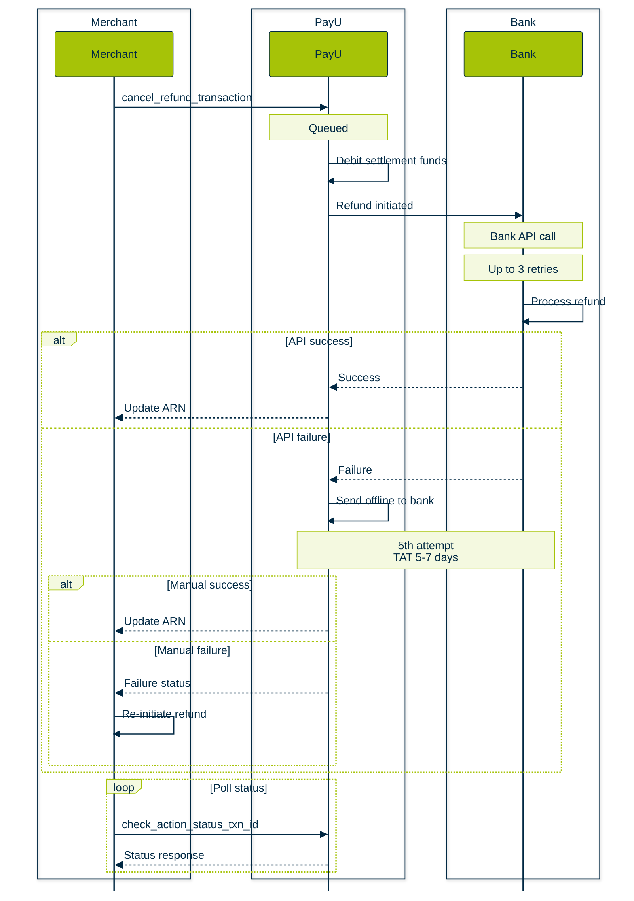

Order cancellations are an unfortunate reality for any business. Customers may cancel an order, return part of the order or the full order. Merchants may not have the resources to fulfill the order and must cancel it. Therefore, it is imperative for merchants collecting payment online to refund the payment back to the customers.

> 📘
>
> **Publish refund policy on your website**: PayU recommends publishing the Refund policy on your website, including the time taken to refund for failed transactions and the process to refund.

## Refunds Workflow

The refunds workflow in PayU typically follows this sequence:

1. **Customer Requests a Refund**: A refund begins when the **customer cancels an order**, returns an item, or did not receive the expected service after being charged.
2. **Merchant Initiates Refund Request**: The merchant can initiate the refund using:
   - **PayU Dashboard**, or
   - **Refund (Cancel Refund Transaction) API**, providing the transaction ID and refund amount.
3. **PayU Validates Refund Request**: Before processing, PayU checks:
   - Whether the transaction exists
   - Whether the refund is within allowed conditions
   - Whether the refund amount matches full or partial rules
4. **PayU Sends Refund Request to the Payment Partner (Bank / Lender)**: After the refund request is validated, PayU forwards it to the respective payment instrument provider (the bank, card network, wallet, etc.).
   > 📘
   >
   > **Automatic retries**: If the Refund API call has failed at the bank end, the bank will try three retries automatically. If the refund still fails, PayU team will request the refund manually (for example, mail) with the bank.
5. **Bank / Payment Partner Processes the Refund**: The bank or issuer processes the refund and transfers the money back to the customer’s source account (card, UPI, Net Banking account, etc.).
6. **Refund Settlement Adjustments**: The refund amount is deducted from the merchant’s settlement balance.
7. **Customer Receives the Refund**:  The refund reflects in the customer’s account. Processing time depends on the payment method:
   - Typically **5–21 days** for the refunded amount to reflect.
   - Some government banks may take longer.  PayU informs the merchant via email once refund is processed.
8. **Automatic Refunds (Special Case)**: If a transaction fails but the customer was still charged, PayU automatically refunds the money after reconciling with the bank the next day.  For more information, refer[ Automatic Refund](#automatic-refund).

## Automatic refund

White a customer is making a payment and if the transaction was not successful (transaction status is "Pending" or Dropped"), but the amount got debited from account due to unforeseen circumstances, After bank will send the amount to PayU and it reconciled to find that transaction was not successful. Hence, PayU will automatically initiates the refund to the customer.

For example, if a customer tries to book a movie ticket on an online ticket booking site and transaction has failed but the amount got debited, the bank send the amount to PayU by next day. Later, when PayU reconciles to find the transaction was not successful, so PayU initiates the refund automatically.

> 📘
>
> **Contact KAM to enable automatic refunds**: If you wish to enable the automatic refund feature, contact your PayU Key Account Manager (KAM) or[ PayU Support](https://help.payu.in).

## Types of refunds

Refunds can be classified into two types:

- **Partial refund**: Where the refund amount is less than payment amount. This means merchant is refunding only part of the payment done by customer. This happens when only part of the order is cancelled. For example, customer purchases two product from merchant of value Rs. 500 and Rs. 7000. Customer pays a total of Rs. 7,500 to the merchant via online payment. Now the customer returns product 1 of value Rs. 500. Now, merchant only must refund the amount of Rs. 500 to the customer (instead of the transaction amount of Rs. 7,500).
- **Full refund**: Where the refund amount is equal to the payment amount. This means that the merchant is refunding the entire payment done by the customer for a transaction. This happens when either merchant or customer cancel the entire order. For example, customer purchases two product from merchant or value Rs. 500 and Rs. 7000. Customer pays a total of Rs. 7,500 to the merchant via online payment. Now the customer returns both the product. Now, merchant must refund Rs. 7,500 to the customer.

For more information on how to refund a transaction, refer to [Refund Transaction API](ref:refund_transaction_api)

When you receive a refund request from customer on a transaction done via PayU:

1. You can raise a refund request via PayU dashboard or refund api indicating the amount to be refunded.
2. Refunds must be sent to the source account which was used to make the payment. To do so, PayU passes the refund request to the bank/lender through which payment was done. Ex. If the payment was done by HDFC Credit Card EMI option, then the refund request is sent to HDFC bank.
3. The bank refunds the amount to the customer.
4. The refund amount is deducted from the merchant settlement.

## When a customer is eligible for a refund?

If a customer has been charged for a transaction and did not receive the expected services, they may be eligible for a refund. For example, if the customer was charged for a movie ticket but did not receive the ticket, they can get a refund.

## Prerequisites for initiating refund

To Initiate a refund, you require the following information:

- The customer must have made the payment within a specific time frame or using a PayU product.
- You have the transaction ID, date, and transaction amount.

## How to get a refund from various PayU India products?

PayU offers refunds for payments made using PayU India products: PayU Offers, PayU Partners, Split Settlements, etc. Generally, you need to initiate a refund request using any of the following methods:

- **Cancel Refund Transaction** API: For more information, refer to [Refund Transaction API](ref:refund_transaction_api)
- **PayU Dashboard**: For more information, refer to [Refunds Dashboard](doc:refunds-dashboard).

## How long does it take to get a refund?

Refunds will take between 5-21 days for the refund amount to reflect in your customer’s bank account. In the case of Net Banking transactions, certain government banks may take some more days. You will be communicated over email with the status (successful or failed) once the request for a refund is processed.

## How does chargeback differ from refunds?

A chargeback is raised by the customer to the issuing bank for many reasons like a fraud transaction, unsatisfactory product or service delivery, etc. In refunds, it is initiated by you (merchants) after your customer requests for a refund or a transaction has failed for the customer.
