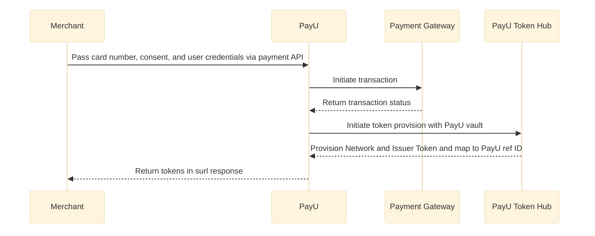

The Model 2 involves only zero code change and this section describes the general workflow.

> 📘
>
> **Note**: To use tokenisation, you need to get the Token Requestor onboarding to be done. Contact your PayU Key Account Manager (KAM) to get the onboarding done.

<br />

## General workflow

To create the token, only minor code changes is required in your implementation. However, to process the transactions using the tokens, you need to integrate an extra API.



1. PayU onboards the merchant on the PayU token hub.
2. Merchant will pass the consent value and user id in the **\_payment** API.

   Here, consent is taken from customer on the merchant’s website (similar to the step 2 of [Model 1 - PayU Hosted Checkout Integration](doc:payu-hosted-checkout-integration-with-vault-model-1) before passing the consent value).


<Image src="https://devguide.payu.in/wordpress/index.php/wp-json/getobject?keyname=uploads/2021/11/payu_hosted_consent_crop.png" align="center" width="512px" />


- If the merchant is already using the PayU vault, only consent parameter needs to be passed.
- If the merchant is newly onboarded on the PayU vault, consent and user ID parameters need to be passed.

1. PayU will first process the transaction and then create the network and issuer token.
2. PayU will store the tokens on its own servers on the merchant’s behalf.

## First-time payment workflow

> 👍
>
> Experience the end-to-end **Merchant Hosted Checkout** flow and instantly generate the complete code for seamless, zero-coding integration into your website. Select **First-Time Customer > Payment API (\_payment)** from left navigation pane after opening the following page
>
> <HTMLBlock>{`
>                       <style>
>                       .tooltip-btn {
>                           position: relative;
>                           background-color: #4CAF50;
>                           color: white;
>                           padding: 10px 20px;
>                           border: none;
>                           border-radius: 5px;
>                           cursor: pointer;
>                           font-weight: bold; /* Added this line */
>                       }
>                       .tooltip-btn:hover::after {
>                           content: attr(data-tooltip);
>                           position: absolute;
>                           bottom: 125%;
>                           left: 50%;
>                           transform: translateX(-50%);
>                           background-color: #333;
>                           color: white;
>                           padding: 5px 10px;
>                           border-radius: 4px;
>                           white-space: nowrap;
>                           font-size: 12px;
>                           z-index: 1;
>                       }
>                       </style>
>
>                       <button onclick="window.open('https://payu.in/integrationlab/seamless/cards', '_blank')" 
>                               class="tooltip-btn" 
>                               data-tooltip="Click here to see the Merchant Hosted Checkout end-to-end integration and instantly generate the complete code needed for a zero-coding setup on your website.">
>                           Experience the flow and get the code
>                       </button>
> `}</HTMLBlock>

### Workflow

The following flow diagram illustrates the workflow for first-time payment workflow.

1. Merchant takes the customer card details and consent, and then initiates transaction and sends the payment details to PayU.​
2. PayU initiates the transaction with the Payment Gateway.
3. Payment Gateway passes the transaction status to PayU.
4. PayU initiates the token provision with PayU vault.
5. PayU then creates token with networks and issuers.
6. PayU passes the token to the merchant.

### Extra request parameters to be posted using \_payment API

**Environment**

|                            |                                                                     |
| :------------------------- | :------------------------------------------------------------------ |
| **Test Environment**       | \<[https://test.payu.in/\_payment>](https://test.payu.in/_payment>) |
| **Production Environment** | \<[https://info.payu.in/\_payment>](https://info.payu.in/_payment>) |

<HTMLBlock>{`
<table style="width: 100%; border-collapse: collapse;">
<thead>
<tr>
  <th style="border: 1px solid #ddd; padding: 8px;"><strong>Field</strong></th>
  <th style="border: 1px solid #ddd; padding: 8px;"><strong>Description</strong></th>
  <th style="border: 1px solid #ddd; padding: 8px;"><strong>Example</strong></th>
</tr>
</thead>
<tbody>
<tr>
  <td style="border: 1px solid #ddd; padding: 8px;"><p>user_credentials<br><strong>mandatory</strong></p>
</td>
  <td style="border: 1px solid #ddd; padding: 8px;"><p><code>varchar</code> It contains the merchant ID and a unique customer identifier. In this example, the user credentials that you submitted with the var1 parameter using the <strong>save_user_cards</strong> API. The format of the value is <code>&lt;merchant key&gt;:&lt;user ID&gt;</code></p>
</td>
  <td style="border: 1px solid #ddd; padding: 8px;"><p>a:b</p>
</td>
</tr>
<tr>
  <td style="border: 1px solid #ddd; padding: 8px;"><p>store_card<br><strong>mandatory</strong></p>
</td>
  <td style="border: 1px solid #ddd; padding: 8px;"><p><code>integer</code> This is an existing field, where the card token flag is passed by merchant. The values for this field can be:  </p>
<ul>
<li><strong>0</strong> – Consent was not provided by customer  </li>
<li><strong>1</strong> – Consent was provided by customer</li>
</ul>
<p>If the consent is provided by the customer, the value is passed as <strong>1</strong>.</p>
</td>
  <td style="border: 1px solid #ddd; padding: 8px;"><p>1</p>
</td>
</tr>
</tbody>
</table>
`}</HTMLBlock>

> 📘
>
> **Notes**:
>
> - Only the fields needed for this operation are mentioned here. For the complete API details for the **\_payment** API, refer to [Merchant Hosted Checkout](doc:custom-checkout-merchant-hosted).
> - After taking the consent, merchant will have to call PayU for doing the transaction and creating token. This is needed as PayU will ensure the additional factor authentication (AFA) requirements are taken care of.
> - The subsequent transactions (using the token) can be done through PayU or any other payment processor.

### Sample request and response

For sample request and response, refer to [Model 2-Zero Code Change](ref:model-2-zero-code-change-for-vault-integration).

## Repeat transaction workflow

The repeat transaction flow involves the following steps:

1. Get the tokenized card details (as described in the [Get User Cards API](ref:get_user_cards_api) section)
2. [Process the transaction with a Tokenized Card](#repeat-transaction-flow)

<br />

> 👍
>
> Experience the end-to-end **Merchant Hosted Checkout** flow and instantly generate the complete code for seamless, zero-coding integration into your website. Select **Repeat Customer > Payment API (\_payment)** from left navigation pane after opening the following page
>
> <HTMLBlock>{`
>                         <style>
>                         .tooltip-btn {
>                             position: relative;
>                             background-color: #4CAF50;
>                             color: white;
>                             padding: 10px 20px;
>                             border: none;
>                             border-radius: 5px;
>                             cursor: pointer;
>                             font-weight: bold; /* Added this line */
>                         }
>                         .tooltip-btn:hover::after {
>                             content: attr(data-tooltip);
>                             position: absolute;
>                             bottom: 125%;
>                             left: 50%;
>                             transform: translateX(-50%);
>                             background-color: #333;
>                             color: white;
>                             padding: 5px 10px;
>                             border-radius: 4px;
>                             white-space: nowrap;
>                             font-size: 12px;
>                             z-index: 1;
>                         }
>                         </style>
>
>                         <button onclick="window.open('https://payu.in/integrationlab/seamless/cards', '_blank')" 
>                                 class="tooltip-btn" 
>                                 data-tooltip="Click here to see the Merchant Hosted Checkout end-to-end integration and instantly generate the complete code needed for a zero-coding setup on your website.">
>                             Experience the flow and get the code
>                         </button>
> `}</HTMLBlock>

### Workflow

The steps involved in creating token after processing payment workflow:

1. Merchant calls PayU with get cards API by passing the user credential
2. Customer selects the card on which they want to do transaction with
3. Merchant Initiates transaction and sends the request to PayU ​
4. PayU processes the transaction and sends the transaction status to the merchant

### Process transaction with a saved card

If you have not received a response from PayU with First-Time Payment Workflow, use the **get\_user\_card** API as described in [Get User Cards API](ref:get_user_cards_api)

### Extra parameters to be posted with saved card using \_payment API

<HTMLBlock>{`
<table style="width: 100%; border-collapse: collapse;">
<thead>
<tr>
  <th style="border: 1px solid #ddd; padding: 8px;"><strong>Field</strong></th>
  <th style="border: 1px solid #ddd; padding: 8px;"><strong>Description</strong></th>
  <th style="border: 1px solid #ddd; padding: 8px;"><strong>Example</strong></th>
</tr>
</thead>
<tbody>
<tr>
  <td style="border: 1px solid #ddd; padding: 8px;"><p>user_credentials<br><strong>mandatory</strong></p>
</td>
  <td style="border: 1px solid #ddd; padding: 8px;"><p><em>varchar</em> It contains the merchant ID and a unique customer identifier. In this example, the user credentials that you submitted with the var1 parameter using the save_user_cards API.</p>
</td>
  <td style="border: 1px solid #ddd; padding: 8px;"><p> a:b</p>
</td>
</tr>
<tr>
  <td style="border: 1px solid #ddd; padding: 8px;"><p>store_card_token</p>
</td>
  <td style="border: 1px solid #ddd; padding: 8px;"><p><em>varchar</em> It is the card token for a card that is returned by PayU when you store a card. When you store a card using the save_user_cards API, the response from PayU contains the card token value in the cardToken parameter.</p>
</td>
  <td style="border: 1px solid #ddd; padding: 8px;"><p>57cb996f2eaeee525765a</p>
</td>
</tr>
<tr>
  <td style="border: 1px solid #ddd; padding: 8px;"><p>storecard_token_type<br><strong>optional for PayU token flow</strong></p>
</td>
  <td style="border: 1px solid #ddd; padding: 8px;"><p><em>integer</em> This parameter can be posted with the value as <strong>0</strong> as you are using PayU token hub.</p>
</td>
  <td style="border: 1px solid #ddd; padding: 8px;"><p>0</p>
</td>
</tr>
</tbody>
</table>
`}</HTMLBlock>

> 📘 Note:
>
> Only the fields needed for this operation are mentioned here. For the complete API details of the **\_payment** API, refer to [Collect Payments using Merchant Hosted Checkout](/docs/custom-checkout-merchant-hosted).

### Sample response

#### Success scenario

PayU will return the response (unformatted) similar to the following on the **surl** specified using **\_payment** API:

```plaintext
mihpayid=999000000001268&mode=CC&status=success&unmappedstatus=captured&key=J****g&txnid=2b019fa0976d7480cf5&amount=10.00&cardCategory=domestic&discount=0.00&net_amount_debit=10&addedon=2021-11-29+11%3A51%3A35&productinfo=Product+Info&firstname=Payu-Admin&lastname=&address1=&address2=&city=&state=&country=&zipcode=&email=test%40example.com&phone=1234567890&udf1=&udf2=&udf3=&udf4=&udf5=&udf6=&udf7=&udf8=&udf9=&udf10=&hash=82df12630b4e4083a90b314534872dfb22e97aaa191b1b93db2a76351561bd612a0b321609b0e31a3b7b62d1928c8e67e9fed5b2b5209deba4366c58706c1ffe&field1=3245029356632939671830&field2=302404&field3=10.00&field4=999000000001268&field5=100&field6=02&field7=AUTHPOSITIVE&field8=&field9=Transaction+is+Successful&payment_source=payu&PG_TYPE=CC-PG&bank_ref_num=3245029356632939671830&bankcode=CC&error=E000&error_Message=No+Error&cardToken=28b99d39e83e8031caa7ad&name_on_card=Test+User&cardnum=XXXXXXXXXXXX2346&cardhash=This+field+is+no+longer+supported+in+postback+params.
```

#### Failure scenario

```plaintext
mihpayid=412345678912344659&mode=&status=failure&unmappedstatus=userCancelled&key=J****g&txnid=4ed74a05e1220e885f70&amount=10.00&discount=0.00&net_amount_debit=0.00&addedon=2019-12-20+11%3A58%3A49&productinfo=Product+Info&firstname=Payu-Admin&lastname=&address1=&address2=&city=&state=&country=&zipcode=&email=test%40example.com&phone=1234567890&udf1=&udf2=&udf3=&udf4=&udf5=&udf6=&udf7=&udf8=&udf9=&udf10=&hash=159e1935d6a8e80c3fd2170bdc7397e1fac48be772f3515be0d728cd402b3420734944de45f8f70a4329dfafe2327200f41bc580d6c96fc0c2ce986ce3a67162&field1=&field2=&field3=&field4=&field5=&field6=&field7=&field8=&field9=Cancelled+by+user&payment_source=payu&PG_TYPE=&bank_ref_num=&bankcode=&error=E1605&error_Message=Transaction+failed+due+to+customer+pressing+cancel+button.&card_token=
```

<br />
