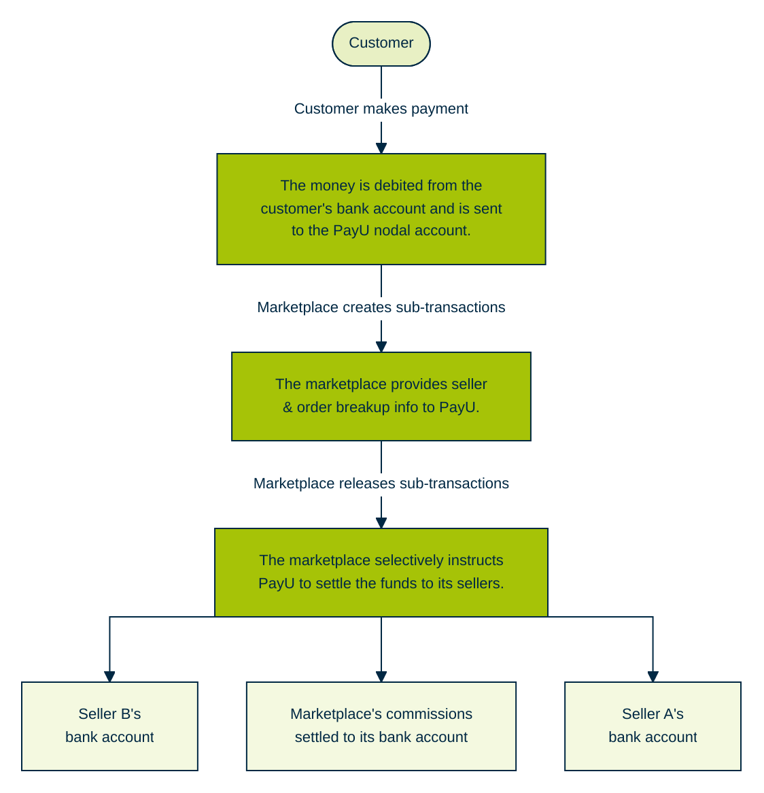

PayU Aggregator APIs are organized around REST, each API is a server-to-server call from your server to our server and it is designed to have predictable resource-oriented URLs and PayU uses HTTP response codes to indicate API errors. For more information on HTTP response codes, refer to [Error Codes](ref:error-codes).

PayU supports cross-platform resource sharing so that you can interact securely with PayU Split Settlements APIs from a client-side web application. PayU responds with a JSON object in all the responses.

## Understanding Split Settlements terms

The terms involved in the Split Settlements API are:

- The marketplace owners are referred to as the **aggregator merchant**.
- The individual providers or sub-sellers of that marketplace are referred to as the **child Merchants**.
- The fee that the parent Merchant can optionally apply per sub-merchant transaction is referred to as **aggregatorCharges**.
- The amount that will be settled to a given child Merchants is referred to as **amountToBeSettled**.

## Split Settlements characteristics

The characteristics of Split Settlements are:

- Customers make a single payment to the aggregator
- Separate accounts for aggregator’s sellers will be created to which money will be settled.
- Settlement of a single transaction can be done across multiple sellers
- Aggregator’s commission is settled to the Aggregator’s account.
- PayUMoney takes care of Nodal Registrations, Settlements and Regulatory
- Requirements of sub-sellers.

## Payment workflow

1. PayU creates sub-transactions based on these amounts for the sellers.
2. Every transaction/order can be split into any number of sub-transactions (depending on the sellers involved).
3. These sub-transactions are settled to the corresponding seller’s account.
4. Marketplace’s commission is settled to the marketplace’s account after deducting PAYU TDR

The following flow diagram explains how the customer makes the payment and how the process flows:

 
