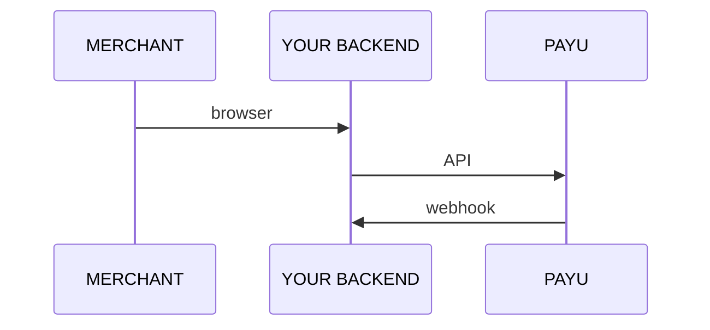
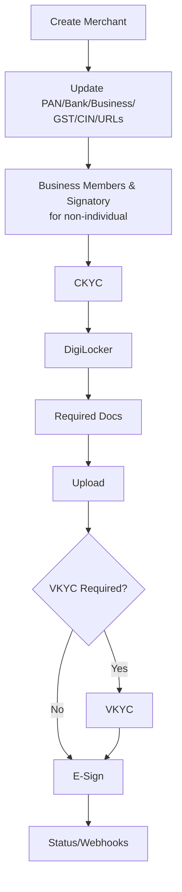

---
title: APIs for Partner integration
excerpt: >-
  Full server-to-server control: onboarding sequence, entity-specific steps, post-activation
  payments and webhooks.
deprecated: false
hidden: false
metadata:
  title: PayU Partner Full API Integration
  description: >-
    Architecture, ordered onboarding steps, individual vs non-individual flows,
    and post-activation payments.
  keywords:
    - PayU partner API integration
    - reseller onboarding API
  robots: index
---

Full control. The merchant never leaves your platform. You build the UI; PayU provides the APIs.

## Architecture

 

All API calls are **server-to-server**. Never expose your `resellerToken` to the browser.

## Onboarding sequence

## Entity type determines the flow

|                  | Individual / Sole Prop | Non-Individual (Pvt Ltd, LLP, Partnership, Trust, Society) |
| ---------------- | ---------------------- | ---------------------------------------------------------- |
| Business members | Not required           | Required                                                   |
| Signatory & UBO  | Not required           | Required                                                   |
| CIN              | Not required           | Required (Pvt Ltd, LLP)                                    |
| CKYC flow        | Mobile OTP             | PAN + Date of Incorporation                                |
| VKYC             | Conditional            | Conditional                                                |

## What the merchant sees

Your platform owns the UI. PayU is invisible except for OTP messages, DigiLocker redirect, and optional VKYC link.

## After activation

Day-0 flags enable S2S payments, tokenisation, callbacks, and refunds. Link to [Collect, verify, refund](doc:collect-verify-refund) and [Webhooks](doc:webhooks-partner).
