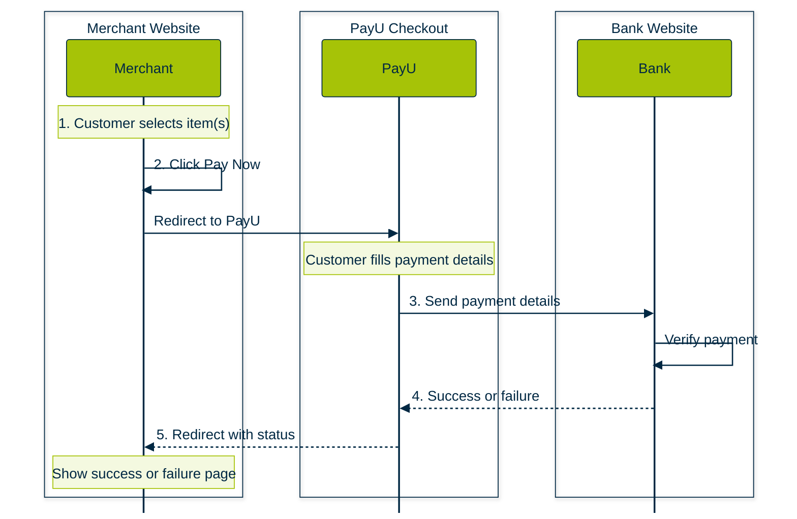
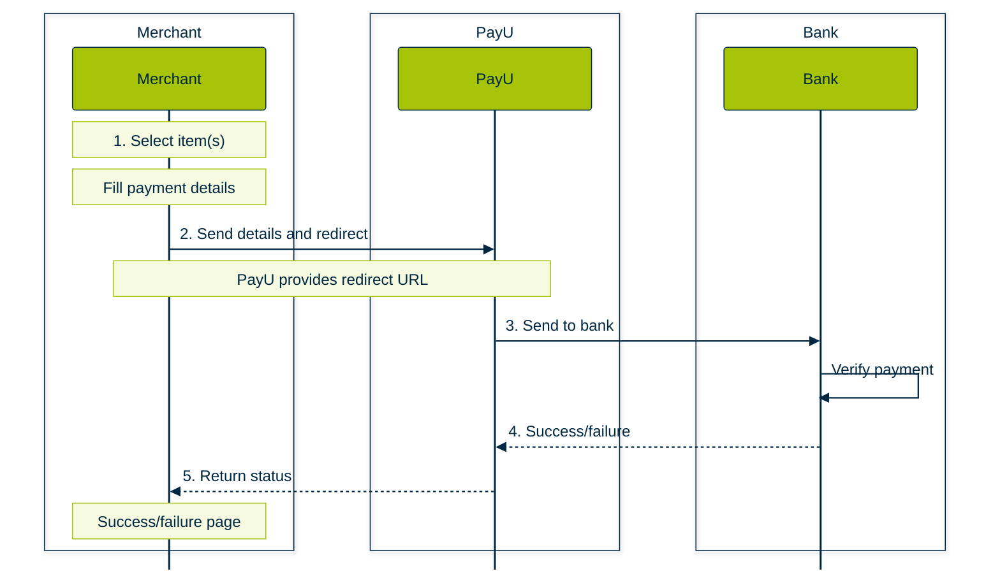
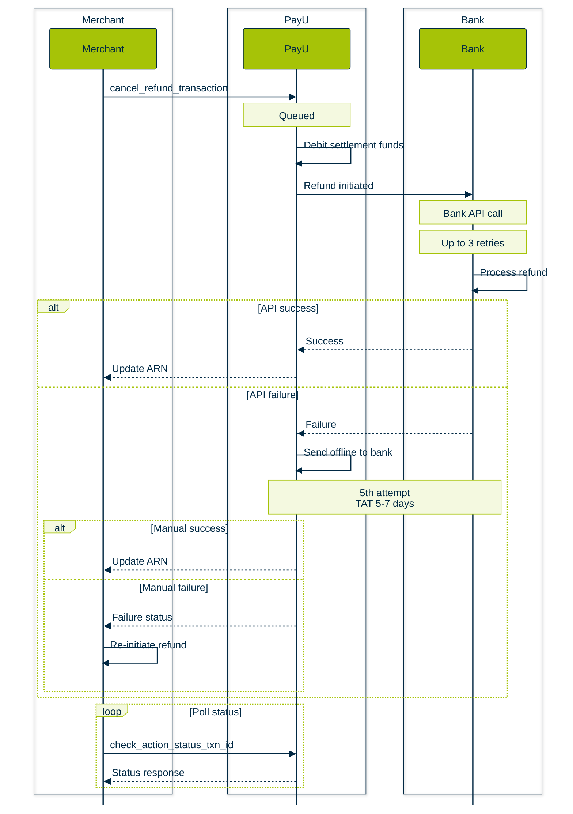

## PayU Hosted Checkout

Original workflow image: [https://docs.payu.in/docs/prebuilt-checkout-payu-hosted](https://docs.payu.in/docs/prebuilt-checkout-payu-hosted "https://docs.payu.in/docs/prebuilt-checkout-payu-hosted")

## Merchant Hosted

Original: [https://docs.payu.in/docs/custom-checkout-merchant-hosted](https://docs.payu.in/docs/custom-checkout-merchant-hosted "https://docs.payu.in/docs/custom-checkout-merchant-hosted")

## Refunds

Original: [https://docs.payu.in/docs/introduction-refunds](https://docs.payu.in/update/docs/introduction-refunds "https://docs.payu.in/update/docs/introduction-refunds")

 