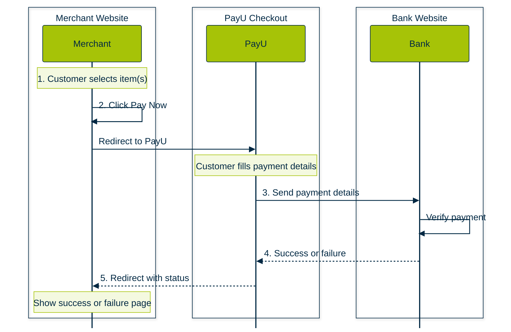
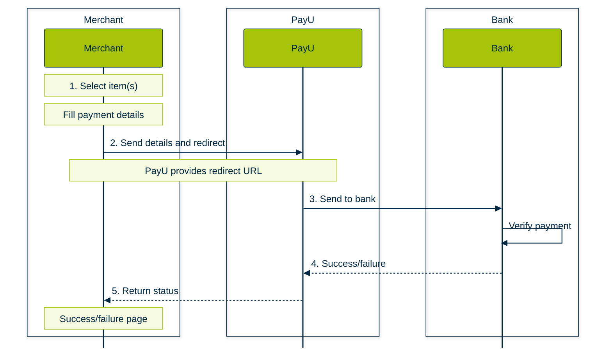
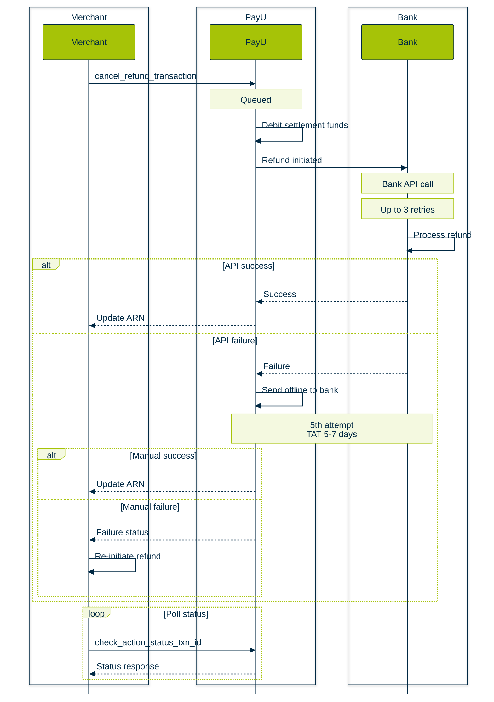
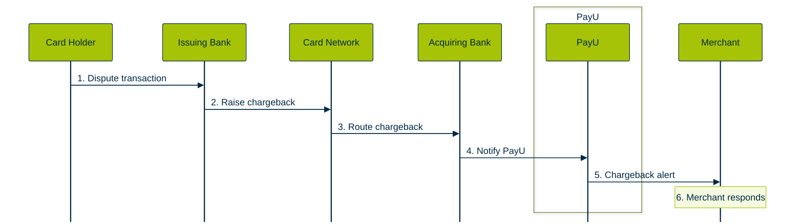
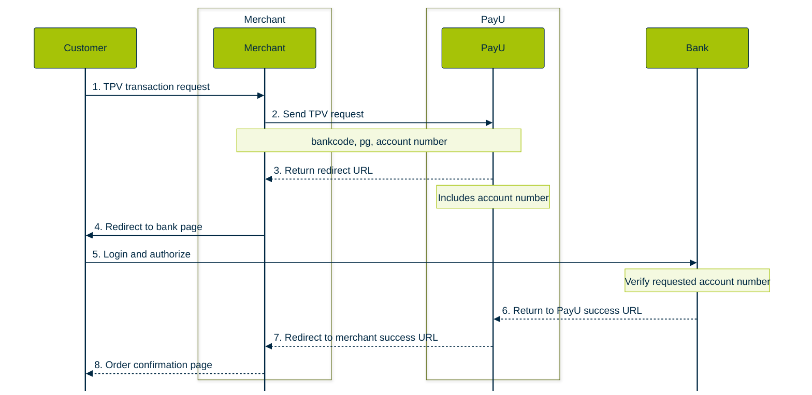
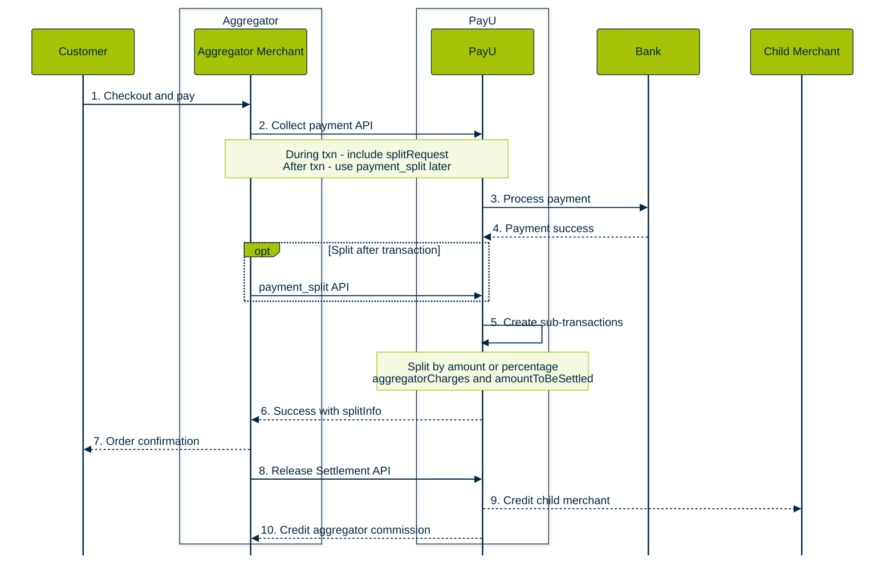
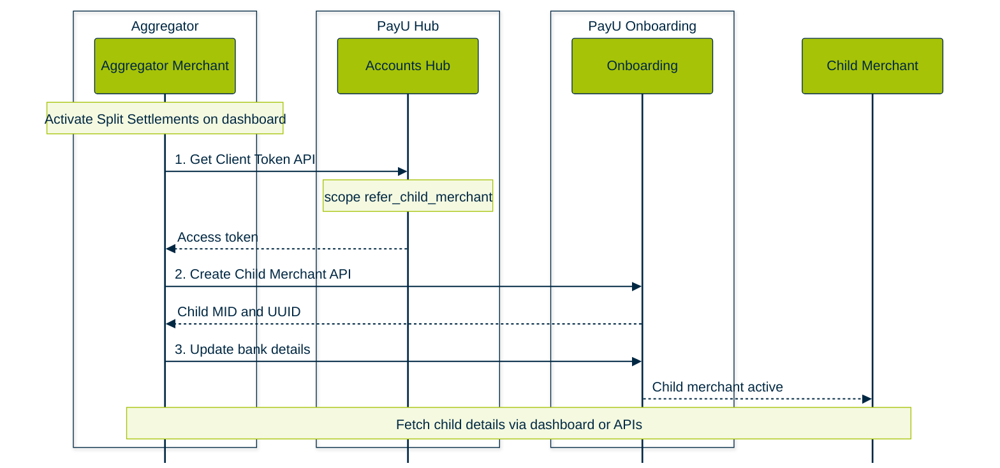

## PayU Hosted Checkout

Original workflow image: [https://docs.payu.in/docs/prebuilt-checkout-payu-hosted](https://docs.payu.in/docs/prebuilt-checkout-payu-hosted "https://docs.payu.in/docs/prebuilt-checkout-payu-hosted")



## Merchant Hosted

Original: [https://docs.payu.in/docs/custom-checkout-merchant-hosted](https://docs.payu.in/docs/custom-checkout-merchant-hosted "https://docs.payu.in/docs/custom-checkout-merchant-hosted")



## Refunds

Original: [https://docs.payu.in/docs/introduction-refunds](https://docs.payu.in/update/docs/introduction-refunds "https://docs.payu.in/update/docs/introduction-refunds")



## Chargeback

[ Original: https://docs.payu.in/docs/chargeback](https://docs.payu.in/docs/chargeback "https://docs.payu.in/docs/chargeback")



## Apple Pay

Original: [https://docs.payu.in/docs/apple-pay-integration](https://docs.payu.in/update/docs/apple-pay-integration "https://docs.payu.in/update/docs/apple-pay-integration")

```mermaid
box Merchant
    participant Merchant as Merchant Checkout

```

## TPV Workflow

Original:[https://docs.payu.in/update/docs/introduction-to-payu-tpv](https://docs.payu.in/update/docs/introduction-to-payu-tpv "https://docs.payu.in/update/docs/introduction-to-payu-tpv")



## Split Settlements Flow

Mermaid swimlane diagrams for [Split Settlements](https://docs.payu.in/docs/split-settlments), based on the aggregator/marketplace docs.

### Payment, split, and settlement

Covers collect payment, split during or after transaction, and fund release to child merchants.



### Child merchant onboarding

One-time setup before split payments. See [Onboarding Child Merchants Workflow](https://docs.payu.in/docs/introduction-split-settlements).



<br />
