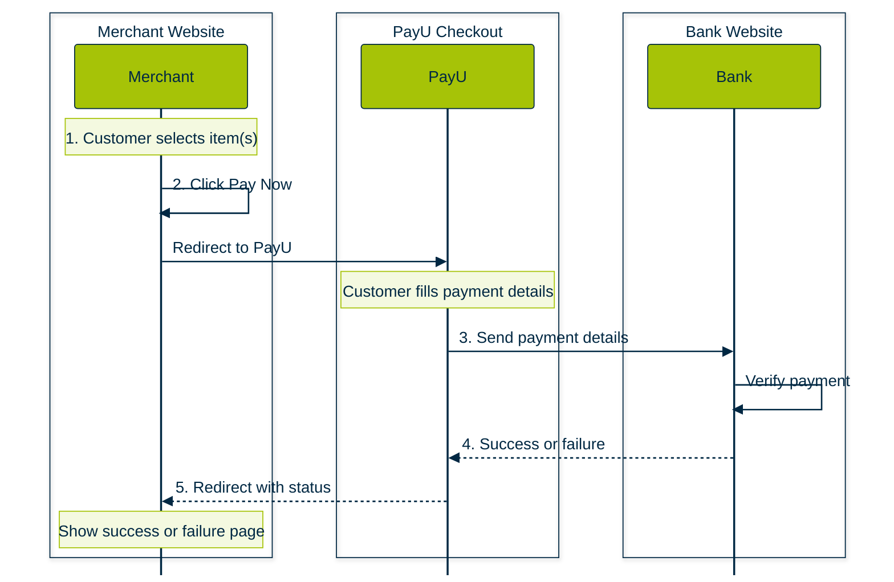

## PayU Hosted Checkout

Original workflow image: [https://docs.payu.in/docs/prebuilt-checkout-payu-hosted](https://docs.payu.in/docs/prebuilt-checkout-payu-hosted "https://docs.payu.in/docs/prebuilt-checkout-payu-hosted")

 
