## PayU Hosted Checkout

Original workflow image: [https://docs.payu.in/docs/prebuilt-checkout-payu-hosted](https://docs.payu.in/docs/prebuilt-checkout-payu-hosted "https://docs.payu.in/docs/prebuilt-checkout-payu-hosted")

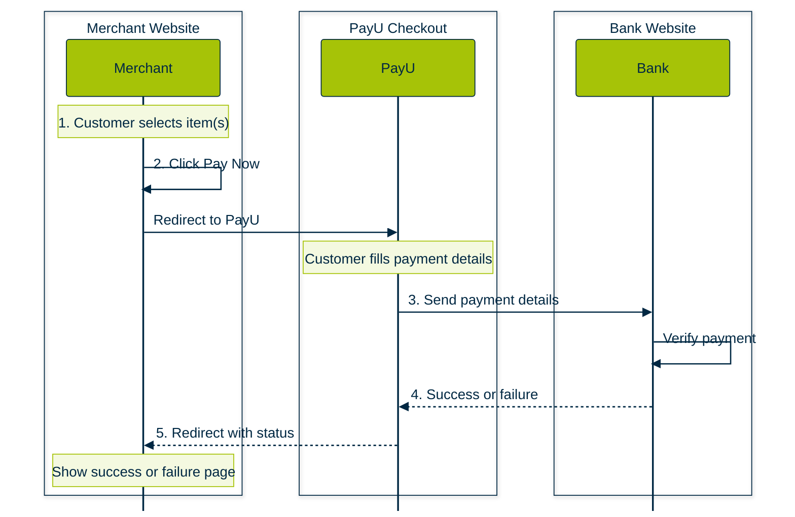

## Merchant Hosted

Original: [https://docs.payu.in/docs/custom-checkout-merchant-hosted](https://docs.payu.in/docs/custom-checkout-merchant-hosted "https://docs.payu.in/docs/custom-checkout-merchant-hosted")

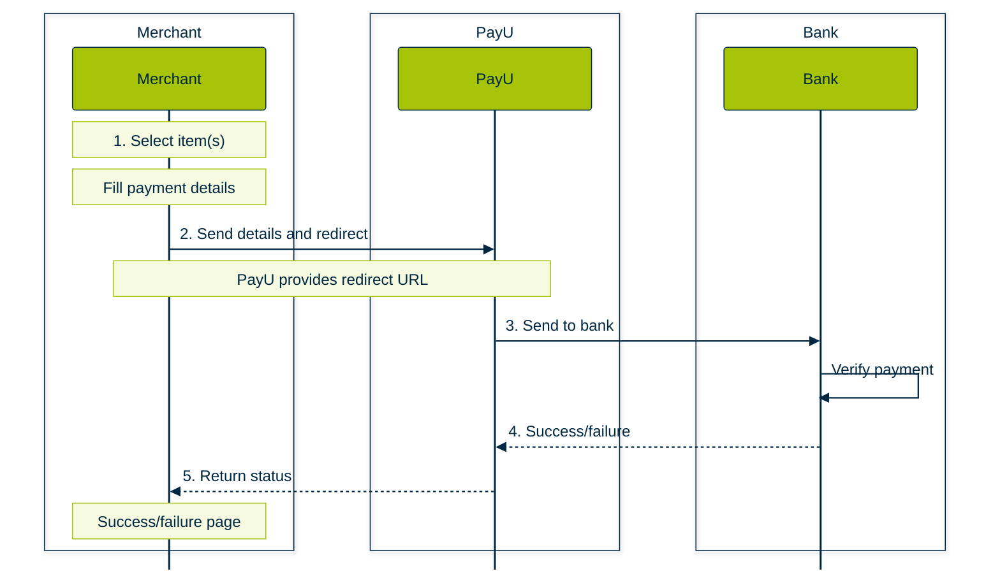

## Refunds

Original: [https://docs.payu.in/docs/introduction-refunds](https://docs.payu.in/update/docs/introduction-refunds "https://docs.payu.in/update/docs/introduction-refunds")

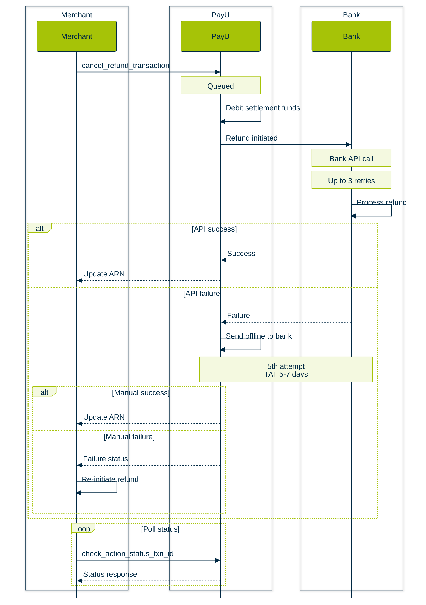

## Chargeback

[ Original: https://docs.payu.in/docs/chargeback](https://docs.payu.in/docs/chargeback "https://docs.payu.in/docs/chargeback")

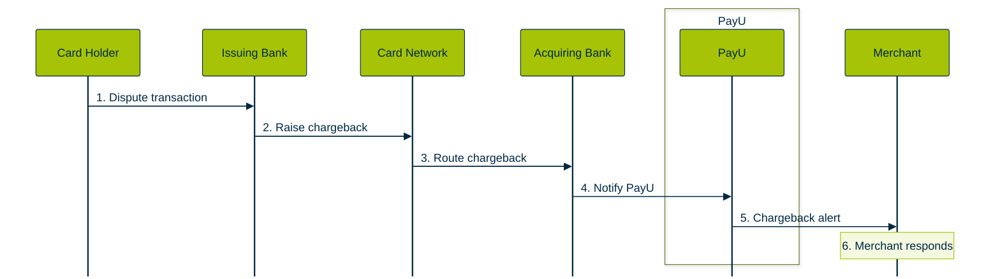

## Apple Pay

Original: [https://docs.payu.in/docs/apple-pay-integration](https://docs.payu.in/update/docs/apple-pay-integration "https://docs.payu.in/update/docs/apple-pay-integration")

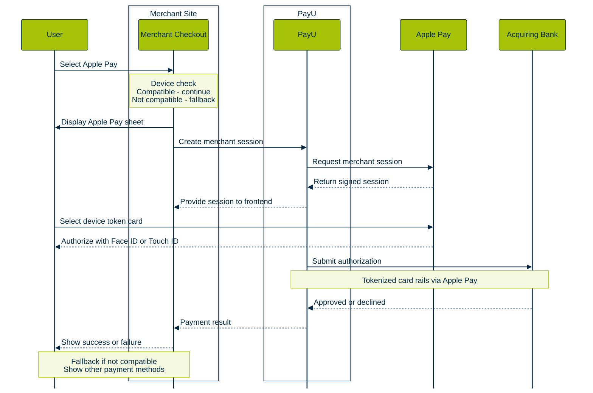

## TPV Workflow

Original:[https://docs.payu.in/update/docs/introduction-to-payu-tpv](https://docs.payu.in/update/docs/introduction-to-payu-tpv "https://docs.payu.in/update/docs/introduction-to-payu-tpv")

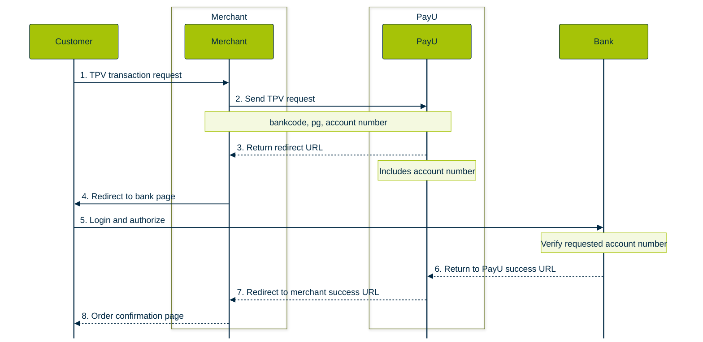

## Split Settlements Flow

Mermaid swimlane diagrams for [Split Settlements](https://docs.payu.in/docs/split-settlments), based on the aggregator/marketplace docs.

### Payment, split, and settlement

Covers collect payment, split during or after transaction, and fund release to child merchants.

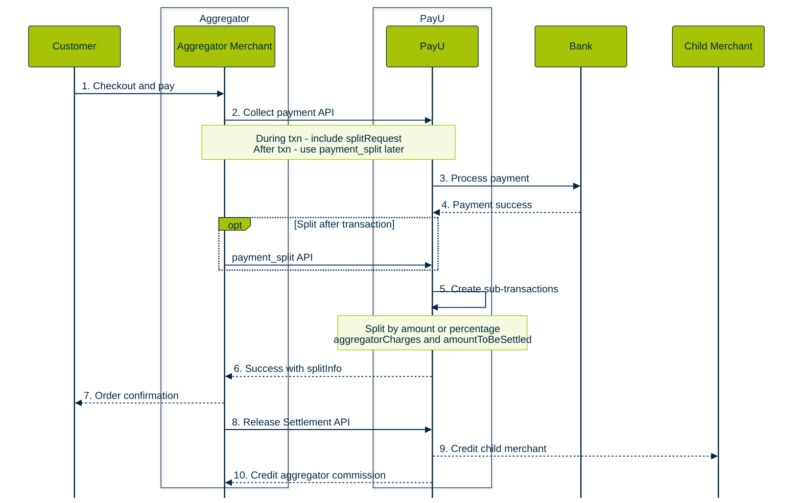

### Child merchant onboarding

One-time setup before split payments. See [Onboarding Child Merchants Workflow](https://docs.payu.in/docs/introduction-split-settlements).

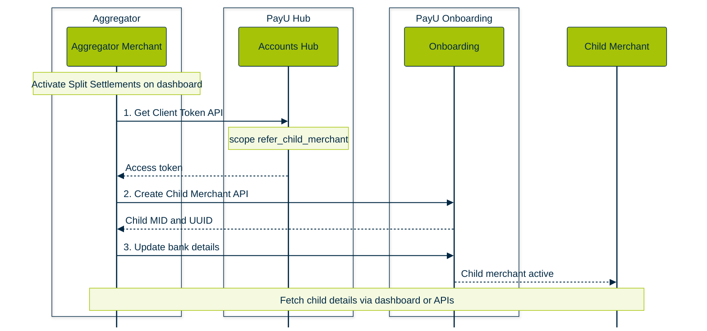

 

## Cross-Border Payments Import Flow

Mermaid swimlane diagrams for [Cross-Border Payments – Import](https://docs.payu.in/docs/introduction-cross-border-payments-import), based on the payment journey, integration, settlement, and on-hold sections.

### Payment and cross-border settlement

End-to-end flow from Indian customer payment to overseas merchant settlement via AD-1 bank (T+2/T+3).

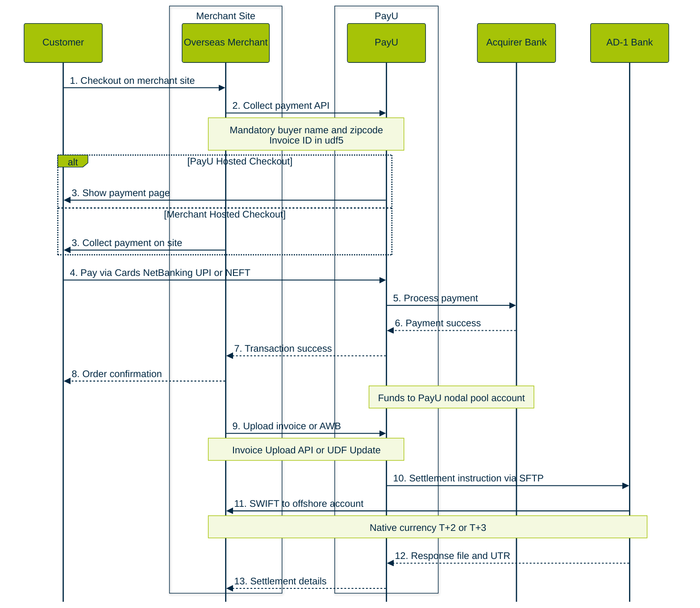

### LRS customer journey (PayU Hosted)

For travel and education under the Liberalised Remittance Scheme. See [Customer Journey - PayU Hosted Checkout with LRS](https://docs.payu.in/docs/customer-journey-payu-hosted-checkout-with-lrs-integration).

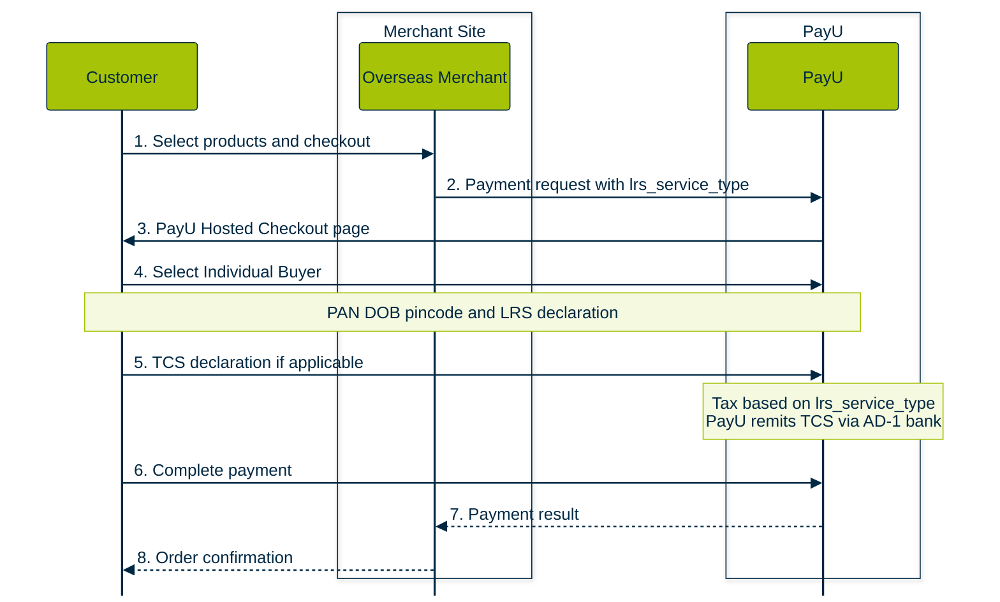

### On-hold settlement resolution

When AD-1 bank requires additional information before releasing outward settlement. See [On-Hold Settlements](https://docs.payu.in/docs/on-hold-settlements-cross-border-payments).

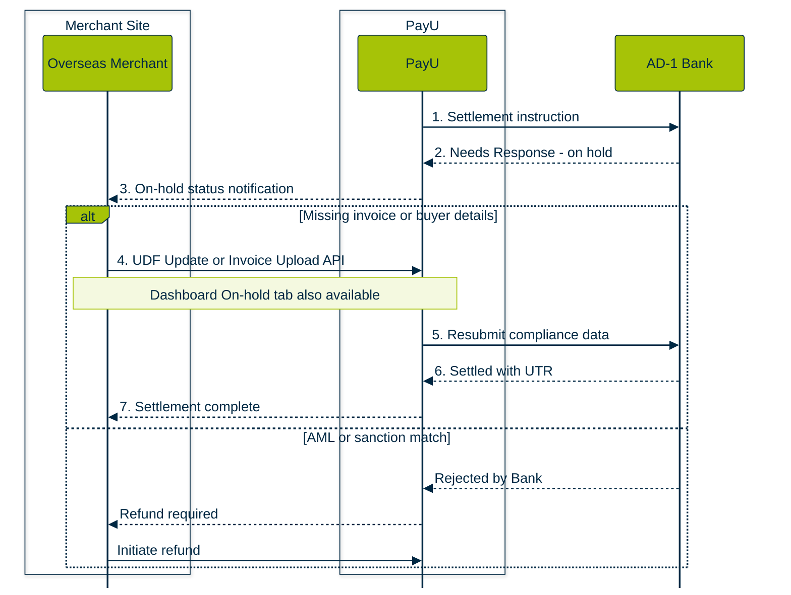

## Recommendation Engine Flow

Mermaid swimlane diagrams for [Recommendation Engine](https://docs.payu.in/docs/recommendation-engine), based on the intro, customer journey, and Fetch API sections.

### Checkout personalization flow

How RE personalizes payment instruments on PayU Hosted Checkout or via the Fetch API for merchant-hosted checkout.

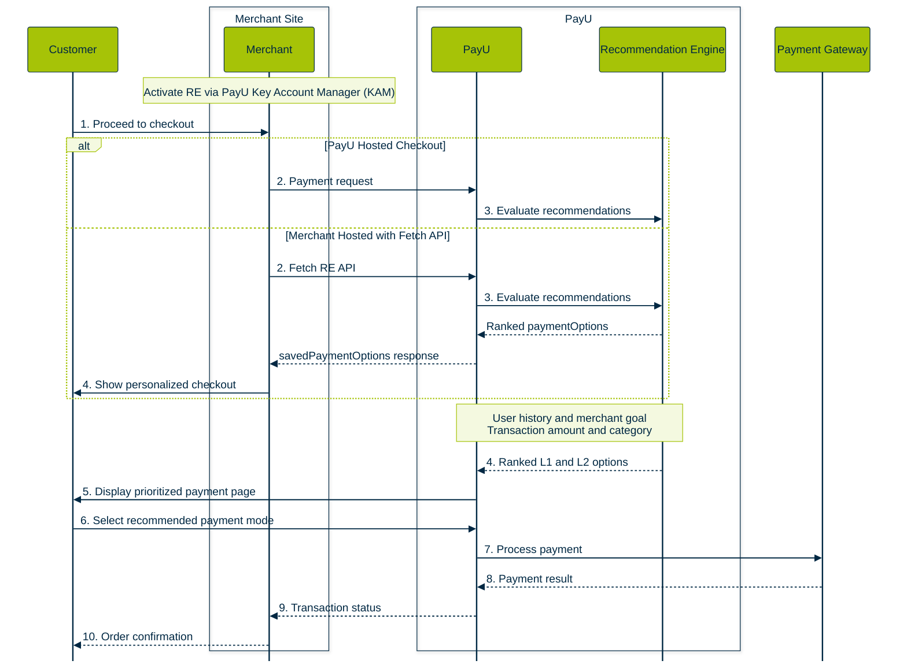

### User scenarios and merchant goals

How RE adapts recommendations based on customer type and the merchant-selected optimization goal.

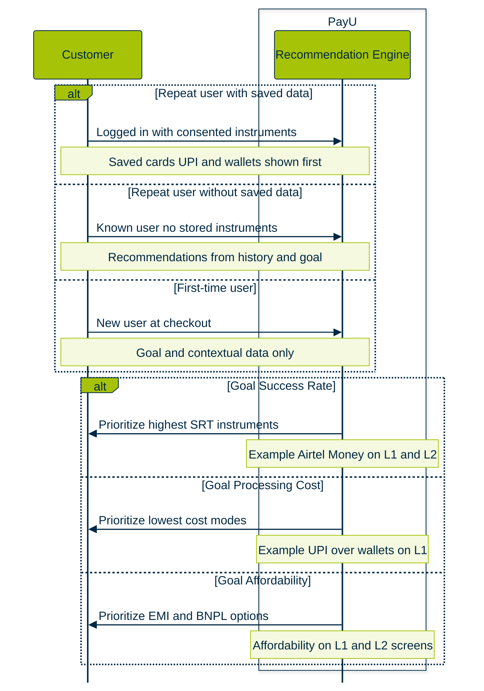

### Fetch Recommendation Engine API

Server-to-server flow for merchants building a custom checkout UI. See [Fetch Recommendation Engine API](https://docs.payu.in/docs/fetch-recommendation-engine-api).

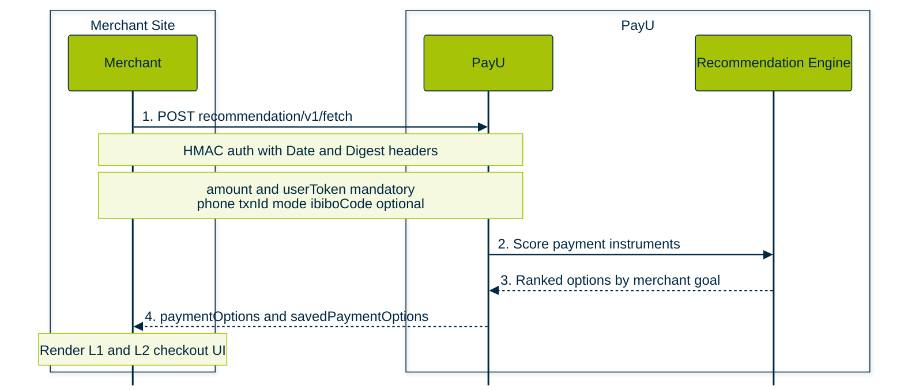

