---
title: '[Internal Review] Swimlane Diagrams'
deprecated: false
hidden: true
metadata:
  robots: index
---
## PayU Hosted Checkout

Original workflow image: [https://docs.payu.in/docs/prebuilt-checkout-payu-hosted](https://docs.payu.in/docs/prebuilt-checkout-payu-hosted "https://docs.payu.in/docs/prebuilt-checkout-payu-hosted")

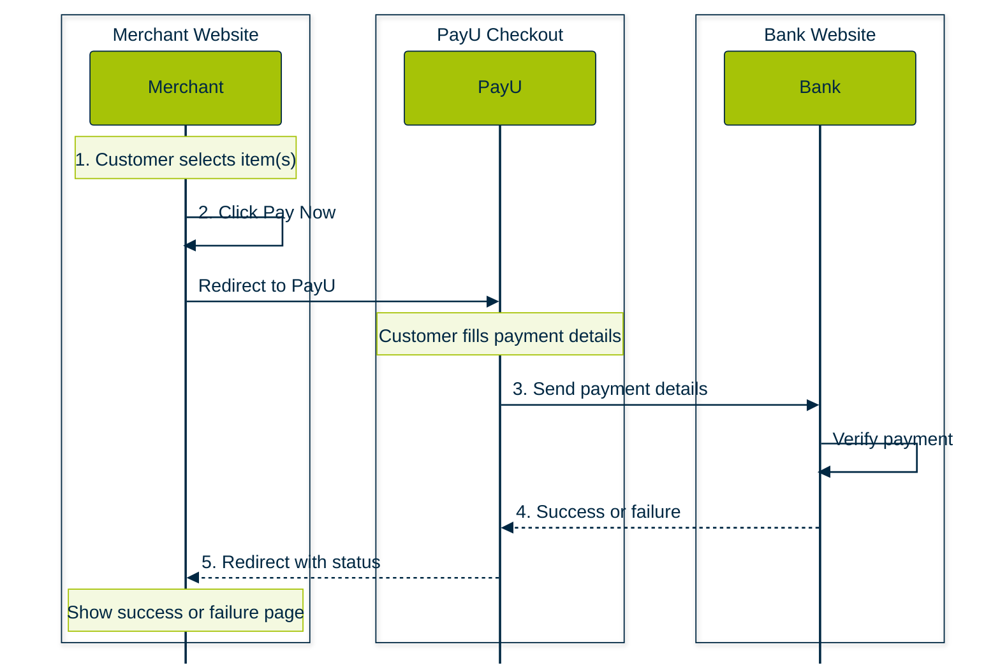
```mermaid
%%{init: {
  "theme": "base",
  "sequence": {
    "mirrorActors": false,
    "rightAngles": true,
    "messageAlign": "left",
    "fontSize": 10,
    "actorFontSize": 10,
    "noteFontSize": 10,
    "actorMargin": 88,
    "width": 168,
    "boxMargin": 10,
    "messageMargin": 38,
    "diagramMarginX": 60,
    "diagramMarginY": 18
  },
  "themeVariables": {
    "fontFamily": "Arial, Helvetica, sans-serif",
    "fontSize": "10px",
    "background": "#FFFFFF",
    "primaryColor": "#A6C307",
    "primaryTextColor": "#002843",
    "primaryBorderColor": "#002843",
    "secondaryColor": "#F4F9E0",
    "lineColor": "#002843",
    "textColor": "#002843",
    "actorBkg": "#A6C307",
    "actorBorder": "#002843",
    "actorTextColor": "#002843",
    "actorLineColor": "#002843",
    "signalColor": "#002843",
    "signalTextColor": "#002843",
    "labelBoxBkgColor": "#F4F9E0",
    "labelBoxBorderColor": "#A6C307",
    "noteBkgColor": "#F4F9E0",
    "noteTextColor": "#002843",
    "noteBorderColor": "#A6C307",
    "activationBkgColor": "#E8F0C4",
    "activationBorderColor": "#002843"
  }
}}%%
sequenceDiagram
    box Merchant Website
        participant Merchant
    end
    box PayU Checkout
        participant PayU
    end
    box Bank Website
        participant Bank
    end

    Note over Merchant: 1. Customer selects item(s)

    Merchant->>Merchant: 2. Click Pay Now
    Merchant->>PayU: Redirect to PayU

    Note over PayU: Customer fills payment details

    PayU->>Bank: 3. Send payment details

    Bank->>Bank: Verify payment
    Bank-->>PayU: 4. Success or failure

    PayU-->>Merchant: 5. Redirect with status

    Note over Merchant: Show success or failure page

```

## Merchant Hosted

Original: [https://docs.payu.in/docs/custom-checkout-merchant-hosted](https://docs.payu.in/docs/custom-checkout-merchant-hosted "https://docs.payu.in/docs/custom-checkout-merchant-hosted")

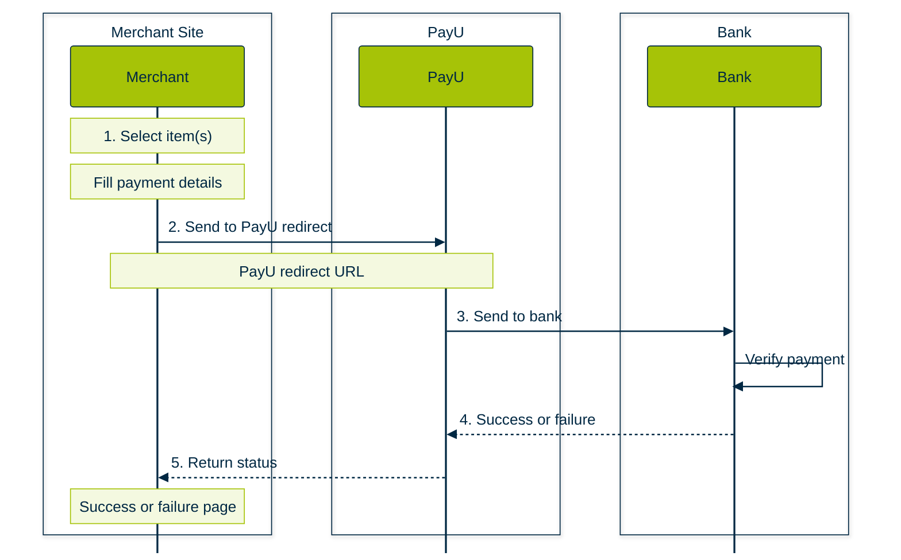
```mermaid
%%{init: {
  "theme": "base",
  "sequence": {
    "mirrorActors": false,
    "rightAngles": true,
    "messageAlign": "left",
    "fontSize": 10,
    "actorFontSize": 10,
    "noteFontSize": 10,
    "actorMargin": 100,
    "width": 185,
    "boxMargin": 12,
    "messageMargin": 42,
    "diagramMarginX": 70,
    "diagramMarginY": 20
  },
  "themeVariables": {
    "fontFamily": "Arial, Helvetica, sans-serif",
    "fontSize": "10px",
    "background": "#FFFFFF",
    "primaryColor": "#A6C307",
    "primaryTextColor": "#002843",
    "primaryBorderColor": "#002843",
    "actorBkg": "#A6C307",
    "actorBorder": "#002843",
    "actorTextColor": "#002843",
    "signalColor": "#002843",
    "noteBkgColor": "#F4F9E0",
    "noteTextColor": "#002843",
    "noteBorderColor": "#A6C307",
    "activationBkgColor": "#E8F0C4",
    "activationBorderColor": "#002843"
  }
}}%%
sequenceDiagram
    box Merchant Site
        participant Merchant
    end
    box PayU
        participant PayU
    end
    box Bank
        participant Bank
    end

    Note over Merchant: 1. Select item(s)
    Note over Merchant: Fill payment details

    Merchant->>PayU: 2. Send to PayU redirect
    Note over Merchant,PayU: PayU redirect URL

    PayU->>Bank: 3. Send to bank

    Bank->>Bank: Verify payment
    Bank-->>PayU: 4. Success or failure

    PayU-->>Merchant: 5. Return status

    Note over Merchant: Success or failure page

```

## Refunds

Original: [https://docs.payu.in/docs/introduction-refunds](https://docs.payu.in/docs/introduction-refunds "https://docs.payu.in/docs/introduction-refunds")

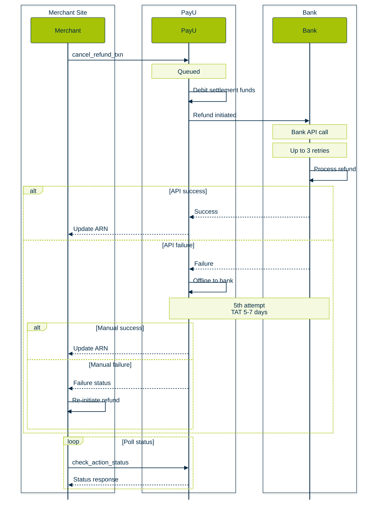
```mermaid
%%{init: {
  "theme": "base",
  "sequence": {
    "mirrorActors": false,
    "rightAngles": true,
    "messageAlign": "left",
    "fontSize": 10,
    "actorFontSize": 10,
    "noteFontSize": 10,
    "actorMargin": 100,
    "width": 190,
    "boxMargin": 10,
    "messageMargin": 38,
    "diagramMarginX": 60,
    "diagramMarginY": 18
  },
  "themeVariables": {
    "fontFamily": "Arial, Helvetica, sans-serif",
    "fontSize": "10px",
    "background": "#FFFFFF",
    "primaryColor": "#A6C307",
    "primaryTextColor": "#002843",
    "primaryBorderColor": "#002843",
    "secondaryColor": "#F4F9E0",
    "lineColor": "#002843",
    "textColor": "#002843",
    "actorBkg": "#A6C307",
    "actorBorder": "#002843",
    "actorTextColor": "#002843",
    "actorLineColor": "#002843",
    "signalColor": "#002843",
    "signalTextColor": "#002843",
    "labelBoxBkgColor": "#F4F9E0",
    "labelBoxBorderColor": "#A6C307",
    "noteBkgColor": "#F4F9E0",
    "noteTextColor": "#002843",
    "noteBorderColor": "#A6C307",
    "activationBkgColor": "#E8F0C4",
    "activationBorderColor": "#002843"
  }
}}%%
sequenceDiagram
    box Merchant Site
        participant Merchant
    end
    box PayU
        participant PayU
    end
    box Bank
        participant Bank
    end

    Merchant->>PayU: cancel_refund_txn
    Note over PayU: Queued

    PayU->>PayU: Debit settlement funds
    PayU->>Bank: Refund initiated

    Note over Bank: Bank API call
    Note over Bank: Up to 3 retries

    Bank->>Bank: Process refund

    alt API success
        Bank-->>PayU: Success
        PayU-->>Merchant: Update ARN
    else API failure
        Bank-->>PayU: Failure
        PayU->>PayU: Offline to bank
        Note over PayU,Bank: 5th attempt<br/>TAT 5-7 days
        alt Manual success
            PayU-->>Merchant: Update ARN
        else Manual failure
            PayU-->>Merchant: Failure status
            Merchant->>Merchant: Re-initiate refund
        end
    end

    loop Poll status
        Merchant->>PayU: check_action_status
        PayU-->>Merchant: Status response
    end

```

## Chargeback

[ Original: https://docs.payu.in/docs/chargeback](https://docs.payu.in/docs/chargeback "https://docs.payu.in/docs/chargeback")

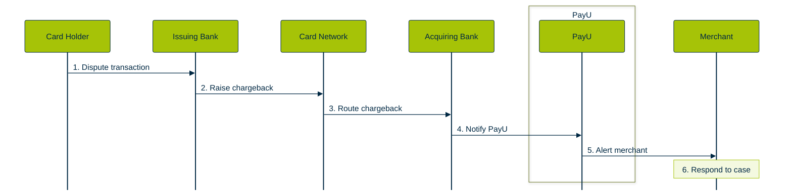
```mermaid
%%{init: {
  "theme": "base",
  "sequence": {
    "mirrorActors": false,
    "rightAngles": true,
    "messageAlign": "left",
    "fontSize": 10,
    "actorFontSize": 10,
    "noteFontSize": 10,
    "actorMargin": 86,
    "width": 172,
    "boxMargin": 8,
    "messageMargin": 34,
    "diagramMarginX": 50,
    "diagramMarginY": 16
  },
  "themeVariables": {
    "fontFamily": "Arial, Helvetica, sans-serif",
    "fontSize": "10px",
    "background": "#FFFFFF",
    "primaryColor": "#A6C307",
    "primaryTextColor": "#002843",
    "actorBkg": "#A6C307",
    "actorBorder": "#002843",
    "signalColor": "#002843",
    "noteBkgColor": "#F4F9E0",
    "noteTextColor": "#002843",
    "noteBorderColor": "#A6C307"
  }
}}%%
sequenceDiagram
    participant Holder as Card Holder
    participant Issuer as Issuing Bank
    participant Network as Card Network
    participant Acquirer as Acquiring Bank
    box PayU
        participant PayU
    end
    participant Merchant

    Holder->>Issuer: 1. Dispute transaction
    Issuer->>Network: 2. Raise chargeback
    Network->>Acquirer: 3. Route chargeback
    Acquirer->>PayU: 4. Notify PayU
    PayU->>Merchant: 5. Alert merchant
    Note over Merchant: 6. Respond to case

```

## Apple Pay

Original: [https://docs.payu.in/docs/apple-pay-integration](https://docs.payu.in/docs/apple-pay-integration "https://docs.payu.in/docs/apple-pay-integration")

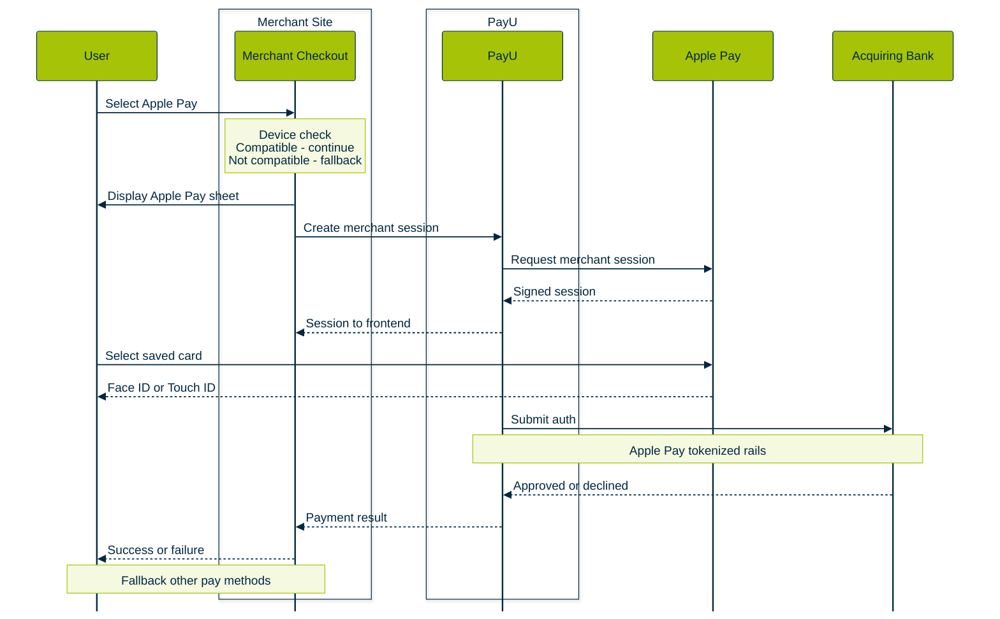
```mermaid
%%{init: {
  "theme": "base",
  "sequence": {
    "mirrorActors": false,
    "rightAngles": true,
    "messageAlign": "left",
    "fontSize": 10,
    "actorFontSize": 10,
    "noteFontSize": 10,
    "actorMargin": 78,
    "width": 158,
    "boxMargin": 8,
    "messageMargin": 34,
    "diagramMarginX": 48,
    "diagramMarginY": 16
  },
  "themeVariables": {
    "fontFamily": "Arial, Helvetica, sans-serif",
    "fontSize": "10px",
    "background": "#FFFFFF",
    "primaryColor": "#A6C307",
    "primaryTextColor": "#002843",
    "primaryBorderColor": "#002843",
    "secondaryColor": "#F4F9E0",
    "secondaryTextColor": "#002843",
    "secondaryBorderColor": "#A6C307",
    "tertiaryColor": "#002843",
    "tertiaryTextColor": "#FFFFFF",
    "lineColor": "#002843",
    "textColor": "#002843",
    "mainBkg": "#A6C307",
    "clusterBkg": "#FAFCF4",
    "clusterBorder": "#D8E8A8",
    "edgeLabelBackground": "#FFFFFF",
    "actorBkg": "#A6C307",
    "actorBorder": "#002843",
    "actorTextColor": "#002843",
    "actorLineColor": "#002843",
    "signalColor": "#002843",
    "signalTextColor": "#002843",
    "labelBoxBkgColor": "#F4F9E0",
    "labelBoxBorderColor": "#A6C307",
    "labelTextColor": "#002843",
    "noteBkgColor": "#F4F9E0",
    "noteTextColor": "#002843",
    "noteBorderColor": "#A6C307",
    "activationBkgColor": "#E8F0C4",
    "activationBorderColor": "#002843"
  }
}}%%
sequenceDiagram
    participant User
    box Merchant Site
        participant Merchant as Merchant Checkout
    end
    box PayU
        participant PayU
    end
    participant Apple as Apple Pay
    participant Bank as Acquiring Bank

    User->>Merchant: Select Apple Pay
    Note over Merchant: Device check<br/>Compatible - continue<br/>Not compatible - fallback

    Merchant->>User: Display Apple Pay sheet
    Merchant->>PayU: Create merchant session
    PayU->>Apple: Request merchant session
    Apple-->>PayU: Signed session
    PayU-->>Merchant: Session to frontend

    User->>Apple: Select saved card
    Apple-->>User: Face ID or Touch ID

    PayU->>Bank: Submit auth
    Note over PayU,Bank: Apple Pay tokenized rails

    Bank-->>PayU: Approved or declined
    PayU-->>Merchant: Payment result
    Merchant-->>User: Success or failure

    Note over User,Merchant: Fallback other pay methods
```

## TPV Workflow

Original: [https://docs.payu.in/docs/introduction-to-payu-tpv](https://docs.payu.in/docs/introduction-to-payu-tpv "https://docs.payu.in/docs/introduction-to-payu-tpv")

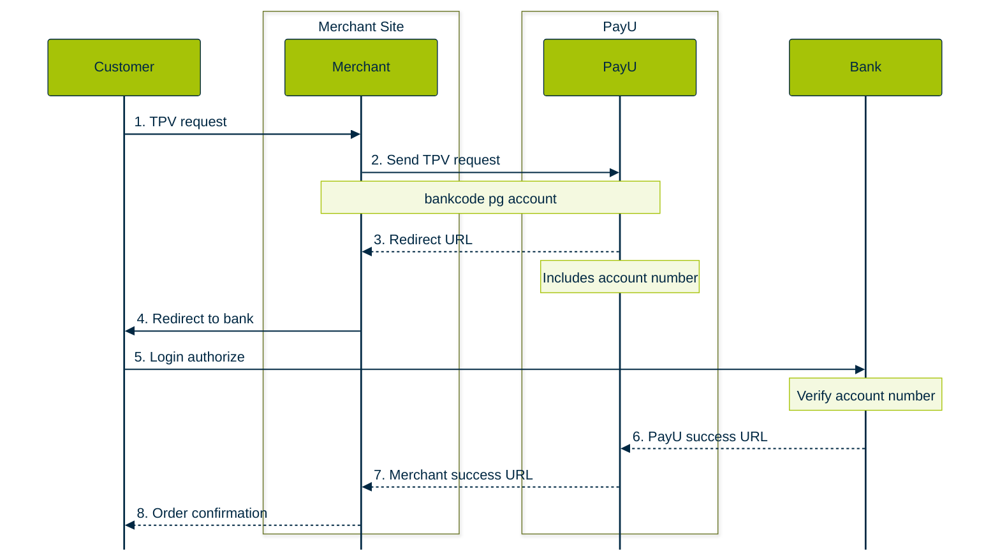
```mermaid
%%{init: {
  "theme": "base",
  "sequence": {
    "mirrorActors": false,
    "rightAngles": true,
    "messageAlign": "left",
    "fontSize": 10,
    "actorFontSize": 10,
    "noteFontSize": 10,
    "actorMargin": 92,
    "width": 175,
    "boxMargin": 10,
    "messageMargin": 38,
    "diagramMarginX": 55,
    "diagramMarginY": 18
  },
  "themeVariables": {
    "fontFamily": "Arial, Helvetica, sans-serif",
    "fontSize": "10px",
    "background": "#FFFFFF",
    "primaryColor": "#A6C307",
    "primaryTextColor": "#002843",
    "actorBkg": "#A6C307",
    "actorBorder": "#002843",
    "signalColor": "#002843",
    "noteBkgColor": "#F4F9E0",
    "noteTextColor": "#002843",
    "noteBorderColor": "#A6C307"
  }
}}%%
sequenceDiagram
    participant Customer
    box Merchant Site
        participant Merchant
    end
    box PayU
        participant PayU
    end
    participant Bank

    Customer->>Merchant: 1. TPV request

    Merchant->>PayU: 2. Send TPV request
    Note over Merchant,PayU: bankcode pg account

    PayU-->>Merchant: 3. Redirect URL
    Note over PayU: Includes account number

    Merchant->>Customer: 4. Redirect to bank

    Customer->>Bank: 5. Login authorize
    Note over Bank: Verify account number

    Bank-->>PayU: 6. PayU success URL

    PayU-->>Merchant: 7. Merchant success URL

    Merchant-->>Customer: 8. Order confirmation

```

## Split Settlements Flow

Mermaid swimlane diagrams for [Split Settlements](https://docs.payu.in/docs/split-settlments), based on the aggregator/marketplace docs.

### Payment, split, and settlement

Covers collect payment, split during or after transaction, and fund release to child merchants.

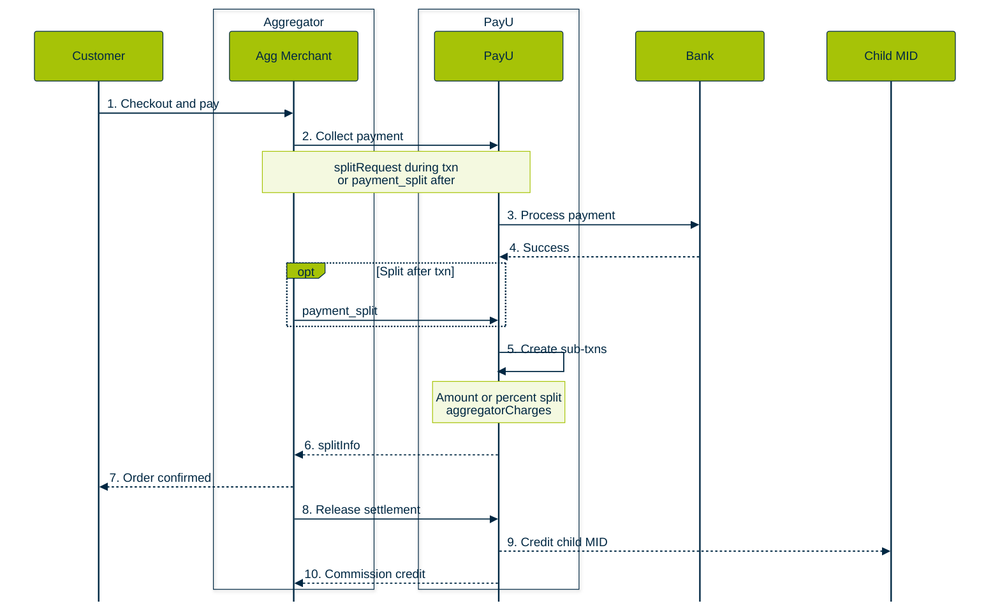
```mermaid
%%{init: {
  "theme": "base",
  "sequence": {
    "mirrorActors": false,
    "rightAngles": true,
    "messageAlign": "left",
    "fontSize": 10,
    "actorFontSize": 10,
    "noteFontSize": 10,
    "actorMargin": 82,
    "width": 168,
    "boxMargin": 8,
    "messageMargin": 34,
    "diagramMarginX": 45,
    "diagramMarginY": 16
  },
  "themeVariables": {
    "fontFamily": "Arial, Helvetica, sans-serif",
    "fontSize": "10px",
    "background": "#FFFFFF",
    "primaryColor": "#A6C307",
    "primaryTextColor": "#002843",
    "primaryBorderColor": "#002843",
    "secondaryColor": "#F4F9E0",
    "lineColor": "#002843",
    "textColor": "#002843",
    "actorBkg": "#A6C307",
    "actorBorder": "#002843",
    "actorTextColor": "#002843",
    "signalColor": "#002843",
    "noteBkgColor": "#F4F9E0",
    "noteTextColor": "#002843",
    "noteBorderColor": "#A6C307",
    "activationBkgColor": "#E8F0C4",
    "activationBorderColor": "#002843"
  }
}}%%
sequenceDiagram
    participant Customer
    box Aggregator
        participant Parent as Agg Merchant
    end
    box PayU
        participant PayU
    end
    participant Bank
    participant Child as Child MID

    Customer->>Parent: 1. Checkout and pay

    Parent->>PayU: 2. Collect payment
    Note over Parent,PayU: splitRequest during txn<br/>or payment_split after

    PayU->>Bank: 3. Process payment
    Bank-->>PayU: 4. Success

    opt Split after txn
        Parent->>PayU: payment_split
    end

    PayU->>PayU: 5. Create sub-txns
    Note over PayU: Amount or percent split<br/>aggregatorCharges

    PayU-->>Parent: 6. splitInfo
    Parent-->>Customer: 7. Order confirmed

    Parent->>PayU: 8. Release settlement
    PayU-->>Child: 9. Credit child MID
    PayU-->>Parent: 10. Commission credit
```

### Child merchant onboarding

One-time setup before split payments. See [Onboarding Child Merchants Workflow](https://docs.payu.in/docs/introduction-split-settlements).

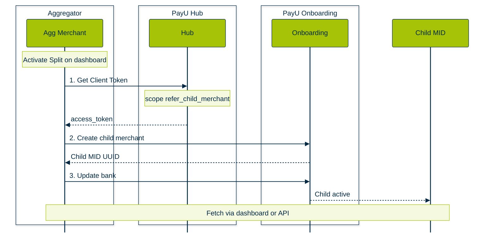
```mermaid
%%{init: {
  "theme": "base",
  "sequence": {
    "mirrorActors": false,
    "rightAngles": true,
    "messageAlign": "left",
    "fontSize": 10,
    "actorFontSize": 10,
    "noteFontSize": 10,
    "actorMargin": 88,
    "width": 178,
    "boxMargin": 10,
    "messageMargin": 36,
    "diagramMarginX": 52,
    "diagramMarginY": 18
  },
  "themeVariables": {
    "fontFamily": "Arial, Helvetica, sans-serif",
    "fontSize": "10px",
    "background": "#FFFFFF",
    "primaryColor": "#A6C307",
    "primaryTextColor": "#002843",
    "primaryBorderColor": "#002843",
    "actorBkg": "#A6C307",
    "actorBorder": "#002843",
    "actorTextColor": "#002843",
    "signalColor": "#002843",
    "noteBkgColor": "#F4F9E0",
    "noteTextColor": "#002843",
    "noteBorderColor": "#A6C307"
  }
}}%%
sequenceDiagram
    box Aggregator
        participant Parent as Agg Merchant
    end
    box PayU Hub
        participant Hub as Hub
    end
    box PayU Onboarding
        participant Onboarding
    end
    participant Child as Child MID

    Note over Parent: Activate Split on dashboard

    Parent->>Hub: 1. Get Client Token
    Note over Hub: scope refer_child_merchant
    Hub-->>Parent: access_token

    Parent->>Onboarding: 2. Create child merchant
    Onboarding-->>Parent: Child MID UUID

    Parent->>Onboarding: 3. Update bank
    Onboarding-->>Child: Child active

    Note over Parent,Child: Fetch via dashboard or API
```

 

## Cross-Border Payments Import Flow

Mermaid swimlane diagrams for [Cross-Border Payments – Import](https://docs.payu.in/docs/introduction-cross-border-payments-import), based on the payment journey, integration, settlement, and on-hold sections.

### Payment and cross-border settlement

End-to-end flow from Indian customer payment to overseas merchant settlement via AD-1 bank (T+2/T+3).

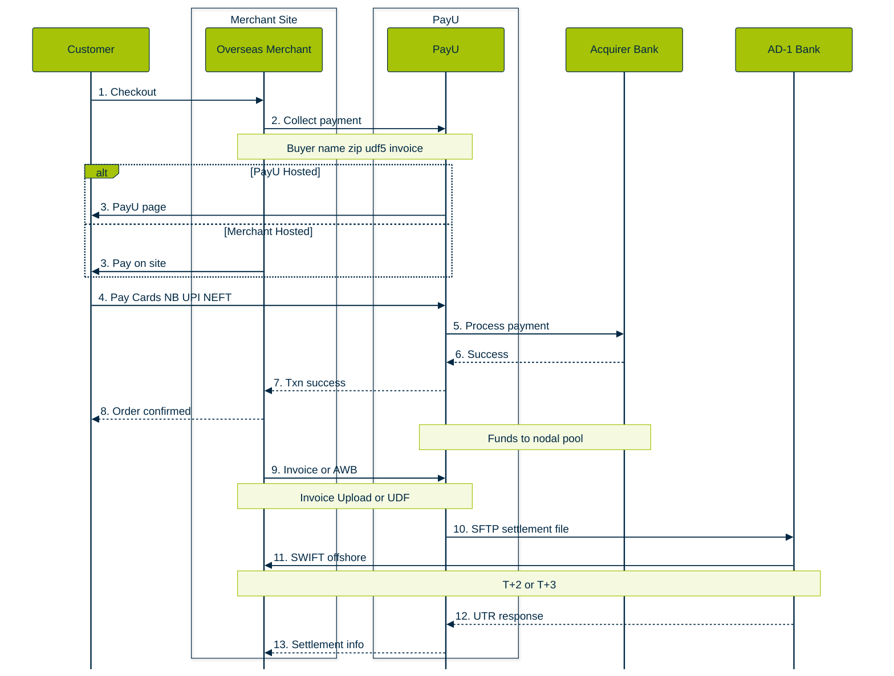
```mermaid
%%{init: {
  "theme": "base",
  "sequence": {
    "mirrorActors": false,
    "rightAngles": true,
    "messageAlign": "left",
    "fontSize": 10,
    "actorFontSize": 10,
    "noteFontSize": 10,
    "actorMargin": 78,
    "width": 172,
    "boxMargin": 8,
    "messageMargin": 34,
    "diagramMarginX": 48,
    "diagramMarginY": 16
  },
  "themeVariables": {
    "fontFamily": "Arial, Helvetica, sans-serif",
    "fontSize": "10px",
    "background": "#FFFFFF",
    "primaryColor": "#A6C307",
    "primaryTextColor": "#002843",
    "primaryBorderColor": "#002843",
    "secondaryColor": "#F4F9E0",
    "lineColor": "#002843",
    "textColor": "#002843",
    "actorBkg": "#A6C307",
    "actorBorder": "#002843",
    "actorTextColor": "#002843",
    "signalColor": "#002843",
    "noteBkgColor": "#F4F9E0",
    "noteTextColor": "#002843",
    "noteBorderColor": "#A6C307",
    "activationBkgColor": "#E8F0C4",
    "activationBorderColor": "#002843"
  }
}}%%
sequenceDiagram
    participant Customer
    box Merchant Site
        participant Merchant as Overseas Merchant
    end
    box PayU
        participant PayU
    end
    participant Acquirer as Acquirer Bank
    participant AD1 as AD-1 Bank

    Customer->>Merchant: 1. Checkout

    Merchant->>PayU: 2. Collect payment
    Note over Merchant,PayU: Buyer name zip udf5 invoice

    alt PayU Hosted
        PayU->>Customer: 3. PayU page
    else Merchant Hosted
        Merchant->>Customer: 3. Pay on site
    end

    Customer->>PayU: 4. Pay Cards NB UPI NEFT
    PayU->>Acquirer: 5. Process payment
    Acquirer-->>PayU: 6. Success

    PayU-->>Merchant: 7. Txn success
    Merchant-->>Customer: 8. Order confirmed

    Note over Acquirer,PayU: Funds to nodal pool

    Merchant->>PayU: 9. Invoice or AWB
    Note over Merchant,PayU: Invoice Upload or UDF

    PayU->>AD1: 10. SFTP settlement file
    AD1->>Merchant: 11. SWIFT offshore
    Note over AD1,Merchant: T+2 or T+3

    AD1-->>PayU: 12. UTR response
    PayU-->>Merchant: 13. Settlement info
```

### LRS customer journey (PayU Hosted)

For travel and education under the Liberalised Remittance Scheme. See [Customer Journey - PayU Hosted Checkout with LRS](https://docs.payu.in/docs/customer-journey-payu-hosted-checkout-with-lrs-integration).

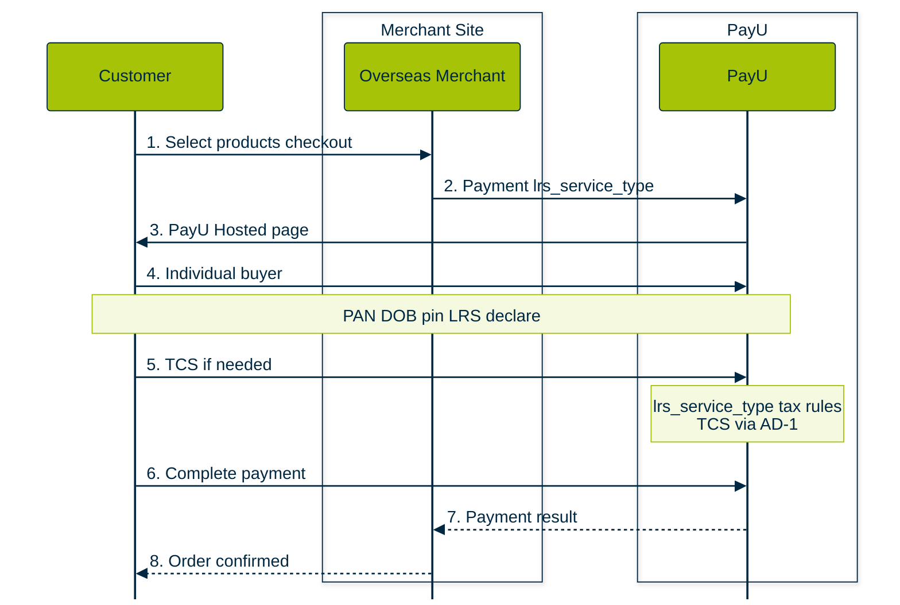
```mermaid
%%{init: {
  "theme": "base",
  "sequence": {
    "mirrorActors": false,
    "rightAngles": true,
    "messageAlign": "left",
    "fontSize": 10,
    "actorFontSize": 10,
    "noteFontSize": 10,
    "actorMargin": 82,
    "width": 168,
    "boxMargin": 8,
    "messageMargin": 32,
    "diagramMarginX": 45,
    "diagramMarginY": 16
  },
  "themeVariables": {
    "fontFamily": "Arial, Helvetica, sans-serif",
    "fontSize": "10px",
    "background": "#FFFFFF",
    "primaryColor": "#A6C307",
    "primaryTextColor": "#002843",
    "primaryBorderColor": "#002843",
    "secondaryColor": "#F4F9E0",
    "lineColor": "#002843",
    "textColor": "#002843",
    "actorBkg": "#A6C307",
    "actorBorder": "#002843",
    "actorTextColor": "#002843",
    "signalColor": "#002843",
    "noteBkgColor": "#F4F9E0",
    "noteTextColor": "#002843",
    "noteBorderColor": "#A6C307"
  }
}}%%
sequenceDiagram
    participant Customer
    box Merchant Site
        participant Merchant as Overseas Merchant
    end
    box PayU
        participant PayU
    end

    Customer->>Merchant: 1. Select products checkout
    Merchant->>PayU: 2. Payment lrs_service_type
    PayU->>Customer: 3. PayU Hosted page

    Customer->>PayU: 4. Individual buyer
    Note over Customer,PayU: PAN DOB pin LRS declare

    Customer->>PayU: 5. TCS if needed
    Note over PayU: lrs_service_type tax rules<br/>TCS via AD-1

    Customer->>PayU: 6. Complete payment
    PayU-->>Merchant: 7. Payment result
    Merchant-->>Customer: 8. Order confirmed
```

### On-hold settlement resolution

When AD-1 bank requires additional information before releasing outward settlement. See [On-Hold Settlements](https://docs.payu.in/docs/on-hold-settlements-cross-border-payments).

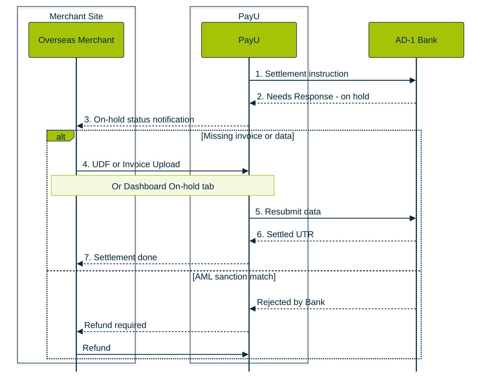
```mermaid
%%{init: {
  "theme": "base",
  "sequence": {
    "mirrorActors": false,
    "rightAngles": true,
    "messageAlign": "left",
    "fontSize": 10,
    "actorFontSize": 10,
    "noteFontSize": 10,
    "actorMargin": 92,
    "width": 175,
    "boxMargin": 8,
    "messageMargin": 34,
    "diagramMarginX": 48,
    "diagramMarginY": 16
  },
  "themeVariables": {
    "fontFamily": "Arial, Helvetica, sans-serif",
    "fontSize": "10px",
    "background": "#FFFFFF",
    "primaryColor": "#A6C307",
    "primaryTextColor": "#002843",
    "primaryBorderColor": "#002843",
    "secondaryColor": "#F4F9E0",
    "lineColor": "#002843",
    "textColor": "#002843",
    "actorBkg": "#A6C307",
    "actorBorder": "#002843",
    "actorTextColor": "#002843",
    "signalColor": "#002843",
    "noteBkgColor": "#F4F9E0",
    "noteTextColor": "#002843",
    "noteBorderColor": "#A6C307"
  }
}}%%
sequenceDiagram
    box Merchant Site
        participant Merchant as Overseas Merchant
    end
    box PayU
        participant PayU
    end
    participant AD1 as AD-1 Bank

    PayU->>AD1: 1. Settlement instruction
    AD1-->>PayU: 2. Needs Response - on hold
    PayU-->>Merchant: 3. On-hold status notification

    alt Missing invoice or data
        Merchant->>PayU: 4. UDF or Invoice Upload
        Note over Merchant,PayU: Or Dashboard On-hold tab
        PayU->>AD1: 5. Resubmit data
        AD1-->>PayU: 6. Settled UTR
        PayU-->>Merchant: 7. Settlement done
    else AML sanction match
        AD1-->>PayU: Rejected by Bank
        PayU-->>Merchant: Refund required
        Merchant->>PayU: Refund
    end
```

## Recommendation Engine Flow

Mermaid swimlane diagrams for [Recommendation Engine](https://docs.payu.in/docs/recommendation-engine), based on the intro, customer journey, and Fetch API sections.

### Checkout personalization flow

How RE personalizes payment instruments on PayU Hosted Checkout or via the Fetch API for merchant-hosted checkout.

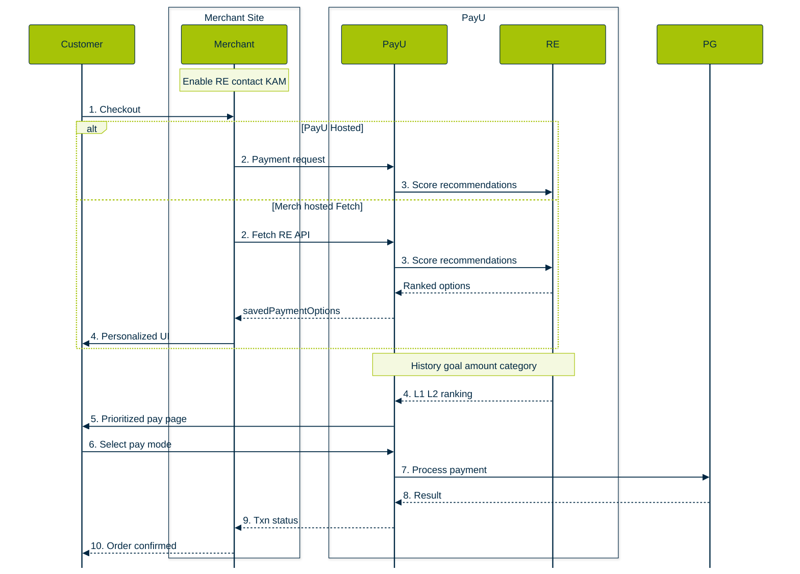
```mermaid
%%{init: {
  "theme": "base",
  "sequence": {
    "mirrorActors": false,
    "rightAngles": true,
    "messageAlign": "left",
    "fontSize": 10,
    "actorFontSize": 10,
    "noteFontSize": 10,
    "actorMargin": 72,
    "width": 175,
    "boxMargin": 8,
    "messageMargin": 34,
    "diagramMarginX": 48,
    "diagramMarginY": 16
  },
  "themeVariables": {
    "fontFamily": "Arial, Helvetica, sans-serif",
    "fontSize": "10px",
    "background": "#FFFFFF",
    "primaryColor": "#A6C307",
    "primaryTextColor": "#002843",
    "primaryBorderColor": "#002843",
    "secondaryColor": "#F4F9E0",
    "secondaryTextColor": "#002843",
    "secondaryBorderColor": "#A6C307",
    "tertiaryColor": "#002843",
    "tertiaryTextColor": "#FFFFFF",
    "lineColor": "#002843",
    "textColor": "#002843",
    "mainBkg": "#A6C307",
    "clusterBkg": "#FAFCF4",
    "clusterBorder": "#D8E8A8",
    "edgeLabelBackground": "#FFFFFF",
    "actorBkg": "#A6C307",
    "actorBorder": "#002843",
    "actorTextColor": "#002843",
    "actorLineColor": "#002843",
    "signalColor": "#002843",
    "signalTextColor": "#002843",
    "labelBoxBkgColor": "#F4F9E0",
    "labelBoxBorderColor": "#A6C307",
    "labelTextColor": "#002843",
    "noteBkgColor": "#F4F9E0",
    "noteTextColor": "#002843",
    "noteBorderColor": "#A6C307",
    "activationBkgColor": "#E8F0C4",
    "activationBorderColor": "#002843"
  }
}}%%
sequenceDiagram
    participant Customer
    box Merchant Site
        participant Merchant
    end
    box PayU
        participant PayU
        participant RE as RE
    end
    participant PG as PG

    Note over Merchant: Enable RE contact KAM

    Customer->>Merchant: 1. Checkout

    alt PayU Hosted
        Merchant->>PayU: 2. Payment request
        PayU->>RE: 3. Score recommendations
    else Merch hosted Fetch
        Merchant->>PayU: 2. Fetch RE API
        PayU->>RE: 3. Score recommendations
        RE-->>PayU: Ranked options
        PayU-->>Merchant: savedPaymentOptions
        Merchant->>Customer: 4. Personalized UI
    end

    Note over RE,PayU: History goal amount category

    RE-->>PayU: 4. L1 L2 ranking
    PayU->>Customer: 5. Prioritized pay page

    Customer->>PayU: 6. Select pay mode
    PayU->>PG: 7. Process payment
    PG-->>PayU: 8. Result

    PayU-->>Merchant: 9. Txn status
    Merchant-->>Customer: 10. Order confirmed
```

### User scenarios and merchant goals

How RE adapts recommendations based on customer type and the merchant-selected optimization goal.

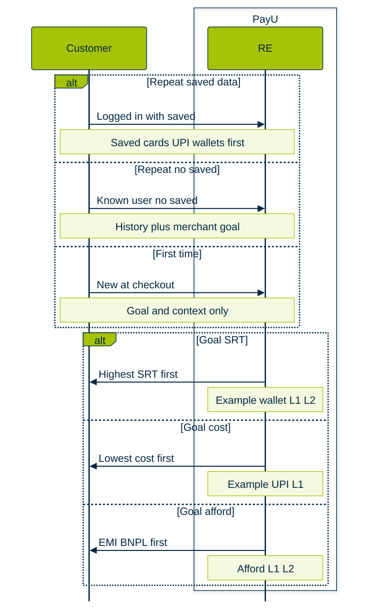
```mermaid
%%{init: {
  "theme": "base",
  "sequence": {
    "mirrorActors": false,
    "rightAngles": true,
    "messageAlign": "left",
    "fontSize": 10,
    "actorFontSize": 10,
    "noteFontSize": 10,
    "actorMargin": 88,
    "width": 175,
    "boxMargin": 8,
    "messageMargin": 34,
    "diagramMarginX": 48,
    "diagramMarginY": 16
  },
  "themeVariables": {
    "fontFamily": "Arial, Helvetica, sans-serif",
    "fontSize": "10px",
    "background": "#FFFFFF",
    "primaryColor": "#A6C307",
    "primaryTextColor": "#002843",
    "primaryBorderColor": "#002843",
    "secondaryColor": "#F4F9E0",
    "lineColor": "#002843",
    "textColor": "#002843",
    "actorBkg": "#A6C307",
    "actorBorder": "#002843",
    "actorTextColor": "#002843",
    "signalColor": "#002843",
    "noteBkgColor": "#F4F9E0",
    "noteTextColor": "#002843",
    "noteBorderColor": "#A6C307"
  }
}}%%
sequenceDiagram
    participant Customer
    box PayU
        participant RE as RE
    end

    alt Repeat saved data
        Customer->>RE: Logged in with saved
        Note over Customer,RE: Saved cards UPI wallets first
    else Repeat no saved
        Customer->>RE: Known user no saved
        Note over Customer,RE: History plus merchant goal
    else First time
        Customer->>RE: New at checkout
        Note over Customer,RE: Goal and context only
    end

    alt Goal SRT
        RE->>Customer: Highest SRT first
        Note over RE: Example wallet L1 L2
    else Goal cost
        RE->>Customer: Lowest cost first
        Note over RE: Example UPI L1
    else Goal afford
        RE->>Customer: EMI BNPL first
        Note over RE: Afford L1 L2
    end
```

### Fetch Recommendation Engine API

Server-to-server flow for merchants building a custom checkout UI. See [Fetch Recommendation Engine API](https://docs.payu.in/docs/fetch-recommendation-engine-api).

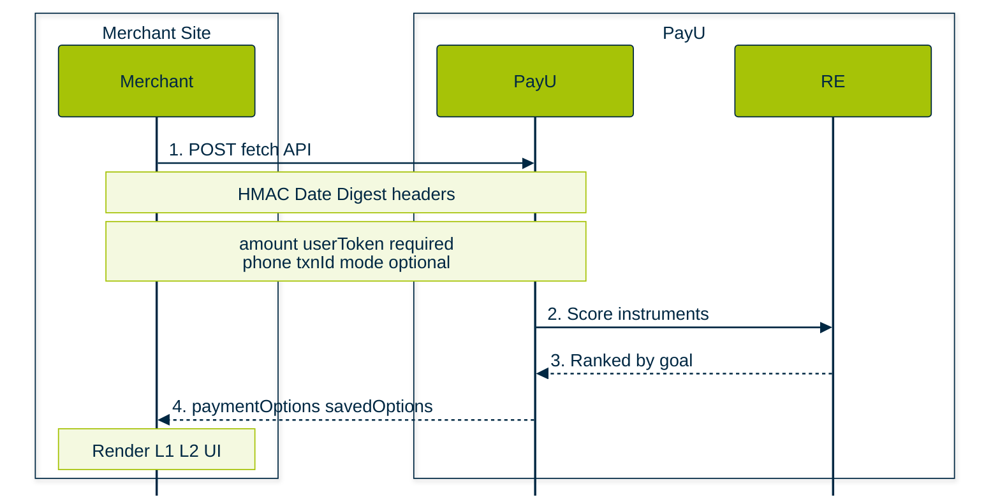
```mermaid
%%{init: {
  "theme": "base",
  "sequence": {
    "mirrorActors": false,
    "rightAngles": true,
    "messageAlign": "left",
    "fontSize": 10,
    "actorFontSize": 10,
    "noteFontSize": 10,
    "actorMargin": 92,
    "width": 178,
    "boxMargin": 8,
    "messageMargin": 34,
    "diagramMarginX": 48,
    "diagramMarginY": 16
  },
  "themeVariables": {
    "fontFamily": "Arial, Helvetica, sans-serif",
    "fontSize": "10px",
    "background": "#FFFFFF",
    "primaryColor": "#A6C307",
    "primaryTextColor": "#002843",
    "primaryBorderColor": "#002843",
    "secondaryColor": "#F4F9E0",
    "lineColor": "#002843",
    "textColor": "#002843",
    "actorBkg": "#A6C307",
    "actorBorder": "#002843",
    "actorTextColor": "#002843",
    "signalColor": "#002843",
    "noteBkgColor": "#F4F9E0",
    "noteTextColor": "#002843",
    "noteBorderColor": "#A6C307"
  }
}}%%
sequenceDiagram
    box Merchant Site
        participant Merchant
    end
    box PayU
        participant PayU
        participant RE as RE
    end

    Merchant->>PayU: 1. POST fetch API
    Note over Merchant,PayU: HMAC Date Digest headers

    Note over Merchant,PayU: amount userToken required<br/>phone txnId mode optional

    PayU->>RE: 2. Score instruments
    RE-->>PayU: 3. Ranked by goal

    PayU-->>Merchant: 4. paymentOptions savedOptions
    Note over Merchant: Render L1 L2 UI
```

## International Payments and DCC Flow

Mermaid swimlane diagrams for [International Payments](https://docs.payu.in/docs/introduction-dynamic-currency-conversion), based on the DCC/MCC workflow and hosted vs merchant-hosted integration sections.

### Dynamic Currency Conversion (DCC)

Real-time currency choice at checkout. Customer may pay in card-issuing currency or merchant order currency. Merchant settles in base currency (e.g. INR).

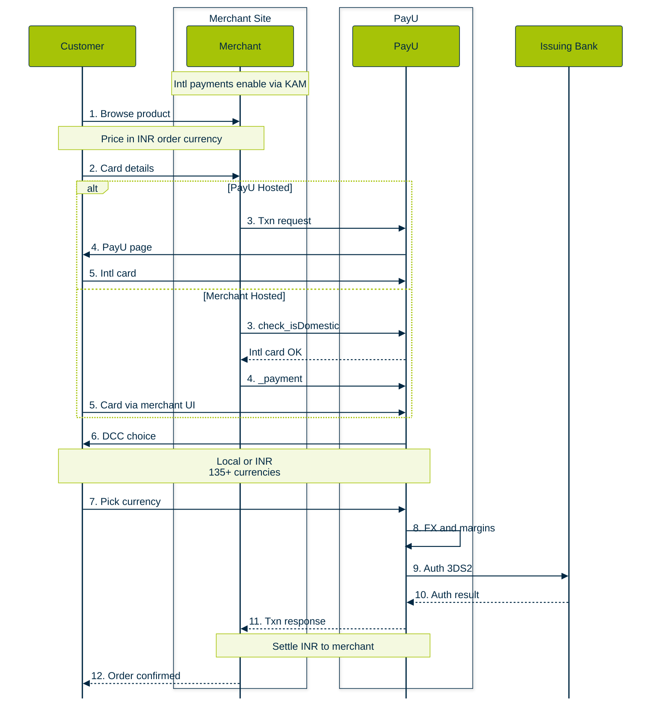
```mermaid
%%{init: {
  "theme": "base",
  "sequence": {
    "mirrorActors": false,
    "rightAngles": true,
    "messageAlign": "left",
    "fontSize": 10,
    "actorFontSize": 10,
    "noteFontSize": 10,
    "actorMargin": 76,
    "width": 170,
    "boxMargin": 8,
    "messageMargin": 34,
    "diagramMarginX": 46,
    "diagramMarginY": 16
  },
  "themeVariables": {
    "fontFamily": "Arial, Helvetica, sans-serif",
    "fontSize": "10px",
    "background": "#FFFFFF",
    "primaryColor": "#A6C307",
    "primaryTextColor": "#002843",
    "primaryBorderColor": "#002843",
    "secondaryColor": "#F4F9E0",
    "secondaryTextColor": "#002843",
    "secondaryBorderColor": "#A6C307",
    "tertiaryColor": "#002843",
    "tertiaryTextColor": "#FFFFFF",
    "lineColor": "#002843",
    "textColor": "#002843",
    "mainBkg": "#A6C307",
    "clusterBkg": "#FAFCF4",
    "clusterBorder": "#D8E8A8",
    "edgeLabelBackground": "#FFFFFF",
    "actorBkg": "#A6C307",
    "actorBorder": "#002843",
    "actorTextColor": "#002843",
    "actorLineColor": "#002843",
    "signalColor": "#002843",
    "signalTextColor": "#002843",
    "labelBoxBkgColor": "#F4F9E0",
    "labelBoxBorderColor": "#A6C307",
    "labelTextColor": "#002843",
    "noteBkgColor": "#F4F9E0",
    "noteTextColor": "#002843",
    "noteBorderColor": "#A6C307",
    "activationBkgColor": "#E8F0C4",
    "activationBorderColor": "#002843"
  }
}}%%
sequenceDiagram
    participant Customer
    box Merchant Site
        participant Merchant
    end
    box PayU
        participant PayU
    end
    participant Bank as Issuing Bank

    Note over Merchant: Intl payments enable via KAM

    Customer->>Merchant: 1. Browse product
    Note over Customer,Merchant: Price in INR order currency

    Customer->>Merchant: 2. Card details

    alt PayU Hosted
        Merchant->>PayU: 3. Txn request
        PayU->>Customer: 4. PayU page
        Customer->>PayU: 5. Intl card
    else Merchant Hosted
        Merchant->>PayU: 3. check_isDomestic
        PayU-->>Merchant: Intl card OK
        Merchant->>PayU: 4. _payment
        Customer->>PayU: 5. Card via merchant UI
    end

    PayU->>Customer: 6. DCC choice
    Note over PayU,Customer: Local or INR<br/>135+ currencies

    Customer->>PayU: 7. Pick currency
    PayU->>PayU: 8. FX and margins
    PayU->>Bank: 9. Auth 3DS2
    Bank-->>PayU: 10. Auth result

    PayU-->>Merchant: 11. Txn response
    Note over PayU,Merchant: Settle INR to merchant

    Merchant-->>Customer: 12. Order confirmed
```

### Multi-Currency Conversion (MCC)

Merchant displays prices in customer local currency upfront. Payment captured in merchant-initiated currency.

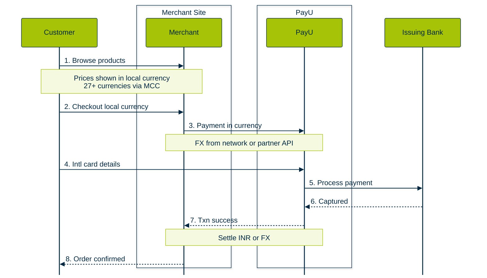
```mermaid
%%{init: {
  "theme": "base",
  "sequence": {
    "mirrorActors": false,
    "rightAngles": true,
    "messageAlign": "left",
    "fontSize": 10,
    "actorFontSize": 10,
    "noteFontSize": 10,
    "actorMargin": 82,
    "width": 170,
    "boxMargin": 8,
    "messageMargin": 34,
    "diagramMarginX": 48,
    "diagramMarginY": 16
  },
  "themeVariables": {
    "fontFamily": "Arial, Helvetica, sans-serif",
    "fontSize": "10px",
    "background": "#FFFFFF",
    "primaryColor": "#A6C307",
    "primaryTextColor": "#002843",
    "primaryBorderColor": "#002843",
    "secondaryColor": "#F4F9E0",
    "lineColor": "#002843",
    "textColor": "#002843",
    "actorBkg": "#A6C307",
    "actorBorder": "#002843",
    "actorTextColor": "#002843",
    "signalColor": "#002843",
    "noteBkgColor": "#F4F9E0",
    "noteTextColor": "#002843",
    "noteBorderColor": "#A6C307"
  }
}}%%
sequenceDiagram
    participant Customer
    box Merchant Site
        participant Merchant
    end
    box PayU
        participant PayU
    end
    participant Bank as Issuing Bank

    Customer->>Merchant: 1. Browse products
    Note over Customer,Merchant: Prices shown in local currency<br/>27+ currencies via MCC

    Customer->>Merchant: 2. Checkout local currency
    Merchant->>PayU: 3. Payment in currency
    Note over Merchant,PayU: FX from network or partner API

    Customer->>PayU: 4. Intl card details
    PayU->>Bank: 5. Process payment
    Bank-->>PayU: 6. Captured

    PayU-->>Merchant: 7. Txn success
    Note over PayU,Merchant: Settle INR or FX

    Merchant-->>Customer: 8. Order confirmed
```

### Post-payment verification and refunds

Standard verify flow applies. Refunds initiated in merchant base currency only.

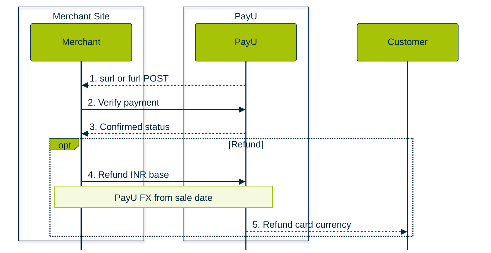
```mermaid
%%{init: {
  "theme": "base",
  "sequence": {
    "mirrorActors": false,
    "rightAngles": true,
    "messageAlign": "left",
    "fontSize": 10,
    "actorFontSize": 10,
    "noteFontSize": 10,
    "actorMargin": 92,
    "width": 175,
    "boxMargin": 8,
    "messageMargin": 34,
    "diagramMarginX": 48,
    "diagramMarginY": 16
  },
  "themeVariables": {
    "fontFamily": "Arial, Helvetica, sans-serif",
    "fontSize": "10px",
    "background": "#FFFFFF",
    "primaryColor": "#A6C307",
    "primaryTextColor": "#002843",
    "primaryBorderColor": "#002843",
    "secondaryColor": "#F4F9E0",
    "lineColor": "#002843",
    "textColor": "#002843",
    "actorBkg": "#A6C307",
    "actorBorder": "#002843",
    "actorTextColor": "#002843",
    "signalColor": "#002843",
    "noteBkgColor": "#F4F9E0",
    "noteTextColor": "#002843",
    "noteBorderColor": "#A6C307"
  }
}}%%
sequenceDiagram
    box Merchant Site
        participant Merchant
    end
    box PayU
        participant PayU
    end
    participant Customer

    PayU-->>Merchant: 1. surl or furl POST
    Merchant->>PayU: 2. Verify payment
    PayU-->>Merchant: 3. Confirmed status

    opt Refund
        Merchant->>PayU: 4. Refund INR base
        Note over Merchant,PayU: PayU FX from sale date
        PayU-->>Customer: 5. Refund card currency
    end
```
# Pluxee Card and Mutual Fund Payments Swimlanes

PayU-branded Mermaid sequence diagrams aligned with [internal-review swimlane style](../docs/RECYCLE%20BIN/internal-review-swimlane-diagrams.md). Font 10px wide actors short labels no semicolons in messages.

---

## Pluxee (Sodexo) card — merchant hosted checkout

Based on [Pluxee Card Integration](https://docs.payu.in/docs/integrate-with-merchant-hosted-checkout-for-pluxee-card) (`pg=MC`, `bankcode=SODEXO`, optional **check_balance**, **save_sodexo_card**, **source_id** repeat flow).

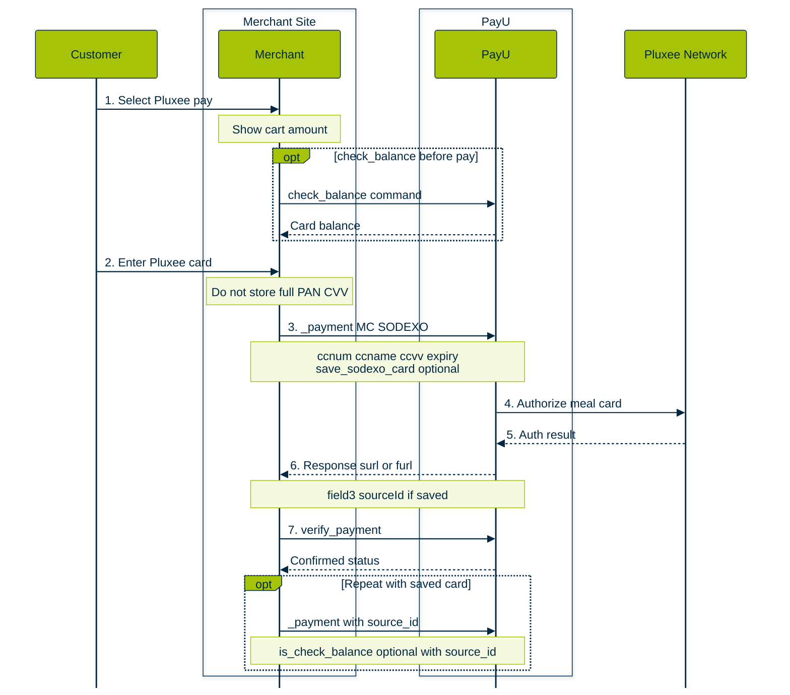
```mermaid
%%{init: {
  "theme": "base",
  "sequence": {
    "mirrorActors": false,
    "rightAngles": true,
    "messageAlign": "left",
    "fontSize": 10,
    "actorFontSize": 10,
    "noteFontSize": 10,
    "actorMargin": 78,
    "width": 165,
    "boxMargin": 8,
    "messageMargin": 34,
    "diagramMarginX": 48,
    "diagramMarginY": 16
  },
  "themeVariables": {
    "fontFamily": "Arial, Helvetica, sans-serif",
    "fontSize": "10px",
    "background": "#FFFFFF",
    "primaryColor": "#A6C307",
    "primaryTextColor": "#002843",
    "primaryBorderColor": "#002843",
    "secondaryColor": "#F4F9E0",
    "lineColor": "#002843",
    "textColor": "#002843",
    "actorBkg": "#A6C307",
    "actorBorder": "#002843",
    "actorTextColor": "#002843",
    "signalColor": "#002843",
    "noteBkgColor": "#F4F9E0",
    "noteTextColor": "#002843",
    "noteBorderColor": "#A6C307",
    "activationBkgColor": "#E8F0C4",
    "activationBorderColor": "#002843"
  }
}}%%
sequenceDiagram
    participant Customer
    box Merchant Site
        participant Merchant
    end
    box PayU
        participant PayU
    end
    participant Pluxee as Pluxee Network

    Customer->>Merchant: 1. Select Pluxee pay
    Note over Merchant: Show cart amount

    opt check_balance before pay
        Merchant->>PayU: check_balance command
        PayU-->>Merchant: Card balance
    end

    Customer->>Merchant: 2. Enter Pluxee card
    Note over Merchant: Do not store full PAN CVV

    Merchant->>PayU: 3. _payment MC SODEXO
    Note over Merchant,PayU: ccnum ccname ccvv expiry<br/>save_sodexo_card optional

    PayU->>Pluxee: 4. Authorize meal card
    Pluxee-->>PayU: 5. Auth result

    PayU-->>Merchant: 6. Response surl or furl
    Note over PayU,Merchant: field3 sourceId if saved

    Merchant->>PayU: 7. verify_payment
    PayU-->>Merchant: Confirmed status

    opt Repeat with saved card
        Merchant->>PayU: _payment with source_id
        Note over Merchant,PayU: is_check_balance optional with source_id
    end
```

---

## Mutual fund payments — high level (Wealth Tech)

From [Mutual Fund Payments](https://docs.payu.in/docs/mutual-funds-payments): SEBI-aligned flows non-seamless or seamless NB and UPI subscriptions via eNACH or UPI Autopay.

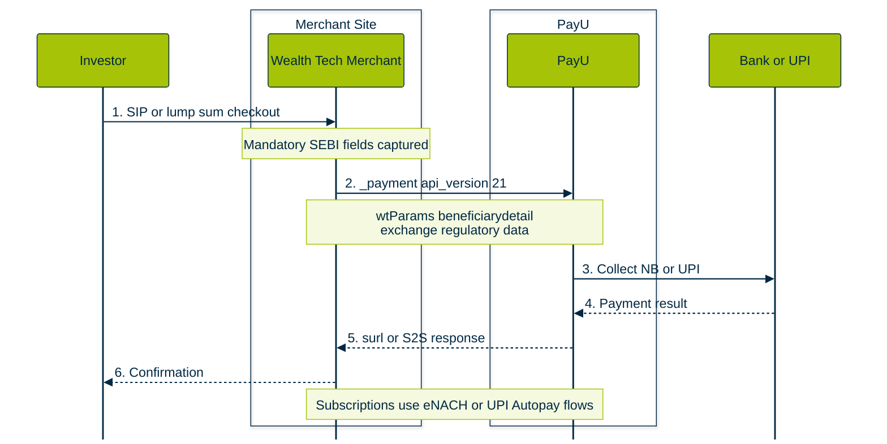
```mermaid
%%{init: {
  "theme": "base",
  "sequence": {
    "mirrorActors": false,
    "rightAngles": true,
    "messageAlign": "left",
    "fontSize": 10,
    "actorFontSize": 10,
    "noteFontSize": 10,
    "actorMargin": 72,
    "width": 160,
    "boxMargin": 8,
    "messageMargin": 32,
    "diagramMarginX": 45,
    "diagramMarginY": 16
  },
  "themeVariables": {
    "fontFamily": "Arial, Helvetica, sans-serif",
    "fontSize": "10px",
    "background": "#FFFFFF",
    "primaryColor": "#A6C307",
    "primaryTextColor": "#002843",
    "primaryBorderColor": "#002843",
    "secondaryColor": "#F4F9E0",
    "lineColor": "#002843",
    "textColor": "#002843",
    "actorBkg": "#A6C307",
    "actorBorder": "#002843",
    "actorTextColor": "#002843",
    "signalColor": "#002843",
    "noteBkgColor": "#F4F9E0",
    "noteTextColor": "#002843",
    "noteBorderColor": "#A6C307"
  }
}}%%
sequenceDiagram
    participant Investor
    box Merchant Site
        participant WT as Wealth Tech Merchant
    end
    box PayU
        participant PayU
    end
    participant Rail as Bank or UPI

    Investor->>WT: 1. SIP or lump sum checkout
    Note over WT: Mandatory SEBI fields captured

    WT->>PayU: 2. _payment api_version 21
    Note over WT,PayU: wtParams beneficiarydetail<br/>exchange regulatory data

    PayU->>Rail: 3. Collect NB or UPI
    Rail-->>PayU: 4. Payment result

    PayU-->>WT: 5. surl or S2S response
    WT-->>Investor: 6. Confirmation

    Note over WT,PayU: Subscriptions use eNACH or UPI Autopay flows
```

---

## Mutual fund payment — PayU hosted (non-seamless)

From [PayU Hosted Integration - Mutual Fund Payments](https://docs.payu.in/docs/payu-hosted-integration-mutual-funds-payment): redirect `_payment` with **products** JSON including **wtParams** and **beneficiarydetail** in hash.

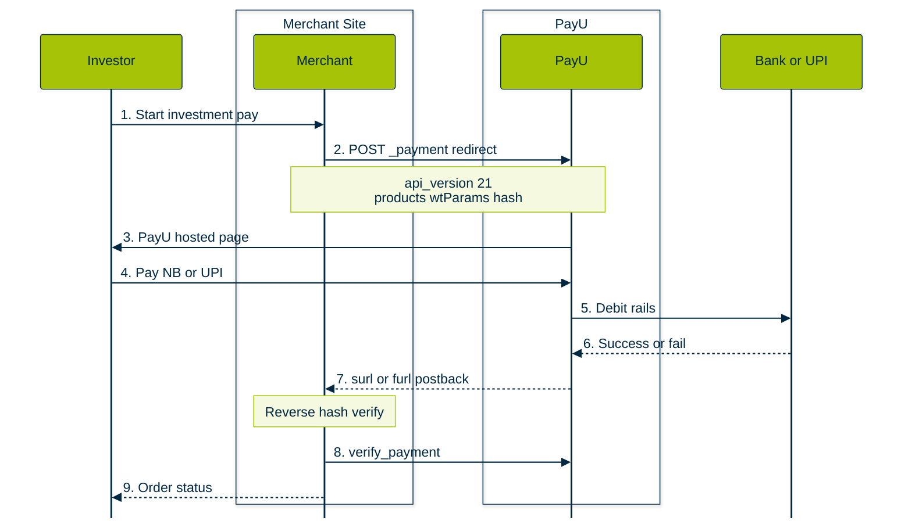
```mermaid
%%{init: {
  "theme": "base",
  "sequence": {
    "mirrorActors": false,
    "rightAngles": true,
    "messageAlign": "left",
    "fontSize": 10,
    "actorFontSize": 10,
    "noteFontSize": 10,
    "actorMargin": 80,
    "width": 168,
    "boxMargin": 8,
    "messageMargin": 34,
    "diagramMarginX": 48,
    "diagramMarginY": 16
  },
  "themeVariables": {
    "fontFamily": "Arial, Helvetica, sans-serif",
    "fontSize": "10px",
    "background": "#FFFFFF",
    "primaryColor": "#A6C307",
    "primaryTextColor": "#002843",
    "primaryBorderColor": "#002843",
    "secondaryColor": "#F4F9E0",
    "lineColor": "#002843",
    "textColor": "#002843",
    "actorBkg": "#A6C307",
    "actorBorder": "#002843",
    "actorTextColor": "#002843",
    "signalColor": "#002843",
    "noteBkgColor": "#F4F9E0",
    "noteTextColor": "#002843",
    "noteBorderColor": "#A6C307",
    "activationBkgColor": "#E8F0C4",
    "activationBorderColor": "#002843"
  }
}}%%
sequenceDiagram
    participant Investor
    box Merchant Site
        participant Merchant
    end
    box PayU
        participant PayU
    end
    participant Rail as Bank or UPI

    Investor->>Merchant: 1. Start investment pay
    Merchant->>PayU: 2. POST _payment redirect
    Note over Merchant,PayU: api_version 21<br/>products wtParams hash

    PayU->>Investor: 3. PayU hosted page
    Investor->>PayU: 4. Pay NB or UPI
    PayU->>Rail: 5. Debit rails
    Rail-->>PayU: 6. Success or fail

    PayU-->>Merchant: 7. surl or furl postback
    Note over Merchant: Reverse hash verify

    Merchant->>PayU: 8. verify_payment
    Merchant-->>Investor: 9. Order status
```

---

## Mutual fund payment — merchant hosted (seamless)

From [Merchant Hosted Integration - Mutual Fund Payments](https://docs.payu.in/docs/merchant-hosted-integration-mutual-fund-payments): **product** JSON with **wtParams** **beneficiarydetail** **pg** NB or **UPI** **bankcode**.

```mermaid
%%{init: {
  "theme": "base",
  "sequence": {
    "mirrorActors": false,
    "rightAngles": true,
    "messageAlign": "left",
    "fontSize": 10,
    "actorFontSize": 10,
    "noteFontSize": 10,
    "actorMargin": 82,
    "width": 170,
    "boxMargin": 8,
    "messageMargin": 34,
    "diagramMarginX": 48,
    "diagramMarginY": 16
  },
  "themeVariables": {
    "fontFamily": "Arial, Helvetica, sans-serif",
    "fontSize": "10px",
    "background": "#FFFFFF",
    "primaryColor": "#A6C307",
    "primaryTextColor": "#002843",
    "primaryBorderColor": "#002843",
    "secondaryColor": "#F4F9E0",
    "lineColor": "#002843",
    "textColor": "#002843",
    "actorBkg": "#A6C307",
    "actorBorder": "#002843",
    "actorTextColor": "#002843",
    "signalColor": "#002843",
    "noteBkgColor": "#F4F9E0",
    "noteTextColor": "#002843",
    "noteBorderColor": "#A6C307",
    "activationBkgColor": "#E8F0C4",
    "activationBorderColor": "#002843"
  }
}}%%
sequenceDiagram
    participant Investor
    box Merchant Site
        participant Merchant
    end
    box PayU
        participant PayU
    end
    participant Rail as Bank or UPI

    Investor->>Merchant: 1. Enter pay details on site
    Merchant->>PayU: 2. _payment seamless
    Note over Merchant,PayU: pg NB or UPI<br/>product wtParams beneficiarydetail

    PayU->>Rail: 3. Process payment
    Rail-->>PayU: 4. Result

    PayU-->>Merchant: 5. Response hash
    Merchant->>Merchant: 6. Reverse hash check

    Merchant->>PayU: 7. verify_payment
    Merchant-->>Investor: 8. SIP or purchase status
```

---

## Mutual fund SIP — eNACH subscription

From [ENACH Integration - Mutual Funds](https://docs.payu.in/docs/enach-mutual-fund-payments-integration): consent with **si=1** **si_details** **pg=ENACH** **products** wtParams then recurring server calls.

```mermaid
%%{init: {
  "theme": "base",
  "sequence": {
    "mirrorActors": false,
    "rightAngles": true,
    "messageAlign": "left",
    "fontSize": 10,
    "actorFontSize": 10,
    "noteFontSize": 10,
    "actorMargin": 78,
    "width": 165,
    "boxMargin": 8,
    "messageMargin": 34,
    "diagramMarginX": 46,
    "diagramMarginY": 16
  },
  "themeVariables": {
    "fontFamily": "Arial, Helvetica, sans-serif",
    "fontSize": "10px",
    "background": "#FFFFFF",
    "primaryColor": "#A6C307",
    "primaryTextColor": "#002843",
    "primaryBorderColor": "#002843",
    "secondaryColor": "#F4F9E0",
    "lineColor": "#002843",
    "textColor": "#002843",
    "actorBkg": "#A6C307",
    "actorBorder": "#002843",
    "actorTextColor": "#002843",
    "signalColor": "#002843",
    "noteBkgColor": "#F4F9E0",
    "noteTextColor": "#002843",
    "noteBorderColor": "#A6C307",
    "activationBkgColor": "#E8F0C4",
    "activationBorderColor": "#002843"
  }
}}%%
sequenceDiagram
    participant Investor
    box Merchant Site
        participant Merchant
    end
    box PayU
        participant PayU
    end
    participant Bank as Sponsor Bank

    Investor->>Merchant: 1. Register SIP eNACH
    Merchant->>PayU: 2. Consent _payment
    Note over Merchant,PayU: si 1 si_details ENACH<br/>products wtParams txn_s2s_flow 4

    PayU->>Bank: 3. Mandate registration
    Bank-->>PayU: 4. Mandate status
    PayU-->>Merchant: 5. Consent response
    Merchant->>PayU: 6. Verify registration

    loop Recurring debit
        Merchant->>PayU: 7. Recurring charge API
        Note over Merchant,PayU: authpayuid invoiceDisplayNumber
        PayU->>Bank: 8. Presentment
        Bank-->>PayU: 9. Debit result
        PayU-->>Merchant: 10. Charge status
    end
```

---

## Mutual fund SIP — UPI Autopay

From [UPI Autopay Integration - Mutual Funds](https://docs.payu.in/docs/upi-autopay-integration-mutual-fund-payments): consent **pg** UPI **bankcode** INTTPV **si** **si_details** **products** wtParams then pre-debit and recurring steps per doc.

```mermaid
%%{init: {
  "theme": "base",
  "sequence": {
    "mirrorActors": false,
    "rightAngles": true,
    "messageAlign": "left",
    "fontSize": 10,
    "actorFontSize": 10,
    "noteFontSize": 10,
    "actorMargin": 78,
    "width": 165,
    "boxMargin": 8,
    "messageMargin": 34,
    "diagramMarginX": 46,
    "diagramMarginY": 16
  },
  "themeVariables": {
    "fontFamily": "Arial, Helvetica, sans-serif",
    "fontSize": "10px",
    "background": "#FFFFFF",
    "primaryColor": "#A6C307",
    "primaryTextColor": "#002843",
    "primaryBorderColor": "#002843",
    "secondaryColor": "#F4F9E0",
    "lineColor": "#002843",
    "textColor": "#002843",
    "actorBkg": "#A6C307",
    "actorBorder": "#002843",
    "actorTextColor": "#002843",
    "signalColor": "#002843",
    "noteBkgColor": "#F4F9E0",
    "noteTextColor": "#002843",
    "noteBorderColor": "#A6C307",
    "activationBkgColor": "#E8F0C4",
    "activationBorderColor": "#002843"
  }
}}%%
sequenceDiagram
    participant Investor
    box Merchant Site
        participant Merchant
    end
    box PayU
        participant PayU
    end
    participant NPCI as UPI Rails

    Investor->>Merchant: 1. UPI Autopay consent
    Merchant->>PayU: 2. Consent _payment
    Note over Merchant,PayU: pg UPI bankcode INTTPV<br/>si si_details products wtParams

    PayU->>NPCI: 3. Mandate setup
    NPCI-->>PayU: 4. Consent outcome
    PayU-->>Merchant: 5. Response
    Merchant->>PayU: 6. Verify consent

    Merchant->>PayU: 7. Pre-debit notification
    PayU-->>Merchant: 8. PDN ack

    loop Recurring debit
        Merchant->>PayU: 9. Recurring debit call
        PayU->>NPCI: 10. Present to UPI
        NPCI-->>PayU: 11. Debit status
        PayU-->>Merchant: 12. Result
    end
```

---

