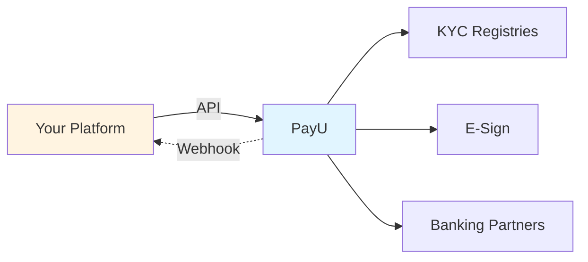

---
title: Partner Integration
excerpt: >-
  Onboard merchants, collect payments, and manage refunds from your platform
  using referral links, Partner Portal, Co-Branded OAuth, or full API integration.
deprecated: false
hidden: false
metadata:
  title: PayU Partner Integration Overview
  description: >-
    How partner integration works with PayU: KYC, webhooks, and choosing between
    referral link, Partner Portal, Co-Branded OAuth, and API paths.
  keywords:
    - PayU partner integration
    - merchant onboarding partner
    - PayU reseller API
  robots: index
---

A partner is a person you refer to PayU and earn incentives. The partner can be resellers or franchisees who can earn incentives for being associated with your business by referral or being part of your platform by offering PayU Payment Platform to the referrals.

PayU Partner Program is a way to grow your business exponentially, raising your profits. PayU’s reliable and secure payment solutions help you with the best customer service efforts. Connect your merchants with PayU with our easy and simple integration methods. By joining this program, you can focus more on business goals to enrich the product experiences and less on maintaining payment systems. To get started, you need to register as a merchant with PayU. For more information, refer to [Register a Partner Account](doc:register-a-partner-account).

Onboard merchants, collect payments, and manage refunds — all from your own platform.

## Advantages

* Quick and easy integration
* Refer merchants and get rewarded
* Easy Account reconciliation
* Real-time merchant onboarding status updates
* Onboard merchants quickly using Partner Partner Integration APIs
* Onboard merchants and validate KYC automatically on the Partner Portal
* Customize Partner Portal with OAuth and onboard merchants with a branded portal.

## Who can become a partner?

PayU welcomes any small- or large-scale enterprise into their partner program. The following list demonstrates LOBs that have partnered with PayU:

* Web Designers and Developers
* Digital Service Providers
* Web Hosting Services
* Freelancers & Small-scale Businesses
* Accelerator Firms
* E-commerce Businesses

## Types of partner

* **Platform Partner**: Companies who are providing ready-to-use eCommerce websites, software solutions for retailers, and accountants, or restaurants, partnering with PayU helps you create new revenue streams and scale internationally. For example, Shopify, Zoho, ClearTax, etc.
* **Resellers:** Resellers are freelancers/entrepreneurs looking to accelerate their business by earning incentives through their clients.

After you onboard the merchants, they can start collecting payments from their customers. For more information, refer to [Web Integration](doc:introduction-web).

## How it works

You integrate with PayU as a partner to bring merchants onto our payment platform. Depending on your needs, you can share a simple referral link or run the entire onboarding journey through APIs.

PayU handles verification (KYC, CKYC, VKYC), compliance, and activation. You collect merchant details, call our APIs, and receive status updates via webhooks.

## Choose your integration

|                                     | Referral Link        | Partner Portal    | Co-Branded OAuth   | API             |
| ----------------------------------- | -------------------- | ----------------- | ------------------ | --------------- |
| **You build UI**                    | No                   | No                | No                 | Yes             |
| **Brand control**                   | None                 | None              | Your logo + colors | Full            |
| **Technical effort**                | None                 | None              | Low                | High            |
| **Merchant stays on your platform** | No                   | No                | No                 | Yes             |
| **Best for**                        | Individual resellers | Manual onboarding | Mid-size platforms | Large platforms |

If you need merchants to stay in your platform with an end-to-end controlled experience, use **API integration**. For a quick start with your branding, use **Co-Branded OAuth**.

## Next Steps

In this part of the document, the following sections provide the steps to integrate using various integration methods:

* [Quick start — five API calls](doc:quick-start-partner-integration)
* [Integration paths](doc:referral-link) (referral link, portal, OAuth, API)
* [API reference](doc:partner-api-authentication) (auth, onboarding, KYC, payments, webhooks)
* [Errors and troubleshooting](doc:errors-partner-integration)
* [Testing and go-live](doc:testing-go-live-partner-integration)
* [Endpoint reference](doc:endpoint-reference)
