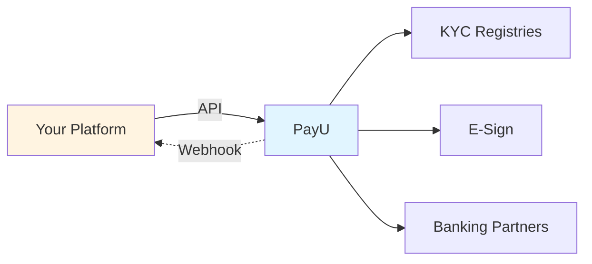

---
title: Partner Integration
excerpt: >-
  Onboard merchants, collect payments, and manage refunds from your platform
  using referral links, Partner Portal, Co-Branded OAuth, or full API integration.
deprecated: false
hidden: false
metadata:
  title: PayU Partner Integration Overview
  description: >-
    How partner integration works with PayU: KYC, webhooks, and choosing between
    referral link, Partner Portal, Co-Branded OAuth, and API paths.
  keywords:
    - PayU partner integration
    - merchant onboarding partner
    - PayU reseller API
  robots: index
---

Onboard merchants, collect payments, and manage refunds — all from your own platform.

## How it works

You integrate with PayU as a partner to bring merchants onto our payment platform. Depending on your needs, you can share a simple referral link or run the entire onboarding journey through APIs.

PayU handles verification (KYC, CKYC, VKYC), compliance, and activation. You collect merchant details, call our APIs, and receive status updates via webhooks.

## Choose your integration

|                                     | Referral Link        | Partner Portal    | Co-Branded OAuth   | API             |
| ----------------------------------- | -------------------- | ----------------- | ------------------ | --------------- |
| **You build UI**                    | No                   | No                | No                 | Yes             |
| **Brand control**                   | None                 | None              | Your logo + colors | Full            |
| **Technical effort**                | None                 | None              | Low                | High            |
| **Merchant stays on your platform** | No                   | No                | No                 | Yes             |
| **Best for**                        | Individual resellers | Manual onboarding | Mid-size platforms | Large platforms |

If you need merchants to stay in your platform with an end-to-end controlled experience, use **API integration**. For a quick start with your branding, use **Co-Branded OAuth**.

## In this section

* [Quick start — five API calls](doc:quick-start-partner-integration)
* [Integration paths](doc:referral-link) (referral link, portal, OAuth, API)
* [API reference](doc:partner-api-authentication) (auth, onboarding, KYC, payments, webhooks)
* [Errors and troubleshooting](doc:errors-partner-integration)
* [Testing and go-live](doc:testing-go-live-partner-integration)
* [Endpoint reference](doc:endpoint-reference)
