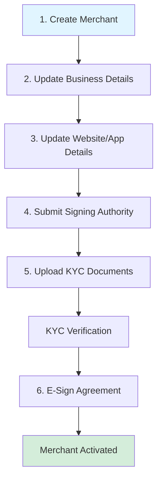

---
title: Quick start (Partner API)
excerpt: >-
  Minimal sequence to create a merchant, add PAN and bank details, trigger CKYC,
  upload KYC documents, and initialize e-sign.
deprecated: false
hidden: false
metadata:
  title: PayU Partner Integration Quick Start
  description: >-
    Five core API calls to get a merchant through onboarding: create merchant,
    update details, CKYC OTP, document upload, e-sign initialize.
  keywords:
    - PayU partner quick start
    - merchant onboarding API
  robots: index
---

Get a merchant onboarded with a small set of API calls: create merchant, update PAN/bank/business, CKYC OTP, upload KYC documents, initialize e-sign.

## Onboarding flow

## Steps to integrate

The followings steps will include the env, sample request and response in accordion.

Step 1. Create Merchant (Name, Email, Phone, PAN)
Step 2. Update Merchant Details (Business Info)
Step 3. Update Website/App Details
Step 4. Submit Signing Authority Details
Step 5. Upload KYC Documents
Step 6. Request E-Sign Agreement
