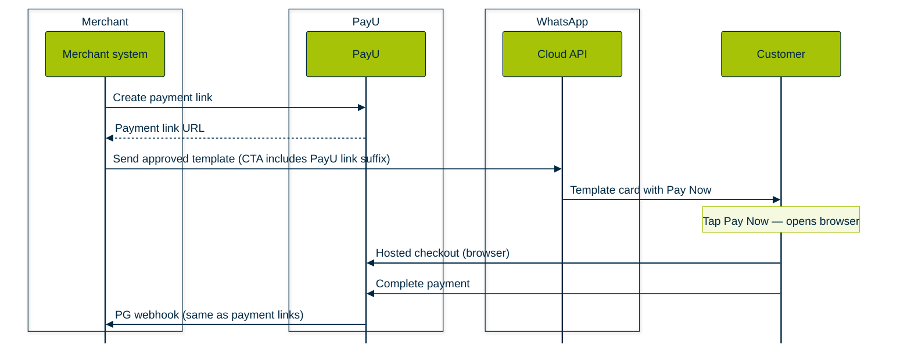

PayU supports multiple ways to accept payments on WhatsApp in partnership with Meta. Merchants integrate with PayU; PayU handles the Meta side—you do not need a separate commercial or technical integration with Meta for these flows.

**Enhanced Payment Links (EPL)** is the simplest option: you send an approved WhatsApp **template** message with a **Pay Now** call-to-action, the customer taps it, and completes payment on PayU’s **hosted checkout** in the browser (outside WhatsApp). If you already use PayU **payment links**, link generation and **webhooks** work the same as today.

 

<Cards>
  <Card title="Overview" href="#overview" icon="fa-info-circle">
    What EPL is and how it fits alongside other WhatsApp payment options.
  </Card>

  <Card title="How the payment flow works" href="#how-the-payment-flow-works" icon="fa-route">
    End-to-end steps from link creation to webhook notification.
  </Card>

  <Card title="Benefits and fit" href="#benefits-for-your-business" icon="fa-briefcase">
    Why EPL is often the best starting point and typical industries.
  </Card>

  <Card title="Requirements to go live" href="#requirements-to-go-live-on-epl" icon="fa-list-check">
    WABA, template approval, allowlisting, and PayU account needs.
  </Card>

  <Card title="Compare WhatsApp payment options" href="#compare-whatsapp-payment-options" icon="fa-table">
    EPL vs UPI Intent vs PG Deep Integration at a glance.
  </Card>

  <Card title="Go-live checklist" href="#go-live-checklist" icon="fa-clipboard-check">
    Checklist before you take EPL live.
  </Card>
</Cards>

EPL uses Meta’s **Enhanced Payment Links** pattern: PayU generates a **payment link** for the order, your system sends a WhatsApp **Cloud API** template whose CTA URL carries the PayU link (with the **PayU-specific URL suffix** Meta requires), WhatsApp shows an enhanced card with **Pay Now**, and the customer pays on PayU checkout using **UPI, cards, net banking, wallets, EMI**, and other methods your PayU setup supports.

Meta defines three WhatsApp commerce payment flavours; EPL sits at the **lowest complexity** end (typically **1–2 weeks** to go live), with **no** PG-to-WhatsApp **OAuth** linking in Business Manager.

|                                | EPL                                                | UPI Intent                            | PG Deep Integration                      |
| :----------------------------- | :------------------------------------------------- | :------------------------------------ | :--------------------------------------- |
| **Complexity**                 | Low                                                | Medium                                | High                                     |
| **Typical engineering effort** | 1–2 weeks                                          | 4–5 weeks                             | 8–12 weeks                               |
| **Payment methods**            | All (UPI, cards, net banking, wallets, EMI)        | UPI-primary (others extendable)       | UPI, cards, net banking, wallets         |
| **Payment inside WhatsApp?**   | No — opens PG checkout in browser                  | Partial — UPI apps open from WhatsApp | Yes — native in-chat checkout            |
| **Best for**                   | Collections, insurance, lending, EMI, fast go-live | Bill pay, utilities, BBPS, government | E-commerce, travel, quick commerce, food |

***

## How the payment flow works

1. Your backend calls PayU to **generate a payment link** (same as existing payment-link flows).
2. Your backend calls the **WhatsApp Cloud API** with an **approved template**; the template’s CTA includes the PayU link URL pattern Meta expects.
3. The customer sees the template card in WhatsApp and taps **Pay Now**.
4. The **browser** opens PayU **hosted checkout**; the customer pays with any supported method.
5. PayU processes the payment and sends your existing **PG webhook** (same payload and reconciliation patterns as today).

The following **sequence diagram** matches the steps above (same styling as other PayU Developer Guide sequence diagrams such as the refunds workflow).

## Customer journey

### Payment Experience with UPI URL​

In a live integration, your backend creates the **UPI Intent** via PayU and sends `POST /messages` with `type: order_details` and `payment_type: "upi"` (per your programme spec). The customer-facing steps below mirror what the **training deck** illustrates on slide **12**.

<Accordion title="Step 1: Choose payment path and receive the order card" icon="fa-comments">
  In the chat, the business asks how the customer wants to pay (for example **Pay with UPI** vs **Other payment option**). After the customer selects **Pay with UPI**, the business sends an **order-style message**: order reference, line item (for example **Electricity bill**), amount, short narrative, and actions such as **Review and pay** and **Pay now**.

</Accordion>

<Accordion title="Step 2: Review native order details (pending)" icon="fa-file-invoice">
  The customer opens the **Order details** view (native screen in the training flow): merchant branding, **ORDER** reference, **Order pending** state, line items and pricing (including any discount), **Total**, and **Continue** to move toward payment.

</Accordion>

<Accordion title="Step 3: Choose UPI payment method" icon="fa-list">
  The **Choose payment method** sheet lists **Pay on WhatsApp** (linked bank as **Default**), options to **Add payment method** or **View account balance**, and **Pay on other UPI app** (for example **Google Pay**, **PhonePe**, **More UPI apps**). The customer selects an option and taps **Continue** (**POWERED BY UPI**).

</Accordion>

<Accordion title="Step 4: In-chat payment confirmation" icon="fa-circle-check">
  In the thread, the customer sees the **order summary** alongside a **completed payment** bubble (amount, **Sent to** the business, **Completed** with read receipts). This corresponds to a successful **UPI** authorisation after the customer confirms on their bank or TPAP flow (not every sub-step is shown in the training stills).

</Accordion>

<Accordion title="Step 5: Receipt and order complete" icon="fa-receipt">
  The business sends a closing message: **Order complete**, paid line item, and a **receipt** (or reference) number for the customer’s records. Your systems should already have received the **PayU PG webhook** for reconciliation.

</Accordion>

<Image src="https://files.readme.io/fa4790a59dc7d1a9722c2970ee10a68d5ad6eb1b1cdb7fdb558a05ac51b43e97-payment-experience-upi-url.gif" align="left" width="350px" border={true} />

 

### Payment Experience with EPL flow​

<Accordion title="Step 1: Payment request appears in the chat" icon="fa-comment-dollar">
  The business sends an approved **template** message. The customer sees a **structured payment card**: amount (for example **₹100.00**), short instructions (“Please make the payment…”), optional **Pay with** hints (card brands), and a primary **Pay now** CTA on the card.
</Accordion>

<Accordion title="Step 2: Customer taps Pay now" icon="fa-hand-pointer">
  Tapping **Pay now** follows the **dynamic URL** on the CTA (your PayU payment link with the Meta-required suffix). WhatsApp then opens the **next payment UI**—in the training asset this is a **bottom sheet**; in other setups it can be **PayU checkout** in the in-app browser.

  There is no separate still between frames **01** and **02**; the animated GIF under [Assets and publishing](#assets-and-publishing) shows the transition.
</Accordion>

<Accordion title="Step 3: Choose payment method" icon="fa-list">
  The customer sees **Choose payment method** (sheet header with close **X**). Typical options in the training UI:

  * **Pay on WhatsApp** — linked bank account (for example **ICICI Bank ••1234**) as **Default**, plus links to view balance or **Add payment method**.
  * **More payment methods** — **Google Pay**, **PhonePe**, **More UPI apps**, and **Other payment methods** (debit card, net banking, and more).

  The customer selects an option and taps **Continue** (green). Footer shows **POWERED BY UPI**.

</Accordion>

<Accordion title="Step 4: Review and confirm payment" icon="fa-circle-check">
  The sheet moves to **Confirm payment** (back arrow to change method). The customer checks:

  * **Payee** — business name / logo and payee identifier (in the demo, a **UPI ID** such as `merchant@wabank`).
  * **Pay from** — selected bank or instrument (for example **ICICI Bank ••5256**, **Default**).
  * **Total** — e.g. **₹100.00**.

  When satisfied, the customer taps **Send payment** (green).

</Accordion>

<Accordion title="Step 5: Authenticate" icon="fa-key">
  For the **UPI on WhatsApp** path shown in the training capture, the bank/UPI step shows **ENTER UPI PIN**, amount and merchant name, numeric keypad, and submit (**checkmark**). For **card / net banking** (if the customer chose **Other payment methods** earlier), authentication is **OTP** or the bank’s page instead—those paths are not shown in these stills.

</Accordion>

<Accordion title="Step 6: Success in chat and webhook to merchant" icon="fa-check-double">
  The conversation updates with a **completed payment** line (green outbound bubble: amount, **Send to** merchant, **Completed** with read receipts). The payment card in-thread may show a post-pay state (for example **View details**). Your **PayU PG webhook** fires on success with the same contract as for standard **payment links** (no separate EPL webhook type).
</Accordion>

 

***
### P2M / PG Deep Integration on WhatsApp Flow

<Accordion title="Step 1: Business sends catalogue or order in WhatsApp" icon="fa-store">
  The merchant (or automation) sends a **structured order or catalogue** message in the conversation—line items, amounts, and context the customer needs before paying. This is typically an **`order_details`**-style interactive message initiated over the **WhatsApp Cloud API** once your PG and Meta **payment_configuration** are in place.
</Accordion>

<Accordion title="Step 2: Customer taps Review & Pay in the chat" icon="fa-hand-pointer">
  From the order bubble or card, the customer taps **Review & Pay** (or the equivalent CTA Meta renders for your template). The UI stays **inside WhatsApp**; there is no hand-off to an external merchant web checkout for the core native flow.
</Accordion>

<Accordion title="Step 3: Native payment sheet opens" icon="fa-credit-card">
  WhatsApp opens the **native payment sheet** so the customer can choose **UPI** (including linked bank / TPAP where offered), **cards**, **net banking**, **wallets**, and **EMI** when your programme supports it. Everything in this step remains in the **in-chat / Meta-native** payment experience described in the training deck.
</Accordion>

<Accordion title="Step 4: Customer completes payment without leaving WhatsApp" icon="fa-lock">
  The customer enters **OTP**, **UPI PIN**, or other authentication required by the selected method. Authorisation completes **without leaving WhatsApp** for the native P2M path (contrast with **EPL**, where checkout opens in a browser, and contrast with **UPI Intent**–only flows that lean on UPI apps).
</Accordion>

<Accordion title="Step 5: Instant confirmation and order update in the chat" icon="fa-check-double">
  On success, the customer sees **payment confirmation** and **order status** updates in the same thread (for example paid / processing / complete, depending on your implementation). Your backend should consume **WhatsApp payment / order webhooks** where configured, **and** continue to handle the **PayU PG webhook** for reconciliation—**PG Deep Integration** uses **both** channels versus EPL or UPI Intent alone.
</Accordion>

<Image src="https://files.readme.io/c5e2f5a86bc6fa4daf9e70becb83d20761dcf8da94e0c2510e9888c9e4788961-payment-experience-p2m-flow-lite.gif" align="left" width="300px" />

## Benefits for your business

\- **Minimal backend change** if you already use PayU payment links—reuse link APIs and webhooks.
\- **No OAuth linking** of your PayU account inside WhatsApp Business Manager for EPL.
\- **Full checkout breadth** on PayU hosted pages (EMI, auto-debit, etc.), not limited to in-chat UPI-only flows.
\- **Fastest path to WhatsApp collections** compared with deeper native integrations.

Real-world examples cited in product materials include **PolicyBazaar** (reported **17%** conversion uplift after EPL) and **Piramal Finance** for recurring EMI collection via links.

### When you must use EPL?

\- Insurance — premium renewals and policyholder collections.
\- Lending / NBFCs — EMI and recurring collection links.
\- Bulk **collections and reminders** with a pay link in each template message.
\- Merchants who already run **PayU payment links** and want WhatsApp as an additional channel.
\- Teams that need **go-live in roughly 1–2 weeks** (often dominated by **Meta template approval**, typically **3–7 business days**).

### When to consider another flavour instead?

\- You need the customer to **stay inside WhatsApp** for the full payment UX → look at **PG Deep Integration** (or **UPI Intent** if UPI-only is acceptable).
\- You need **rich multi-line-item orders** and real-time **order status** purely in chat (for example food delivery) → **PG Deep Integration** is usually more appropriate.

***

## Prerequisites to go live on EPL

| Requirement                          | Detail                                                                                                                      |
| :----------------------------------- | :-------------------------------------------------------------------------------------------------------------------------- |
| **WhatsApp Business Account (WABA)** | **Enterprise** WABA, **verified** with Meta.                                                                                |
| **Approved message template**        | Template with a **CTA button**; URL must follow Meta’s **PayU-specific link suffix** rules. Submitted and approved by Meta. |
| **PayU account**                     | Standard PayU merchant account. (Razorpay and Cashfree are also supported in EPL programmes where applicable.)              |
| **EPL allowlisting**                 | WABA must be added to Meta’s **EPL gating (GK) biglist**—PayU or your **BSP** drives this.                                  |
| **OAuth to link PG in WA**           | **Not required** for EPL.                                                                                                   |
| **Webhooks**                         | Keep your **existing PayU webhook**; no new WhatsApp payment webhook is required for EPL.                                   |

\> 👍 Contact PayU KAM
\>
\> For **WABA verification**, **template submission**, **EPL allowlisting**, and **commercial enablement**, work with your **PayU Key Account Manager (KAM)** or your **BSP** so the correct Meta and PayU steps complete in order.

***

## Comparison of WhatsApp payment options

| Dimension                                | EPL                    | UPI Intent                          | PG Deep Integration                                                        |
| :--------------------------------------- | :--------------------- | :---------------------------------- | :------------------------------------------------------------------------- |
| **What you send**                        | Template + CTA URL     | `order_details` interactive message | `order_details` interactive message                                        |
| **Meta template required**               | Yes                    | No                                  | No                                                                         |
| **PG–WhatsApp OAuth**                    | No                     | No                                  | Yes                                                                        |
| `payment_configuration`**&#x20;in Meta** | No                     | No                                  | Yes                                                                        |
| **EPL GK biglist**                       | Yes                    | No                                  | No                                                                         |
| **Webhook changes**                      | None (same PG webhook) | None (same PG webhook)              | Yes — add **WhatsApp payment status** webhooks; reconcile with PG webhooks |
| **In-chat order management**             | No                     | No                                  | Full (`order_status`, payment lookup APIs)                                 |
| **Customer leaves WhatsApp?**            | Yes (browser checkout) | Partial (UPI app)                   | No                                                                         |

PayU is supported across **all three** solutions, so many merchants can start with **EPL** and later add **UPI Intent** or **PG Deep Integration** without changing payment gateway.

***

## Go-live checklist

\- \[ ] **Enterprise WABA** verified.
\- \[ ] **Active PayU** (or supported PG) merchant account.
\- \[ ] **Template** submitted with PayU CTA URL pattern; **approved** by Meta (often 3–7 business days).
\- \[ ] WABA on **EPL GK biglist** (PayU / BSP).
\- \[ ] Integration to **send the template** via WhatsApp Cloud API with the payment link.
\- \[ ] **Payment link** generation already in use (or implemented)—no EPL-specific change to PayU link APIs.
\- \[ ] **Existing PayU webhook** configured—unchanged for EPL.
\- \[ ] **End-to-end** test in sandbox / pilot.

**Typical timeline:** about **1–2 weeks**, often driven by template approval.

***

\> 📘 **PayU recommends**
\>
\> - Treat EPL as the **default first step** for **link-based collections** and teams new to WhatsApp payments.
\> - Keep using the [API Reference](ref:introduction-api-reference) for exact PayU request fields alongside this product overview.
\> - Confirm **pricing and commercials** with your **PayU Key Account Manager (KAM)**; they are not covered in this technical overview.

***

##

 