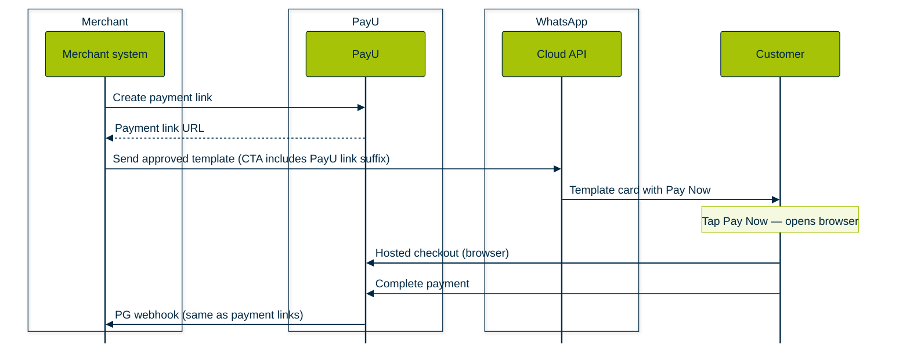

PayU supports multiple ways to accept payments on WhatsApp in partnership with Meta. Merchants integrate with PayU; PayU handles the Meta side—you do not need a separate commercial or technical integration with Meta for these flows.

**Enhanced Payment Links (EPL)** is the simplest option: you send an approved WhatsApp **template** message with a **Pay Now** call-to-action, the customer taps it, and completes payment on PayU’s **Hosted Checkout** page on the browser (outside WhatsApp) and on WhatsApp app itself for UPI payments. If you already use PayU **payment links**, link generation and **webhooks** work the same as today. For more information, refer to [Payment Links.](doc:payment-links-dashboard)

<Callout icon="📘" theme="info">
  ### Prerequisites for integration

  After you ensure that the list of items listed under [Prerequisites to go live on EPL,](#prerequisites-to-go-live-on-epl) the integration with PayU is complete and not other steps are required.&#x20;
</Callout>

 

<Cards>
  <Card title="Overview" href="#overview" icon="fa-info-circle">
    What EPL is and how it fits alongside other WhatsApp payment options.
  </Card>

  <Card title="Prerequisites to go live" href="#prerequisites-to-go-live-on-epl" icon="fa-list-check">
    WABA, template approval, allowlisting, and PayU account needs.
  </Card>

  <Card title="How commerce works on WhatsApp" href="#how-commerce-works-on-whatsapp" icon="fa-store">
    Catalog, cart, identity, address, and order placement before payment.
  </Card>

  <Card title="How the payment flow works" href="#how-the-payment-flow-works" icon="fa-route">
    End-to-end EPL steps from link creation to webhook notification.
  </Card>

  <Card title="Customer journey" href="#customer-journey" icon="fa-info-list">
    In-chat payment experience with accordions and training visuals.
  </Card>

  <Card title="Benefits and fit" href="#benefits-for-your-business" icon="fa-briefcase">
    Why EPL is often the best starting point and typical industries.
  </Card>
</Cards>

## Overview

EPL uses Meta’s **Enhanced Payment Links** pattern: PayU generates a **payment link** for the order, your system sends a WhatsApp **Cloud API** template whose CTA URL carries the PayU link (with the **PayU-specific URL suffix** Meta requires), WhatsApp shows an enhanced card with **Pay Now**, and the customer pays on PayU checkout using **UPI, cards, net banking, wallets, EMI**, and other methods your PayU setup supports.

Meta defines three WhatsApp commerce payment flavours; **EPL** sits at the **lowest complexity** end (typically **1–2 weeks** to go live), with **no** PG-to-WhatsApp **OAuth** linking in Business Manager.

## Prerequisites to go live

<Callout icon="📌" theme="default">
  ### Integrate with Meta
  Refer to the following to integrating with Meta before proceeding with PayU. For more information, refer to <Anchor target="_blank" href="https://developers.facebook.com/documentation/business-messaging/whatsapp/payments/payments-in/enhanced-payment-links">Meta > Enhanced Payment Links</Anchor>
</Callout>

<Accordion title="Prerequisites to Go Live on EPL" icon="fa-list-check">
  The following table describes other prerequisites:

  | Requirement                          | Detail                                                                                                                         |
  | :----------------------------------- | :----------------------------------------------------------------------------------------------------------------------------- |
  | **WhatsApp Business Account (WABA)** | **Enterprise** WABA, **verified** with Meta.                                                                                   |
  | **Approved message template**        | Template with a **CTA button**; URL must follow Meta’s **PayU-specific link suffix** rules. Submitted and approved by Meta.    |
  | **PayU account**                     | Standard PayU merchant account.                                                                                                |
  | **EPL allowlisting**                 | WABA must be added to Meta’s **EPL gating list**, which will be done by PayU Key Account Manager (KAM). Contact your PayU KAM. |
  | **Webhooks**                         | Keep your **existing PayU webhook**; no new WhatsApp payment webhook is required for EPL.                                      |

  <Callout icon="✅" theme="okay">
    ### Gating list or allowlist (also known as GK biglist)

    GK biglist is Meta's authorization mechanism for WhatsApp EPL.
  </Callout>
</Accordion>
<Callout icon="📘" theme="info">
    ### Contact PayU KAM

  For **WABA verification**, **EPL allowlisting**, and **commercial enablement**, work with your **PayU Key Account Manager (KAM)** or your **BSP** so the correct Meta and PayU steps complete in order.
</Callout>

***

## How commerce works on WhatsApp

WhatsApp Commerce is **not a full e-commerce website inside the chat**. It is usually a **conversation-led** journey: the customer talks to the business (or a bot), the business helps them choose what to buy, then **payment** is triggered using one of Meta’s flavours—**EPL**, **UPI Intent**, or **PG Deep Integration (P2M)**. PayU integrates at the **payment** step; **catalogue, cart, login, and address** are handled by **Meta’s messaging features** plus **your** website, app, CRM, or order system.

### What happens before payment

| Commerce step                 | What typically happens on WhatsApp                                                                                                                                                                                              | Who builds it                          |
| :---------------------------- | :------------------------------------------------------------------------------------------------------------------------------------------------------------------------------------------------------------------------------ | :------------------------------------- |
| **Discovery & chat**          | Customer opens a thread with the business; agent or chatbot answers questions.                                                                                                                                                  | Merchant / BSP (Cloud API, flows, CRM) |
| **Login / identity**          | There is **no separate “sign up”** in most native flows—the customer is already on WhatsApp; the **phone number** and chat thread identify them. Your backend maps that number to a customer record if needed.                  | Merchant CRM / OMS                     |
| **Browse & catalog**          | Business shares a **WhatsApp Catalog**, **product** messages, or links to the **website / app**.                                                                                                                                | Meta Catalog + merchant systems        |
| **Add to cart / build order** | For **retail**: items are added via catalog UX or your bot records line items. For **collections / BFSI**: the “order” is often **already created** in your core system (policy, EMI, invoice) before any WhatsApp pay message. | Merchant OMS / billing                 |
| **Address & delivery**        | Shipping or billing address may be collected **in chat**, in an `order_details` payload (UPI Intent / P2M), or on **PayU Hosted Checkout** / your site when the customer pays (common for **EPL**).                             | Merchant + flavour chosen              |
| **Order placement**           | You confirm the order in your system, then send the right **WhatsApp message** (template with pay link, or native **order** message).                                                                                           | Merchant backend + Cloud API           |

### Where EPL fits in the commerce journey

**EPL is a payment channel**, not a full in-chat storefront:

- **Commerce before pay** usually happens **outside** the pay template—on your **website**, **app**, **call centre**, or **agent chat**—or the payable amount is **system-generated** (renewal, EMI, invoice).
- Your system **creates the order or payable** in your OMS / billing stack, then calls PayU for a **payment link**, then sends an approved **template** with **Pay Now**.
- **Login, address, and line-item UX** are **not** provided by EPL itself; if you need them at pay time, they appear on **PayU Hosted Checkout** (browser / in-app WebView) or were captured earlier in your journey.

Use **UPI Intent** or **PG Deep Integration** when the customer must **review a structured order in chat** and pay with a **native order bubble** (utilities, multi-item retail, in-chat checkout). For more information on those journeys, refer to [WhatsApp Payments Integration](doc:whatsapp-native-payments).

### Commerce capability by payment flavour

| Commerce need                             | EPL                                          | UPI Intent                          | PG Deep Integration (P2M)               |
| :---------------------------------------- | :------------------------------------------- | :---------------------------------- | :-------------------------------------- |
| **Pay an invoice / renewal / EMI link**   | Yes — primary use case                       | Possible                            | Overkill                                |
| **WhatsApp Catalog → pay in chat**        | Pay link after order is built elsewhere      | Order bubble + UPI                  | Full catalog → **Review & Pay** in chat |
| **Multi-item cart with shipping in chat** | Limited — checkout on PayU page              | Partial — order bubble, UPI-first   | Yes — native sheet, order status        |
| **Address at checkout**                   | On **PayU Hosted Checkout** or pre-collected | In **order\_details** or prior chat | In **order\_details** + in-chat pay     |
| **Real-time order status in WhatsApp**    | No                                           | Limited                             | Yes                                     |

***

## How the payment flow works

1. Your backend calls PayU to **generate a payment link** (same as existing payment-link flows).
2. Your backend calls the **WhatsApp Cloud API** with an **approved template**; the template’s CTA includes the PayU link URL pattern Meta expects.
3. The customer sees the template card in WhatsApp and taps **Pay Now**.
4. The **browser** opens PayU **hosted checkout**; the customer pays with any supported method.
5. PayU processes the payment and sends your existing **PG webhook** (same payload and reconciliation patterns as today).

The following **sequence diagram** matches the steps above (same styling as other PayU Developer Guide sequence diagrams such as the refunds workflow).

***

## Customer journey

<Accordion title="Step 1: Payment request appears in the chat" icon="fa-comment-dollar">
  The business sends an approved **template** message. The customer sees a **structured payment card**: amount (for example **₹100.00**), short instructions (“Please make the payment…”), optional **Pay with** hints (card brands), and a primary **Pay now** CTA on the card.
</Accordion>

<Accordion title="Step 2: Customer taps Pay now" icon="fa-hand-pointer">
  Tapping **Pay now** follows the **dynamic URL** on the CTA (your PayU payment link with the Meta-required suffix). WhatsApp then opens the **next payment UI**, in other setups it can be **PayU checkout** in the in-app browser.

  There is no separate still between frames **01** and **02**; the animated GIF below shows the transition.
</Accordion>

<Accordion title="Step 3: Choose payment method" icon="fa-list">
  The customer sees **Choose payment method** (sheet header with close **X**):

  * **Pay on WhatsApp** — linked bank account (for example **ICICI Bank ••1234**) as **Default**, plus links to view balance or **Add payment method**.
  * **More payment methods** — **Google Pay**, **PhonePe**, **More UPI apps**, and **Other payment methods** (debit card, net banking, and more).

  The customer selects an option and taps **Continue** (green). Footer shows **POWERED BY UPI**.

</Accordion>

<Accordion title="Step 4: Review and confirm payment" icon="fa-circle-check">
  The sheet moves to **Confirm payment** (back arrow to change method). The customer checks:

  * **Payee** — business name / logo and payee identifier (in the demo, a **UPI ID** such as `merchant@wabank`).
  * **Pay from** — selected bank or instrument (for example **ICICI Bank ••5256**, **Default**).
  * **Total** — e.g. **₹100.00**.

  When satisfied, the customer taps **Send payment** (green).

</Accordion>

<Accordion title="Step 5: Authenticate" icon="fa-key">
  For the **UPI on WhatsApp** path, the bank/UPI step shows **ENTER UPI PIN**, amount and merchant name, numeric keypad, and submit (**checkmark**). For **card / net banking** (if the customer chose **Other payment methods** earlier), authentication is **OTP** or the bank’s page instead—those paths are not shown in these stills.

</Accordion>

<Accordion title="Step 6: Success in chat and webhook to merchant" icon="fa-check-double">
  The conversation updates with a **completed payment** line (green outbound bubble: amount, **Send to** merchant, **Completed** with read receipts). The payment card in-thread may show a post-pay state (for example **View details**). Your **PayU PG webhook** fires on success with the same contract as for standard **payment links** (no separate EPL webhook type).
</Accordion>

 

***

 

## Benefits for your business

\- **Minimal backend change** if you already use PayU payment links—reuse link APIs and webhooks.
\- **No OAuth linking** of your PayU account inside WhatsApp Business Manager for EPL.
\- **Full checkout breadth** on PayU hosted pages (EMI, auto-debit, etc.), not limited to in-chat UPI-only flows.
\- **Fastest path to WhatsApp collections** compared with deeper native integrations.

Real-world examples cited in product materials include **PolicyBazaar** (reported **17%** conversion uplift after EPL) and **Piramal Finance** for recurring EMI collection via links.  

### When you must use EPL?

\- Insurance — premium renewals and policyholder collections.
\- Lending / NBFCs — EMI and recurring collection links.
\- Bulk **collections and reminders** with a pay link in each template message.
\- Merchants who already run **PayU payment links** and want WhatsApp as an additional channel.
\- Teams that need **go-live in roughly 1–2 weeks** (often dominated by **Meta template approval**, typically **3–7 business days**).  

### When to consider another flavour instead?

- **EPL can still offer a native payment experience** for some customers (for example **UPI** via WhatsApp’s in-app payment surface), but EPL is **link-first**: you send a template with **Pay Now** after the amount and purpose are already fixed. It does not, by itself, run a full **browse → cart → address → pay** journey in chat.

- You want a **conversational commerce flow**—not only dropping a **payment link** in WhatsApp, but walking the customer through **catalogue, cart, address, and order placement in the conversation** → a **complete commerce experience on WhatsApp** typically needs **PG Deep Integration (P2M)**. Use **UPI Intent** if a structured **order bubble** with **UPI-only** pay is enough. See [WhatsApp Payments Integration](doc:whatsapp-native-payments).

- You need **rich multi-line-item orders** and **real-time order status** purely in chat (for example food delivery or quick commerce) → **PG Deep Integration (P2M)** is usually required. See [Integrate WhatsApp Payments](doc:integrate-whatsapp-payments).

***

 