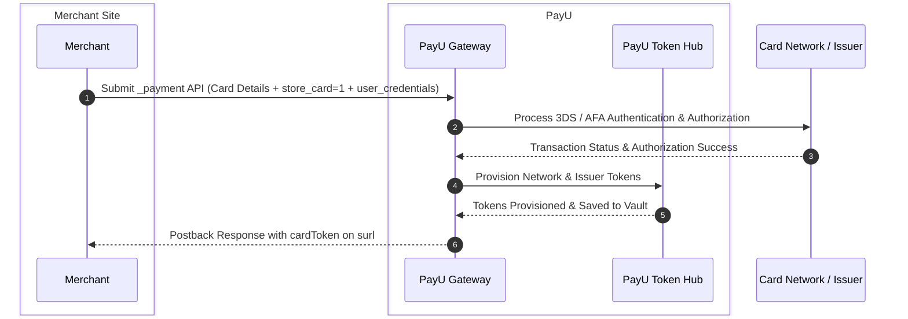

Model 2 enables merchants using **Merchant Hosted Checkout (Seamless Integration)** to leverage PayU Vault with minimal code modifications. PayU manages token creation, scheme provisioning, and storage on your behalf.

<Callout icon="📘" theme="info">
  ### **Prerequisite: Token Requestor Onboarding**:

  Tokenization requires Token Requestor ID (TRID) provisioning with card schemes. Coordinate with your PayU Key Account Manager (KAM) to complete onboarding before testing or going live.
</Callout>

***

## General Architecture

***

## First-Time Payment Workflow

1. The customer enters card details on your checkout page and gives consent to save the card.
2. The merchant submits payment details to the `_payment` endpoint along with `store_card=1` and `user_credentials`.
3. PayU authenticates the cardholder (AFA/OTP) and processes the transaction.
4. After successful payment, PayU automatically creates and vaults the network and issuer tokens.
5. PayU sends a postback response to your `surl` containing the unique `cardToken`.

### Endpoints

| Environment    | Endpoint URL                    |
| :------------- | :------------------------------ |
| **Test**       | `https://test.payu.in/_payment` |
| **Production** | `https://info.payu.in/_payment` |

### Required Parameters for First-Time Tokenization

| Parameter          | Type      | Required?     | Description                                                                                                                          | Example             |
| :----------------- | :-------- | :------------ | :----------------------------------------------------------------------------------------------------------------------------------- | :------------------ |
| `user_credentials` | `string`  | **Mandatory** | Combination of merchant key and unique customer identifier formatted as `<merchant_key>:<customer_id>`.                              | `JPM7Fg:user_98765` |
| `store_card`       | `integer` | **Mandatory** | Flag indicating customer consent to save the card: • `1` = Customer consented to tokenization • `0` = Consent not provided | `1`                 |

<Callout icon="📘" theme="info">
  ### **Note**:

  Include all standard payment parameters (`key`, `txnid`, `amount`, `productinfo`, `firstname`, `email`, `phone`, `surl`, `furl`, `hash`, `pg=CC`, `bankcode`, `ccnum`, `ccname`, `ccvv`, `ccexpmon`, `ccexpyr`). For the complete list, refer to [Merchant Hosted Checkout](doc:custom-checkout-merchant-hosted).
</Callout>

***

## Repeat Transaction Workflow

For subsequent transactions, customers do not re-enter their 16-digit card number:

1. **Fetch Saved Cards**: Call `get_user_cards` using `user_credentials` to retrieve the customer's vaulted cards.
2. **Customer Selection**: Present the masked cards to the customer.
3. **Submit Payment**: Submit `store_card_token` and `user_credentials` to `_payment`.

### Parameters for Repeat Payment

| Parameter              | Type      | Required?     | Description                                                                   | Example                  |
| :--------------------- | :-------- | :------------ | :---------------------------------------------------------------------------- | :----------------------- |
| `user_credentials`     | `string`  | **Mandatory** | Merchant key and customer ID (`<merchant_key>:<customer_id>`).                | `JPM7Fg:user_98765`      |
| `store_card_token`     | `string`  | **Mandatory** | The unique card token reference ID returned by PayU when the card was stored. | `28b99d39e83e8031caa7ad` |
| `storecard_token_type` | `integer` | Optional      | Set to `0` when processing using PayU Vault token hub.                        | `0`                      |
| `ccvv`                 | `string`  | Optional      | CVV number entered by customer (if mandated by the issuing bank).             | `123`                    |

### Postback Response Attributes

Upon transaction completion, PayU returns transaction parameters to your `surl` (or `furl` on failure):

| Parameter   | Description                                                           |
| :---------- | :-------------------------------------------------------------------- |
| `mihpayid`  | Unique PayU payment transaction identifier.                           |
| `status`    | Status of transaction (`success`, `failure`).                         |
| `txnid`     | Merchant's order/transaction identifier.                              |
| `cardToken` | Unique token identifier in PayU Vault for subsequent repeat payments. |
| `cardnum`   | Masked card number (e.g., `XXXXXXXXXXXX2346`).                        |
| `hash`      | Secure response hash to verify against tampering.                     |
