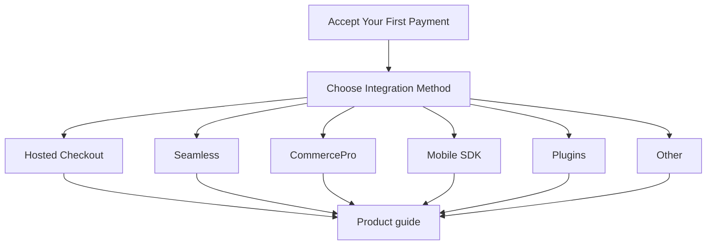

> <FreshTag heading="Recommended starting point" asHeading={false} text="Start here" />

This is the **recommended first page** for every new PayU merchant.

Use it to understand the payment flow, choose the right integration, and reach your first successful test payment — then continue into product-specific documentation.

> 📘 Start here
>
> Every other Collect Payments guide is a **continuation** of this journey, not a separate starting point.

***

## Overview

PayU integrations share one workflow-centric path:

1. Prerequisites
2. Choose Integration Method
3. Get Credentials
4. Generate Hash
5. Create First Payment
6. Handle Payment Response
7. Verify Payment
8. Test
9. Go Live
10. Next Steps (product-specific guides)



***

## Prerequisites

Before you write code:

* Register a PayU merchant account — see [Register with PayU](doc:register-with-payu)
* Open the [PayU Dashboard](doc:payu-dashboard) and enable **Test Mode**
* Locate your test **merchant key** and **salt**
* Prepare HTTPS success (`surl`) and failure (`furl`) URLs when required by your path
* Prefer integrating against Test before Production

Exact prerequisites update automatically when you pick an integration in the interactive guide below.

***

## Choose Integration Method

| Integration | Best when | PCI on your side |
| :---------- | :-------- | :--------------- |
| **Hosted Checkout** | You want the fastest go-live | No |
| **Seamless** | You need full checkout UI control | Yes (for cards on your site) |
| **CommercePro** | You want a conversion-optimized checkout | No (PayU handles sensitive data) |
| **Mobile SDK** | You are building Android / iOS / RN / Flutter apps | Depends on SDK mode |
| **Plugins** | You run Shopify, WooCommerce, Magento, etc. | No |
| **Other** | S2S, Payment Links, UPI QR, specialized flows | Varies |

Not sure? Use the interactive selector in the guide, or see [Choose your Integration](doc:choose-your-payment-gateway).

***

## Interactive onboarding guide

Select an integration to personalize prerequisites, language-specific samples, documentation links, and next steps — without leaving this page.

Language tabs switch code instantly and preserve scroll position. Every code panel includes a copy control with keyboard-accessible feedback.

<AcceptFirstPaymentGuide />

***

## Get Credentials

1. Sign in to the PayU Dashboard.
2. Switch to **Test Mode**.
3. Copy your merchant **key** and **salt**.
4. Store them as server-side environment variables.

Never embed salt in browser JavaScript, mobile binaries, or public repositories.

***

## Generate Hash

All Collect Payment requests are integrity-protected with **SHA-512**.

Request hash recipe:

```text
key|txnid|amount|productinfo|firstname|email|udf1|udf2|udf3|udf4|udf5||||||salt
```

Use the language tabs inside the interactive guide for Node.js, Java, PHP, Python, Go, and .NET samples. For additional hashing details, see [Hashing request and response](doc:hashing-request-and-response).

***

## Create Payment Request

* **Hosted Checkout** — server builds a signed form POST to `https://test.payu.in/_payment`
* **Seamless** — your UI collects method details; your server calls Merchant Hosted APIs
* **CommercePro** — create the optimized checkout session/payload server-side
* **Mobile SDK** — app requests a hash from your backend, then launches Checkout Pro
* **Plugins** — configure key/salt in the platform admin and place a test order

Continue to the matching product guide from **Next Steps** after your first success.

***

## Handle Payment Response

* PayU returns customers to your **surl** (success) or **furl** (failure) with a POST payload
* Configure **webhooks** for reliable server-to-server notifications
* Treat the browser return as UX only — fulfilment waits on verification

***

## Verify Payment

1. Validate the **reverse hash** on the return POST.
2. Call **verify_payment** (or SDK verify helpers) with the `txnid`.
3. Fulfil the order only when PayU confirms success.

***

## Test

* Complete one successful Test Mode payment
* Exercise a failure path
* Confirm reverse hash + verify_payment
* Use a unique `txnid` per attempt
* For Hosted Checkout, you can also use the [Hosted Checkout integration lab](doc:prebuilt-checkout-page-integration)

***

## Go Live

* Switch to production endpoints and production key/salt
* Keep salt server-side only
* Enable webhooks and monitoring
* Run a small live transaction before full traffic

See also the go-live checklists embedded in each Collect Payments product guide.

***

## Next Steps

Branch into the guide that matches how you integrate:

* [Hosted Checkout Guide](doc:prebuilt-checkout-payu-hosted)
* [Seamless / Merchant Hosted Guide](doc:custom-checkout-merchant-hosted)
* [CommercePro Guide](doc:checkout-express)
* [Android Checkout Pro SDK](doc:android-checkoutpro-sdk)
* [iOS Checkout Pro SDK](doc:ios-checkoutpro-sdk)
* [Go SDK Guide](doc:go-sdk)
* [Plugin documentation](doc:ecommerce-platform-plugins)
* [Payment Links](doc:payment-links-dashboard)
* [Server-to-Server](doc:server-to-server-integration)

Need a quiz-style recommendation? Try the path recommender on the introduction POC or compare options in [Choose your Integration](doc:choose-your-payment-gateway).

***

## Related reusable components

Future guides can reuse the DevEx building blocks in `custom_blocks/`:

* `DevExIntegrationSelector`
* `DevExLanguageTabs`
* `DevExCodeSwitcher`
* `DevExWorkflowTimeline`
* `DevExNextStepCards`
* `DevExProgressIndicator`
* `DevExCopyButton`
* `DevExScrollSyncNav`
* `AcceptFirstPaymentGuide`

Maintainer details: [DevEx component guide](doc:devex-component-guide).
