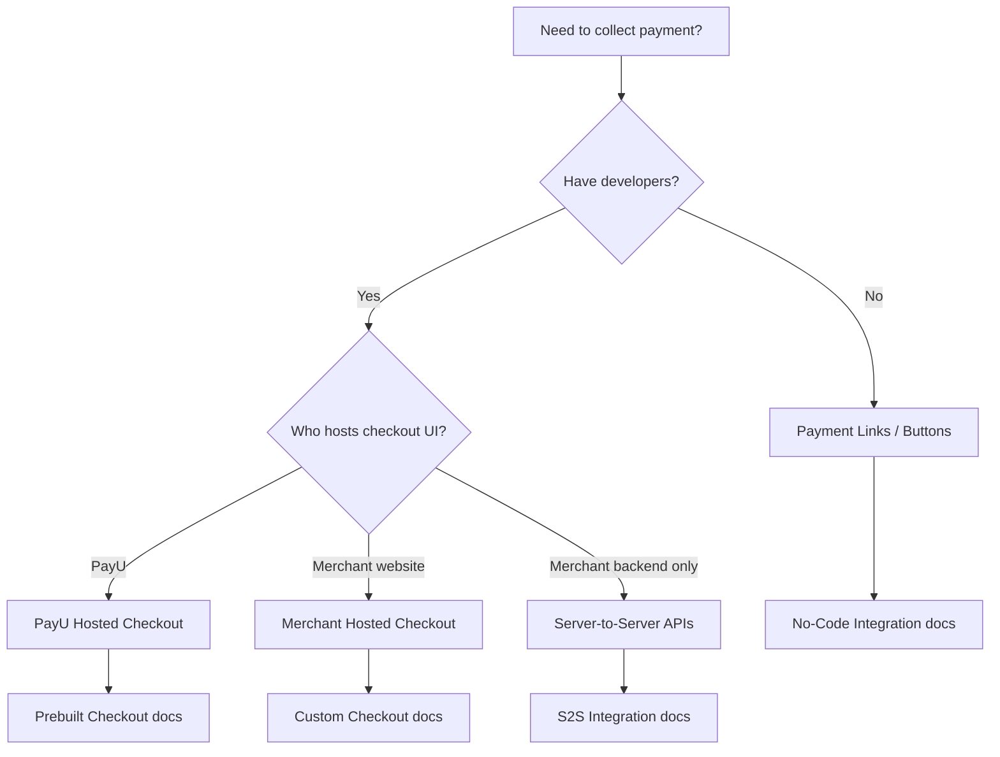

---
title: Payment APIs Getting Started
excerpt: >-
  Choose the right PayU payment API path—Hosted Checkout, Merchant Hosted, S2S,
  Payment Links—and mandatory steps for hash, webhooks, and go-live.
deprecated: false
hidden: false
metadata:
  title: Payment APIs Getting Started
  description: >-
    PayU Payment APIs quick-start: integration paths, hash and verify payment,
    webhooks, test credentials, and links to checklists.
  robots: index
next:
  description: ''
---
This page helps you pick the right **Payment API** integration path and complete the steps that prevent the most common integration support issues (invalid hash, missing webhooks, test/production mismatch).

> 📘 For a full topic index, see [Merchant First Integration Guide](doc:merchant-first-integration-guide).

## Choose your integration path

| If you want… | Integration | Primary API / flow |
| :----------- | :------------ | :----------------- |
| Fastest go-live, PayU hosts the payment page | [PayU Hosted Checkout](doc:prebuilt-checkout-payu-hosted) | Redirect to `_payment` |
| Custom checkout on your website | [Merchant Hosted Checkout](doc:custom-checkout-merchant-hosted) | `_payment` + your UI |
| Cards/UPI processed on your server without redirect | [Server-to-Server Integration](doc:server-to-server-integration) | S2S / decoupled APIs |
| Share a link or invoice without building checkout | [Payment Links](doc:introduction-no-code-payments-integration) | Payment Links / Invoice APIs |
| Confirm status after payment | [Verify Payment API](ref:verify_payment_api) | `verify_payment` command |

## Mandatory steps (all Payment API paths)

### 1. Generate hash on your server

Never expose **Salt** in client-side code (browser, mobile app, or public repos). Compute the payment hash on your server before each transaction.

* Merchant Hosted: [Generate Hash](doc:generate-hash-merchant-hosted)
* Validate calculations: [Using PayU Hash Verification Tool](doc:using-payu-hash-verification-tool)
* Web Services / Payment Links commands use a different formula: `sha512(key|command|var1|salt)` — see [Hash Generation - Android](doc:hash-generation) (Web Service Hash section)

### 2. Validate the response (reverse hash)

On `surl` / `furl` (or S2S response), verify PayU’s response hash before updating order status. See [Handling the Redirect URLs](doc:handling-the-redirect-urls) and your integration checklist.

### 3. Configure webhooks and Verify Payment API

Redirects can fail on poor connectivity. Treat webhooks plus **Verify Payment API** as mandatory backups—not optional.

* [Create a New Webhook](doc:create-a-new-webhook)
* [Payment Webhooks](doc:create-and-manage-webhooks-1)
* [Using Webhook Logs](doc:using-webhook-logs)
* [Verify Payment API](ref:verify_payment_api)

### 4. Use matching test or production credentials

| Environment | Payment endpoint (typical) | Credentials |
| :---------- | :------------------------- | :---------- |
| Test | `https://test.payu.in/_payment` | Test Key and Salt from Dashboard (Test Mode) |
| Production | `https://secure.payu.in/_payment` | Live Key and Salt after KYC |

Details: [PayU India API Environment](doc:payu-india-api-environment), [Generate Test Merchant Key and Salt](doc:generate-test-merchant-key-and-salt).

### 5. Complete the integration checklist before go-live

* [Integration Checklist - Merchant Hosted Checkout](doc:integration-checklist-merchant-hosted-checkout)
* [Integration Checklist - S2S](doc:integration-checklist-s2s)
* [Go-Live Checklist - All Integrations](doc:go-live-checklist-all-integrations)

## Common errors

| Symptom | Likely cause | What to do |
| :------ | :----------- | :--------- |
| **Invalid hash** | Wrong formula, UDF pipe count, or test salt with live URL | Match payload to [Generate Hash](doc:generate-hash-merchant-hosted); use [Hash Verification Tool](doc:using-payu-hash-verification-tool) |
| **Invalid VPA** | Typo, collect flow validation, or UPI not enabled on MID | Use valid test VPAs; for production UPI collect, confirm mode enablement with your **PayU Key Account Manager (KAM)** |
| **Webhook not received** | URL not reachable, wrong mode (test vs live), or 5xx on your server | [Using Webhook Logs](doc:using-webhook-logs); fix TLS/firewall; return HTTP 200 quickly |
| **Payment succeeds but order not updated** | surl/furl not implemented or reverse hash skipped | Implement surl/furl + reverse hash; add webhook handler |

More FAQs: [FAQs for Web Checkout Integration](doc:faqs-for-web-checkout-integration).

## Server SDKs (optional helpers)

PayU provides server libraries that wrap common APIs:

* [Java SDK](doc:java-sdk)
* [Node.js SDK](doc:node-js-sdk)
* [PHP SDK](doc:php-sdk)
* [Python SDK](doc:python-sdk)
* [Go SDK](doc:go-sdk)

## Need a feature enabled on your MID?

Flags such as S2S flow, UPI Intent, or specific payment modes require **PayU Key Account Manager (KAM)** enablement on your merchant account. Integration docs describe the API parameters; your KAM confirms when the MID is ready for UAT or production.
