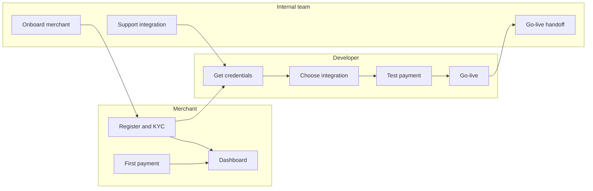

---
title: Quick Start Guide
excerpt: Get started with PayU in minimal steps. Choose your path as a developer, merchant, or internal integrations team member.
deprecated: false
hidden: false
metadata:
  title: PayU Quick Start Guide
  description: Quick start paths for developers, merchants, and PayU internal integrations team to onboard and integrate with PayU.
  keywords:
    - PayU quick start
    - developer quick start
    - merchant onboarding
    - PayU integration
  robots: index
next:
  description: ''
---

Use this guide to get going with PayU in minimal steps. Choose the path that matches your role.

In this guide you will find:

* **Developers**: Account setup, credentials, integration choice, first test payment, and go-live prep.
* **Merchants**: Registration, KYC, Dashboard tour, and collecting your first payment (e.g. via payment link or button).
* **Internal Integrations Team**: Standard onboarding flow, credentials and environments, integration support, partner onboarding, and go-live handoff.

---

## Choose your path

| Role | Goal | Link |
|------|------|------|
| **Developer** | Integrate and test payments (APIs, SDKs, or plugins) | [Quick Start: Developers](doc:quick-start-developers) |
| **Merchant** | Open account, use Dashboard, collect first payment | [Quick Start: Merchants](doc:quick-start-merchants) |
| **Internal Integrations Team** | Onboard merchants, support integration, go-live | [Quick Start: Internal Integrations Team](doc:quick-start-internal-integrations-team) |

---

## How the paths connect

Merchants register and complete KYC; developers use the same account to get credentials and integrate. The internal team guides onboarding and supports integration through go-live.

---

## More resources

* [Introduction](doc:introduction) – PayU products and integration options
* [Register with PayU](doc:register-with-payu) – Merchant registration
* [Explore Dashboard](doc:payu-dashboard) – PayU Dashboard overview
* [Contact PayU](doc:contact-payu) – Support and key account manager