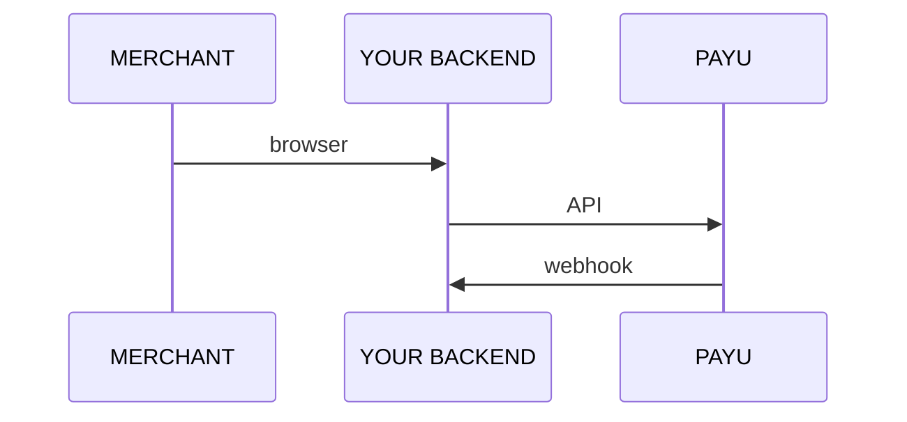
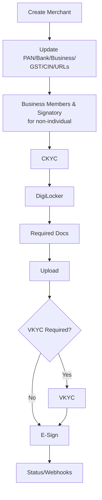

Full control. The merchant never leaves your platform. You build the UI; PayU provides the APIs.

## Architecture

All API calls are **server-to-server**. Never expose your `resellerToken` to the browser.

## Onboarding sequence

## Entity type determines the flow

|                  | Individual / Sole Prop | Non-Individual (Pvt Ltd, LLP, Partnership, Trust, Society) |
| ---------------- | ---------------------- | ---------------------------------------------------------- |
| Business members | Not required           | Required                                                   |
| Signatory & UBO  | Not required           | Required                                                   |
| CIN              | Not required           | Required (Pvt Ltd, LLP)                                    |
| CKYC flow        | Mobile OTP             | PAN + Date of Incorporation                                |
| VKYC             | Conditional            | Conditional                                                |

## APIs to integrate

The following APIs are used to onboard and manage merchants through Partner Integration:

### Authentication

| Use case → Reference                                          | `command` / primary value | Description                                                                |
| ------------------------------------------------------------- | ------------------------- | -------------------------------------------------------------------------- |
| Generate an access token — [Get Token API](ref:get_token_api) | `POST /oauth/token`       | Generates an access token using the partner's client ID and client secret. |

### Create and Update Merchant

| Use case → Reference                                                                     | `command` / primary value                                        | Description                                                                   |
| ---------------------------------------------------------------------------------------- | ---------------------------------------------------------------- | ----------------------------------------------------------------------------- |
| Onboard a merchant — [Create Merchant API](ref:create_merchant_api)                      | `POST /api/v3/merchants`                                         | Creates a merchant account, submits KYC details, and returns the Merchant ID. |
| Manage bank details — [Add or Update Bank Details API](ref:add_update_bank_details_api)  | `POST /api/v3/merchants/` `{merchant_uuid}/add_bank_detail` | Adds or updates a merchant's bank account details after PAN verification.     |
| Update merchant details — [Update Merchant Details API](ref:update_merchant_details_api) | `PUT /api/v1/merchants/` `{uuid}/update`                    | Updates merchant information, including PAN details.                          |

### Verify Bank Details and KYC

| Use case → Reference                                                                          | `command` / primary value             | Description                                                                  |
| --------------------------------------------------------------------------------------------- | ------------------------------------- | ---------------------------------------------------------------------------- |
| Retrieve merchant details — [Get Merchant API](ref:get_merchant_api)                          | `GET /api/v1/merchants/{mid}`         | Retrieves the details of a merchant linked to the partner.                   |
| Verify and link a merchant — [Verify and Link Merchant API](ref:verify_and_link_merchant_api) | `POST /api/v1/merchants/{mid}/verify` | Verifies an existing merchant and links the merchant account to the partner. |

### User Token APIs

| Use case → Reference                                 | `command` / primary value      | Description                                                                     |
| ---------------------------------------------------- | ------------------------------ | ------------------------------------------------------------------------------- |
| Send an OTP — [Send OTP API](ref:send_otp_api)       | `POST /api/v1/otps/send_otp`   | Sends an OTP to verify merchant details or authorize a bank-details update.     |
| Verify an OTP — [Verify OTP API](ref:verify_otp_api) | `POST /api/v1/otps/verify_otp` | Verifies the merchant's OTP and returns a user token for authorized operations. |

### Manage KYC

| Use case → Reference                                                                      | `command` / primary value                                         | Description                                                    |
| ----------------------------------------------------------------------------------------- | ----------------------------------------------------------------- | -------------------------------------------------------------- |
| Retrieve required KYC documents — [Info KYC Document API](ref:info_kyc_document_api)      | `GET /api/v3/merchants/kyc_document/info`                         | Retrieves the documents required to complete a merchant's KYC. |
| Upload a KYC document — [Create KYC Document](ref:create_kyc_document_api)                | `POST /api/v3/merchants/{mid}/kyc_document`                       | Uploads a KYC document for a merchant.                         |
| Delete a KYC document — [Delete KYC Document API](ref:delete_kyc_document_api)            | `DELETE /api/v3/merchants/{mid}/kyc_document/{kyc_document_uuid}` | Deletes a previously uploaded KYC document.                    |
| Submit CKYC details — [Post CKYC API](ref:post_ckyc_api)                                  | `POST /api/v3/merchants/kyc_document/ckyc_data`                   | Submits the merchant's Central KYC details to PayU.            |
| Upload Aadhaar XML — [Upload Aadhaar XML Offline API](ref:upload_aadhaar_xml_offline_api) | `POST /api/v3/merchants/kyc_document/aadhaar_xml_offline`         | Uploads the merchant's offline Aadhaar XML file for KYC.       |

### E-Sign Flow APIs

| Use case → Reference                                                                                                           | `command` / primary value                                                           | Description                                                           |
| ------------------------------------------------------------------------------------------------------------------------------ | ----------------------------------------------------------------------------------- | --------------------------------------------------------------------- |
| Generate the merchant agreement — [Generate Merchant Agreement for E-sign API](ref:generate-merchant-agreement-for-e-sign-api) | `POST /v3/merchants/{merchant_uuid}/generate_agreement_for_esign`                   | Generates the merchant agreement document for electronic signing.     |
| Send an OTP to the signatory — [Send OTP to Signatory Email API](ref:send-otp-to-signatory-email-api)                          | `POST /v3/merchants/{merchant_uuid}/agreements/{agreement_uuid}/send_signatory_otp` | Sends an OTP to the merchant's signatory for agreement signing.       |
| E-sign the merchant agreement — [E-Sign Merchant Agreement API](ref:e-sign-merchant-agreement-api)                             | `POST /v3/merchants/{merchant_uuid}/agreements/{agreement_uuid}/esign`              | Uses the signatory OTP to electronically sign the merchant agreement. |
