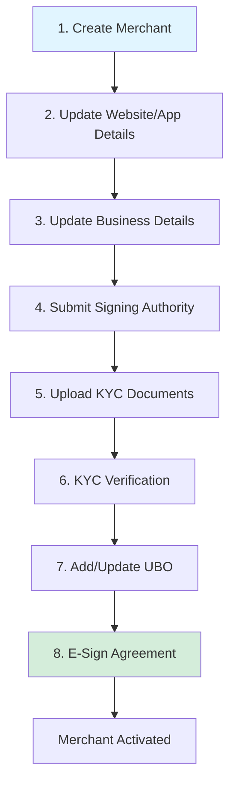

Get a merchant onboarded with a small set of API calls: create merchant, update PAN/bank/business, CKYC OTP, upload KYC documents, initialize e-sign.

## Onboarding flow



## Steps to integrate

Obtain a bearer token with the `refer_merchant` scope before these steps. See [GetToken API](ref:get_token_partner_integration). Each step below includes the environment URL and sample request/response. Request parameters are listed for Step 1; for later steps, use the linked API reference.

### Step 1. Create Merchant (Name, Email, Phone)

Creates a new merchant shell account on PayU. Pass display name, email, mobile, product (`PayUbiz`), and business entity type. Store `mid`, `uuid`, and `product_account_uuid` from the response — later steps use these identifiers. For the full parameter list and Try It experience, see [CreateMerchant API](ref:createmerchant).

**HTTP Method**: POST

**Environment**

|                        | URL                                             |
| :--------------------- | :---------------------------------------------- |
| Test Environment       | `https://test-partner.payu.in/api/v3/merchants` |
| Production Environment | `https://partner.payu.in/api/v3/merchants`      |

<Accordion title="Request parameters" icon="fa-table">
  | Parameter                                                                      | Description                                                     | Example                |
  | :----------------------------------------------------------------------------- | :-------------------------------------------------------------- | :--------------------- |
  | merchant\[display_name]<br /><code>mandatory</code>                            | `string` — Business or display name                             | `Acme Stores`          |
  | merchant\[email]<br /><code>mandatory</code>                                   | `string` — Unique merchant email across PayU                    | `merchant@example.com` |
  | merchant\[mobile]<br /><code>mandatory</code>                                  | `string` — Exactly 10-digit Indian mobile number                | `9876543210`           |
  | merchant\[product]<br /><code>mandatory</code>                                 | `string` — Must be `PayUbiz` (required to avoid backend errors) | `PayUbiz`              |
  | merchant\[business_details]\[business_entity_type]<br /><code>mandatory</code> | `string` — Entity type; determines CKYC method and later steps  | `Private Limited`      |
</Accordion>

<Accordion title="Sample request" icon="fa-code">
  ```bash
  curl --location 'https://test-partner.payu.in/api/v3/merchants' \
  --header 'Authorization: Bearer {{access_token}}' \
  --form 'merchant[display_name]="Acme Stores"' \
  --form 'merchant[email]="merchant@example.com"' \
  --form 'merchant[mobile]="9876543210"' \
  --form 'merchant[product]="PayUbiz"' \
  --form 'merchant[business_details][business_entity_type]="Private Limited"'
  ```
</Accordion>

<Accordion title="Sample response" icon="fa-file-code">
  ```json
  {
    "mid": 12345678,
    "uuid": "11ef-d968-6b042d6c-9b94-02975f21d323",
    "product_account_uuid": "11ef-d968-6b042d6c-9b94-02975f21d323"
  }
  ```
</Accordion>

### Step 2. Update Merchant Details (Business Info)

Adds business category, sub-category, expected monthly volume, GST, business name, and CIN where required (for Private Limited, Public Limited, and One Person Company). Use the merchant `uuid` from Step 1. For the full parameter list and Try It experience, see [UpdateMerchant Business Details API](ref:updatemerchant_businessdetails).

**HTTP Method**: PUT

**Environment**

|                        | URL                                                           |
| :--------------------- | :------------------------------------------------------------ |
| Test Environment       | `https://test-partner.payu.in/api/v1/merchants/{uuid}/update` |
| Production Environment | `https://partner.payu.in/api/v1/merchants/{uuid}/update`      |

<Accordion title="Sample request" icon="fa-code">
  ```bash
    curl --location --request PUT 'https://test-partner.payu.in/api/v1/merchants/{{uuid}}/update' \
    --header 'Authorization: Bearer {{access_token}}' \
    --form 'merchant[business_category]="Arts, Gifts & Stationery"' \
    --form 'merchant[business_sub_category]="Art Dealers and Galleries"' \
    --form 'merchant[monthly_expected_volume]="500000"' \
    --form 'merchant[gst_number]="29ABCDE1234F1Z5"' \
    --form 'merchant[gst_consent]="true"' \
    --form 'merchant[business_name]="MERCHANT BUSINESS NAME"' \
    --form 'merchant[cin_number]="U74999KA2020PTC123456"'
  ```
</Accordion>

<Accordion title="Sample response" icon="fa-file-code">
  ```json
  {
    "merchant": {
      "mid": 12345678,
      "business_name": "MERCHANT BUSINESS NAME",
      "status": "account_created"
    }
  }
  ```
</Accordion>

### Step 3. Update Website/App Details

Adds the merchant website and/or app store URLs. At least one channel URL is typically required depending on how the merchant sells. For the full parameter list and Try It experience, see [UpdateMerchant Website Details API](ref:updatemerchant_websitedetails).

**HTTP Method**: PUT

**Environment**

|                        | URL                                                           |
| :--------------------- | :------------------------------------------------------------ |
| Test Environment       | `https://test-partner.payu.in/api/v1/merchants/{uuid}/update` |
| Production Environment | `https://partner.payu.in/api/v1/merchants/{uuid}/update`      |

<Accordion title="Sample request" icon="fa-code">
  ```bash
    curl --location --request PUT 'https://test-partner.payu.in/api/v1/merchants/{{uuid}}/update' \
    --header 'Authorization: Bearer {{access_token}}' \
    --form 'merchant[website_details][website_url]="https://www.example.com"' \
    --form 'merchant[website_details][android_url]="https://play.google.com/store/apps/details?id=com.example"' \
    --form 'merchant[website_details][ios_url]="https://apps.apple.com/app/example/id123456"'
  ```
</Accordion>

<Accordion title="Sample response" icon="fa-file-code">
  ```json
  {
    "merchant": {
      "mid": 12345678,
      "status": "account_created"
    }
  }
  ```
</Accordion>

### Step 4. Submit Signing Authority Details

Submits the authorised signatory for the merchant agreement. Complete this step before DigiLocker or Video KYC — those APIs fail if signatory details are missing. For the full parameter list and Try It experience, see [Add Signatory Details API](ref:addsignatorydetails).

**HTTP Method**: PUT

**Environment**

|                        | URL                                                                      |
| :--------------------- | :----------------------------------------------------------------------- |
| Test Environment       | `https://test-partner.payu.in/api/v1/merchants/{uuid}/signatory_details` |
| Production Environment | `https://partner.payu.in/api/v1/merchants/{uuid}/signatory_details`      |

<Accordion title="Sample request" icon="fa-code">
  ```bash
    curl --location --request PUT 'https://test-partner.payu.in/api/v1/merchants/{{uuid}}/signatory_details' \
    --header 'Authorization: Bearer {{access_token}}' \
    --header 'Content-Type: application/x-www-form-urlencoded' \
    --data-urlencode 'merchant[signatory_contact_details_attributes[0][authorised_signatory]]=true' \
    --data-urlencode 'merchant[signatory_contact_details_attributes[0][name]]=Signatory 1 Name' \
    --data-urlencode 'merchant[signatory_contact_details_attributes[0][pancard_number]]=ABCDE1234F' \
    --data-urlencode 'merchant[signatory_contact_details_attributes[0][email]]=signatory1@yopmail.com' \
    --data-urlencode 'merchant[signatory_contact_details_attributes[0][contact_detail_type]]=Signing Authority' \
    --data-urlencode 'merchant[signatory_contact_details_attributes[0][cin_number]]='
  ```
</Accordion>

<Accordion title="Sample response" icon="fa-file-code">
  ```json
  {
    "merchant": {
      "mid": 12345678,
      "status": "account_created"
    }
  }
  ```
</Accordion>

### Step 5. Upload KYC Documents

Uploads one KYC document per required category (JPG, PNG, or PDF; max 5 MB). Call this API once for each required category. Use numeric `mid` from Step 1 in the path. For the full parameter list and Try It experience, see [Upload KYC Document API](ref:uploadkycdocument).

**HTTP Method**: POST

**Environment**

|                        | URL                                                                |
| :--------------------- | :----------------------------------------------------------------- |
| Test Environment       | `https://test-partner.payu.in/api/v3/merchants/{mid}/kyc_document` |
| Production Environment | `https://partner.payu.in/api/v3/merchants/{mid}/kyc_document`      |

<Accordion title="Sample request" icon="fa-code">
  ```bash
    curl --location 'https://test-partner.payu.in/api/v3/merchants/{{mid}}/kyc_document' \
    --header 'Authorization: Bearer {{access_token}}' \
    --form 'merchant[document_category]="PAN Card of Signing Authority"' \
    --form 'merchant[document_type]="PAN Card"' \
    --form 'merchant[processed_document]=@"/path/to/pan.pdf"'
  ```
</Accordion>

<Accordion title="Sample response" icon="fa-file-code">
  ```json
  {
    "merchant": {
      "mid": "8390925",
      "kyc_document_name": "PAN Card of Signing Authority",
      "kyc_document_uuid": "11ef-587e-4383...",
      "kyc_document_status": "DOCUMENT_SUBMITTED",
      "error_message": null,
      "created_at": "2024-08-12T07:41:19.000Z"
    }
  }
  ```
</Accordion>

### Step 6. Request E-Sign Agreement

Generates the merged merchant agreement for electronic signing. After successful e-sign, the merchant can be activated. Ensure the token includes `refer_merchant` and either `client_manage_agreement` or `client_manage_kyc_details`. Contact your **PayU Key Account Manager (KAM)** if scopes need enablement. For the full parameter list and Try It experience, see [Generate Agreement for E-Sign API](ref:generateagreementforesign).

**HTTP Method**: GET

**Environment**

|                        | URL                                                                                       |
| :--------------------- | :---------------------------------------------------------------------------------------- |
| Test Environment       | `https://test-partner.payu.in/api/v1/merchants/{uuid}/generate_merged_document_for_esign` |
| Production Environment | `https://partner.payu.in/api/v1/merchants/{uuid}/generate_merged_document_for_esign`      |

<Accordion title="Sample request" icon="fa-code">
  ```bash
  curl --location 'https://test-partner.payu.in/api/v1/merchants/{{uuid}}/generate_merged_document_for_esign' \
  --header 'Authorization: Bearer {{access_token}}' \
  --header 'Accept: application/json'
  ```
</Accordion>

<Accordion title="Sample response" icon="fa-file-code">
  ```json
  {
    "agreement_url": "https://esign.example.com/document/...",
    "agreement_status": "Generated",
    "message": "Agreement generated successfully"
  }
  ```
</Accordion>
