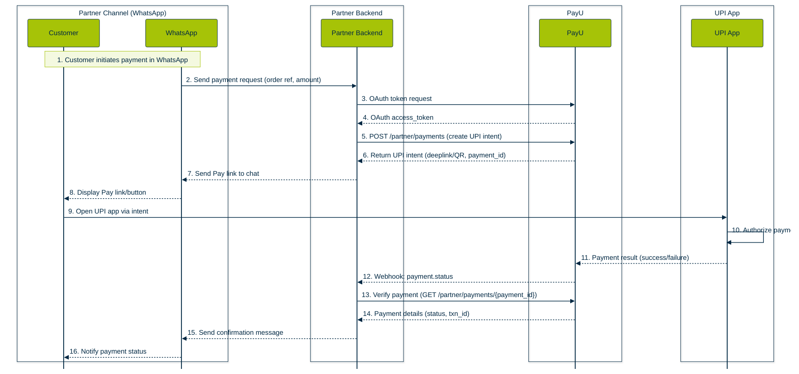

Partner Payments API enables partners and resellers to integrate PayU's payment acceptance capabilities on behalf of their merchants. This API supports multiple payment flows including UPI Intent S2S, UPI TPV (Third-Party Validation), and standard redirect checkout flows.

## How it works?

Partner Payments uses a three-step OAuth authentication flow followed by payment initiation via RESTful APIs. Here's the complete flow:

1. **Authentication Flow** — Partners generate an OAuth access token through a three-step process:
   - Step 1: Password grant using reseller credentials to obtain an initial access token
   - Step 2: Request authorization code for the specific merchant using the initial token
   - Step 3: Exchange the authorization code for the final access token with `partner_payments` scope

2. **Payment Initiation** — Partners use the final access token to call the `/partner/payments` endpoint with:
   - Transaction details (amount, product info, customer details)
   - Partner identifiers (merchant_id, reseller_id)
   - Payment-specific parameters (UPI S2S flags, TPV beneficiary details, redirect URLs)
   - SHA-512 hash computed using the partner-specific formula with `client_secret`

3. **Response Handling** — PayU returns different response formats based on payment type:
   - **UPI Intent S2S**: Returns `intentURIData` and `acsTemplate` for rendering UPI intent
   - **Redirect Flow**: Returns `redirectUri` to redirect customer to PayU hosted checkout
   - **UPI TPV**: Returns intent data with validated beneficiary account

4. **Webhook Delivery** — After payment completion, PayU:
   - Sends callback to configured partner webhook URLs
   - Delivers comprehensive payload including transaction status, payment ID, and custom UDF fields
   - Includes SHA-512 hash for webhook verification using reverse hash formula

5. **Payment Verification** — Partners verify final payment status by:
   - Calling `/partner/verifyPayment` API with transaction ID
   - Validating response hash for authenticity
   - Reconciling payment status with webhook data

## Customer Journey

The following diagram illustrates the end-to-end payment journey when partners integrate via WhatsApp or other channels:

**Typical Flow:**

1. Customer initiates payment request through partner's interface (WhatsApp, app, web)
2. Partner backend generates OAuth access token (if not cached)
3. Partner calls `/partner/payments` API with payment details and computed hash
4. For UPI Intent S2S:
   - PayU returns `intentURIData` and `acsTemplate`
   - Partner renders UPI intent link or QR code to customer
   - Customer selects UPI app and authorizes payment
5. PayU processes payment and sends webhook to partner's configured URL
6. Partner verifies webhook hash and calls `/partner/verifyPayment` for confirmation
7. Partner updates customer with payment status

## Features of Partner Payments

✅ **OAuth 2.0 Secure Authentication** — Three-step token generation flow with scope-based access control ensuring secure API access

✅ **Multiple Payment Flows** — Support for UPI Intent S2S, UPI TPV, redirect checkout, payment links, and subscriptions

✅ **UPI Intent S2S Integration** — Receive `intentURIData` and `acsTemplate` for seamless UPI app invocation without redirect

✅ **UPI TPV (Third-Party Validation)** — Validate beneficiary account details during payment initiation for enhanced security and compliance

✅ **Partner-Specific Hashing** — Dedicated hash formulas using `client_secret` instead of merchant salt for improved security isolation

✅ **Configurable Webhooks** — Database-driven webhook configuration supporting partner-level and merchant-level URLs with fallback behavior

✅ **Comprehensive Webhook Payload** — Receive complete transaction data including status, payment ID, UDF fields, and verification hash

✅ **Payment Verification API** — Programmatic verification endpoint to confirm final transaction status independently of webhooks

✅ **Flexible UDF Fields** — Five user-defined fields (udf1-udf5) for passing custom partner and merchant metadata

✅ **Database-Driven Configuration** — Control webhook delivery, disable merchant fallbacks, and manage partner-merchant relationships via `partner_webhook_urls` and `partner_merchant_params` tables

## Benefits of Partner Payments

🚀 **Faster Merchant Onboarding** — Integrate once as a partner and onboard multiple merchants without per-merchant integration effort

🔒 **Enhanced Security** — Separate OAuth scopes, partner-specific hash formulas, and reverse hash verification prevent unauthorized access

💰 **Revenue Flexibility** — Support for commission tracking via UDF fields and partner-level reporting

📊 **Real-Time Status Updates** — Webhook-driven architecture ensures instant payment status delivery to partner systems

🔧 **Reduced Technical Complexity** — Merchants don't need to integrate PayU directly; partner handles all API communication

📱 **Omnichannel Support** — Integrate payments into WhatsApp, mobile apps, web portals, or any partner channel

⚡ **High Performance** — Optimized S2S flows reduce redirect latency and improve conversion rates

🛡️ **Compliance Ready** — Built-in TPV support for regulatory compliance in specific use cases

## Next Steps

To integrate Partner Payments, refer to:

- [Partner Payments Integration Guide](doc:partner-payments-integration-guide) — Complete step-by-step integration walkthrough
- [UPI TPV Integration](doc:upi-tpv-integration) — Third-party validation setup for compliance scenarios
- [Testing and Troubleshooting](doc:testing-and-troubleshooting-partner-payments) — Common errors, log patterns, and test data

<Callout icon="📮" theme="default">
  ### **Postman Collection**

  Download the Partner Payments Postman Collection from: [Partner API Collection](https://docs.payu.in/reference/partner-integration-api-introduction)
</Callout>
