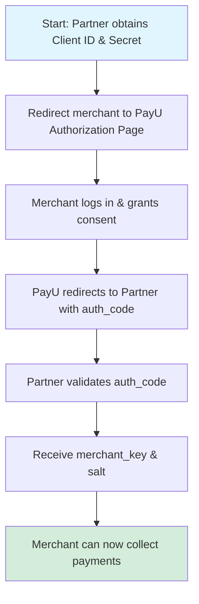

Onboard a merchant using Co-Branded OAuth flow with a small set of API calls.



## Overview

The Co-Branded OAuth onboarding flow allows partners to onboard merchants seamlessly using OAuth 2.0 authorization. This approach provides a branded experience where merchants authenticate directly with PayU, and partners receive the merchant credentials securely.

## Prerequisites

Before you begin, ensure you have:
- **Partner credentials**: Client ID and Client Secret
- **Whitelisted redirect URL**: Your callback URL registered with PayU
- **OAuth scope enabled**: Contact your Key Account Manager (KAM) to enable OAuth onboarding

> 📝 **Note**: To download your Client ID and Secret, navigate to **Merchant Integration** → **Partner Integration** → **Download Credentials** on the PayU Partner Portal.

---

## Steps to Integrate

### Step 1: Build the Authorization URL

Construct the authorization URL to redirect merchants to the PayU login page.

**URL Format:**

| Environment | URL |
|-------------|-----|
| **Test** | `https://onboardingtest.payu.in/merchant/partner-oauth?client_id={{client_id}}&redirect_url={{redirect_url}}` |
| **Production** | `https://onboarding.payu.in/merchant/partner-oauth?client_id={{client_id}}&redirect_url={{redirect_url}}` |

**Required Parameters:**
- `client_id`: Your partner client ID
- `redirect_url`: Your whitelisted callback URL (must be URL-encoded)

<details>
<summary><strong>Sample Authorization URL</strong></summary>

```
https://onboardingtest.payu.in/merchant/partner-oauth?client_id=ABC123&redirect_url=https%3A%2F%2Fpartner.example.com%2Fcallback
```
</details>

---

### Step 2: Redirect Merchant to Authorization Page

Redirect the merchant to the authorization URL constructed in Step 1. The merchant will:
1. Log in to PayU (or create a new account)
2. Complete KYC if not already done
3. Grant authorization to your partner application

---

### Step 3: Receive Authorization Code

After successful authorization, PayU redirects the merchant back to your `redirect_url` with an authorization code.

**Callback URL Format:**
```
{{redirect_url}}?auth_code={{authorization_code}}
```

**Example:**
```
https://partner.example.com/callback?auth_code=XYZ789ABC123
```

> ⚠️ **Important**: The `auth_code` is single-use and expires after a short period. Exchange it immediately for merchant credentials.

---

### Step 4: Validate Authorization Code

Exchange the authorization code for merchant credentials using the **Validate Auth Code** API.

**HTTP Method:** `POST`

| Environment | Endpoint |
|-------------|----------|
| **Test** | `https://testdashboard.payu.in/oauth/validate-auth-code` |
| **Production** | `https://dashboard.payu.in/oauth/validate-auth-code` |

🔗 [Try it - Validate Auth Code API](/reference/validate_authcode_and_client_api)

<details>
<summary><strong>Sample Request</strong></summary>

```bash
curl --location 'https://testdashboard.payu.in/oauth/validate-auth-code' \
--header 'Content-Type: application/json' \
--data '{
    "client_id": "ABC123",
    "client_secret": "your_client_secret",
    "auth_code": "XYZ789ABC123"
}'
```
</details>

<details>
<summary><strong>Sample Response (Success)</strong></summary>

```json
{
    "status": 1,
    "msg": "Success",
    "merchant_key": "mK3j2L9p",
    "salt": "sA7x9B2c"
}
```
</details>

<details>
<summary><strong>Sample Response (Failure)</strong></summary>

```json
{
    "status": 0,
    "msg": "Invalid auth code"
}
```
</details>

**Response Parameters:**
| Parameter | Description |
|-----------|-------------|
| `status` | `1` for success, `0` for failure |
| `msg` | Success or error message |
| `merchant_key` | Merchant's API key (returned on success) |
| `salt` | Merchant's salt for hash generation (returned on success) |

---

### Step 5: Store Merchant Credentials Securely

Once you receive the `merchant_key` and `salt`:
1. **Store them securely** in your database associated with the merchant
2. **Never expose** these credentials in client-side code
3. Use them to generate payment hashes on your server

> 🔒 **Security Best Practice**: Encrypt sensitive credentials at rest and in transit.

---

### Step 6: (Optional) Retrieve Merchant Credentials Later

If you need to retrieve merchant credentials at a later time, use the **Get Merchant Credentials** API.

**HTTP Method:** `POST`

| Environment | Endpoint |
|-------------|----------|
| **Test** | `https://testdashboard.payu.in/oauth/get-merchant-credentials` |
| **Production** | `https://dashboard.payu.in/oauth/get-merchant-credentials` |

🔗 [Try it - Get Merchant Credentials API](/reference/get_merchant_credentials_api)

<details>
<summary><strong>Sample Request</strong></summary>

```bash
curl --location 'https://testdashboard.payu.in/oauth/get-merchant-credentials' \
--header 'Content-Type: application/json' \
--data '{
    "client_id": "ABC123",
    "client_secret": "your_client_secret"
}'
```
</details>

<details>
<summary><strong>Sample Response</strong></summary>

```json
{
    "status": 1,
    "msg": "Success",
    "merchant_key": "mK3j2L9p",
    "salt": "sA7x9B2c"
}
```
</details>

---

### Step 7: Collect Payments

After you complete the above steps, the merchant can start collecting payments. You can integrate using:

- **PayU Hosted Checkout** - Redirect customers to PayU's payment page
- **Pre-Built Checkout** - Embed PayU's checkout interface on your website
- **UPI S2S (Server-to-Server)** - Direct UPI integration for seamless payments

Choose the integration method based on your requirements. Refer to the [Payment Integration documentation](/docs/introduction-web) for detailed implementation guides.

---

## Next Steps

✅ **Test your integration**: Use the test environment credentials to verify the OAuth flow
✅ **Review API documentation**: [Validate Auth Code API](/reference/validate_authcode_and_client_api) | [Get Merchant Credentials API](/reference/get_merchant_credentials_api)
✅ **Go Live**: Contact your KAM to enable production OAuth and whitelist your redirect URLs

📚 For complete details on OAuth onboarding, see the [Co-Branded OAuth Documentation](/docs/refer-merchants-using-co-branded-oauth-onboarding).
