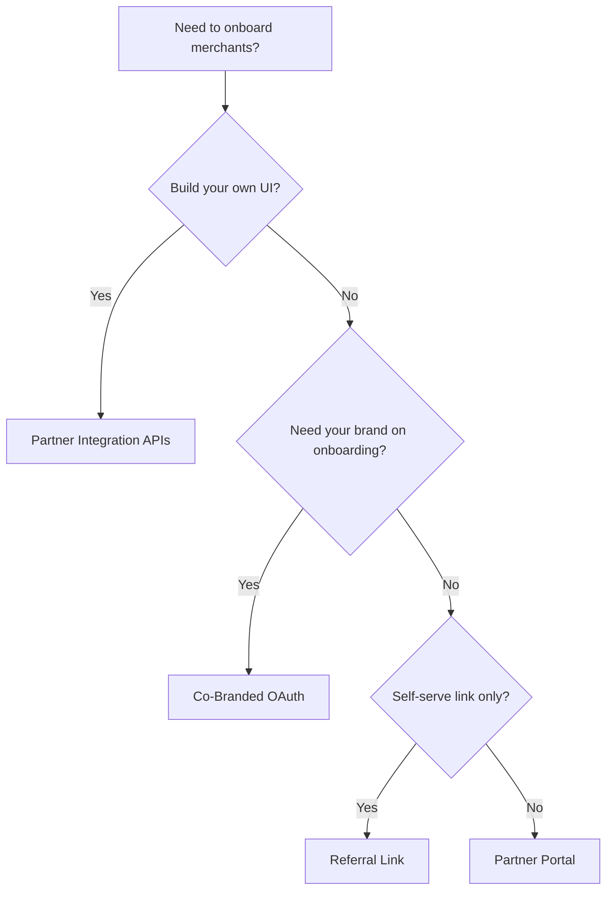

Choose how you want to onboard merchants with PayU. Use this page to compare **Partner Portal**, **Co-Branded OAuth**, **Partner Integration APIs**, and **referral links**, then follow the guide for your path.

## At a glance

|                                     | Referral Link                                     | Partner Portal                                       | Co-Branded OAuth                                    | API                                     |
| ----------------------------------- | ------------------------------------------------- | ---------------------------------------------------- | --------------------------------------------------- | --------------------------------------- |
| **You build UI**                    | No                                                | No                                                   | No                                                  | Yes                                     |
| **Brand control**                   | None                                              | None                                                 | Your logo + colours                                 | Full                                    |
| **Technical effort**                | None                                              | None                                                 | Low                                                 | High                                    |
| **Merchant stays on your platform** | No                                                | No                                                   | No (redirects to PayU, then back)                   | Yes                                     |
| **Custom onboarding journey**       | Limited                                           | Manual / portal-led                                  | PayU-hosted, co-branded                             | Full control via APIs                   |
| **Pre-fill merchant fields**        | No                                                | No                                                   | Yes                                                 | Yes                                     |
| **Redirection to PayU**             | Yes                                               | Yes                                                  | Yes                                                 | No                                      |
| **Redirection back to platform**    | No                                                | No                                                   | Yes (with auth code)                                | Not required                            |
| **Authorisation model**             | Not applicable                                    | Not applicable                                       | Merchant consent; validate auth code                | Bearer token (`GetToken`)               |
| **Best for**                        | Individual resellers                              | Manual onboarding                                    | Mid-size platforms                                  | Large platforms                         |
| **Ideal when**                      | You only need to share a link and earn incentives | You want dashboard tools without building product UI | You want branded onboarding without building KYC UI | Merchants must never leave your product |

If merchants must stay in your platform end-to-end, use **API integration**. For a branded journey with low engineering effort, use **Co-Branded OAuth**. For operational onboarding without code, use **Partner Portal** or a **referral link**.

## Partner Portal

[Partner Portal](doc:partner-portal) helps you grow by onboarding merchants and tracking incentives from a PayU-hosted dashboard. Merchants can then collect payments with PayU payment methods.

**What you can do**

- Refer merchants
- Complete the merchant profile on their behalf
- Track referred merchants’ onboarding status
- Track incentives earned on referrals
- Get settlement and other reports for merchants
- Manage portal users and permissions

**What you should know**

- No frontend development required for onboarding UI
- Brand control is limited; the experience is PayU-controlled
- Best for partners who prefer manual or ops-led onboarding
- After onboarding, merchants collect payments using standard PayU integrations such as [Web Integration](doc:introduction-web)

**Get started**

- [Register a Partner Account](doc:register-a-partner-account)
- [Configure URLs and Logo](doc:configure-urls-and-logo)
- [Log in to Partner Portal](doc:log-in-to-partner-portal)
- [Referral Onboarding](doc:referral-onboarding)
- [Track Incentives](doc:track-incentives)

## Co-Branded OAuth onboarding

[Co-Branded (OAuth) Onboarding](doc:refer-merchants-using-co-branded-oauth-onboarding) lets partners offer a seamless, co-branded onboarding journey powered by PayU. You customise look and feel without building the onboarding GUI from scratch. Merchants redirect to PayU only to complete onboarding, then return to your platform.

**What you can do**

- Host a partner logo and branding on the PayU onboarding experience
- Share sign-up or login links (including optional `email` and `state`)
- Receive merchant consent to link the account to your partner profile
- Capture `auth_code` and merchant ID on redirect, then call Validate Auth Code and Get Merchant Credentials APIs
- Fetch merchant key/salt to create payment links or collect payments on their behalf

**What you should know**

- Low technical effort compared with full API onboarding
- Merchants leave your platform briefly for KYC and consent, then redirect back
- Enablement (OAuth flow, scopes such as `credentials_using_oauth`, My App) is done on your partner account — contact your **PayU Key Account Manager (KAM)**
- Configure redirect URI, branding, and download client credentials from **My App** in the Partner Portal

**Get started**

- [Refer Merchants using Co-Branded (OAuth) Onboarding](doc:refer-merchants-using-co-branded-oauth-onboarding)
- [Enable Co-Branded Onboarding (OAuth)](doc:enable-co-branded-onboarding-oauth-for-partners)
- [Workflow — Co-Branded Onboarding](doc:workflow-cobranded-onboarding)
- [Download Client Credentials](doc:download-client-credentials)
- [APIs for Co-Branded Onboarding](doc:apis-for-co-branded-onboarding)

## Partner Integration APIs

[Refer merchants using APIs](doc:refer-merchants-using-api) gives full control. You build the UI; PayU provides the APIs. Partners can onboard merchants, manage KYC, verify bank accounts, handle e-sign, and receive status updates via webhooks — without sending merchants to PayU-hosted screens for the core journey.

**What you can do**

- Create and update merchant accounts server-to-server
- Run the full onboarding sequence (authentication through e-sign)
- Manage KYC documents, DigiLocker, VKYC, business members, and UBO where required
- Poll status with GetMerchant and subscribe to webhooks for real-time updates
- Keep the merchant entirely inside your product experience

**What you should know**

- Highest technical effort; you own UI, orchestration, and error handling
- Uses OAuth 2.0 bearer tokens — call GetToken first; never expose credentials or tokens in client-side code
- Onboarding follows a dependent multi-step sequence (Create Merchant → profile/KYC updates → documents → e-sign)
- Best for large platforms that need end-to-end control

**Get started**

- [Quick start — Partner Integration](doc:quick-start-partner-integration)
- [APIs for Partner Integration](doc:apis-for-partner-integration)

## Referral links

[Referral links](doc:refer-merchants-using-referral-links) are the lowest-effort path. Share your affiliate link from the Partner Portal; merchants complete sign-up and KYC on the PayU website.

**What you can do**

- Share one link (email, website, messaging)
- Let PayU manage the full onboarding journey
- Track referrals and incentives in the Partner Portal

**What you should know**

- No platform or API integration required
- No brand control and no field pre-fill
- Ideal for individual resellers and freelancers

**Get started**

- [Refer Merchants using Referral Links](doc:refer-merchants-using-referral-links)
- [Onboard Merchant with Referral Links](doc:onboard-merchant-with-referral-links)

## Which method should you choose?

| If you want…                                              | Choose                   |
| :-------------------------------------------------------- | :----------------------- |
| Zero engineering and a simple shareable link              | Referral Link            |
| Ops tools, bulk/manual refer, incentives, and reports     | Partner Portal           |
| Your logo on PayU-hosted onboarding with low build effort | Co-Branded OAuth         |
| Merchants never leave your app; full lifecycle control    | Partner Integration APIs |

## Next steps

1. Register as a partner if you have not already — [Register a Partner Account](doc:onboard-merchants-manually#step-1-register-a-partner-account)
2. Follow the guide for your chosen path above
3. After merchants are onboarded, enable collections —  [Partner Payment Integration](reference:partner-payment-integration-apis)
4. Before production, review [Testing and go-live](doc:testing-and-go-live-partner-integration) and [Errors and troubleshooting](doc:errors-and-troubleshooting-partner-integration)
