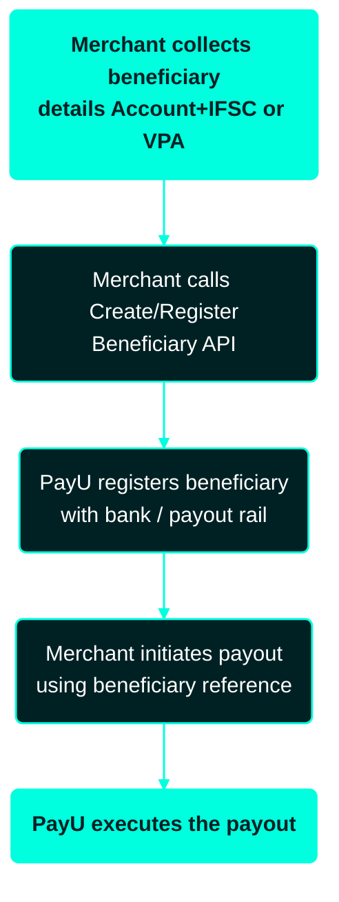
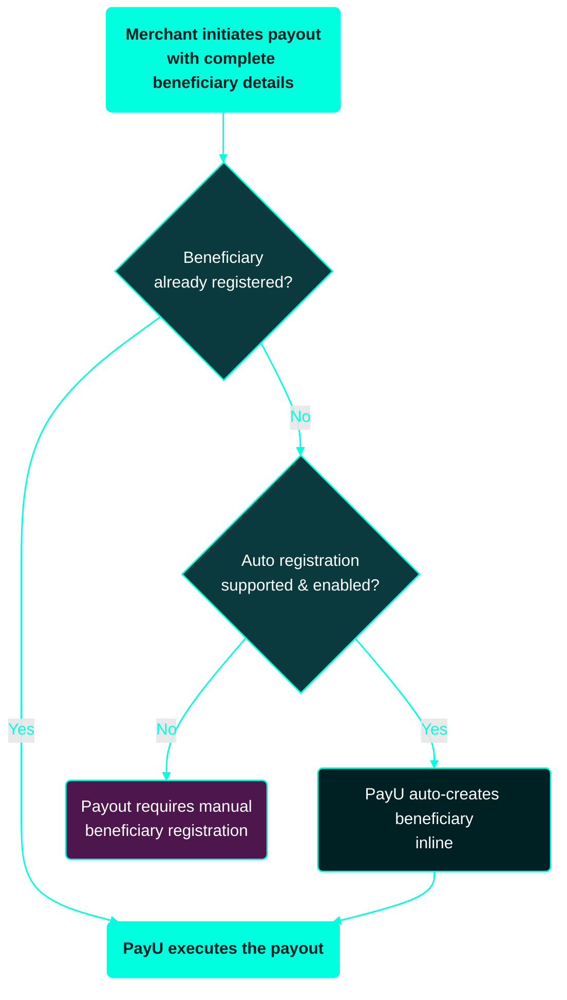

---
title: Introduction to Beneficiary Management
excerpt: ''
deprecated: false
hidden: false
metadata:
  title: ''
  description: ''
  robots: index
next:
  description: ''
---

**Beneficiary Management** lets you define and manage the recipients of your payouts. PayU supports two approaches: **Manual (API-based) Registration**, where you explicitly register beneficiaries before initiating a payout, and **Auto Beneficiary Registration**, where PayU registers the beneficiary automatically inline during payout processing when supported and enabled.

This section descrobes what a beneficiary is, how beneficiary registration works, and the difference between manual and auto beneficiary registration. For enablement or configuration changes, contact your **Key Account Manager (KAM)**.

Payouts require a defined recipient (a **beneficiary**). You can manage beneficiaries in two ways:

* **Manually** through APIs before payout, or
* **Automatically** inline during payout, when supported and enabled.

<Callout icon="📘" theme="info">
  **Enable Auto Beneficiary Registration**: To enable Auto beneficiary registration, contact you PayU Key Account Manager.

  Auto beneficiary registration applies only when **both** of the following are true:

  * The merchant is enabled for the feature.
  * The bank and payout method support auto registration.
</Callout>

## What is a beneficiary?

A beneficiary is the recipient of a payout. Beneficiaries are typically identified by:

* **Bank account** — account number + IFSC, or
* **UPI ID** — VPA (Virtual Payment Address)

Before processing a payout, the beneficiary typically needs to be registered with the bank or payout system.

## What is Auto Beneficiary Registration?

Auto Beneficiary Registration allows PayU to automatically create a beneficiary during payout processing if it does not already exist:

1. You initiate a payout with beneficiary details.
2. If the beneficiary is not registered, the system creates it.
3. The payout proceeds without a separate registration step.

### Why this matters

| Aspect            | Without Auto Registration                                  | With Auto Registration          |
| ----------------- | ---------------------------------------------------------- | ------------------------------- |
| Beneficiary setup | Must pre-register all beneficiaries                        | Beneficiaries created on demand |
| API interactions  | Additional API calls required                              | Fewer API interactions          |
| Failure risk      | Higher chance of payout failure (unregistered beneficiary) | Lower failure risk              |
| System complexity | More system state to manage                                | Simplified integration          |

### Manual Registration Flow

#### Manual Registration Limitations

* Higher integration complexity.
* Additional API calls.
* Requires storage and state management.

### Auto Beneficiary Registration

When enabled (and supported), PayU automatically registers the beneficiary during payout processing if required.

#### Auto Beneficiary Registration Flow

#### Key characteristics — Auto Registration

* No mandatory pre-registration step.
* Beneficiary creation handled inline.
* System manages missing-beneficiary scenarios.

#### Benefits — Auto Registration

* Reduced API overhead.
* Faster payout initiation.
* Lower risk of failure due to unregistered beneficiaries.
* Simplified integration flow.

## Manual vs Auto Registration

| Feature                                 | Manual Registration | Auto Registration (Enabled) |
| --------------------------------------- | ------------------- | --------------------------- |
| Registration control                    | Merchant-managed    | System-managed              |
| API effort                              | Higher              | Lower                       |
| Integration complexity                  | More steps          | Simplified                  |
| Registration timing                     | Pre-payout          | Inline during payout        |
| Failure risk (unregistered beneficiary) | Higher              | Lower                       |

<Callout icon="📘" theme="info">
   **Note**: If these conditions are not met, payouts may require manual beneficiary registration. In some cases, no beneficiary registration is required at all — your KAM can confirm what applies to your account.
</Callout>
