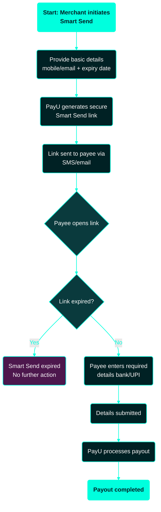

---
title: Introduction to Smart Send
excerpt: ''
deprecated: false
hidden: false
metadata:
  title: ''
  description: ''
  robots: index
next:
  description: ''
---

**Smart Send** is a PayU Payouts feature that lets you initiate a payout or request action **without collecting full beneficiary details upfront**. Instead of requiring a bank account number and IFSC at initiation, you start the process with basic customer information (such as a mobile number or email address) — the payee then receives a secure link to complete the required details or action.

This guide introduces Smart Send, explains when to use it, and outlines how the flow works from a merchant perspective. For enablement or configuration, contact your **Key Account Manager (KAM)**.

## What is Smart Send?

Smart Send is a PayU feature that allows you to initiate a payout or request action without requiring complete beneficiary details upfront.

Instead of collecting full bank details (such as account number and IFSC), you can start the process using basic customer information — for example:

* Mobile number
* Email address

The customer (payee) then receives a secure link to complete the required details or action.

<Callout icon="📘" theme="info">
  **Note**: To enable Smart Send on your account, contact your PayU Key Account Manager (KAM).
</Callout>

## When should you use Smart Send?

Smart Send is useful when:

* You do not have full beneficiary details.
* You want to shift data entry to the payee.
* You want to simplify onboarding of new recipients.

### Use cases

| Use case                                    | Why Smart Send fits                                                              |
| ------------------------------------------- | -------------------------------------------------------------------------------- |
| Refunds when bank details are not available | The payee provides bank or UPI details directly via the secure link.             |
| Customer reimbursements                     | No need to capture or store sensitive financial information at the merchant end. |
| Onboarding new recipients                   | Faster than collecting and validating bank details upfront.                      |

## How Smart Send works

1. You initiate Smart Send using basic payee details.
2. PayU sends a secure link to the payee (via SMS, email, or both).
3. The payee opens the link and provides required details (e.g., bank account or UPI ID).
4. The payee reviews and submits the information or completes the requested action.
5. The payout is processed.

You can initiate the flow using the [Create Smart Send Link API](ref:create-smart-send-link-api) and check the status of any request using the [Smart Send Details API](ref:smart_send_details_api).

## Flow diagram

The following diagram below provides a high-level view of how Smart Send progresses from initiation by the merchant to payout processing by PayU, with the payee completing the required details in between.

**Reading the diagram**:

* **Cyan-filled nodes** mark the entry (`Merchant initiates Smart Send`) and successful exit (`PayU processes the payout`) of the flow.
* **Diamond node** (`Details valid?`) is the validation checkpoint — invalid details loop back for correction.
* **Purple node** (`Payee corrects and resubmits`) represents a holding state until the payee provides valid information.

## Key characteristics

* Minimal input required from the merchant side.
* Payee-driven flow for entering sensitive details.
* Secure link-based interaction.
* Reduces dependency on collecting and storing bank details.

## Benefits

* Faster onboarding of new payees.
* Reduced integration complexity.
* Lower risk of incorrect beneficiary details.
* Improved user experience for end customers.
* No need to store sensitive financial information upfront.

## Notes

* The flow depends on **payee action** — the payee must open the link and complete details for the payout to progress.
* Links may have **validity / expiry** constraints. You can extend the expiry of a valid link using the [Extend Expiry Date API](ref:extend-expiry-date-api), or cancel an active link using the [Cancel Smart Send API](ref:cancel-smartsend-api).
* The payout outcome depends on the **payee-provided details** and on the standard **bank validation and rules** applied during processing.
* For incomplete requests, PayU can automatically resend the link based on a configurable cadence — see [Smart Send Retrigger](ref:smart-send-retrigger).

## Maker-Checker Flow

Smart Send can also support a **maker-checker approval flow**, where payout initiation requires one or more approval steps before the Smart Send link is generated and shared with the payee.

In this setup:

* A **maker** creates or initiates the Smart Send request
* The request moves to an approval stage
* One or multiple **checkers** can approve the request, based on the approval rules configured for the merchant
* Once the required approvals are completed, PayU generates and sends the Smart Send link to the payee

This helps merchants implement internal authorization controls and ensures payout requests are reviewed before being shared with customers or payees.

### High-Level Flow

1. Maker initiates Smart Send request

2. Request moves to pending approval state

3. One or more checkers review the request

4. Approval flow is completed based on configured rules

5. On successful approval:

   * Smart Send link is generated
   * Communication is sent to the payee

6. Payee completes the Smart Send flow

### Key Benefits

* Additional authorization layer before payout initiation
* Flexible approval workflows based on merchant rules
* Better operational control and auditability
* Suitable for businesses with compliance or governance requirements

## Getting started

To start using Smart Send:

1. **Contact your KAM** for enablement on your account.
2. **Confirm supported configurations** and communication channels (SMS, email, or both).
3. **Integrate the Smart Send initiation flow** using the [Create Smart Send Link API](ref:create-smart-send-link-api).