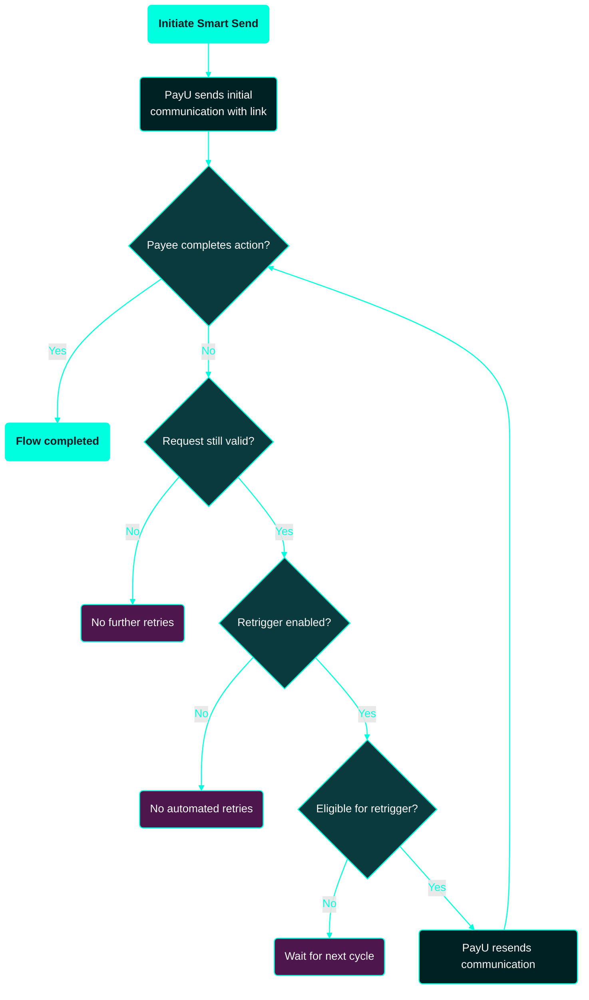

---
title: Smart Send Retrigger
excerpt: ''
deprecated: false
hidden: false
metadata:
  title: ''
  description: ''
  robots: index
next:
  description: ''
---

Smart Send allows you to send a secure payment or action link to your customer (payee), enabling them to complete a required step such as payment, verification, or authorization. Completion depends on the payee action — if the link is missed or ignored, the process may remain incomplete.

**Smart Send retrigger** is an automated, PayU-managed process that resends Smart Send communications for eligible, incomplete requests. It improves completion rates by reducing drop-offs caused by missed or ignored notifications, and requires no additional API calls or retry logic from your side.

This section describes Smart Send retrigger, its benefits, eligibility, and how skip days determine the retry cadence.

> 📘 Note:
>
> To enable Smart Send Retrigger and configuration assistance, contact your PayU Key Account Manager (KAM).

### Why use Smart Send retrigger?

| Manual retry handling                               | Smart Send retrigger                               |
| --------------------------------------------------- | -------------------------------------------------- |
| Build and maintain retry logic                      | Fully managed by PayU                              |
| Requires scheduling, monitoring, and error handling | No additional engineering effort                   |
| Risk of missed retries due to system issues         | Consistent retry execution with controlled cadence |
| Separate tracking of retry attempts                 | Unified and centrally governed process             |

**Outcome**: Improved completion rates by reducing drop-offs caused by missed or ignored communications.

## End-to-End flow

The following flow chart provides a high-level view of how Smart Send and retriggering progress from creation to completion. At each decision point, PayU evaluates whether the request should be retriggered, completed, or exited.

**Reading the diagram**:

* **Cyan-filled nodes** (`Initiate Smart Send`, `Flow completed`) mark the entry and successful exit of the flow.
* **Diamond nodes** are PayU evaluation checkpoints (action completion, validity, retrigger enablement, eligibility).
* **Purple nodes** (`No further retries`, `No automated retries`, `Wait for next cycle`) represent terminal or holding states where no retrigger is performed.
* The loop from **`PayU resends communication`** back to **`Payee completes action?`** continues until the payee completes the action, the request expires, or the retry window closes.

## PayU retrigger process

At each evaluation point, PayU checks:

* Whether the payee has already completed the required action.
* If the original Smart Send request is still valid (not expired or closed).
* Whether retrigger is enabled for the merchant.
* If the request is eligible for retrigger based on skip days and retry window.

You can verify the current state of any Smart Send request at any time using the [Smart Send Details API](ref:smart_send_details_api).

## Eligibility criteria

Smart Send retrigger applies only when **all** of the following are true:

* Merchant is enabled for retrigger.
* The Smart Send request is in a pending or actionable state.
* The request is not expired.
* The request falls within the configured retry window.

> 📘 Note:
>
> Eligibility rules are enforced by PayU. Contact your KAM for exact configuration details.

## Skip days — retrigger frequency

Skip days define the interval between retriggers, starting from the day of creation (Day 0). A higher skip-day value results in fewer retries; a lower value results in more frequent retries.

* **Day 0**: Smart Send is created (no retrigger).
* Retrigger eligibility starts after Day 0.
* Higher skip days → fewer retries.
* Lower skip days → more frequent retries.

### Examples

| Skip days | Behavior                                          | Illustration                    |
| --------- | ------------------------------------------------- | ------------------------------- |
| 0         | Eligible for daily retriggering from Day 1 onward | See panel "Skip Days = 0" below |
| 1         | Alternate-day retrigger (every 2 days)            | See panel "Skip Days = 1" below |
| 3         | Retrigger every 4th day                           | See panel "Skip Days = 3" below |

### Visual representation

The following timelines illustrate three parallel skip-day configurations:

* **Skip Days = 0** → Retrigger on Day 1, Day 2, Day 3, Day 4, …
* **Skip Days = 1** → Retrigger on Day 2, Day 4, Day 6, Day 8, …
* **Skip Days = 3** → Retrigger on Day 4, Day 8, Day 12, …

## Configuration and enablement

To get started with Smart Send retrigger, request enablement via your KAM. The following parameters can be configured for your account:

| Parameter              | Description                                                                      |
| ---------------------- | -------------------------------------------------------------------------------- |
| Skip days              | Retry interval between successive retrigger attempts, counted from Day 0.        |
| Retry window           | Maximum duration during which a request remains eligible for retrigger.          |
| Additional constraints | Optional rules such as channel preferences, quiet hours, or maximum retry count. |

> 📘 Note:
>
> Skip days can be configured per **Payout Virtual Account (VA)** where supported. You may also set a common skip-day value that applies across all supported VAs.

## Operational tips and best practices

* Choose skip days that balance customer experience with completion rates. For time-sensitive actions, prefer shorter intervals.
* Review and optimize the retry window so that customer communications are well-timed and do not result in excessive or repetitive notifications.
* Monitor completion funnels — if most completions happen after a specific retry, consider adjusting the cadence accordingly.
* Ensure your business notifications and reporting dashboards account for retriggered communications, so operational teams can distinguish original sends from automated retries.

For the list of error messages and their description that you may encounter when integrating Smart Send APIs, refer to [Smart Send Error Codes](ref:smart-send-error-codes).
