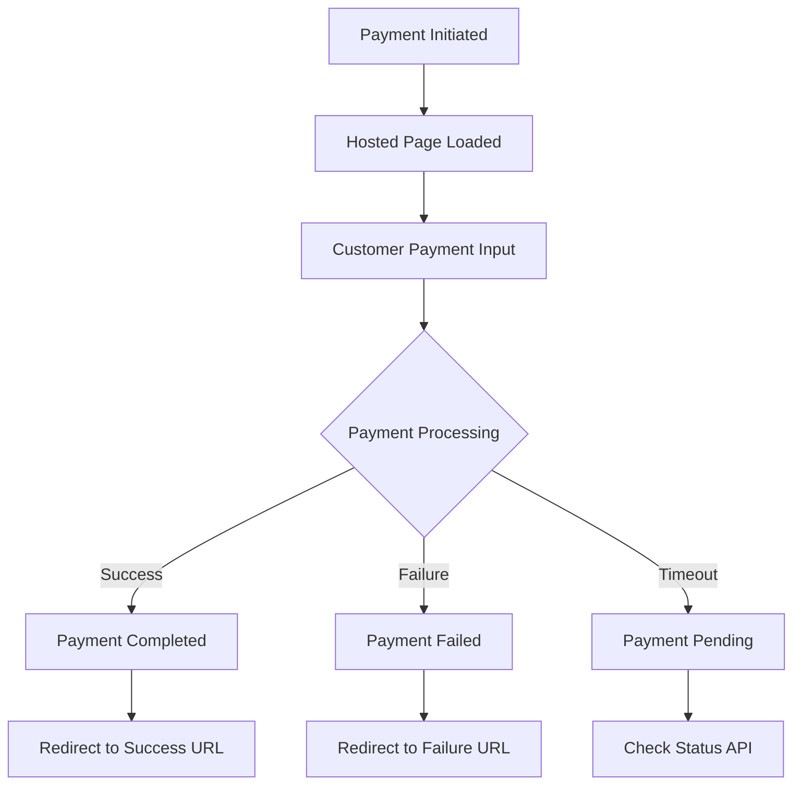

PayU Hosted Checkout provides a secure, PCI-compliant payment interface where customers complete their payment on PayU's hosted payment page. This integration method is ideal for merchants who want to minimize PCI compliance scope while offering a comprehensive payment experience.

## 🔗 **API Endpoints**

**Base URLs:**

* **UAT:** `https://test.payu.in`
* **Production:** `https://secure.payu.in`

**Endpoint:** `POST /_payment`\
**Content-Type:** `application/x-www-form-urlencoded`
**Authentication:** Hash-based authentication using SHA512

***

## 🚀 **Quick Start**

### Sample cURL Request

```bash
curl -X POST https://test.payu.in/_payment \
  -H "Content-Type: application/x-www-form-urlencoded" \
  -d "key=JPM7Fg" \
  -d "txnid=txn_123456789" \
  -d "amount=1000" \
  -d "productinfo=iPhone 14" \
  -d "firstname=John" \
  -d "email=john.doe@example.com" \
  -d "phone=9876543210" \
  -d "surl=https://merchant.com/success" \
  -d "furl=https://merchant.com/failure" \
  -d "hash=calculated_hash_value"
```

### Sample Response

```html
<!-- PayU redirects to hosted checkout page -->
<!-- Customer completes payment and gets redirected to success/failure URL -->
```

***

## 🔐 **Authentication**

PayU Hosted Checkout uses **hash-based authentication** to ensure request integrity and security.

### Hash Calculation

The hash must be calculated using SHA512 algorithm with the following format:

```
sha512(key|txnid|amount|productinfo|firstname|email|udf1|udf2|udf3|udf4|udf5||||||SALT)
```

**Important Notes:**

* Use pipe (`|`) as separator between parameters
* Include empty values for unused UDF fields with pipes
* SALT is provided by PayU during merchant onboarding
* Hash must be calculated on merchant server for security

### Sample Hash Calculation (PHP)

```php
$hash = hash('sha512', 
    $key.'|'.$txnid.'|'.$amount.'|'.$productinfo.'|'.$firstname.'|'.
    $email.'|||||||||'.$salt
);
```

***

## 📝 **Request Parameters**

<HTMLBlock>{`
<table>
  <thead>
    <tr>
      <th>Parameter</th>
      <th>Description</th>
      <th>Example</th>
    </tr>
  </thead>
  <tbody>
    <tr>
      <td>amount<br/><code>mandatory</code></td>
      <td><code>integer</code> The payment amount for the transaction.<br/>Minimum: 1, Maximum: 500000 (in smallest currency unit)</td>
      <td><code>1000</code></td>
    </tr>
    <tr>
      <td>email<br/><code>mandatory</code></td>
      <td><code>string</code> The email address of the customer.<br/>Must be a valid email format</td>
      <td><code>john.doe@example.com</code></td>
    </tr>
    <tr>
      <td>firstname<br/><code>mandatory</code></td>
      <td><code>string</code> The first name of the customer.<br/>Maximum 60 characters</td>
      <td><code>John</code></td>
    </tr>
    <tr>
      <td>furl<br/><code>mandatory</code></td>
      <td><code>string</code> The Failure URL, which is the page PayU will redirect to if the transaction is failed.<br/>Must be a valid URL, HTTPS recommended</td>
      <td><code>https://merchant.com/failure</code></td>
    </tr>
    <tr>
      <td>hash<br/><code>mandatory</code></td>
      <td><code>string</code> It is the hash calculated by the merchant. The format for calculating the hash: sha512(key|txnid|amount|productinfo|firstname|email|udf1|udf2|udf3|udf4|udf5||||||SALT)<br/>128-character SHA512 hex string</td>
      <td><code>calculated_hash_value</code></td>
    </tr>
    <tr>
      <td>key<br/><code>mandatory</code></td>
      <td><code>string</code> Merchant key provided by PayU during onboarding.<br/>Alphanumeric identifier provided by PayU</td>
      <td><code>JPM7Fg</code></td>
    </tr>
    <tr>
      <td>productinfo<br/><code>mandatory</code></td>
      <td><code>string</code> A brief description of the product.<br/>Maximum 100 characters</td>
      <td><code>iPhone 14</code></td>
    </tr>
    <tr>
      <td>surl<br/><code>mandatory</code></td>
      <td><code>string</code> The success URL, which is the page PayU will redirect to if the transaction is successful.<br/>Must be a valid URL, HTTPS recommended</td>
      <td><code>https://merchant.com/success</code></td>
    </tr>
    <tr>
      <td>txnid<br/><code>mandatory</code></td>
      <td><code>string</code> The transaction ID is a reference number for a specific order that is generated by the merchant.<br/>Max 25 characters, must be unique for each transaction</td>
      <td><code>txn_123456789</code></td>
    </tr>
    <tr>
      <td>buyer_type_business<br/><code>optional</code></td>
      <td><code>string</code> This parameter is used to identify whether it is a B2B transaction. If 1 is posted, it is a B2B transaction.<br/>Send "1" for B2B transactions, empty for B2C</td>
      <td><code>1</code></td>
    </tr>
    <tr>
      <td>curl<br/><code>optional</code></td>
      <td><code>string</code> The Cancel URL, which is the page PayU will redirect to if the transaction is cancelled by customer.<br/>Must be a valid URL, HTTPS recommended</td>
      <td><code>https://merchant.com/cancel</code></td>
    </tr>
    <tr>
      <td>lastname<br/><code>optional</code></td>
      <td><code>string</code> The last name of the customer.<br/>Maximum 60 characters</td>
      <td><code>Doe</code></td>
    </tr>
    <tr>
      <td>phone<br/><code>optional</code></td>
      <td><code>number</code> The phone number of the customer.<br/>10-digit mobile number</td>
      <td><code>9876543210</code></td>
    </tr>
    <tr>
      <td>udf1<br/><code>optional</code></td>
      <td><code>string</code> User-defined fields (udf) are used to store any information corresponding to a particular transaction. You can use up to five udfs in the post designated as udf1, udf2, udf3, udf4, udf5.<br/>Maximum 255 characters</td>
      <td><code>custom_data_1</code></td>
    </tr>
    <tr>
      <td>udf2<br/><code>optional</code></td>
      <td><code>string</code> User-defined fields (udf) are used to store any information corresponding to a particular transaction. You can use up to five udfs in the post designated as udf1, udf2, udf3, udf4, udf5.<br/>Maximum 255 characters</td>
      <td><code>custom_data_2</code></td>
    </tr>
    <tr>
      <td>udf3<br/><code>optional</code></td>
      <td><code>string</code> User-defined fields (udf) are used to store any information corresponding to a particular transaction. You can use up to five udfs in the post designated as udf1, udf2, udf3, udf4, udf5.<br/>Maximum 255 characters</td>
      <td><code>custom_data_3</code></td>
    </tr>
    <tr>
      <td>udf4<br/><code>optional</code></td>
      <td><code>string</code> User-defined fields (udf) are used to store any information corresponding to a particular transaction. You can use up to five udfs in the post designated as udf1, udf2, udf3, udf4, udf5.<br/>Maximum 255 characters</td>
      <td><code>custom_data_4</code></td>
    </tr>
    <tr>
      <td>udf5<br/><code>optional</code></td>
      <td><code>string</code> User-defined fields (udf) are used to store any information corresponding to a particular transaction. You can use up to five udfs in the post designated as udf1, udf2, udf3, udf4, udf5.<br/>Maximum 255 characters</td>
      <td><code>custom_data_5</code></td>
    </tr>
  </tbody>
</table>
`}</HTMLBlock>

***

## 📊 **Response Handling**

### Success Response (200)

When the request is valid, PayU returns the hosted checkout page (HTML content) where customers can complete their payment.

**Content-Type:** `text/plain`\
**Response:** HTML page with payment interface

### Payment Completion Flow

1. Customer completes payment on PayU's hosted page
2. PayU redirects to `surl` (success) or `furl` (failure) with transaction details
3. Merchant receives POST callback with payment status

### Callback Parameters

PayU sends the following parameters to your success/failure URLs:

| Parameter | Description                    | Example              |
| --------- | ------------------------------ | -------------------- |
| mihpayid  | PayU's transaction ID          | `403993715519726440` |
| mode      | Payment mode used              | `CC`, `NB`, `UPI`    |
| status    | Transaction status             | `success`, `failure` |
| txnid     | Your transaction ID            | `txn_123456789`      |
| amount    | Transaction amount             | `1000.00`            |
| hash      | Response hash for verification | `calculated_hash`    |

***

<Accordion title="Sample Request" icon="fa-code">
  ### Complete Form Submission Example

  ```html
  <form action="https://test.payu.in/_payment" method="post" id="payuForm">
      <input type="hidden" name="key" value="JPM7Fg" />
      <input type="hidden" name="hash" value="calculated_hash_value"/>
      <input type="hidden" name="txnid" value="txn_123456789" />
      <input type="hidden" name="amount" value="1000" />
      <input type="hidden" name="firstname" value="John" />
      <input type="hidden" name="email" value="john.doe@example.com" />
      <input type="hidden" name="phone" value="9876543210" />
      <input type="hidden" name="productinfo" value="iPhone 14" />
      <input type="hidden" name="surl" value="https://merchant.com/success" />
      <input type="hidden" name="furl" value="https://merchant.com/failure" />
      <input type="hidden" name="curl" value="https://merchant.com/cancel" />
      <input type="hidden" name="udf1" value="custom_data_1" />
      <input type="submit" value="Pay Now" />
  </form>
  ```

  ### cURL Example with All Parameters

  ```bash
  curl -X POST https://test.payu.in/_payment \
    -H "Content-Type: application/x-www-form-urlencoded" \
    -d "key=JPM7Fg" \
    -d "txnid=txn_123456789" \
    -d "amount=1000" \
    -d "productinfo=iPhone 14" \
    -d "firstname=John" \
    -d "lastname=Doe" \
    -d "email=john.doe@example.com" \
    -d "phone=9876543210" \
    -d "surl=https://merchant.com/success" \
    -d "furl=https://merchant.com/failure" \
    -d "curl=https://merchant.com/cancel" \
    -d "buyer_type_business=0" \
    -d "udf1=Order_123" \
    -d "udf2=Customer_ID_456" \
    -d "hash=calculated_hash_value"
  ```
</Accordion>

<Accordion title="Sample Response" icon="fa-reply">
  ### Initial Response (Hosted Checkout Page)

  ```html
  <!DOCTYPE html>
  <html>
  <head>
      <title>PayU Secure Payment</title>
  </head>
  <body>
      <!-- PayU's hosted checkout interface -->
      <div class="payu-checkout">
          <!-- Payment options: Cards, Net Banking, UPI, Wallets -->
          <!-- Customer enters payment details here -->
      </div>
  </body>
  </html>
  ```

  ### Success Callback Response

  ```
  POST https://merchant.com/success

  Parameters received:
  mihpayid=403993715519726440
  mode=CC
  status=success
  txnid=txn_123456789
  amount=1000.00
  discount=0.00
  net_amount_debit=1000.00
  addedon=2024-08-19 14:10:57
  productinfo=iPhone 14
  firstname=John
  lastname=Doe
  email=john.doe@example.com
  phone=9876543210
  hash=response_hash_for_verification
  ```

  ### Failure Callback Response

  ```
  POST https://merchant.com/failure

  Parameters received:
  mihpayid=403993715519726441
  mode=CC
  status=failure
  txnid=txn_123456789
  amount=1000.00
  error=E000
  error_Message=Transaction failed due to invalid card details
  hash=response_hash_for_verification
  ```
</Accordion>

<Accordion title="Response Parameters" icon="fa-list">
  ### Success Response Parameters

  | Parameter          | Type     | Description                    | Example                     |
  | ------------------ | -------- | ------------------------------ | --------------------------- |
  | mihpayid           | string   | PayU's unique transaction ID   | `403993715519726440`        |
  | mode               | string   | Payment method used            | `CC`, `NB`, `UPI`, `WALLET` |
  | status             | string   | Transaction status             | `success`                   |
  | txnid              | string   | Your original transaction ID   | `txn_123456789`             |
  | amount             | decimal  | Transaction amount             | `1000.00`                   |
  | discount           | decimal  | Discount applied               | `0.00`                      |
  | net\_amount\_debit | decimal  | Final amount debited           | `1000.00`                   |
  | addedon            | datetime | Transaction timestamp          | `2024-08-19 14:10:57`       |
  | productinfo        | string   | Product information            | `iPhone 14`                 |
  | firstname          | string   | Customer first name            | `John`                      |
  | lastname           | string   | Customer last name             | `Doe`                       |
  | email              | string   | Customer email                 | `john@example.com`          |
  | phone              | string   | Customer phone                 | `9876543210`                |
  | hash               | string   | Response hash for verification | `response_hash`             |

  ### Failure Response Parameters

  | Parameter      | Type   | Description           | Example                |
  | -------------- | ------ | --------------------- | ---------------------- |
  | status         | string | Transaction status    | `failure`              |
  | error          | string | Error code            | `E000`, `E001`, `E002` |
  | error\_Message | string | Error description     | `Transaction failed`   |
  | bank\_ref\_num | string | Bank reference number | `123456789`            |
  | bankcode       | string | Bank/issuer code      | `CC`, `HDFC`           |
</Accordion>

<Accordion title="Additional Information" icon="fa-flask">
  ### Hash Verification

  Always verify the response hash to ensure data integrity:

  ```php
  // For success response
  $responseHash = hash('sha512', 
      $salt.'|'.$status.'|||||'.$udf5.'|'.$udf4.'|'.$udf3.'|'.$udf2.'|'.$udf1.'|'.
      $email.'|'.$firstname.'|'.$productinfo.'|'.$amount.'|'.$txnid.'|'.$key
  );

  if ($responseHash === $hash) {
      // Response is valid
  } else {
      // Response tampered, reject transaction
  }
  ```

  ### Payment Flow States

  ```
  PENDING → PROCESSING → SUCCESS/FAILURE → SETTLEMENT
  ```

  ### Best Practices

  * **Always use HTTPS** for redirect URLs
  * **Validate response hash** before updating order status
  * **Handle timeout scenarios** (customer doesn't complete payment)
  * **Store transaction logs** for reconciliation
  * **Use unique transaction IDs** for each payment attempt
  * **Implement proper error handling** for all failure scenarios

  ### Testing Credentials

  **Test Environment:**

  * Key: `JPM7Fg`
  * Salt: `e5iIg1jwi8`
  * Test Cards: Available in PayU documentation

  ### Common Error Codes

  | Error Code | Description                    | Resolution                 |
  | ---------- | ------------------------------ | -------------------------- |
  | E000       | Transaction failed             | Check payment details      |
  | E001       | Invalid parameters             | Verify all required fields |
  | E002       | Hash mismatch                  | Recalculate hash value     |
  | E003       | Merchant authentication failed | Check key and salt         |

  ### Webhook Configuration

  Configure webhooks for real-time payment notifications:

  * **Webhook URL:** Your server endpoint
  * **Authentication:** Hash verification
  * **Retry Logic:** PayU retries failed webhooks
</Accordion>

***

## ⚠️ **Error Handling**

### Common Error Scenarios

| Scenario              | Cause                      | Resolution                   |
| --------------------- | -------------------------- | ---------------------------- |
| Hash Mismatch         | Incorrect hash calculation | Verify hash formula and salt |
| Invalid Amount        | Amount \< 1 or > limit     | Check amount constraints     |
| Invalid Email         | Malformed email address    | Validate email format        |
| Missing Parameters    | Required field not sent    | Include all mandatory fields |
| Duplicate Transaction | Same txnid used twice      | Use unique transaction IDs   |

### Error Response Format

```json
{
    "status": "failure",
    "error": "E001",
    "error_message": "Invalid parameters",
    "field": "email"
}
```

***

## 🔄 **Transaction States**

### Payment Lifecycle



### Status Meanings

* **success**: Payment completed successfully
* **failure**: Payment failed or declined
* **pending**: Payment in process, final status awaited
* **cancel**: Customer cancelled the transaction

***

## 🧪 **Testing & Validation**

### Test Environment Details

* **Base URL:** `https://test.payu.in`
* **Test Merchant Key:** `JPM7Fg`
* **Test Salt:** `e5iIg1jwi8`

### Test Card Numbers

| Card Type  | Number           | CVV  | Expiry |
| ---------- | ---------------- | ---- | ------ |
| Visa       | 4111111111111111 | 123  | 12/25  |
| MasterCard | 5123456789012346 | 123  | 12/25  |
| Amex       | 378282246310005  | 1234 | 12/25  |

### Test UPI IDs

* Success: `success@payu`
* Failure: `failure@payu`

### Test Net Banking

* Success: Any bank with amount \< 2000
* Failure: Any bank with amount > 2000

***

## 🔗 **Related Resources**

### Essential APIs

* **[Payment Status Check]()** - Verify transaction status
* **[Refund API]()** - Process refunds
* **[Settlement API]()** - Check settlement details

### Integration Resources

* **[Postman Collection](/)** - Ready-to-use API collection
* **[SDK Downloads](/)** - PHP, Java, Node.js, Python SDKs
* **[Webhook Setup Guide](/)** - Configure real-time notifications
* **[Testing Guide](/)** - Comprehensive testing scenarios

### Security & Compliance

* **[PCI DSS Guidelines](/)** - Security compliance requirements
* **[Hash Calculation Examples](/)** - Implementation in various languages
* **[Error Handling Best Practices](/)** - Robust error management

***

*For additional support, visit[PayU Developer Documentation](https://docs.payu.in) or contact our integration team.*