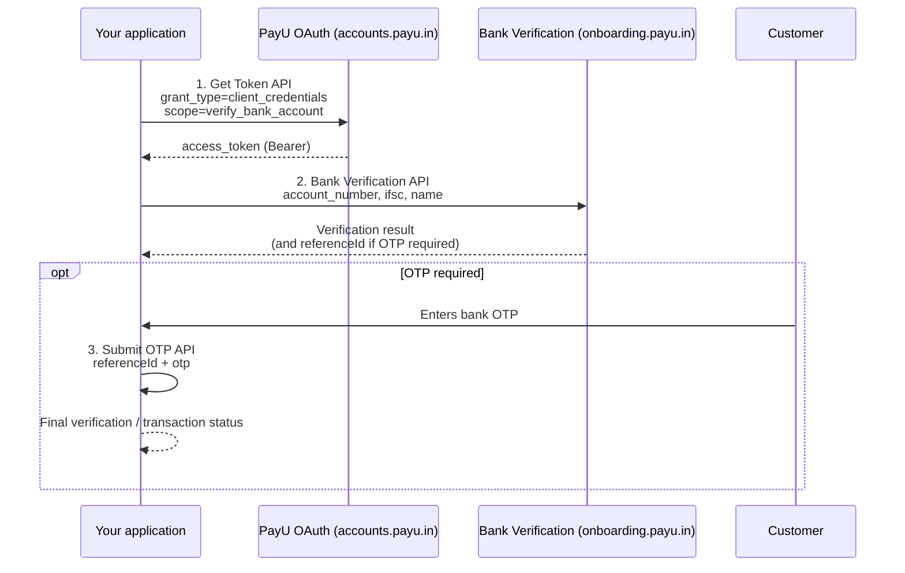

---
title: Bank Verification APIs
excerpt: >-
  Verify bank accounts using penny drop or penniless transactions—authenticate
  with Get Token, call Bank Verification, and complete OTP when required.
deprecated: false
hidden: false
metadata:
  title: Bank Verification APIs
  description: >-
    API reference hub for PayU bank account verification: Get Token
    (verify_bank_account), Bank Verification (penny drop / penniless), and
    Submit OTP when the flow requires customer authentication.
  robots: index
next:
  description: ''
---
Bank Verification API let you confirm that a bank account is valid and that the account holder name matches your records. Verification uses a **penny drop** or **penniless** transaction against the account number and IFSC you provide.

Use this hub when you integrate bank verification during merchant onboarding, KYC, or payout beneficiary validation. Each API below has its own reference page with request parameters, samples, and response fields.

> 👍 **Before you begin**
>
> Contact your **PayU Key Account Manager (KAM)** to enable Bank Verification and to obtain **client ID**, **client secret**, and **clientId** header values for your environment. You need the `verify_bank_account` OAuth scope whitelisted on your Hub client before calling these APIs.

## Integration flow

1. **[Get Token API – Bank Verification](ref:gettoken-bank-verification)** — Obtain a Bearer `access_token` with scope `verify_bank_account`.
2. **[Bank Verification API](ref:bank-verification-api)** — Post account number, IFSC, and holder name; optionally enable name matching.
3. **[Submit OTP API](ref:submit-otp-to-payu)** — When the verification or linked authentication flow returns a `referenceId` and requires customer OTP, collect the OTP on your page and submit it to complete the step.

If OTP submission fails or expires, use [Resend OTP API](ref:resend-otp-api) before retrying Submit OTP.

## On this page

- [Integration flow](#integration-flow)
- [APIs used in Bank Verification](#apis-used-in-bank-verification)
- [Environments](#environments)
- [Integration guides](#integration-guides)

## APIs used in Bank Verification

| API | Purpose |
| --- | --- |
| [Get Token API – Bank Verification](ref:gettoken-bank-verification) | Generate an OAuth access token (`grant_type`: `client_credentials`, `scope`: `verify_bank_account`) for the Bank Verification API Authorization header. |
| [Bank Verification API](ref:bank-verification-api) | Verify a bank account using penny drop or penniless mode; returns account status, bank response, and masked account holder name. |
| [Submit OTP API](ref:submit-otp-to-payu) | Submit the customer OTP with the `referenceId` from the verification or initiate response when the flow requires OTP authentication to complete. |

## Environments

| Service | Test (UAT) | Production |
| --- | --- | --- |
| OAuth token | [https://uat-accounts.payu.in/oauth/token](https://uat-accounts.payu.in/oauth/token) | [https://accounts.payu.in/oauth/token](https://accounts.payu.in/oauth/token) |
| Bank account verification | [https://uat-onepayuonboarding.payu.in/dvs/bank_accounts/acc_verification](https://uat-onepayuonboarding.payu.in/dvs/bank_accounts/acc_verification) | [https://onboarding.payu.in/dvs/bank_accounts/acc_verification](https://onboarding.payu.in/dvs/bank_accounts/acc_verification) |
| Submit OTP | [https://test.payu.in/ResponseHandler.php](https://test.payu.in/ResponseHandler.php) | [https://secure.payu.in/ResponseHandler.php](https://secure.payu.in/ResponseHandler.php) |

<Callout icon="📘" theme="info">
  **Authentication:** Pass the Get Token `access_token` as `Authorization: Bearer <access_token>` on the Bank Verification API. Include your PayU **clientId** in the request header as documented on [Bank Verification API](ref:bank-verification-api).
</Callout>

## Integration guides

Follow the API references in this order:

* [Get Token API – Bank Verification](ref:gettoken-bank-verification)
* [Bank Verification API](ref:bank-verification-api)
* [Submit OTP API](ref:submit-otp-to-payu) — when OTP is required to complete the flow
